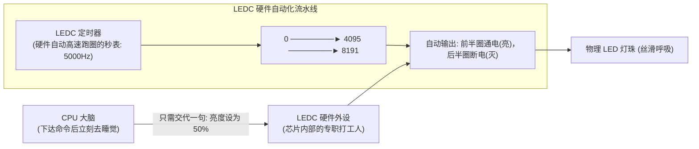
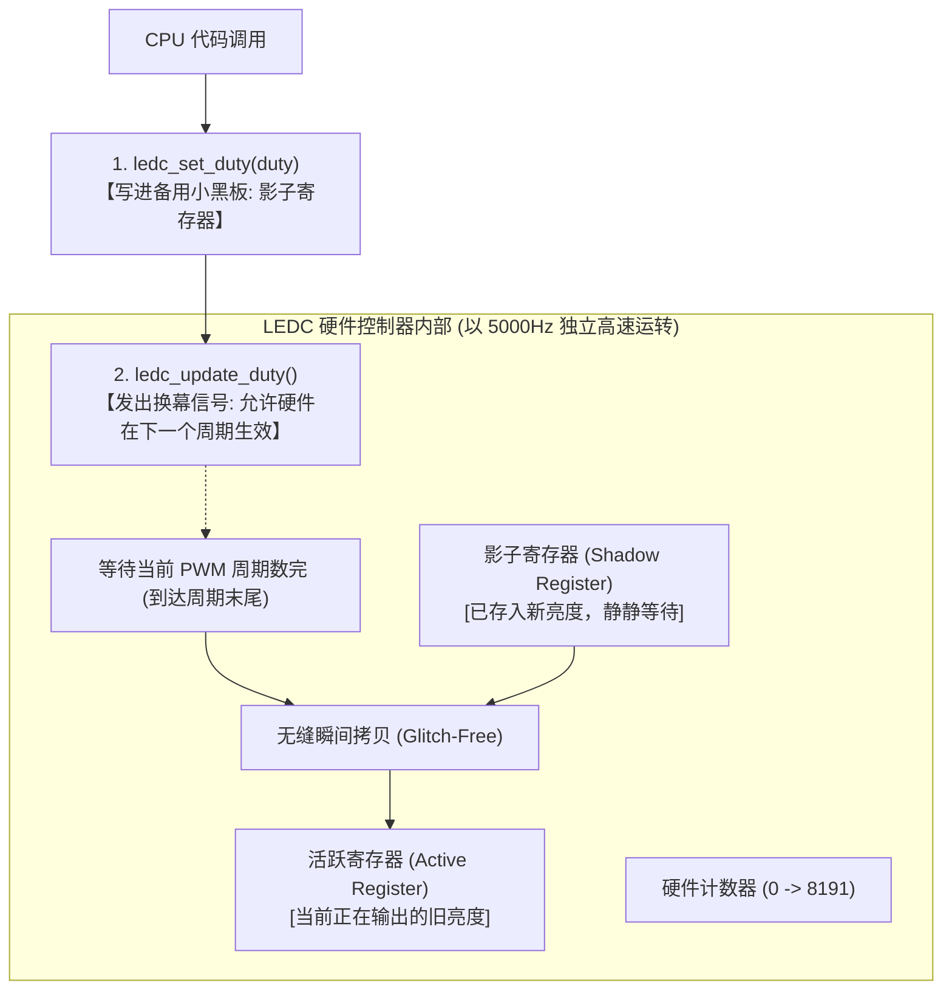

# 第 02 章：掌控电流的力量 —— ESP32 GPIO 数字输出与 PWM 呼吸灯


> **写在前面**：在第一章中，我们让单片机向电脑屏幕打印出了文字，实现了“虚拟世界”的数据交互。
> 
> 从这一章开始，我们将正式跨入**“物理世界”**—— 让代码控制芯片管脚释放真实的电流，去点亮开发板上的第一颗硬件蓝色 LED 灯，并进一步利用 PWM（脉冲宽度调制）技术，让灯光如呼吸般优雅地渐亮渐暗！

---

## 2.1 什么是 GPIO？（单片机的手和脚）

**GPIO** 全称是 *General Purpose Input / Output*（**通用输入输出引脚**）。

如果把 ESP32 芯片比作一个人的大脑，那么 GPIO 引脚就是它的**“手”和“脚”**：
* **作为输出（Output，本章内容）**：大脑命令引脚输出 **3.3V 高电平（相当于打开开关供电）** 或 **0V 低电平（相当于关闭开关断电）**，去控制 LED 点亮、蜂鸣器发声、电机旋转；
* **作为输入（Input，下一章内容）**：引脚用来感知外界电平，检测按键有没有被按下、红外传感器有没有探测到人。

---

### 2.1.1 🗺️ 揭开 ESP32 针脚的神秘面纱：引脚长啥样？怎么分工？有哪些致命雷区？

很多新手刚拿到开发板时，看到板子左右两侧密密麻麻的排针（通常是 30 针或 38 针）会感到无从下手。**这颗 ESP32 芯片到底有哪些引脚？每一根针脚都能随便用吗？**

我们先把 ESP32 引脚的“外貌与家族分工”看个明明白白！

#### 1. 引脚全景直观图（以经典 38-Pin 布局为例）

```text
                        ┌──────────────────┐
                        │   ESP32-WROOM    │ 
                        │   (金属屏蔽罩)    │
                        └─┬──────────────┬─┘
                 3V3 ───[ 1]            [38]─── GND (地线)
     (使能/复位)  EN ───[ 2]            [37]─── GPIO23 (VSPI MOSI / I2C SDA)
   (纯输入/模拟) VP  ───[ 3] (GPIO36)   [36]─── GPIO22 (I2C SCL)
   (纯输入/模拟) VN  ───[ 4] (GPIO39)   [35]─── GPIO1 (U0TXD 串口发送)
    (纯输入) GPIO34 ───[ 5]            [34]─── GPIO3 (U0RXD 串口接收)
    (纯输入) GPIO35 ───[ 6]            [33]─── GPIO21 (I2C SDA / 屏幕RST)
             GPIO32 ───[ 7]            [32]─── GND
             GPIO33 ───[ 8]            [31]─── GPIO19 (VSPI MISO / 屏幕MOSI)
             GPIO25 ───[ 9] (DAC1)     [30]─── GPIO18 (VSPI CLK / 屏幕SCLK)
 (板载RGB/LCD) GPIO26 ───[10] (DAC2)     [29]─── GPIO5  (VSPI CS / 屏幕CS)
  (板载LED2) GPIO27 ───[11]            [28]─── GPIO17 (UART2 TX / 屏幕DC)
             GPIO14 ───[12] (HSPI CLK) [27]─── GPIO16 (UART2 RX)
 (启动引脚)  GPIO12 ───[13] (HSPI MISO)[26]─── GPIO4  (Touch0)
             GND    ───[14]            [25]─── GPIO0  (Boot按键/启动引脚)
 (启动引脚)  GPIO13 ───[15] (HSPI MOSI)[24]─── GPIO2  (板载LED/启动引脚)
 (启动引脚)  GPIO15 ───[16] (HSPI CS)  [23]─── GPIO15 (MTDO)
    [内部占用] GPIO11 ───[17] (Flash CMD) [22]─── GPIO8  [内部Flash占用]
    [内部占用] GPIO10 ───[18] (Flash SD3) [21]─── GPIO7  [内部Flash占用]
    [内部占用] GPIO9  ───[19] (Flash SD2) [20]─── GPIO6  [内部Flash占用]
                        └────────────────┘
```

> ❓ **灵魂拷问：为什么 GPIO 编号不是从 0 开始一直顺着排下来的？**
> 
> 很多初学者都会发现两个“奇怪”的现象：
> 1. **物理针脚排序是“乱”的**：左边是 36, 39, 34, 35, 32... 右边是 23, 22, 1, 3... 为什么不按 0, 1, 2, 3 顺序排？
> 2. **GPIO 编号存在“跳号”**：你看遍整个表，会发现**根本没有 GPIO20、GPIO24、GPIO28~31**！
>
> 💡 **原因大揭秘**：
> * **① 物理引脚号（Pin 1~38）≠ 逻辑 GPIO 编号（GPIO xx）**：
>   排针上的 `1 ~ 38` 只是开发板边缘焊接位置的“座位号”；而 `GPIO27` 是芯片内部逻辑电路的“身份证号”。**写代码时永远只认 GPIO 编号（如 `GPIO_NUM_27`），绝对不要数排针第几个脚！**
> * **② 为什么引脚排序看起来是“乱”的？（射频与硬件走线优化）**：
>   ESP32 是一颗集成了 2.4GHz Wi-Fi / 蓝牙高频无线电的芯片（模组顶部是天线）。为了防止高频信号干扰模拟信号，芯片内部必须把模拟输入（VP/VN/GPIO34~36）放在远离天线和数字开关噪声的位置；把高速 Flash 引脚（GPIO6~11）紧挨着内部 Flash 芯片放置。因此受限于芯片内部硅片结构与最短走线原则，引出的引脚自然无法按 0, 1, 2 顺序排列。
> * **③ 为什么会有“消失”的 GPIO 编号？**：
>   在 ESP32 芯片最初设计时，GPIO20、GPIO24、GPIO28~31 确实被设计过，但它们要么未连接到外部硅片焊盘（Unbonded），要么被用作芯片内部测试/内部总线，并没有向外部引出，所以 ESP32 实际上可用的 GPIO 编号大约为 34 个。
>
> ---
>
> 🔍 **特别科普：图上的 `EN`、`VP`、`VN` 到底是什么意思？**
>
> * **1. `EN` (Enable / CHIP_PU) —— 芯片的总开关 / 复位引脚（Reset）**
>   * **全称**：*Chip Enable*（芯片使能 / 开启）或 *Chip Power Up*。
>   * **功能**：它是控制整颗 ESP32 芯片“开机还是关机”的总电源门禁。
>     * 给 **3.3V 高电平** 时：芯片内部供电启动，正常开机运行；
>     * 给 **0V (接地 GND)** 时：芯片内部电路立即断电休眠；
>     * **开发板上的 RST / EN 按键** 就是一头接 EN 引脚，一头接地。按下按键瞬间把 EN 拉到 0V 关机，松开按键后 EN 恢复 3.3V，芯片就完成了**重启（硬件复位）**。
>
> * **2. `VP` (Voltage Positive) —— 模拟差分输入正端（即 `GPIO36`）**
> * **3. `VN` (Voltage Negative) —— 模拟差分输入负端（即 `GPIO39`）**
>   * **历史由来**：ESP32 内部集成了一个极高灵敏度的“低噪声前置放大器”（Low-Noise Amplifier），专门用来测量微伏/毫伏级的极微弱信号（如脑电、心电、微弱传感器差分信号）。测量微弱差分电压需要一正（**P**ositive）一负（**N**egative）两根输入线，因此乐鑫官方就把这两根引脚命名为 **VP** 和 **VN**。
>   * **日常开发中**：不用测微弱差分信号时，它们就是纯输入 GPIO（`GPIO36` 和 `GPIO39`），在代码里直接写 `GPIO_NUM_36` 和 `GPIO_NUM_39`。比如我们这块开发板上的**用户按键 SW3 就是接在 `GPIO39 (VN)` 上**！

---

#### 2. ESP32 引脚“红黑榜”与黄金法则（新手必背 ⚠️）

ESP32 的 30 多根引脚**并不是完全平等的**，它们有严格的职能划分，必须分清以下四类：

| 引脚类别 | 包含引脚 | 能否当输出？ | 特性与使用规则 |
| :--- | :--- | :---: | :--- |
| 🟢 **主力通用引脚 (推荐使用)** | `GPIO 4, 16, 17, 18, 19, 21, 22, 23, 25, 26, 27, 32, 33` | **能 (自由使用)** | ✅ 完美支持数字输入、数字输出、PWM、I2C、SPI、内部上拉/下拉。做实验**优先选用**这些引脚！ |
| 🟡 **纯输入引脚 (只进不出)** | `GPIO 34, 35, 36 (VP), 39 (VN)` | ❌ **绝对不能** | ⚠️ **新手第一大坑！** 这 4 根引脚内部**没有输出驱动电路和上下拉电阻**。只能用来读取按键、ADC 模拟电压或传感器信号，**绝对无法点亮 LED 或输出高低电平**！ |
| 🟠 **Strapping 启动引脚 (小心使用)** | `GPIO 0, 2, 12, 15` | ⚠️ **能 (需避开启动时刻)** | ⚠️ 芯片每次刚通电上电的瞬间，会自动检测这些引脚的电平高低来决定进入“正常运行模式”还是“固件烧录模式”。**若在外部随意接上拉/下拉，会导致单片机无法开机或无法下载程序！** |
| 🔴 **Flash 禁区引脚 (严禁碰触！)** | `GPIO 6, 7, 8, 9, 10, 11` | ❌ **绝对严禁** | 🚫 这 6 根引脚在模组内部紧密连接着存储代码的 Flash 芯片。**一旦你在代码中配置或在外部连线碰触它们，单片机会瞬间崩溃重启 (Panic Crash)！** |

---

#### 3. 🎯 本开发板板载硬件引脚映射速查（实战对照）

在这块实战开发板上，各个常用硬件已经分配好了最优引脚：

* 💡 **蓝色指示灯 LED2**：连接在 **`GPIO27`**（高电平点亮，本章主角！）
* 🔘 **用户按键 SW3**：连接在 **`GPIO39 (VN)`**（纯输入引脚，按压为低电平）
* 🌈 **WS2812 幻彩 RGB 灯**：连接在 **`GPIO26`**（与屏幕背光复用，调试需拔下 JP7 跳线帽）
* 🌡️ **DHT11 温湿度传感器**：连接在 **`GPIO25`**
* 📡 **HC-SR04 超声波测距**：Trig 接 **`GPIO32`**，Echo 接 **`GPIO33`**
* 🚶 **SR602 人体红外感应**：连接在 **`GPIO34`**（纯输入）
* 🖥️ **1.69寸 彩色屏幕 (SPI 总线)**：
  * CS(片选)=`GPIO5`，DC(数据/命令)=`GPIO17`，SCLK(时钟)=`GPIO18`，MOSI(主发从收)=`GPIO19`，RST(复位)=`GPIO21`，BLK(背光)=`GPIO26`
* 👆 **电容触摸屏 (I2C 总线)**：
  * SCL=`GPIO22`，SDA=`GPIO23`，INT(触摸中断)=`GPIO35`

---

## 2.2 🗺️ 手把手教小白看懂人生第一张电路原理图

很多初学者一看到电路图就头大，其实单片机外围电路就像“水流管道”一样简单。

在本项目配套的完整电路图文件 [`docs/ESP32开发板原理图1.1.pdf`](../docs/ESP32开发板原理图1.1.pdf) 中，我们截取出了这颗受控蓝色 LED 的真实电路结构：

```
                    【板载受控蓝色 LED2 电路原理图】

   ESP32 单片机
  ┌──────────────┐          R26 (1kΩ)                LED2 (蓝色灯)          GND (0V 地线)
  │              │        ┌───────────┐                 ┌──┐
  │   GPIO27     ├────────┤ 1000 欧姆 ├───────────▷|────┤  ├─────────────┸ (接地)
  │ (代码控制端) │        └───────────┘                └──┘
  └──────────────┘           [限流电阻]             [发光二极管]
       3.3V / 0V                                  (电流只能单向流过)
```

### 🔍 认识电路图中的 4 个核心符号：

#### 1. 信号源：`GPIO27`（电源总阀门）
* 这是 ESP32 芯片伸出来的一根金属引脚。
* 当代码执行 `gpio_set_level(LED_PIN, 1)` 时，芯片内部把这根引脚连通到 **3.3V 电源**（开闸放水）；
* 当代码执行 `gpio_set_level(LED_PIN, 0)` 时，芯片内部把这根引脚连通到 **0V**（关闸断水）。

#### 2. 限流电阻：`R26 (1kΩ / 1000 欧姆)`（水管节流阀）
* **符号**：一个带有电阻代号的长方框 `[ R26 ]`；
* **为什么必须加它？**
  LED 灯珠非常娇贵，如果直接把 3.3V 电压接上去，瞬间过大的电流会**直接把 LED 灯珠烧爆击穿**！
  串联一个 1kΩ 的电阻就像在水管里加了一个“限流节流阀”，把电流严格限制在极安全的 **0.5 毫安（mA）** 左右，既省电又能保护硬件。

#### 3. 发光二极管：`LED2`（单向透光阀门）
* **符号**：一个三角形撞上一堵竖线 `▷|`，旁边还有两个向外发散的小箭头（代表发光）；
* **核心物理特性（单向导电性）**：
  * 三角形的底边是 **正极（阳极 Anode）**，竖线是 **负极（阴极 Cathode）**；
  * 电流只能**从正极顺着三角箭头流向负极**，如果反过来接，二极管就会死死堵住电流，完全不亮。

#### 4. 地线：`GND (Ground)`（全板下水道）
* **符号**：逐渐变短的三条横线 `┸`；
* **物理含义**：它是整个开发板的**“基准 0V 电位”**（相当于地面的水槽/下水道）。
* **工作闭环**：电流永远**从高电压（3.3V）流向低电压（0V GND）**。只有当电流从 GPIO27 出发，穿过电阻、流过 LED，最后顺利流回 GND 形成**完整闭合回路**时，灯才会发光！

---

### ⚠️ 小白必知：LED 颜色能不能用代码改变？板载两颗灯怎么区分？

#### 1. 为什么代码不能改变普通单色 LED 的颜色？
很多初学者会好奇：“既然我能用代码控制亮灭和亮度，我能让这颗灯变成绿色或紫色吗？”
* **答案是：绝对不能！**
* 普通贴片 LED 的发光颜色是由工厂制造这颗芯片时使用的**半导体物理化学材料（能带间隙 Bandgap）**决定的：
  * 发**红光**：使用磷砷化镓（GaAsP）或铝镓铟磷（AlGaInP）；
  * 发**蓝光/绿光**：使用氮化镓（GaN）；
* **出厂批次差异**：不同批次的开发板，厂家在贴片焊机上装了什么颜色的灯珠盘料，出厂就是什么颜色（常见的有红色、蓝色、绿色或黄色）。代码只能控制**通电（亮）、断电（灭）与通电比例（调明暗）**，无法改变其物理发光波长。
* *(注：只有像 WS2812 这种在一颗灯珠里封装了红绿蓝 3 颗独立芯片的 RGB 全彩灯，才能用代码调出 1600 万种颜色！)*

#### 2. 如果开发板上的两颗灯都是红色的，怎么区分谁是谁？

| 板载丝印 | 典型外观 | 电路连接方式 | 物理工作行为（如何肉眼区分） |
| :--- | :--- | :--- | :--- |
| **LED1** | **🔴 红色** | 直接连在 `+3.3V 电源` 与 `GND` 之间 | **电源指示灯**：只要插上 Type-C 数据线通电，它就**死死常亮**，代码完全无法控制它。 |
| **LED2** | **🔴 红色 / 🔵 蓝色** | 连在 **`GPIO27`** 与 `GND` 之间 | **程序控制灯**：插电后，**跟随我们的代码指令闪烁、或者像呼吸一样慢慢变亮变暗的那颗灯**，就是受控的 `LED2`！ |

---

## 2.3 关卡源码逐行带读（两种控制模式）

打开 [`main/app_main.c`](../main/app_main.c)，我们在代码中设计了两个循序渐进的阶段：

```c
#include <stdio.h>
#include "freertos/FreeRTOS.h"
#include "freertos/task.h"
#include "driver/gpio.h"     // 引入普通 GPIO 控制库
#include "driver/ledc.h"     // 引入硬件 PWM 控制库
#include "esp_log.h"

static const char *TAG = "LEVEL_2_LED";

// 板载蓝色 LED2 物理引脚定义
#define LED_PIN GPIO_NUM_27
```
👉 **第 1 部分：引入引脚与 PWM 控制头文件**
* 想控制引脚的高低电平？借 `driver/gpio.h`；
* 想做呼吸灯渐变？借 `driver/ledc.h`。

---

### 【模式 1】：普通数字输出模式（基础闪烁 Blink）

```c
static void init_led_gpio(void)
{
    // 1. 将引脚恢复为默认干净状态
    gpio_reset_pin(LED_PIN);
    // 2. 把 GPIO27 配置为输出模式 (Output)
    gpio_set_direction(LED_PIN, GPIO_MODE_OUTPUT);
    // 3. 初始输出 0（低电平，熄灭）
    gpio_set_level(LED_PIN, 0);
}
```
* **开机执行 6 次交替闪烁**：
  ```c
  for (int i = 1; i <= 6; i++) {
      gpio_set_level(LED_PIN, 1);       // 输出高电平：开灯！
      vTaskDelay(pdMS_TO_TICKS(500));   // 保持亮 500 毫秒

      gpio_set_level(LED_PIN, 0);       // 输出低电平：关灯！
      vTaskDelay(pdMS_TO_TICKS(500));   // 保持灭 500 毫秒
  }
  ```

---

### 【模式 2】：硬件 PWM 呼吸灯模式（渐亮渐暗）

#### 1. 思考题：如果让你用刚才学的 GPIO 代码调光，你会怎么做？

我们在前面已经学会了让灯“亮 500ms、灭 500ms”。
那如果我想让灯处于 **“微亮（10% 亮度）”**，用纯代码怎么做？

聪明的小白可能会想到：
* 让引脚输出高电平（开灯）保持 **1 毫秒**；
* 紧接着输出低电平（关灯）保持 **9 毫秒**；
* 循环往复疯狂重复……因为开关速度太快（1 秒切换 100 次），人眼根本看不出闪烁，只能感觉到灯光变成了 **10% 的微弱亮度**！

这种利用“开关时间的比例”来控制平均亮度的技术，就叫 **PWM（脉冲宽度调制）**，开灯时间占总时间的比例叫 **占空比（Duty Cycle）**。

#### ⏱️ 5000Hz 微观时间切片解密：改变亮度到底改变了什么？

在 `5000 Hz` 的频率下，**1 秒钟被等分成了 5000 个极微小的微观时间片段（每个周期固定为 0.2 毫秒 / 200 微秒）**。

**无论亮度怎么变，“每秒 5000 个周期”是永远固定不变的！** 改变亮度改变的只是**在这 0.2 毫秒的微观时间切片里，“通电开灯”和“断电关灯”的时间比例**：

```text
【微观策略 1：你想让灯保持 10% 亮度（微光）】
  每个 0.2ms 周期内：通电 0.02ms，断电 0.18ms
  ──┐
    └────────────────── (硬件一秒钟重复 5000 次该策略 ──► 人眼感受到 10% 微光)

【微观策略 2：你想让灯调到 50% 亮度（中等）】
  每个 0.2ms 周期内：通电 0.10ms，断电 0.10ms
  ──────────┐
            └────────── (硬件一秒钟重复 5000 次该策略 ──► 人眼感受到 50% 亮度)

【微观策略 3：你想让灯调到 90% 亮度（强光）】
  每个 0.2ms 周期内：通电 0.18ms，断电 0.02ms
  ──────────────────┐
                    └── (硬件一秒钟重复 5000 次该策略 ──► 人眼感受到 90% 强光)
```

#### 🌊 那么“呼吸灯”的宏观本质是什么？

**呼吸灯的本质就是：CPU 在宏观时间轴上，不断命令硬件切换不同的“微观 5000Hz 开关策略”**：
1. **第 0.00 秒**：CPU 交代硬件执行 **0% 策略**（硬件以 5000Hz 输出全灭方波）；
2. **第 0.02 秒**：CPU 交代硬件切换为 **5% 策略**（硬件以 5000Hz 输出 5% 占空比方波）；
3. **第 0.04 秒**：CPU 交代硬件切换为 **10% 策略**（硬件以 5000Hz 输出 10% 占空比方波）；
4. ……一路升到 100%，然后再逐级降回 0%。

在这一级级平滑切换策略的过程中，人眼就看到了如潮水涌动、如人深呼吸一般优美丝滑的渐变光效！

---

#### 2. 致命误区与思想实验：代码里的 `while(1)` 是在开关引脚吗？

很多初学者看到代码里有个 `while(1)` 和 `vTaskDelay(20)`，都会误以为：“这不还是 CPU 在 `while(1)` 循环里开关引脚吗？”

**答案是：完全不是！**

##### 💡 思想实验：如果把代码里的 `while(1)` 彻底删掉，会发生什么？
假设你的 `app_main` 代码只写这 3 行，后面没有任何循环直接结束：
```c
void app_main(void)
{
    init_ledc_pwm(); // 1. 初始化 LEDC 硬件外设
    ledc_set_duty(LEDC_LOW_SPEED_MODE, LEDC_CHANNEL_0, 4095); // 2. 设定 50% 亮度
    ledc_update_duty(LEDC_LOW_SPEED_MODE, LEDC_CHANNEL_0);    // 3. 生效
    // 彻底结束，没有任何 while(1) 循环！
}
```
* **实验结果**：开发板上的灯**绝对不会熄灭**！它会一直极其稳定地保持在 50% 亮度！
* **为什么？**
  因为引脚的高速 5000Hz 开关通断电，是由芯片内部的 **LEDC 纯硬件电路** 在底层自动执行的。即便 CPU 代码已经运行结束，硬件依然在全自动运转！
* **代码里 `while(1)` 的真正职责**：
  CPU 在 `while(1)` 里**根本不参与开关引脚**，它只是充当“指挥官”，每隔 20 毫秒醒来交代一句“调高一点亮度”，交代完立刻定闹钟睡大觉（`vTaskDelay`），把 CPU 算力完全解放给其他任务！

---

#### 3. 救星登场：什么是“LEDC”与“LEDC 定时器”？（专职打工人与自动秒表）

为了把宝贵的 CPU 从开关灯的苦力活中解放出来，ESP32 芯片内部雇佣了一个专门的**硬件小助手 —— LEDC（LED 控制器）**！



##### 💡 用生活比喻搞懂什么是“LEDC 定时器”：
* **LEDC**：相当于芯片里的**专职打工人**；
* **LEDC 定时器（Timer）**：相当于打工人手里拿的一个**“超高速自动秒表”**；
  * 这个秒表以每秒 5000 圈（`5000 Hz`）的极高速度自动循环跑圈（从 0 数到 8191）；
* **完整工作流程**：
  1. **CPU** 只需要对打工人下达一次指令：“帮我把 GPIO27 绑在 0 号通道上，按 50% 亮度输出”；
  2. **CPU 下完命令后就可以彻底撒手不管，去干别的事或者睡觉**；
  3. **打工人带着定时器秒表**，全自动在硬件底层以 5000Hz 的速度疯狂通断电，输出极其平整的 PWM 波形，**全程消耗 CPU 的算力为 0**！

---

#### 4. 呼吸灯核心源码实现

现在你明白了硬件外设的意义，再来看呼吸灯的代码就会感觉豁然开朗：

```c
// 1. 第一步：给打工人配一块“秒表” (配置定时器：5000Hz 频率，13 位 8192 级分辨率)
ledc_timer_config_t ledc_timer = {
    .speed_mode       = LEDC_LOW_SPEED_MODE,
    .duty_resolution  = LEDC_TIMER_13_BIT,
    .timer_num        = LEDC_TIMER_0,
    .freq_hz          = 5000,
    .clk_cfg          = LEDC_AUTO_CLK
};
ledc_timer_config(&ledc_timer);

// 2. 第二步：让打工人把“秒表”和“物理 GPIO27 引脚”连接起来 (配置通道)
ledc_channel_config_t ledc_channel = {
    .speed_mode     = LEDC_LOW_SPEED_MODE,
    .channel        = LEDC_CHANNEL_0,
    .timer_sel      = LEDC_TIMER_0,
    .gpio_num       = GPIO_NUM_27,
    .duty           = 0, // 初始亮度 0
    .hpoint         = 0
};
ledc_channel_config(&ledc_channel);

// 3. 第三步：在主循环中平滑调节目标亮度 (实现呼吸效果)
while (1) {
    // 吸气：渐亮 (0 -> 8191)
    for (int duty = 0; duty <= 8191; duty += 150) {
        ledc_set_duty(LEDC_LOW_SPEED_MODE, LEDC_CHANNEL_0, duty);
        ledc_update_duty(LEDC_LOW_SPEED_MODE, LEDC_CHANNEL_0);
        vTaskDelay(pdMS_TO_TICKS(20));
    }
    // 呼气：渐暗 (8191 -> 0)
    for (int duty = 8191; duty >= 0; duty -= 150) {
        ledc_set_duty(LEDC_LOW_SPEED_MODE, LEDC_CHANNEL_0, duty);
        ledc_update_duty(LEDC_LOW_SPEED_MODE, LEDC_CHANNEL_0);
        vTaskDelay(pdMS_TO_TICKS(20));
    }
}
```

---

## 2.3 📚 专属编程知识拓展（库函数字典与语法速查）

---

### 1. 本章引入的头文件与 CMake 依赖

| 头文件 | 所属组件 | 对应 CMake REQUIRES | 主要提供的函数 |
| :--- | :--- | :--- | :--- |
| **`"driver/gpio.h"`** | GPIO 基础驱动 | `esp_driver_gpio` 或 `driver` | `gpio_reset_pin()`、`gpio_set_direction()`、`gpio_set_level()` |
| **`"driver/ledc.h"`** | LEDC (PWM) 控制器 | `esp_driver_ledc` | `ledc_timer_config()`、`ledc_channel_config()`、`ledc_set_duty()` |

> ⚠️ **编译避坑提示**：
> 在 ESP-IDF v6 中，如果使用了 `driver/ledc.h`，必须在 [`main/CMakeLists.txt`](../main/CMakeLists.txt) 中的 `REQUIRES` 后面添加 **`esp_driver_ledc`**，否则编译器会提示找不到该头文件。

---

### 2. 核心库函数功能字典与深度细节

#### ① 普通 GPIO 控制函数三部曲
1. **`gpio_reset_pin(gpio_num_t gpio_num)`**
   * **作用**：将引脚重置回初始默认状态（关闭可能残留的内部上拉/下拉电阻与外设复用绑定）。
2. **`gpio_set_direction(gpio_num_t gpio_num, gpio_mode_t mode)`**
   * **作用**：设置引脚方向。
   * **常用模式**：`GPIO_MODE_OUTPUT`（输出模式）、`GPIO_MODE_INPUT`（输入模式）。
3. **`gpio_set_level(gpio_num_t gpio_num, uint32_t level)`**
   * **作用**：控制引脚输出电平。
   * **参数**：`1` 输出 3.3V 高电平（亮灯），`0` 输出 0V 低电平（灭灯）。

---

#### ② LEDC (PWM) 硬件控制器配置与【核心细节拆解】

很多初学者都会困惑：“为什么调个亮度要先调用 `ledc_set_duty`，紧接着又调用 `ledc_update_duty`？为什么不合成一个函数？”

这里蕴含着极其巧妙的**硬件电路设计智慧**！

##### 💡 深度解密：为什么设置亮度要分“两步走”？（影子寄存器与防抽搐机制）



* **如果不分两步，会发生什么可怕的事？（硬件毛刺 / Glitch）**：
  * 硬件定时器正在以每秒 5000 次（5 kHz）的高速数数（从 0 数到 8191）；
  * 如果没有影子寄存器保护，CPU 在硬件**刚数到一半时**突然强行修改了数值，硬件计数器就会发生**错乱溢出**；
  * 反映在物理 LED 灯上，就是灯光在平滑变亮的过程中，会**突然极其刺眼地“抽搐/闪烁”一下（产生硬件毛刺）**！
* **两步走的真正作用（无缝换幕布）**：
  1. **`ledc_set_duty(mode, channel, duty)`**：
     把新的目标亮度写进备用的**影子寄存器（Shadow Register）**中，此时正在发光的灯**完全不受影响**；
  2. **`ledc_update_duty(mode, channel)`**：
     向硬件发出通知：“我准备好了，请你在**当前这个周期彻底数完的一瞬间**，再把新亮度无缝替换上去”。
  * 这样无论你的 CPU 代码怎么疯狂调节亮度，硬件输出的 PWM 波形永远**极其平整干净，没有一丝抽搐和闪烁**！

---

##### 💡 参数深度剖析：为什么选择 13 位分辨率（8192 级）？

在配置定时器时，我们写了：
```c
.duty_resolution = LEDC_TIMER_13_BIT  // 13 位分辨率
.freq_hz          = 5000              // 5000 Hz 频率
```

* **什么是 13 位分辨率？**
  * 二进制 13 位能表示的最大数字是 $2^{13} - 1 = 8191$。
  * 也就是说，我们把 0% 到 100% 的亮度分成了 **8192 个极其细腻的微小阶梯**。
* **为什么不用传统的 8 位（256 级）？**
  * 人眼对光线的感知是**对数曲线**：在**极微弱的暗光状态下**，人眼对亮度的变化极其敏锐；
  * 如果只有 256 级，呼吸灯在快要熄灭或者刚刚亮起的那一瞬间，人眼能明显看出“一格一格跳动”的顿挫感；
  * 提升到 13 位（8192 级）后，每一级亮度的变化只有 0.012%，呼吸暗光过渡**如丝般顺滑**！

---

##### 💡 进阶彩蛋：ESP32 硬件全自动呼吸（无需 CPU 循环）

除了我们用 `for` 循环软件调光，ESP32 的 LEDC 外设其实还支持**纯硬件自动渐变**！
只需调用下面两个高级 API，设置好“在 1500ms 内从 0 变到 8191”，硬件就会**全自动自己呼吸**，期间你的 CPU 可以去干别的事或者睡觉，完全不耗一点算力：

```c
// 启用硬件渐变功能 (Fade)
ledc_fade_func_install(0);

// 让硬件在 1500 毫秒内自动从当前亮度平滑渐变到 8191 最亮
ledc_set_fade_with_time(LEDC_LOW_SPEED_MODE, LEDC_CHANNEL_0, 8191, 1500);
// 启动渐变 (无阻塞模式)
ledc_fade_start(LEDC_LOW_SPEED_MODE, LEDC_CHANNEL_0, LEDC_FADE_NO_WAIT);
```

---

#### ③ 💡 芯片冷知识：LEDC 名字从何而来？它真的只能控制 LED 吗？

很多初学者看到 `LEDC` 这个名字，第一反应就是：“这肯定是一个专门控制 LED 灯的专用模块吧？”

**你的直觉非常准！但它的实际能力远超你的想象！**

##### 1. 名字的真实由来：`LEDC` = **LED Controller**（LED 控制器）
乐鑫（Espressif）在最初设计 ESP32 芯片的硬件外设时，专门为了满足智能家居中 **RGB 彩灯调色、单色 LED 平滑调光与呼吸渐变** 的需求，打造了这个硬件控制器，并顺理成章地给它命名为 **LEDC**。

##### 2. 它只能控制 LED 吗？—— “挂羊头卖狗肉”的万能 PWM 发生器！
虽然名字叫 LED 控制器，但它的**物理本质是一个极其强大的“硬件高精度 PWM 脉冲发生器”**！

在单片机与物联网开发中，只要一个外设能输出精准的 PWM 脉冲方波，工程师们就会拿它来干各种各样的硬件控制任务：

| 实际应用场景 | 控制原理 | 为什么用 LEDC？ |
| :--- | :--- | :--- |
| 💡 **LED 调光与呼吸** | 改变占空比调节平均亮度 | 初始本职工作 |
| 📺 **LCD 屏幕背光调节** | 改变占空比控制背光暗/亮 | 本项目后续第 5/6 关屏幕实战会用到 |
| 🔊 **无源蜂鸣器播放音乐** | 改变 PWM 频率输出不同音调（Do-Re-Mi） | 频率可调，能奏出完整乐谱旋律 |
| 🦾 **控制 180° 舵机与机械臂** | 输出 50Hz 脉冲（0.5ms~2.5ms 脉宽） | 精准控制旋转角度（0°~180°） |
| 🚗 **控制直流小车电机转速** | 改变占空比控制电机转速 | 占空比越大，小车跑得越快 |

> 📌 **单片机冷知识对比**：
> ESP32 内部其实还有一个叫 **`MCPWM`（Motor Control PWM，电机专用控制器）** 的外设，专门用于工业级无刷电机和四轴无人机飞控。
> 而对于日常开发中的 **调光、屏幕背光、蜂鸣器音乐、舵机**，大家最常用的就是简单高效的 **`LEDC`**！

---

## 2.4 动手小实验（即时体验）

烧录当前代码到开发板后，仔细观察板子右下方的蓝色 LED2：
1. **现象确认**：开机前 3 秒，蓝色 LED2 会以 0.5 秒一次的节奏清晰闪烁 6 次；随后自动切换为深呼吸般平滑变亮、变暗的呼吸灯！

### 🧪 实验 1：制作“急促喘息”的呼吸灯
将代码中的亮度变化延时从 `20ms` 改为 `5ms`：
```c
vTaskDelay(pdMS_TO_TICKS(5)); // 从 20 改为 5
```
👉 **重新烧录观察**：呼吸速度是不是瞬间快了 4 倍，像跑完步心跳加速一样？

---

### 🧪 实验 2：制作“微弱夜灯”
将最大亮度限制在 10%（约 800）：
```c
const int max_duty = 800; // 不再升到 8191
```
👉 **重新烧录观察**：LED 会在微弱柔和的光线范围内呼吸，不会刺眼。

---

## 2.5 新手排错宝典

| 遇到的现象 | 常见原因 | 解决方案 |
| :--- | :--- | :--- |
| **烧录成功后，板子上的 LED2 毫无反应** | 1. 看错了灯（板上有两颗灯：LED1 是红色的电源灯，LED2 才是蓝色的受控灯）；<br>2. 引脚宏定义写错了。 | 确认板载引脚定义为 **`GPIO_NUM_27`**，观察蓝色 LED2 灯珠。 |
| **编译时报错 `driver/ledc.h: No such file or directory`** | `main/CMakeLists.txt` 中未声明依赖。 | 打开 `main/CMakeLists.txt`，在 `REQUIRES` 后追加 **`esp_driver_ledc`**。 |

---

## 2.6 本章总结与闯关打卡

恭喜你！学完本章，你已经成功跨入了单片机控制硬件外设的大门：
1. 理解了 GPIO 的本质是控制电压高低（3.3V / 0V）；
2. 掌握了普通数字输出 `gpio_set_level()` 的闪烁控制；
3. 掌握了 PWM 脉宽调制的原理，并用硬件定时器实现了优雅的呼吸灯效果。

---

## 2.7 🌟 课外拓展：芯片演进史与工程师茶话会

### ☕ 聊聊初代 ESP32 的“全能野心”与过度设计（Feature Creep）

在 2016 年乐鑫推出初代 ESP32 时（借着上一代神芯片 ESP8266 的火爆热度），设计师们怀着极大的野心，希望打造出一颗**“无所不能的终极物联网全能神芯”**，恨不得把市面上所有奇思妙想的外设全部塞进这颗几块钱的芯片里：

```
                    【初代 ESP32 的全能野心】
               ┌─────────────────────────────────┐
               │         初代 ESP32 芯片          │
               │                                 │
               │  [Wi-Fi + 蓝牙]  [双核 240MHz]   │
               │  [低噪声放大器] ◄── (测微弱脑电?) │
               │  [霍尔磁传感器] ◄── (测磁场?)    │
               │  [8位 DAC转换]  ◄── (直接唱歌?)  │
               │  [10路触摸检测]  [以太网 MAC]    │
               └─────────────────────────────────┘
```

然而在实际工业与创客落地中，这种“全能”却遭遇了半导体工程现实的残酷教训：

#### 1. 为什么 VP/VN 的低噪声放大器（LNA）沦为了“鸡肋”？
* **初衷**：在 `VP (GPIO36)` 和 `VN (GPIO39)` 内部集成一个高增益放大器，让开发者不用外接运放就能直接拿两根线测微伏（$\mu\text{V}$）级的心电（ECG）或脑电（EEG）。
* **现实**：ESP32 毕竟是一颗带 Wi-Fi 射频和大功率开关数字电路的芯片，工作时电源噪声较大。微伏级的生物电极易被淹没在噪声中，而且人体还带有多达几伏特的 50Hz 房间工频干扰。最终官方在后续 SDK 中**直接废弃了该驱动支持**，这两个引脚回归为纯输入 GPIO。
* **现代正确做法**：测心率血氧用 **`MAX30102` (I2C数字模块)**，测心电用 **`AD8232` (专用前端)**，测脑电用 **`ADS1299`**。

#### 2. 内置霍尔磁场传感器（Hall Sensor）为什么没人用？
* 芯片靠近磁铁时能测磁场，但因为芯片运行发热，**温漂误差巨大**，测出来的数据波动剧烈，工业产品几乎不敢采纳。

#### 3. 内置 8 位 DAC（数模转换器，GPIO25/GPIO26）
* 试图直接输出模拟音频声音，但 8 位精度采样伴随着很大的白噪声（类似老式收音机底噪）。真正要做高保真语音播报，大家依然外接 **I2S 专用音频解码芯片（如 MAX98357/PCM5102）**。

---

### 🚀 乐鑫后来的“去伪存真与大瘦身”

吸取了初代芯片的教训后，乐鑫在后续推出的全新一代芯片（如 **ESP32-S3、ESP32-C3、ESP32-C6、ESP32-P4**）中做出了非常果断的架构重构：

* ✂️ **果断砍掉**：彻底删除了鸡肋的 LNA 放大器、霍尔传感器和低精度 DAC；
* 🎯 **精准发力**：
  * **AI 算力爆发**：在 ESP32-S3 中加入了 **矢量指令扩展（Vector Instructions）**，专门用于加速端侧离线语音识别与人脸检测；
  * **架构升级**：在 C 系列中全面转向开源高效的 **RISC-V 架构**；
  * **无线跃迁**：引入 **Wi-Fi 6 + 蓝牙 BLE 5.0 / Mesh / Thread / Matter** 协议支持；
  * **开发体验**：增加 **USB 调试直连（Native USB / JTAG）**，无需外置串口芯片即可一键调试！

> 💡 **工程师感悟**：
> 优秀的硬件设计从来不是“堆砌越多功能越好”，而是在**成本、功耗、底噪、易用性与场景专一性**之间找到最完美的平衡点。了解这段历史，能让你在未来面对不同型号的芯片选型时更加游刃有余！

---

*下一关预告：既然单片机已经能通过 GPIO 向外“输出”信号了，那么下一关，我们将学习**让单片机“感知输入”—— 读取板载按键 SW3 (GPIO39) 和 SR602 人体红外探头（GPIO34）**，实现“按下按键开关灯”与“人来灯亮、人走灯灭”的人机交互！*  
请翻开 [**第 03 章：ESP32 按键检测消抖与 PIR 人体红外感应**](./03_按键检测与人体红外感应.md)！

