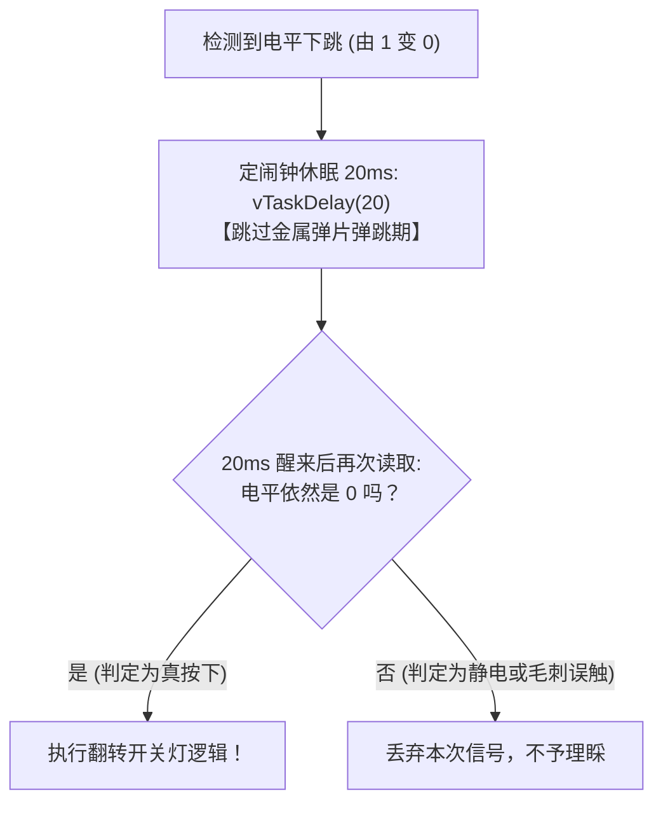

# 第 03 章：感知世界的声音 —— ESP32 按键输入检测与人体红外感应


> **写在前面**：在前两关中，我们学会了向电脑打印文字、向外输出电流点亮 LED。单片机学会了“说话”和“动手动脚”（输出 Output）。
> 
> 但如果单片机只能自己闷头输出，那它只是一个没有灵魂的自动化机器。这一章，我们将为 ESP32 装上**“触觉（机械按键 SW3）”**与**“眼睛（人体红外探头 SR602）”**—— 让代码能够**感知物理世界的输入（Input）**，实现真正的人机交互！

---

## 3.1 什么是 GPIO 输入？（单片机的眼睛与皮肤）

* **GPIO 输出（Output，上一关）**：CPU 内部决定输出 3.3V 还是 0V（单片机主动“伸手操作”）；
* **GPIO 输入（Input，本关核心）**：引脚处于**“高阻抗监听状态”**，用来测量外部物理世界送进来的电压是多少：
  * 当外部送来的电压接近 **3.3V** 时，芯片读取到数字 **`1`（高电平）**；
  * 当外部送来的电压接近 **0V** 时，芯片读取到数字 **`0`（低电平）**。


在本关卡中，我们将分别实现两种不同类型的输入交互：
1. **触觉输入（主动触发）**：板载微动机械按键 **`SW3`**（连接至 `GPIO39`）；
2. **视觉输入（被动感应）**：外接微型人体红外传感器 **`SR602`**（连接至 `GPIO34`）。

---

## 3.2 🔘 触觉输入篇：板载用户按键 SW3 与硬件电路

### 1. 🗺️ 手把手看懂按键电路原理图

我们用“双重视角”来彻底看懂这个电路 —— 先看**逻辑等效图（秒懂原理）**，再看**EDA 真实图纸还原（学会看图）**：

#### ① 视角一：逻辑等效极简图（单片机视角的原理）

```text
                  【板载用户按键 SW3 逻辑等效原理图】

              +3.3V 电源
                 │
                 │ R42 (10kΩ 上拉电阻：平时把这根线充满 3.3V)
                 │
  GPIO39 ────────┴─────────○  ○───────────┸ GND (0V 地线)
 (输入监听端)             SW3 机械按键
```

---

#### ② 视角二：EDA 真实图纸还原（PDF 原理图对照）

在配套原理图 [`docs/ESP32开发板原理图1.1.pdf`](../docs/ESP32开发板原理图1.1.pdf) 的顶部【复位下载按键】框内，你可以找到这颗受控按键 `SW3` 的真实电路：


```text
                  【原理图真实电路还原：板载用户按键 SW3】

                       (金属弹片/手柄)
                            ┌───┐
                            │ ■ │
                      ┌─────┴───┴─────┐
                 1  ──○               ○──  2
                      │   [ SW3 按键 ] │       【网络标号: VN】
                 3  ──○               ○──  4 ───┬──────────────► (隐形连向芯片第5脚 GPIO39)
                      └───────────────┘        │
                              │                │
                             ┸ GND             └───[ R42 (10kΩ) ]─── +3.3V 电源
                            (0V 地线)                 [ 上拉电阻 ]
```

#### 🔍 很多初学者看不懂这个电路符号，我们做 2 个核心拆解：

##### ❓ 疑问一：为什么按键符号里有 4 个小圆圈，还两两垂直连着？
我们在板子上看到的黑色微动按键，现实中其实有 **4 只金属引脚**（左右各 2 只，为了能极其牢固地焊接在电路板上）：
* **左边两脚（1 脚与 3 脚）**：内部本来就是导通在一起的，引出来统一连接到 **GND（0V 地线）**；
* **右边两脚（2 脚与 4 脚）**：内部也导通在一起，引出来连接右侧电路；
* **顶部的金属弹片（深蓝色 T 字手柄）**：
  * **平时不按时**：弹片悬空，左边（GND）和右边（芯片端）**完全断开**；
  * **手指按压时**：弹片被压下，**瞬间把左边的 GND 和右边的电路短路接通**！

##### ❓ 疑问二：为什么右侧导线没有画一根长线拉到 ESP32 芯片？
仔细观察图纸，右侧蓝线上印着文字 **`VN`**：
* 在专业电路图（EDA 软件）中，这叫做 **“网络标号（Net Label）”**；
* **EDA 的“隐形传送门”规则**：图纸上只要有两处标注了完全相同的名字（比如按键这里的 `VN` 和芯片第 5 脚 `SENSOR_VN` 处的 `VN`），就代表它们**在物理电路板上已经通过铜箔走线死死焊接在了一起**！
* 这样设计是为了防止图纸上横七竖八布满交叉的实线，保证图纸清晰易读。

---

#### ⚡ 串联工作全流程（为什么按键按下是 0，松开是 1？）：

1. **平时松手（没按按键时）**：
   * 按键内部断开，左边的 GND 无法连通；
   * 右侧 `+3.3V` 电源通过 `R42 (10kΩ)` 上拉电阻给这根线路“供电充盈”；
   * **`VN` 导线保持在 3.3V 高电平，芯片 `GPIO39` 读取到数字 `1`**。
2. **手指用力按下按键时**：
   * 内部弹片压下接通，这根导线瞬间被强行拉到 **GND（0V 地线）**；
   * **`VN` 导线瞬间跌入 0V 低电平，芯片 `GPIO39` 读取到数字 `0`**。
3. 👉 **这就是最经典的“低电平有效”（按下读 0，松开读 1）按键电路！**

---

### 2. ⚡ 深入核心痛点：为什么按一下按键会触发好几次？

在写单片机代码时，新手最常遇到的诡异 Bug 就是：**“我明明只按了一下按键，为什么灯疯狂闪烁或者日志连弹了 8 次？”**

这是因为真实物理世界中的机械按键，并不是理想的瞬间接通！

```text
               【微观时间轴下的按键抖动 (10~20ms)】

高电平 (3.3V) ────┐    ┌─┐  ┌┐
                  │ ┌──┘ └──┘ └──┐
低电平 (0V)       └─┘            └──────────────────── (稳定按下)
                  ▲              ▲
                  │  机械抖动区  │
                  └── (10~20ms) ─┘
```

* **物理真相（机械碰撞弹跳）**：
  按键内部是两片微小的弹性金属弹片。当你用手指压下去的瞬间，弹片在碰撞时会像乒乓球落地一样发生**数毫秒的微观弹性弹跳（Bounce）**；
* **单片机速度太快**：ESP32 的主频高达 240MHz，在金属弹片跳动的这 10 毫秒内，CPU 已经跑了 240 万条指令，把每一次微观回弹都误当成了你又按了一次按键！

---

### 3. 💡 工业级解法：20ms 软件消抖法（定闹钟二次确认）

解决机械抖动最经典、工业界最常用的算法是 **“延时双重确认法（Debounce）”**：



#### 💻 核心实现代码片段（按键消抖与翻转）：

```c
#define BUTTON_PIN GPIO_NUM_39
static int button_last_level = 1; // 记录上一次电平，平时松开为 1
static bool g_led_state = false;  // 记录 LED 开关状态

// 1. 读取当前电平
int current_btn_level = gpio_get_level(BUTTON_PIN);

// 2. 边沿检测：只有从“1(没按)”变成“0(按下)”的瞬间才响应
if (button_last_level == 1 && current_btn_level == 0) {
    // 3. 软件消抖：休眠 20 毫秒跳过弹片弹跳期
    vTaskDelay(pdMS_TO_TICKS(20));

    // 4. 二次确认：醒来后再读一次，依然为 0 说明是真实按下
    if (gpio_get_level(BUTTON_PIN) == 0) {
        g_led_state = !g_led_state; // 状态取反：开变关、关变开
        gpio_set_level(LED_PIN, g_led_state ? 1 : 0);
        ESP_LOGI(TAG, "🔘 按键有效触发！当前灯状态: %d", g_led_state);
    }
}
button_last_level = current_btn_level; // 更新历史状态
```

---

## 3.3 🚶 视觉输入篇：SR602 微型人体红外传感器深度剖析

我们在楼梯口、智能走廊常常会看到“人来灯亮、人走灯灭”的感应灯，它是怎么感知到有人靠近的？本关我们使用的就是一颗经典的 **SR602 微型人体热释电红外传感器（PIR）**。

### 1. 🔍 认识这颗“白色小圆帽”：它长啥样？怎么插？

SR602 是一颗非常小巧的传感器模块，正面覆盖着一个半球形的**白色塑料小帽子**（菲涅尔透镜），黑色圆形 PCB 板下方引出 3 根金属插针。


#### 🔍 观察模块正面的 3 个微型白色丝印符号（从左至右）：
1. **左侧引脚标注 `-`（减号）**：代表 **`GND`（电源地线 / 负极）**；
2. **中间引脚标注 `+`（加号）**：代表 **`VCC`（+3.3V 电源正极）**；
3. **右侧引脚标注 `OUT`（信号）**：代表 **`S / Signal`（红外高低电平信号输出端）**。

> 💡 **硬件冷知识：右上角那两个空焊盘 `S+` 和 `S-` 是干嘛的？**
> * 它是预留给 **光敏电阻（LDR，测光线明暗）** 的扩展焊接位！
> * 很多真实的走廊感应灯要求**“白天大太阳下有人经过不亮灯，只有天黑后有人经过才亮灯”**。如果在这两个焊盘上焊上一颗普通光敏电阻：
>   * **白天有光照时**：光敏电阻阻值变小，将感应信号锁死关闭（白天彻底休眠不触发，极致省电）；
>   * **夜晚天黑时**：光敏电阻阻值变大，解除锁定，恢复正常感应。
> * **出厂默认不焊接**：代表模块处于**“全天候 24 小时工作模式”**（无论白天黑夜，只要有人经过都会触发），方便我们随时随地做实验！

---

#### 📌 实物插针对齐法则（核心防呆 ⚠️）：

对照开发板下方的排针丝印：


* **开发板 JP5 插座从左至右**：**`S` | `VCC` | `GND`**
* **SR602 模块正面从左至右**：**`- (GND)` | `+ (VCC)` | `OUT (S)`**

```text
               【SR602 模块与开发板 JP5 排针插入对齐图】

             (模块正面朝外，让 OUT 对准 S，让 - 对准 GND)
             
                     ┌──────────────────┐
                     │   SR602 传感器    │
                     │  ⚪ 白色半球透镜  │
                     │                  │
                     │ [OUT]  [+]  [-]  │  ◄── 【模块正面丝印】
                     └───┬─────┬────┬───┘
                         │     │    │
                         │     │    │ (对准插入开发板排针)
                         ▼     ▼    ▼
                     ┌──────────────────┐
                     │   S    VCC  GND  │  ◄── 【开发板 JP5 丝印】
                     │  [JP5 人体检测]   │
                     └──────────────────┘
```

| 模块正面丝印 | 对应功能 | 插入开发板 JP5 位置 | 连接到 ESP32 芯片 |
| :---: | :--- | :---: | :--- |
| **`OUT`** | 信号输出 (有人为 1，无人为 0) | **`S`**（左针） | 板载 100Ω 电阻连到 **`GPIO34`** |
| **`+`** | 电源正极 (+3.3V) | **`VCC`**（中针） | **`+3.3V`** 电源 |
| **`-`** | 电源负极 (接地 0V) | **`GND`**（右针） | **`GND`** 地线 |

> 💡 **一句话记忆**：
> **把 SR602 模块的正面（印着 SR602 字样和白色小球的一面）朝向开发板外侧（下方），让印着 `OUT` 的引脚对准左侧的 `S` 针脚插进去即可！**

---

### 2. 🗺️ 拆解人体红外原理图（JP5 接口电路）

在配套原理图 [`docs/ESP32开发板原理图1.1.pdf`](../docs/ESP32开发板原理图1.1.pdf) 左下角【传感器接口】区域，可以看到 `JP5` 的电路结构：

```text
                  【JP5 人体红外传感器接口原理图】

              GPIO34 ──[ R10 100Ω ]──[ Pin 1: S (RES) ]
                (输入)
                              +3.3V ───[ Pin 2: VCC ]
                                           JP5 接口
                                GND ───[ Pin 3: GND ]
```

* **限流保护电阻 `R10 (100Ω)`**：串联在 `S (RES)` 信号线上，用于防止静电和浪涌电流冲击 ESP32 芯片的 `GPIO34` 引脚。

---

### 3. 🌡️ 物理工作原理：为什么人走过能感应，静止不动却不感应？

很多初学者以为红外传感器是像手电筒一样“自己向外发射红外光”，**其实完全不是！**

* **① 被动接收人体热辐射（PIR, Passive Infrared）**：
  自然界中任何温度高于绝对零度（$-273.15^\circ\text{C}$）的物体都会向外辐射红外线。人体体温约为 $37^\circ\text{C}$，会天然向外界辐射波长约为 **$9 \sim 10\ \mu\text{m}$ 的远红外光**；
* **② 菲涅尔透镜（白色小帽子）的神奇作用**：
  白色半球罩并不是普通塑料，而是由多组精密微小同心圆构成的**菲涅尔透镜（Fresnel Lens）**。它将感应区域分割成一格一格的“明区”与“暗区”交替视野；
* **③ 热释电效应（只对“温度变化”敏感）**：
  当有人体走过时，人体辐射的热源在传感器的明区和暗区之间移动，内部的热释电晶体温度发生**动态跳变**，晶体表面瞬间产生微弱电荷，触发内部放大器输出高电平！
  > 💡 **这就是为什么如果你像雕塑一样在它面前完全静止不动，传感器就会判定为“无人”而变回低电平！**

---

### 4. ⏱️ 关键电气特性：2.5 秒输出延时保持

SR602 模块内部集成了一个微型定时器：
* **感应到人活动时**：输出引脚立刻跳变到 **3.3V 高电平（读到 `1`）**；
* **延时保持机制**：一旦被触发，它会**强行保持约 2.5 秒的高电平**。在这 2.5 秒内，即使人走开了，它依然输出 1，直到 2.5 秒倒计时结束才恢复为 **0V 低电平（读到 `0`）**。
* 👉 这种硬件设计非常巧妙，可以防止灯光因人体的短暂动作停顿而频繁闪烁！

#### 💻 核心实现代码片段（红外状态跳变捕获）：

```c
#define PIR_PIN GPIO_NUM_34
static int pir_last_state = -1; // 记录上一次红外状态，初值 -1 保证开机打印一次

// 1. 读取红外引脚当前电平 (1: 有人, 0: 无人)
int current_pir_state = gpio_get_level(PIR_PIN);

// 2. 状态变化检测：只有在电平发生改变时才打印，防止每 10ms 狂刷日志
if (current_pir_state != pir_last_state) {
    if (current_pir_state == 1) {
        ESP_LOGW(TAG, "🚶‍♂️ [红外感应] 探测到人体活动！(GPIO34 = 1 高电平)");
    } else {
        ESP_LOGI(TAG, "🍃 [红外感应] 人体离开或静止无感应。(GPIO34 = 0 低电平)");
    }
    pir_last_state = current_pir_state; // 更新历史状态
}
```

---

## 3.4 ⚠️ 小白避坑高压线：ESP32 的 4 根“纯输入管脚”限制！

在 ESP32 芯片上，有 4 根非常特殊的引脚，必须刻在脑海里：

$$\mathbf{GPIO34} \quad \mathbf{GPIO35} \quad \mathbf{GPIO36 (VP)} \quad \mathbf{GPIO39 (VN)}$$

在本章中，按键接在 `GPIO39 (VN)`，人体红外接在 `GPIO34`，它们都属于这 4 根特殊引脚：

> 🚫 **硬件三大铁律**：
> 1. **绝不能配置为输出**：它们在硅片物理层面就没有输出驱动晶体管，如果你写 `gpio_set_direction(GPIO_NUM_39, GPIO_MODE_OUTPUT)`，不仅无效还会报错；
> 2. **内部没有上拉/下拉电阻**：普通 GPIO 可以通过软件开启内部上拉（`GPIO_PULLUP_ENABLE`），但这 4 根引脚**内部没有上拉电阻**，必须依赖开发板电路上的外部硬件电阻（如板载按键的 10kΩ 电阻）；
> 3. **极佳用途**：正因为它们输入阻抗极高、没有内部开关杂波，非常适合用来做**按键输入、ADC 模拟采集、红外与传感器信号读取**。

#### 💻 代码对比：纯输入管脚的正确 vs 错误配置

```c
// ❌ 错误示范 1：试图配成输出模式（会报错/无效）
gpio_set_direction(GPIO_NUM_39, GPIO_MODE_OUTPUT); 

// ❌ 错误示范 2：试图开启内部上拉电阻（无效，硬件上根本没有）
gpio_set_pull_mode(GPIO_NUM_39, GPIO_PULLUP_ONLY); 

// ✅ 正确规范写法：纯输入模式，上拉由板载外围硬件电路搞定
gpio_reset_pin(GPIO_NUM_39);
gpio_set_direction(GPIO_NUM_39, GPIO_MODE_INPUT);
```

---

## 3.5 关卡源码逐行带读（[`main/app_main.c`](../main/app_main.c)）

打开源码，我们来看看完整的按键消抖与红外检测是如何落地的：

```c
#include <stdio.h>
#include "freertos/FreeRTOS.h"
#include "freertos/task.h"
#include "driver/gpio.h"
#include "esp_log.h"

static const char *TAG = "LEVEL_3_INPUT";

// 引脚宏定义
#define LED_PIN         GPIO_NUM_27  // 板载受控指示灯 LED2 (输出)
#define BUTTON_PIN      GPIO_NUM_39  // 用户按键 SW3 (纯输入)
#define PIR_PIN         GPIO_NUM_34  // SR602 人体红外探头 (纯输入)

// 全局状态变量：记录当前灯是开(true)还是关(false)
static bool g_led_state = false;
```

---

### 1. 初始化 GPIO 方向

```c
static void init_system_gpios(void)
{
    // 1. 初始化 LED2 为输出
    gpio_reset_pin(LED_PIN);
    gpio_set_direction(LED_PIN, GPIO_MODE_OUTPUT);
    gpio_set_level(LED_PIN, 0); // 默认初始熄灭

    // 2. 初始化 SW3 按键为输入
    gpio_reset_pin(BUTTON_PIN);
    gpio_set_direction(BUTTON_PIN, GPIO_MODE_INPUT);

    // 3. 初始化 SR602 红外为输入
    gpio_reset_pin(PIR_PIN);
    gpio_set_direction(PIR_PIN, GPIO_MODE_INPUT);
}
```

---

### 2. 主循环：边沿检测、消抖与状态翻转

```c
void app_main(void)
{
    init_system_gpios();

    int pir_last_state = -1;   // 记录上一次红外状态，防止刷屏
    int button_last_level = 1; // 按键平时松开为高电平 1

    while (1) {
        // --- 模块一：按键扫描与消抖 ---
        int current_btn_level = gpio_get_level(BUTTON_PIN);

        // 边沿检测：只有当按键从“没按(1)”变成“按下了(0)”的瞬间才响应
        if (button_last_level == 1 && current_btn_level == 0) {
            // 💡 软件消抖：睡 20ms 避开金属弹片抖动
            vTaskDelay(pdMS_TO_TICKS(20));

            // 二次确认：醒来后再读一次
            if (gpio_get_level(BUTTON_PIN) == 0) {
                // 💡 状态翻转小技巧：!true 变成 false，!false 变成 true
                g_led_state = !g_led_state;
                gpio_set_level(LED_PIN, g_led_state ? 1 : 0);

                ESP_LOGI(TAG, "🔘 [按键触发] 用户按下了 SW3！当前指示灯: %s", 
                         g_led_state ? "🟢【点亮】" : "⚪【熄灭】");
            }
        }
        button_last_level = current_btn_level; // 更新历史状态

        // --- 模块二：人体红外状态变化监控 ---
        int current_pir_state = gpio_get_level(PIR_PIN);
        if (current_pir_state != pir_last_state) {
            if (current_pir_state == 1) {
                ESP_LOGW(TAG, "🚶‍♂️ [红外感应] 探测到人体活动！(GPIO34 = 1)");
            } else {
                ESP_LOGI(TAG, "🍃 [红外感应] 人体离开或静止无感应。(GPIO34 = 0)");
            }
            pir_last_state = current_pir_state;
        }

        // 极短休眠 10ms，既不漏掉快速点击，又让出 CPU 算力
        vTaskDelay(pdMS_TO_TICKS(10));
    }
}
```

---

## 3.6 📚 专属编程知识拓展（库函数字典与语法速查）

---

### 1. 核心库函数功能字典

| 函数名称 | 典型写法 | 参数说明 | 作用 |
| :--- | :--- | :--- | :--- |
| **`gpio_get_level()`** | `int val = gpio_get_level(GPIO_NUM_39);` | 引脚编号 | 读取该引脚当前电平，返回 `1`（高电平）或 `0`（低电平） |

---

### 2. 嵌入式 C 语言技巧拆解

#### ① 状态翻转取反运算符：`g_led_state = !g_led_state;`
* `g_led_state` 是一个布尔变量（`true` 或 `false`）；
* 加上 `!`（逻辑非）操作符：
  * 如果当前是 `false`（关灯），`!false` 就会变成 `true`（开灯）；
  * 如果当前是 `true`（开灯），`!true` 就会变成 `false`（关灯）；
* 一行代码即可实现**“按一下开，再按一下关”**的优雅切换。

#### ② 边沿检测（Edge Trigger）vs 电平检测（Level Trigger）
* **如果写 `if (current_btn_level == 0)`（电平检测）**：
  只要你手指按着按键不松开，程序每 10ms 就会连续触发一次，灯疯狂闪烁成迪厅；
* **写成 `if (button_last_level == 1 && current_btn_level == 0)`（下跳沿检测）**：
  程序只在**按下去那一瞬间（由 1 变成 0）**触发一次，就算你手指按着一小时不松手，也只算触发一次！

#### ③ 嵌入式安全铁律：为什么只有输出引脚要赋初值 0？输入引脚为什么不行？

很多初学者在看初始化代码时都会好奇：**为什么只有 LED 输出引脚写了 `gpio_set_level(LED_PIN, 0)`，而按键和红外输入引脚却没写？**

* **① 输入（Input）是“单片机的耳朵”**：
  * 按键和红外是输入引脚，处于**高阻抗监听状态**。它的电压完全由外界（按键有没有按、红外有没有感应）决定。
  * 单片机只能用 `gpio_get_level()` 被动去“听/读”外界是 1 还是 0，**单片机自己无法也不应该去强行设置输入引脚的电压**。
* **② 输出（Output）是“单片机的手和开关”**：
  * 单片机刚通电或者重启复位时，底层硬件寄存器可能残留着未知的状态。
  * **防止开机误动作（安全第一）**：如果这个引脚接的不是 LED，而是**电机、继电器、水泵或蜂鸣器**，如果不显式赋初值 0，单片机开机瞬间水泵可能猛喷一下、继电器可能打火误触、蜂鸣器刺耳尖叫！
  * **软硬件状态对齐**：代码中全局变量定义了 `g_led_state = false`（认为灯默认熄灭），显式调用 `gpio_set_level(LED_PIN, 0)` 才能确保**“代码变量记录的状态”与“物理硬件真实状态”100% 同步归零**！

---

## 3.7 动手小实验（即时体验与真实验收）

烧录固件到开发板后，打开 VS Code 串口监视器（`idf.py monitor`），你将看到如下图所示的标准交互运行效果：


```text
                  【关卡 3 真实串口终端交互日志】

I (762) LEVEL_3_INPUT: ==================================================
I (762) LEVEL_3_INPUT:    🎉 关卡 3 启动：按键输入与人体红外感知教学     
I (772) LEVEL_3_INPUT: ==================================================
I (782) LEVEL_3_INPUT: GPIO 初始化完成: LED2 (输出), SW3按键 (输入), SR602红外 (输入)
I (792) LEVEL_3_INPUT: >>> 系统已就绪，请按下板载按键 SW3，或用手靠近 SR602 红外探头...
I (802) LEVEL_3_INPUT: 🍃 [红外感应] 人体离开或静止无感应。(GPIO34 = 0 低电平)

--- 阶段一：人体红外动态感应（有人靠近 ➔ 离开恢复）---
W (5882) LEVEL_3_INPUT: 🚶‍♂️ [红外感应] 探测到人体活动！(GPIO34 = 1 高电平)
I (9862) LEVEL_3_INPUT: 🍃 [红外感应] 人体离开或静止无感应。(GPIO34 = 0 低电平)

--- 阶段二：用户按键 SW3 连续点击翻转灯光 ---
I (26982) LEVEL_3_INPUT: 🔘 [按键触发] 用户按下了 SW3！当前指示灯切换为: 🟢【点亮】
I (28152) LEVEL_3_INPUT: 🔘 [按键触发] 用户按下了 SW3！当前指示灯切换为: ⚪【熄灭】
I (29552) LEVEL_3_INPUT: 🔘 [按键触发] 用户按下了 SW3！当前指示灯切换为: 🟢【点亮】
I (30122) LEVEL_3_INPUT: 🔘 [按键触发] 用户按下了 SW3！当前指示灯切换为: ⚪【熄灭】
```

---

### 🧪 实验 1：按键开关灯测试
* 用手指按下板载右上角的用户按键 **SW3**：
  * 第一次按：LED2 点亮，终端打印绿色日志 `🔘 当前指示灯切换为: 🟢【点亮】`；
  * 第二次按：LED2 熄灭，终端打印 `🔘 当前指示灯切换为: ⚪【熄灭】`；
  * 长按不放：确认指示灯不会疯狂闪烁，只在按下的瞬间切换一次（证明 20ms 消抖生效！）。

---

### 🧪 实验 2：人体红外感应测试
* 如果板上插了 SR602 模块（JP5）：
  * 用手在白色小球上方晃动一下，观察串口终端立刻弹出黄色警告日志：`🚶‍♂️ [红外感应] 探测到人体活动！`；
  * 手移开保持静止 3 秒后，终端恢复打印：`🍃 人体离开或静止无感应`。

---

### 🧪 实验 3：进阶联动 —— 打造“智能楼道感应灯”

我们把按键和人体红外结合起来：**有人经过时自动亮灯，人走后自动熄灭；同时支持随时按键强制开灯/关灯！**

尝试把主循环逻辑修改为如下联动代码：

```c
// 💡 智能楼道灯核心逻辑：
if (current_pir_state == 1) {
    // 只要红外检测到有人，自动点亮 LED
    gpio_set_level(LED_PIN, 1);
} else if (!g_led_state) {
    // 无人且未手动强制开灯时，自动熄灭 LED
    gpio_set_level(LED_PIN, 0);
}
```

👉 **体验效果**：当你走近开发板晃晃手，灯光自动照亮；离开后静待 2.5 秒，灯光优雅熄灭！

---

## 3.8 新手排错宝典

| 遇到的现象 | 为什么会这样？ | 怎么解决？ |
| :--- | :--- | :--- |
| **按下 SW3 按键没有任何日志输出** | 1. 看错了按键（板上有两个按键：RESET 键按下会重启单片机，旁边的 **SW3** 才是用户按键）；<br>2. 没打开串口监视器。 | 确认按下的是 **SW3** 按键，并确认终端已执行 `idf.py monitor`。 |
| **编译报错提示 GPIO39 不能配输出** | 误把 GPIO39 配置成了 `GPIO_MODE_OUTPUT`。 | 牢记 ESP32 的 4 根纯输入引脚（34/35/36/39）绝对不能配置为输出。 |

---

## 3.9 本章总结与闯关打卡

恭喜你！学完本章，你已经攻克了单片机从“单向输出”到“双向交互”的最关键一步：
1. 掌握了数字输入 `gpio_get_level()` 的使用与电路原理（上拉电阻 + 低电平有效）；
2. 彻底搞懂了机械按键抖动的原因，并掌握了工业级 20ms 软件消抖法；
3. 掌握了边沿检测触发机制与人体红外传感器（PIR）的数据捕获。

---

*下一关预告：虽然软件轮询消抖能够检测按键，但 CPU 必须不停地执行 `while(1)` 轮询，既浪费算力又耗电。如何让 CPU 在没人按键时彻底休眠，一旦手指按下瞬间**硬件触发“拍肩膀”打断 CPU**？下一关，我们将学习现代嵌入式系统响应外设的核心王牌 —— [**第 04 关：ESP32 GPIO 外部中断与 FreeRTOS 队列通信**](./04_GPIO外部中断与FreeRTOS任务队列.md)！*
