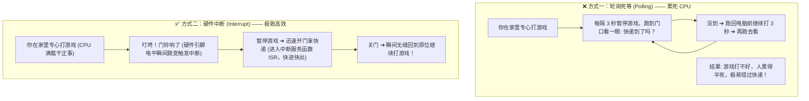
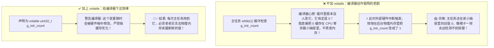

# 第 04 章：瞬息之间的掌控 —— ESP32 GPIO 外部中断(ISR)与事件驱动


> **写在前面**：在上一关中，我们学会了用 `gpio_get_level()` 读取按键状态。但你有没有发现一个“别扭”的地方？
> 
> 代码里必须写一个 `while(1)` 死循环，每隔 10ms 就傻傻地去问一次：“按键按下了吗？按键按下了吗？” —— 这种方式在计算机领域叫做 **“轮询（Polling）”**。
> 
> 如果单片机正在执行复杂的 Wi-Fi 联网或绘制屏幕，漏掉了某一次 10ms 的检测，按键就会发生**“吞键/漏响应”**。
> 
> 这一章，我们将学习单片机程序员真正的**核心看家武器 —— 硬件外部中断（Interrupt）**！让硬件在物理按下的**微秒级瞬间主动打断 CPU**，彻底告别死等轮询，迈入现代事件驱动编程的大门！

---

## 4.1 什么是“中断”？（生活中的生动比喻）

为了彻底搞懂中断，我们对比两种日常生活场景：



### 💡 核心结论：
* **轮询（Polling）**：CPU 不断主动去查引脚状态。**缺点**：严重浪费算力，响应不及时；
* **中断（Interrupt）**：CPU 根本不管引脚，专心做自己的主任务或直接休眠省电。**一旦引脚电平发生变化，硬件电路自动给 CPU 发送“暂停信号”**，CPU 瞬间跳去执行专属的紧急处理函数（ISR），处理完后立刻返回原来暂停的地方继续运行！

---

## 4.2 🗺️ 拆解按键动作：什么是“电平边沿”？（像悬崖一样的跳水过程）

很多初学者第一次听到 **“上升沿（Rising Edge）”**、**“下降沿（Falling Edge）”** 这些词时，都会觉得一头雾水：**“电平就电平，怎么还长出‘边沿’来了？”**

其实非常简单！**“沿（Edge）”就像悬崖的边缘**。我们把按一次按键的整个物理过程，拆成 **4 个连续动作**，你看电路里的电压发生了什么：

---

### 🎬 按键全动作剖析图（从按压到松开）：

```text
               【用“悬崖与水面”看懂按键的 4 个物理动作】

           ① 平时不按                 ④ 手指松开瞬间 (上升沿)
           (水位在 3.3V 山顶)         (像火箭瞬间从 0V 窜回 3.3V)
电压       ─────────────┐                    ┌───────────── (恢复 3.3V)
(Volt)                  │                    ▲
3.3V                    │                    │
                        │                    │
0V                      ▼                    │
                        └────────────────────┘
                  ② 手指刚按下的瞬间      ③ 手指一直按着不松开
                     (下降沿：跳水！)        (水位停留在 0V 谷底)
```

我们把这 4 个动作与单片机的感知一一对应：

#### 动作 ①：平时没碰按键（平静的山顶）
* 电路状态：内部/外部上拉电阻拉着，引脚电压稳定在 **3.3V（高电平）**；
* 单片机状态：电压没有剧烈波动，安安静静。

#### 动作 ②：手指刚压下去的那 1 微秒 —— ⚡【下降沿 Falling Edge】
* 物理过程：按键内部金属片刚碰到接地线，电压**像从悬崖顶上跳水一样，瞬间从 3.3V 摔落到 0V**！
* 英文名称：**`GPIO_INTR_NEGEDGE`**（Negative Edge / 下降沿）；
* 单片机感知：**“检测到悬崖坠落！用户刚刚把按键按下去了！”** ➔ 立即触发中断！

#### 动作 ③：手指一直按着不放（沉在谷底）
* 物理过程：电压一直稳稳地趴在 **0V（低电平）**；
* 状态：虽然是低电平，但电压没有发生“跳崖”。

#### 动作 ④：手指松开按键的那 1 微秒 —— ⚡【上升沿 Rising Edge】
* 物理过程：按键弹簧弹开，3.3V 电源瞬间重新充满线路，电压**像火箭一样瞬间从 0V 攀升回 3.3V**！
* 英文名称：**`GPIO_INTR_POSEDGE`**（Positive Edge / 上升沿）；
* 单片机感知：**“检测到悬崖攀升！用户的按键刚刚松开了！”** ➔ 立即触发中断！

---

### ⚠️ 致命雷区剖析：为什么不能选“低电平触发”，必须选“下降沿触发”？

ESP32 提供了 5 种中断模式，初学者最容易混淆的就是 **“边沿触发（Edge）”** 和 **“电平触发（Level）”**：


### 📋 5 种中断模式大白话速查表：

| 模式宏定义 | 中文名称 | 用生活大白话解释触发时机 | 最适用的真实场景 | 本关推荐 |
| :--- | :--- | :--- | :--- | :---: |
| **`GPIO_INTR_NEGEDGE`** | **下降沿触发** | **只在电平“从高掉到低”的坠崖瞬间触发一次** | **按键按下检测**（一按立刻响应） | ⭐ **本关首选！** |
| **`GPIO_INTR_POSEDGE`** | **上升沿触发** | **只在电平“从低窜到高”的攀登瞬间触发一次** | **按键松开检测**、人体红外感应有人靠近 | 常用 |
| **`GPIO_INTR_ANYEDGE`** | **双边沿触发** | **不管往下掉还是往上升，只要电压变了就触发** | 旋钮编码器旋转、超声波测脉冲宽度 | 进阶使用 |
| **`GPIO_INTR_LOW_LEVEL`**| **低电平触发** | **只要电压是 0V 就一刻不停地疯狂触发** | 外部专用传感器芯片硬件报警拉低 | 慎用（按键禁用） |
| **`GPIO_INTR_HIGH_LEVEL`**| **高电平触发** | **只要电压是 3.3V 就一刻不停地疯狂触发** | 特殊硬件状态监听 | 慎用（按键禁用） |

---

## 4.3 🚪 既然门铃响了，该派谁去开门？—— 认识中断服务函数（ISR）

在上一节，我们搞懂了：**“当用户按下按键时，电压会在一瞬间跳崖（下降沿），就像按响了门铃。”**

那接下来最自然的问题就是：**门铃响了之后，单片机该执行哪一段代码去“开门拿快递”？**

在嵌入式编程中，这段被硬件打断后专门跑去紧急处理的函数，有一个专属的名字：  
👉 **中断服务函数（ISR，全称 Interrupt Service Routine）**。

---

### 1. 先看一眼：一个最简单纯粹的“开门函数”长啥样？

其实它本质上就是一个普通的 C 语言函数，比如我们想让按键一按，灯就立刻翻转：

```c
// 🚪 这就是我们的“开门函数”（中断服务函数 ISR）
static void IRAM_ATTR gpio_isr_handler(void* arg)
{
    // 按键一按，瞬间执行这行代码：翻转 LED 灯！
    g_led_state = !g_led_state;
    gpio_set_level(LED_PIN, g_led_state ? 1 : 0);
}
```

但很多初学者一看到这个函数，立刻会冒出 **两个极大的疑惑**：

---

### ❓ 疑惑一：为什么这个函数里不能像平时一样写 `vTaskDelay()` 睡觉？

你在平时的代码里习惯了写 `vTaskDelay(100)` 让程序睡一会。但在中断函数里，**一旦写了 `vTaskDelay`，单片机会瞬间崩溃报错死机！**

这是为什么呢？用一个开车接电话的比喻你就彻底懂了：


#### 💡 核心法则（快进快出，随用随结束）：
* 中断的特权极高，**它运行时整个单片机的其他任务都会被临时定格**！
* 所以中断函数就像**“火警报警器”**：它的天职是 **“花 1 微秒拉响警报，然后立刻挂断”**，而不是自己冲进火场慢悠悠灭火！
* 绝不能在里面睡觉（`vTaskDelay`）、不能做复杂的数学运算，也不能打印一大堆冗长的日志！

#### 🌟 进阶灵魂拷问：如果按键按下后，真的必须干一件耗时几秒的“大重活”，该怎么办？

很多初学者这时一定会问：**“如果我按一下按键，想让单片机连 Wi-Fi 发一条微信消息、或者在屏幕上画一幅大图，这需要耗时好几秒钟，既然中断里不能干，那我该把代码写在哪？”**

这是嵌入式高手的标准解法 —— **“前台拉警报，后台慢慢干”（事件驱动经典架构）**：


👉 **结论**：中断函数**“只负责极速发便签通知，耗时的大重活全部留给后台任务慢慢干”**！

---

### ❓ 疑惑二：为什么函数名字前面非要顶着一个奇怪的 `IRAM_ATTR`？

仔细看上面的函数声明：`static void IRAM_ATTR gpio_isr_handler(...)`。

很多小白会问：`static void` 我认得，中间这个 **`IRAM_ATTR`** 到底是个什么鬼符号？不写它行不行？

我们来听一个 **“大仓库与贴身口袋钥匙”** 的故事：

```text
       【为什么需要 IRAM_ATTR？—— 外部大仓库 vs 贴身口袋】

┌─────────────────────────────────────────────────────────────┐
│  ESP32 芯片外部的大仓库 (8MB 外部 Flash 芯片)                │
│  平时写的所有代码、字体、图片，都存放在这个大仓库里。        │
│  CPU 要执行代码时，需要派人跑去大仓库里一条条取指令。       │
└─────────────────────────────────────────────────────────────┘
                              ▲
                              │ ⚠️ 危险时刻：当单片机正在连 Wi-Fi、
                              │    保存配置写入 Flash 时，大仓库大门会被临时锁死！
                              ▼
┌─────────────────────────────────────────────────────────────┐
│  ESP32 芯片内部的贴身口袋 (高速 Internal RAM / IRAM)         │
│                                                             │
│  ✨ 加上 IRAM_ATTR 的中断函数：                             │
│     编译器会把这段开门代码【直接塞进 CPU 的贴身口袋】！     │
│     就算外部大仓库大门被锁死，CPU 随时从口袋掏出代码就能执行│
└─────────────────────────────────────────────────────────────┘
```

#### 🔍 事故现场重现（如果不加 `IRAM_ATTR` 会发生什么？）：
1. **平时正常时**：不加可能看不出毛病，CPU 每次跑去大仓库（Flash）读中断代码执行；
2. **致命时刻（大仓库锁门）**：当你的 ESP32 以后连上 Wi-Fi、或者正在保存数据到 Flash 芯片时，**外部 Flash 芯片会被硬件锁死几毫秒进行擦写**；
3. **灾难降临**：偏偏就在这几毫秒内，用户用手按了一下按键，硬件发出门铃声！CPU 急冲冲跑去外部大仓库拿中断代码，发现**仓库大门被锁死、拿不到代码指令**！
4. **芯片自爆重启**：CPU 拿不到指令直接懵圈，触发严重硬件异常：  
   `Guru Meditation Error: Core 0 panic'ed (Cache disabled but cached memory region accessed)`  
   单片机当场死机黑屏，瞬间重启！
5. 👉 **一句话解药**：只要在中断函数前加上 **`IRAM_ATTR`**，就等于告诉编译器：**“把这段中断开门代码死死焊在 CPU 的贴身口袋（内部高速 IRAM）里！”** 无论外部 Flash 在干什么，硬件中断都能在纳秒级瞬间安全执行，永不死机！

---

## 4.4 💻 中断配置 4 步法（从零搭建中断流水线）

在 ESP32 中，要把一个按键配置为外部硬件中断，只需按顺序执行标准的 **4 步流水线**：

```c
// =========================================================================
// 步骤 1：写好具体的“开门办事函数”（中断服务函数 ISR）
// =========================================================================
// 必须加 IRAM_ATTR，保证代码常驻内部高速 RAM；快进快出，微秒级执行！
static void IRAM_ATTR gpio_isr_handler(void* arg)
{
    // 硬件瞬间翻转 LED (微秒级响应)
    gpio_set_level(LED_PIN, 1); 
}

// =========================================================================
// 步骤 2：配置目标引脚的“门铃机关”（设置为输入 + 下降沿触发）
// =========================================================================
gpio_config_t io_conf = {
    .pin_bit_mask = (1ULL << GPIO_NUM_39), // 目标是 39 号用户按键引脚
    .mode = GPIO_MODE_INPUT,               // 输入模式
    .intr_type = GPIO_INTR_NEGEDGE         // 下降沿：手指按下跳水瞬间触发
};
gpio_config(&io_conf);

// =========================================================================
// 步骤 3：在芯片中安装“全局 GPIO 中断总前台服务”
// =========================================================================
// 参数 0 表示使用系统默认的中断分配优先级（全局只需要、也只能调用 1 次！）
gpio_install_isr_service(0);

// =========================================================================
// 步骤 4：在总前台登记：“39号引脚响了，请派 gpio_isr_handler 去处理”
// =========================================================================
// 参数 1: 目标引脚 (GPIO39)
// 参数 2: 绑定的中断函数 (gpio_isr_handler)
// 参数 3: 传给函数的参数 (通常传入引脚号本身，方便多个引脚共用一个函数)
gpio_isr_handler_add(GPIO_NUM_39, gpio_isr_handler, (void*) GPIO_NUM_39);
```

---

### 🔍 深度拆解：为什么要有“步骤 3”和“步骤 4”？（总前台接线员模型）

看完上面的 4 步，初学者最容易困惑的就是最后两步：
* *“为什么又要安装全局服务（步骤 3），又要往引脚上挂载（步骤 4）？为什么不一步到位？全局能挂多少个中断？有上限吗？”*

我们来看一个生动的 **“公司总前台与分机通讯录”** 模型：

```text
       【ESP32 外部中断架构：总前台接线员 vs 引脚分机通讯录】

  [引脚 39: SW3 按键] ────┐
  [引脚 34: SR602红外] ───┼──► 🏢【全局 GPIO 中断总前台】 ──► ⚡【CPU 核心】
  [引脚 35: 触摸屏INT] ───┘   (gpio_install_isr_service)    (瞬间响应打断)
                                      │
                                      ▼ 查阅花名册分发:
                             * 39号响了 ➔ 派按键函数执行
                             * 34号响了 ➔ 派红外函数执行
                             * 35号响了 ➔ 派触摸函数执行
```

#### 1. 现实困境
ESP32 芯片上有 30 多个 GPIO 引脚，但 CPU 内部的**硬件中断线是非常稀缺宝贵的**。如果 30 个引脚每个人都拉一根线直接找 CPU 吵架，走线会乱成一团糟。

#### 2. ESP-IDF 的两级分发设计
1. **步骤 3（聘请公司总前台）**：`gpio_install_isr_service(0)`  
   由总前台一个人向 CPU 申请一条专属中断专线。**整个项目开机时只需要装一次！**
2. **步骤 4（登记分机通讯录）**：`gpio_isr_handler_add(...)`  
   按键、红外、触摸屏等外设，都在总前台那里登记一份花名册。哪个引脚触发了，总前台负责在微秒级时间内把任务精准派发给对应的函数！

---

### ❓ 初学者高频疑问解答：

#### ❓ 疑问一：全局可以挂载很多个中断吗？有没有数量上限？
* **答案**：**几乎没有人为限制，上限就是你开发板上可用的物理 GPIO 引脚总数！**
* **怎么挂多个？**：
  `gpio_install_isr_service(0)` 只需要在系统开机时**调用 1 次**；
  随后你可以调用多次 `gpio_isr_handler_add()` 登记多个不同的外设：
  ```c
  gpio_isr_handler_add(GPIO_NUM_39, button_isr_handler, NULL); // 挂载按键 SW3
  gpio_isr_handler_add(GPIO_NUM_34, pir_isr_handler, NULL);    // 挂载 SR602 人体红外
  gpio_isr_handler_add(GPIO_NUM_35, touch_isr_handler, NULL);  // 挂载 CST816S 触摸屏
  ```
  按键、红外和触摸屏都拥有了自己专属的中断函数，互不干扰、并行不悖！

#### ❓ 疑问二：为什么不把“步骤 3 和步骤 4”合并成一个函数，非要分两步？
* **支持“动态注销与随时热拔插”**：
  分步设计支持灵活解绑。比如你在做智能密码锁：
  * 平时：`gpio_isr_handler_add(GPIO_NUM_39, unlock_handler, ...)`（按键用来开锁）；
  * 密码输错 3 次锁定机器：调用 `gpio_isr_handler_remove(GPIO_NUM_39)`（**随时把 39 号从前台通讯录抹掉，按键瞬间在硬件层面彻底失效，防暴力破解！**）。

---

## 4.5 关卡源码逐行带读（[`main/app_main.c`](../main/app_main.c)）

打开本关源码，看看中断驱动的完整工程架构：

```c
#include <stdio.h>
#include "freertos/FreeRTOS.h"
#include "freertos/task.h"
#include "driver/gpio.h"
#include "esp_log.h"
#include "esp_timer.h"

static const char *TAG = "LEVEL_4_INTR";

#define LED_PIN         GPIO_NUM_27  // 板载受控蓝色 LED2 (输出)
#define BUTTON_PIN      GPIO_NUM_39  // 用户按键 SW3 (输入专用，平时 1，按下 0)

// 全局变量：声明为 volatile，防止编译器过度优化
static volatile uint32_t g_intr_count = 0;
static volatile bool g_led_state = false;
static volatile int64_t g_last_intr_time = 0; // 上次中断时间戳 (微秒)

// ⚡ 硬件中断服务函数 (ISR)
static void IRAM_ATTR gpio_isr_handler(void* arg)
{
    int64_t now = esp_timer_get_time(); // 获取硬件微秒时间戳 (ISR 安全)

    // 中断简易消抖：两次中断间隔小于 150ms (150,000µs) 视为弹片弹跳，直接丢弃
    if (now - g_last_intr_time > 150000) {
        g_intr_count++;
        g_led_state = !g_led_state;
        
        // 瞬间翻转 LED (微秒级硬件即时响应！)
        gpio_set_level(LED_PIN, g_led_state ? 1 : 0);
        
        g_last_intr_time = now;
    }
}

static void init_system_interrupt(void)
{
    // 1. 初始化 LED2 为输出，初始置 0
    gpio_reset_pin(LED_PIN);
    gpio_set_direction(LED_PIN, GPIO_MODE_OUTPUT);
    gpio_set_level(LED_PIN, 0);

    // 2. 配置 SW3 (GPIO39) 为下降沿中断
    gpio_config_t io_conf = {
        .pin_bit_mask = (1ULL << BUTTON_PIN),
        .mode = GPIO_MODE_INPUT,
        .pull_up_en = GPIO_PULLUP_DISABLE,
        .pull_down_en = GPIO_PULLDOWN_DISABLE,
        .intr_type = GPIO_INTR_NEGEDGE
    };
    gpio_config(&io_conf);

    // 3. 安装中断驱动服务
    gpio_install_isr_service(0);

    // 4. 挂载中断回调函数
    gpio_isr_handler_add(BUTTON_PIN, gpio_isr_handler, (void*) BUTTON_PIN);

    ESP_LOGI(TAG, "✅ 硬件中断初始化完成：SW3 (GPIO39) 下降沿中断已挂载！");
}

void app_main(void)
{
    ESP_LOGI(TAG, "==================================================");
    ESP_LOGI(TAG, "   ⚡ 关卡 4 启动：GPIO 外部中断与事件驱动教学     ");
    ESP_LOGI(TAG, "==================================================");

    init_system_interrupt();

    uint32_t last_reported_count = 0;

    // 主循环彻底告别轮询！CPU 可以休眠等待
    while (1) {
        // 只有发生中断时才打印日志（安全地在主任务中处理日志输出）
        if (g_intr_count != last_reported_count) {
            ESP_LOGI(TAG, "⚡ [中断事件捕获] 按键第 %lu 次硬件打断！当前灯光: %s (响应时间戳: %lld ms)",
                     g_intr_count,
                     g_led_state ? "🟢【点亮】" : "⚪【熄灭】",
                     g_last_intr_time / 1000);
            
            last_reported_count = g_intr_count;
        }

        // 主任务休眠 500ms，CPU 彻底释放，静候硬件打断
        vTaskDelay(pdMS_TO_TICKS(500));
    }
}
```

---

## 4.6 📚 专属编程知识拓展（库函数字典与语法速查）

---

### 1. 核心库函数功能字典

| 函数名称 | 典型写法 | 作用 |
| :--- | :--- | :--- |
| **`gpio_install_isr_service()`** | `gpio_install_isr_service(0);` | 安装 ESP-IDF 全局 GPIO 中断驱动服务框架 |
| **`gpio_isr_handler_add()`** | `gpio_isr_handler_add(GPIO_NUM_39, isr_func, arg);` | 为指定引脚绑定独立的中断处理回调函数 |
| **`esp_timer_get_time()`** | `int64_t t = esp_timer_get_time();` | 获取芯片从开机至今的硬件微秒数（$\mu\text{s}$），**可在 ISR 中安全调用** |

---

### 2. 嵌入式 C 语言技巧拆解

#### ① 为什么中断与主任务共享的全局变量必须加 `volatile`？

在声明全局变量时，你看到了这样的写法：
```c
static volatile uint32_t g_intr_count = 0;
```
`volatile` 的英文原意是 **“易变的、随时会变的”**。它之所以必须存在，是因为**编译器有时会“自作聪明地偷懒”**：



##### 📌 嵌入式黄金铁律（什么时候必须加 `volatile`？）：
只要一个变量满足以下条件，**必须无条件加上 `volatile`**：
1. **在中断服务函数（ISR）里会被修改**；
2. **同时在中断外部的主任务（`app_main` / Task）里被读取或使用**。

> 💡 **一句话口诀**：**“中断改、主任务读，必须声明 `volatile`！”**

---

## 4.7 🧪 动手小实验（即时体验与真实验收）

将代码编译烧录到开发板后，打开串口监视器（`idf.py monitor`）：

### 实验 1：极速按键响应测试
* 快速、连续地按下右上角的用户按键 **SW3**；
* **观察效果**：蓝色 LED2 在手指按下的瞬间**零延迟即刻翻转**，随后串口终端平稳打印出每次中断触发的精确毫秒时间戳与计数值。

### 实验 2：体验 CPU 算力解放
* 注意观察代码中的 `app_main`：主循环里每隔 500ms 睡大觉（`vTaskDelay(500)`）；
* **思考**：即使 CPU 正在大睡 500ms 的正中间，只要你按压按键，灯光依然瞬间翻转！这就是硬件中断与普通软件延时轮询的质的区别！

---

## 4.8 🛠️ 新手排错宝典

| 遇到的现象 | 常见原因 | 解决方案 |
| :--- | :--- | :--- |
| **按键按下时单片机直接崩溃重启 (Crash)** | 中断函数里调用了不可重入的函数或大延时（如 `vTaskDelay`）。 | 检查 ISR 函数，确保只执行快速引脚翻转与变量记录，耗时操作移至主任务。 |
| **没有加 `IRAM_ATTR` 导致报错** | 中断函数未被加载到内部 IRAM 中。 | 在中断回调函数声明前务必加上 **`IRAM_ATTR`** 修饰符。 |
| **按一次按键计数值跳了好几个** | 机械弹片物理抖动产生了多个下降沿。 | 在 ISR 中利用 `esp_timer_get_time()` 校验两次中断时间差（如 > 150ms 判定为有效）。 |

---

## 4.9 🎯 本章总结与思维跃迁

恭喜你！学完本章，你已经彻底掌握了单片机从“被动轮询”走向“事件驱动”的最核心分水岭：
1. **彻底搞懂了中断的本质**：硬件门铃一响，CPU 暂停主线立刻去开门（ISR），告别死等轮询；
2. **看透了电平边沿的物理动作**：手指按下瞬间的跳崖（下降沿 `NEGEDGE`）是捕获按键的最佳时机；
3. **掌握了中断服务函数（ISR）的编写戒律**：
   - **快进快出**：像火警报警器一样，1 微秒内发完通知立刻退出，绝不留恋；
   - **`IRAM_ATTR`**：把开门代码焊在贴身口袋（内部高速 IRAM）里，无论 Flash 怎么擦写都永不死机；
4. **领悟了“前台发便签，后台干重活”的架构思想**：
   - 中断只负责极速记录事件，耗时的大重活（连网络、画屏幕、写文件）全部交给后台任务！

---

*下一关预告：既然我们已经知道了“中断负责发便签，后台负责干重活”，那么单片机该如何优雅地建立“消息传递通道（Queue 队列）”？后台任务又该如何像多线程一样分工合作？下一关，我们将学习现代嵌入式操作系统的终极武器 —— [**第 05 关：FreeRTOS 多任务调度与队列通信**](./05_FreeRTOS多任务调度与队列通信.md)！*
