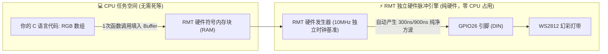

# 第 06 章：光芒与律动 —— ESP32 RMT 硬件脉冲外设与 WS2812 幻彩 RGB 跑马灯


> **写在前面**：在前几关中，我们学会了用 GPIO 控制单个蓝灯、用 PWM 呼吸灯实现明暗渐变、用中断与 FreeRTOS 队列处理多任务并发。
> 
> 但如果让你控制 **几十颗甚至上百颗全彩 RGB 灯珠（每个灯都能独立显示 1677 万种颜色）**，你该怎么做？
> * 是给每颗灯的红、绿、蓝三个引脚都连一根线吗？100 颗灯就需要 300 根线，单片机引脚立刻被挤爆！
> 
> 聪明的工程师发明了 **WS2812B（内置驱动芯片的幻彩单线灯珠）** —— **整条灯带只需 1 根数据线**，就能级联控制成千上万颗独立全彩灯！
> 
> 然而，单线通信的代价是：**它的通信时序达到了纳秒（ns）级的极致严苛要求！** 普通单片机用软件延时翻转引脚极易被中断打碎导致“群魔乱舞”乱闪。
> 
> 这一章，我们将解锁 ESP32 的独门王牌硬件外设 —— **RMT（Remote Control Peripheral，硬件脉冲发生器）**，用硬件状态机自动发射高精度方波，不占 CPU 任何算力，驱动梦幻般的彩虹流光！

---

## 6.1 什么是 WS2812？为什么 1 根线就能控制成百上千颗灯？

很多初学者第一次接触 WS2812 灯珠（常被称为“幻彩 RGB”、“像素灯”或“魔术灯带”）时，最震撼的莫过于：**只需 1 根信号线（DIN），就能让每颗灯发出截然不同的颜色！**

```text
                  【WS2812 级联数据传送图 —— 贪吃蛇吃糖果机制】
 
   ESP32 (GPIO26)
   ┌──────────┐   DIN     ┌─────────┐   DOUT    ┌─────────┐   DOUT    ┌─────────┐
   │  RMT     ├──────────►│ 第 1 颗 │──────────►│ 第 2 颗 │──────────►│ 第 3 颗 │ ...
   │ 硬件脉冲 │           │ WS2812  │           │ WS2812  │           │ WS2812  │
   └──────────┘           └─────────┘           └─────────┘           └─────────┘
```

### 🍭 “贪吃蛇吃糖果”原理（级联数据传递）：
1. **数据打包**：每颗 WS2812 灯珠包含绿（G）、红（R）、蓝（B）三个颜色通道，每个通道占 8 位（0~255），因此**一颗灯需要 24 bit（3 字节）数据**；
2. **第一颗灯吞下数据**：ESP32 一口气发送 N 颗灯的所有数据。第 1 颗灯首先截取并吞下最前面的 24 bit 作为自己的显示颜色；
3. **整形转发给下一颗**：从第 25 bit 开始，第 1 颗灯内部的硬件整形电路会自动把后续数据通过 `DOUT` 引脚原封不动吐给第 2 颗灯；
4. **锁存刷新（Reset 信号）**：当所有灯的数据发送完毕后，ESP32 保持信号线**低电平超过 50 微秒（µs）**，所有灯珠同时“吞下肚锁存”，一起亮起对应颜色！

---

## 6.2 纳秒级生死时速：WS2812 的单线归零码（NZR）时序

为什么 WS2812 这么难用普通代码驱动？因为它是 **单线归零码（Non-Return-to-Zero, NZR）**，没有专门的“时钟线（SCLK）”，每一位数据（`0` 还是 `1`）完全由**高低电平持续的时间长短**来区分！

### ⏱️ WS2812 标准 800kHz 脉冲时序表（每个 bit 周期固定为 1.25 µs）：

```text
    【发送数据 0 时的波形】                   【发送数据 1 时的波形】
    ┌────┐ (高电平短: 300ns)                 ┌────────────┐ (高电平长: 900ns)
    │ T0H│                                   │    T1H     │
────┘    └───────────────────────        ────┘            └──────────
         │   T0L (低电平长: 900ns)                        │ T1L (低电平短: 300ns)
         ◄────── 1.25 µs ───────►                         ◄────── 1.25 µs ───────►
```

| 符号 | 描述 | 标准时间 | 允许误差范围 |
| :--- | :--- | :--- | :--- |
| **`T0H`** | 发送 **0** 码时的高电平时间 | **300 ns (0.3 µs)** | ±150 ns |
| **`T0L`** | 发送 **0** 码时的低电平时间 | **900 ns (0.9 µs)** | ±150 ns |
| **`T1H`** | 发送 **1** 码时的高电平时间 | **900 ns (0.9 µs)** | ±150 ns |
| **`T1L`** | 发送 **1** 码时的低电平时间 | **300 ns (0.3 µs)** | ±150 ns |
| **`RESET`**| 复位锁存信号（低电平保持） | **> 50 µs** | 无上限（通常 80~280 µs） |

### 💥 为什么传统 CPU 死等延时（NOP / delayMicroseconds）必定翻车？
* **时间太短**：`300 纳秒` 只有 `0.0003 毫秒`！在 240MHz 的 ESP32 CPU 下，仅相当于 72 条时钟指令；
* **FreeRTOS 中断打断**：ESP32 内部时刻在运行 Wi-Fi、蓝牙、时钟节拍中断。如果 CPU 正在精确数指令延时发送 `T0H (300ns)`，突然来了一个 Wi-Fi 中断打了 2 微秒的岔，高电平被瞬间拉长，灯珠就会把 `0` 误认为 `1`，造成整条灯带**发疯乱闪、爆出刺眼白光或杂色**！

---

## 6.3 救星降临：ESP32 独门武器 —— RMT（硬件遥控脉冲发生器）

为了彻底解决高精度脉冲被中断打乱的痛点，乐鑫（Espressif）在 ESP32 硬件硅片中内置了专属的硬件外设 —— **RMT（Remote Control Peripheral）**！



### 🌟 RMT 外设的三大无敌优势：
1. **纯硬件发射**：CPU 只需要把颜色数据转换成 RMT 符号（Symbol）扔给 RMT 硬件缓存，RMT 独立硬件引擎就会接管引脚，按纳秒时基自动发射波形；
2. **免疫任何中断打扰**：即使此时 Wi-Fi 满载传输、系统触发了极长中断，RMT 硬件模块依然由独立晶振驱动，方波精度分秒不差；
3. **CPU 彻底解放**：在发射脉冲的几百微秒内，CPU 可以去跑复杂算法、渲染 UI 或进入低功耗休眠！

---

### 🔬 工程师硬核冷知识：为什么在开发板原理图上找不到 RMT 芯片？

很多刚接触硬件的小伙伴翻遍了开发板原理图，疑惑地问：*“板子上能看到温度传感器、按键和 LCD 屏，但 RMT 芯片在哪呢？”*

这就是**板级原理图**与**微观芯片设计**的巨大区别：

```text
 ┌─────────────────────────────────────────────────────────────┐
 │  ESP32 芯片黑胶封装内部（微观硅片晶体管世界）                │
 │                                                             │
 │   ┌──────────────┐       ┌──────────────────────────────┐   │
 │   │ 双核 CPU 核心 │       │  RMT 硬件脉冲引擎 (8个独立通道)│   │
 │   └──────┬───────┘       └──────────────┬───────────────┘   │
 │          │                              │                   │
 │          │ (CPU 扔完数据就走)            │ (纯硬件纳秒发波)   │
 │          ▼                              ▼                   │
 │   ┌─────────────────────────────────────────────────────┐   │
 │   │     GPIO Matrix (芯片内部硬件十字路口矩阵交换机)       │   │
 │   └──────────────────────────┬──────────────────────────┘   │
 └──────────────────────────────┼──────────────────────────────┘
                                │ (通过芯片引脚引出)
                                ▼
                       【 原理图上看到的: GPIO26 】
                                │
                                ▼
                         外接 WS2812 灯环
```

* **原理图（板级视角）**：就像一栋大楼的“外部水电管线图”，它只关心芯片露在外面的引脚（如 `GPIO26`、`3.3V`、`GND`）怎么连接外面的电阻电容；
* **RMT（芯片内部视角）**：它是乐鑫原厂直接用微米级半导体刻在**硅片内部**的纯硬件外设。ESP32 内部还有一个**“GPIO 硬件交换机矩阵（GPIO Matrix）”**，因此 RMT 硬件发生器可以被内部自由路由到芯片的任意引脚（如 GPIO26）发射出去！

> [!TIP]
> **💡 脑洞大开：原来 ESP32 肚子里还藏着这些“隐藏黑科技”！**
> 除了用于发射纳秒方波的 **RMT** 之外，ESP32 硅片内部还深藏了一整套“微型军火库”：
> 1. **🥷 ULP 隐形协处理器**：主 CPU 沉睡关机时，它以几微安极低功耗在后台暗中巡逻，异常时瞬间唤醒系统；
> 2. **🖐️ 10 通道电容触摸感应**：直接引出一根铜线或外壳铜皮，无需外接触摸芯片，手指靠近即可隔空感应；
> 3. **🧲 内部硬件磁场霍尔传感器**：拿一块磁铁靠近芯片外壳，无需外接元件就能直接读出磁场强度；
> 4. **🎲 物理热噪声真随机数发生器 (TRNG)**：采集内部微观热噪声生成金融级不可预测随机数；
> 5. **🛡️ 硬件密码学加速器**：纯硬件流水线硬解 AES/RSA/SHA，跑安全网络协议丝毫不卡 CPU；
> 6. **🎵 I2S 硬件数字音频引擎**：支持无损音乐播放与录音，还能兼职当做高速并行总线秒刷彩色屏幕！
> 
> 在接下来的关卡实战中，我们还会一步步将这些沉睡的硬件宝藏逐一唤醒！

---

## 6.4 ⚠️ 第一步：硬件接线与实物图解（JP7 避坑指南）

刚拿到模块的小伙伴，第一件事不是写复杂算法，而是**先把线接对、把灯点亮**！

套件配备的通常是 **12 颗灯珠的圆形 WS2812B 灯环（型号：HS-F12A）**。

### 🔍 1. 灯环实物引脚深度解析（正面/背面丝印对照）

| 正面 12 颗灯珠面 (`D R V G`) | 背面清晰丝印面 (`DUOT RGB VCC GND`) |
| :---: | :---: |
|  |  |

```text
               【12 颗 WS2812B 环形灯板 (HS-F12A) 接线图】

          正面看 (倒置简写): [ D ]    [ R ]    [ V ]    [ G ]
          背面看 (正向全拼): [DUOT]  [ RGB ]  [ VCC ]  [ GND ]
                               │        │        │        │
                               ▼        ▼        ▼        ▼
                             悬空     GPIO26    +5V      GND
                            (不接)   (信号线)  (正极)   (负极)
```

| 引脚名称 (背面/正面) | 中文功能定义 | 应该连到 ESP32 开发板哪个引脚？ | 为什么这样接？（小白通俗解释） |
| :--- | :--- | :--- | :--- |
| **`DUOT` / `D`** | **Data Out (数据输出)** | ❌ **留空不接（悬空）** | 这是用来**串联下一个灯环**的“出口”。因为我们只接一个灯环，不需要传给别人，所以不用接线！ |
| **`RGB` / `R`** | **Data In (数据输入)** | **`GPIO26`**（或板载 **JP3 的 Pin 1**） | 这是**灯环唯一的指令输入口**。ESP32 的 RMT 硬件脉冲就是从这根线灌入全部 12 颗灯的颜色数据的！ |
| **`VCC` / `V`** | **Power (电源正极)** | 开发板的 **`5V`**（或板载 **JP3 的 Pin 2**） | 灯环供电正极。接开发板的 5V 引脚（供电充足，色彩更饱满明亮）或 3.3V。 |
| **`GND` / `G`** | **Ground (电源负极)** | 开发板的 **`GND`**（或板载 **JP3 的 Pin 3**） | 电源地线，给电流提供回流通路。必须与 ESP32 共地！ |

---

### 🚨 2. 致命避坑：必须拔下板载 `JP7` 跳线帽！

在我们的这块 ESP32 综合开发板上，有一个极度关键的硬件复用设计：

```text
               【板载 GPIO26 功能复用与跳线帽设置】
 
                       ┌──────────────┐
                       │  ESP32 芯片  │
                       │    GPIO26    │
                       └──────┬───────┘
                              │
               ┌──────────────┴──────────────┐
               │                             │
               ▼                             ▼
       ┌───────────────┐             ┌───────────────┐
       │ JP7 跳线帽    │             │ JP3 排针接口  │
       │ (LCD 屏幕背光) │             │ (WS2812 数据) │
       └───────┬───────┘             └───────┬───────┘
               ▼                             ▼
        ST7789 屏幕背光                WS2812 幻彩灯带
```

> [!CAUTION]
> **💥 为什么必须拔下 JP7 跳线帽？**
> * **`GPIO26` 同时连接了屏幕背光驱动电路与 WS2812 数据口**；
> * 屏幕背光电路上带有滤波电容和三极管，相当于一个“海绵”，会把 **300 纳秒（0.0003毫秒）的高频尖锐脉冲彻底吸平变形**；
> * **后果**：如果 `JP7` 没拔下来，WS2812 灯珠根本识别不出数据，会导致**完全不亮**或**发疯爆白光乱闪**！
> * 👉 **极简操作**：在板子上找到标有 **`JP7`** 的两个小排针，把套在上面的**黑色塑料小跳线帽拔下来**保管好即可！

---

## 6.5 实战第 1 步：点亮第一颗灯 —— 嵌入式“Hello WS2812”

> [!NOTE]
> **🤔 灵魂疑问：为什么控制普通 LED 用 `gpio_set_level()`，而这里要用 `led_strip_*` 这一套新函数？**
> 
> * **第 02 关的普通板载 LED2**：它只是一个最普通的物理二极管，引脚给高电平（1）通电就亮、给低电平（0）断电就灭，所以只用简单的 `gpio_set_level(GPIO27, 1)` 就能开关；
> * **本关的 WS2812 幻彩灯珠**：**每颗灯珠肚子里都封装了一颗微型数字控制芯片（IC）**！你单纯给它通电它并不会亮，它在时刻等待接收 ESP32 发过来的“24-bit 纳秒级数据包”；
> * **`led_strip` 是什么？** 这是乐鑫 ESP-IDF 官方专门为可寻址幻彩灯（Addressable LED Strip）开发的标准驱动库。只要以 `led_strip_` 开头的函数，就是官方帮我们写好的**“高精度脉冲打包发射器”**！不管是 12 颗圆形灯环、100 颗长灯带、还是 8×8 矩阵点阵屏，只要芯片是 WS2812，全部都通用这套函数！

线接好了，跳线帽拔掉了。我们不要一上来就写复杂循环，**先用最干净的三行核心代码点亮第 1 颗红色灯珠**！

### 💡 极简点灯三部曲（核心 API）：
1. **`led_strip_clear(s_led_strip)`**：【清空画布】将显存中所有灯珠的数据清零（全黑熄灭）；
2. **`led_strip_set_pixel(s_led_strip, index, red, green, blue)`**：【填色画图】在内部显存中，给第 `index` 颗灯设置红、绿、蓝三个通道的亮度（0~255）；
3. **`led_strip_refresh(s_led_strip)`**：【发射点亮】**最关键一步！** 命令 RMT 硬件引擎一口气把纳秒脉冲方波发射到物理引脚上，灯珠瞬间点亮！

```c
// 🌟 实验 1 极简完整代码（可直接替换 main/app_main.c 运行）
#include "freertos/FreeRTOS.h"
#include "freertos/task.h"
#include "esp_log.h"
#include "led_strip.h"

#define WS2812_GPIO_PIN   26
#define WS2812_NUM_LEDS   12

void app_main(void)
{
    led_strip_handle_t led_strip;
    led_strip_config_t strip_config = {
        .strip_gpio_num = WS2812_GPIO_PIN,
        .max_leds = WS2812_NUM_LEDS,
    };
    led_strip_rmt_config_t rmt_config = {
        .resolution_hz = 10 * 1000 * 1000, // 10MHz 时钟基准 (100ns/tick)
    };
    ESP_ERROR_CHECK(led_strip_new_rmt_device(&strip_config, &rmt_config, &led_strip));

    // 只点亮第 0 颗灯（红色），其余全黑
    led_strip_clear(led_strip);
    led_strip_set_pixel(led_strip, 0, 255, 0, 0); // 0号灯：R=255, G=0, B=0 (纯正正红)
    led_strip_refresh(led_strip);                 // 脉冲发射！灯珠瞬间亮起纯红光
}
```

---

## 6.6 实战第 2 步：全环点亮与经典纯色轮播（红 ➔ 绿 ➔ 蓝）

点亮一颗灯成功后，我们加上一个最基础的 `for` 循环，把圆环上的 **全部 12 颗灯珠** 同时点亮，并每隔 1 秒切换一种纯正颜色！

```c
// 🌟 实验 2 完整代码：12 颗灯全环单色轮播（可直接替换 main/app_main.c 运行）
#include "freertos/FreeRTOS.h"
#include "freertos/task.h"
#include "esp_log.h"
#include "led_strip.h"

#define WS2812_GPIO_PIN   26
#define WS2812_NUM_LEDS   12

void app_main(void)
{
    led_strip_handle_t led_strip;
    led_strip_config_t strip_config = {
        .strip_gpio_num = WS2812_GPIO_PIN,
        .max_leds = WS2812_NUM_LEDS,
    };
    led_strip_rmt_config_t rmt_config = {
        .resolution_hz = 10 * 1000 * 1000,
    };
    ESP_ERROR_CHECK(led_strip_new_rmt_device(&strip_config, &rmt_config, &led_strip));

    while (1) {
        // 1. 全环 12 颗灯刷成纯红
        for (int i = 0; i < WS2812_NUM_LEDS; i++) {
            led_strip_set_pixel(led_strip, i, 255, 0, 0);
        }
        led_strip_refresh(led_strip);
        vTaskDelay(pdMS_TO_TICKS(1000));

        // 2. 全环 12 颗灯刷成纯绿
        for (int i = 0; i < WS2812_NUM_LEDS; i++) {
            led_strip_set_pixel(led_strip, i, 0, 255, 0);
        }
        led_strip_refresh(led_strip);
        vTaskDelay(pdMS_TO_TICKS(1000));

        // 3. 全环 12 颗灯刷成纯蓝
        for (int i = 0; i < WS2812_NUM_LEDS; i++) {
            led_strip_set_pixel(led_strip, i, 0, 0, 255);
        }
        led_strip_refresh(led_strip);
        vTaskDelay(pdMS_TO_TICKS(1000));
    }
}
```

---

## 6.7 实战第 3 步：间隔点亮与单灯走马跑圈（跑马灯诞生！）

学会了控制每颗灯之后，怎样做出**“动起来”**的跑马灯效果？

### 💡 跑马灯的本质：位置索引在时间轴上的平移
我们定义一个位置变量 `pos`，每隔 80 毫秒让 `pos` 递增 1（`pos = (pos + 1) % 12`），只点亮当前 `pos` 位置的灯，其他灯全灭：

```c
// 🌟 实验 3 完整代码：单颗光斑在圆环上飞速旋转（可直接替换 main/app_main.c 运行）
#include "freertos/FreeRTOS.h"
#include "freertos/task.h"
#include "esp_log.h"
#include "led_strip.h"

#define WS2812_GPIO_PIN   26
#define WS2812_NUM_LEDS   12

void app_main(void)
{
    led_strip_handle_t led_strip;
    led_strip_config_t strip_config = {
        .strip_gpio_num = WS2812_GPIO_PIN,
        .max_leds = WS2812_NUM_LEDS,
    };
    led_strip_rmt_config_t rmt_config = {
        .resolution_hz = 10 * 1000 * 1000,
    };
    ESP_ERROR_CHECK(led_strip_new_rmt_device(&strip_config, &rmt_config, &led_strip));

    int pos = 0;
    while (1) {
        led_strip_clear(led_strip);                         // 先清空画布(全黑)
        led_strip_set_pixel(led_strip, pos, 0, 255, 255);   // 只点亮当前 pos 号灯(电光青)
        led_strip_refresh(led_strip);                      // 发射刷新！

        pos = (pos + 1) % WS2812_NUM_LEDS;                // 0 -> 1 -> 2 ... -> 11 -> 0 循环往复
        vTaskDelay(pdMS_TO_TICKS(80));                      // 80毫秒步进一格(极度丝滑)
    }
}
```

> [!TIP]
> **💡 小试牛刀：奇偶跳跃闪烁**  
> 如果把 `while(1)` 里的逻辑改成 `if (i % 2 == 0)` 点亮黄色，奇数灯熄灭，每隔 500ms 反转一次，你就能瞬间做出经典的警灯交替爆闪效果！

---

## 6.8 实战第 4 步：高阶质变 —— 像玩画图软件一样做“彩虹流光”

前面我们学会了让灯珠显示单一的纯红、纯绿、纯蓝，以及让灯珠一格一格往前跑。

但很多小伙伴会有一个很酷的想法：  
> **“我想让 12 颗灯像电脑炫酷机箱那样，一圈彩虹如丝绸般平滑地旋转流动，这要怎么做？”**

很多初学者觉得这一定需要极度高深的数学，其实只要换一个思路，**用大家小时候玩过电脑画图软件的思维**，就能秒懂！

---

### 🎨 1. 生活中的调色板：为什么调颜色只需要“拉一个滑块”？

大家一定用过电脑自带的画图软件（或者 Photoshop）里的**“调色板”**：

```text
       【电脑调色板上的“彩虹滑块”】                       【360° 彩虹色彩圆盘全景】

   0° ──── [ 🔴 大红 Red    ] ◄── 滑块在这里就是红色            0° (正红 Red)
  60° ──── [ 🟡 金黄 Yellow ]                                \ 
 120° ──── [ 🟢 草绿 Green  ]                      300° (紫色) \        / 60° (金黄)
 180° ──── [ 🌐 青色 Cyan   ]                            \      \      /      /
 240° ──── [ 🔵 纯蓝 Blue   ]                             \       \  /       /
 300° ──── [ 🟣 紫色 Purple ]                              ●───────●────────●
 360° ──── [ 🔴 又回到大红  ] ◄── 拉到底又回到红色        /       /  \       \
                                                         /      /      \      \
                                                   240° (纯蓝) /        \ 120° (草绿)
                                                              180° (青色 Cyan)
```

在画图软件里，你想要什么颜色，根本不需要心算“红色占 80%、绿色占 20%、蓝色占 0%”。  
你只需要做一件事：**用鼠标上下拖动这根彩虹滑条（或者在圆盘上转动指针角度，从 0° 滑到 360°）**！

```text
                   【HSV 模型的 3 个简单物理量】

  • H (Hue 色相角度 0° ~ 360°): 彩虹大转盘的角度！转一圈遍历人类肉眼可见的所有颜色。
  • S (Saturation 饱和度 0 ~ 255): 颜色有多浓郁？255 最鲜艳纯正，0 褪色成纯白/纯灰。
  • V (Value 亮度 0 ~ 255): 灯光有多亮？255 最亮，0 彻底熄灭变黑。
```

* 我们在单片机里，如果让一个变量 `h` 自动从 `0` 慢慢加到 `360`，就相当于**有一只无形的手在自动上下拖动这个彩虹滑块**，颜色就会极其自然地由红 ➔ 橙 ➔ 黄 ➔ 绿 ➔ 青 ➔ 蓝 ➔ 紫 ➔ 红丝滑循环！

---

### 🤝 2. 大自然色彩的“交接班”原理（不用记公式，看懂故事即可）

我们的 WS2812 灯珠硬件只听得懂“红、绿、蓝（RGB）”三个通道的电流。  
那怎么把上面的 **“滑块角度（0°~360°）”** 翻译成红绿蓝呢？

其实就是三原色在**“轮流值班与交接班”**：

```text
 阶段 1 (0° ~ 60°):   🔴 红色值班（满格255），🟢 绿色开始接班（从0慢慢变亮） ──► 混合出 🟡 黄色
 阶段 2 (60° ~ 120°): 🟢 绿色值班（满格255），🔴 红色开始下班（从255慢慢熄灭）──► 变纯 🟢 绿色
 阶段 3 (120° ~ 180°):🟢 绿色值班（满格255），🔵 蓝色开始接班（从0慢慢变亮） ──► 混合出 🌐 青色
 阶段 4 (180° ~ 240°):🔵 蓝色值班（满格255），🟢 绿色开始下班（从255慢慢熄灭）──► 变纯 🔵 蓝色
 阶段 5 (240° ~ 300°):🔵 蓝色值班（满格255），🔴 红色开始接班（从0慢慢变亮） ──► 混合出 🟣 洋红
 阶段 6 (300° ~ 360°):🔴 红色值班（满格255），🔵 蓝色开始下班（从255慢慢熄灭）──► 又回到 🔴 纯红
```

> [!TIP]
> **💡 小白安心锦囊：你不需要自己写这套数学转换代码！**  
> 在实际做项目时，工程师早就把上面这套交接班逻辑打包成了一个固定的工具函数 `hsv_to_rgb()`（如下）。  
> **你完全不需要去死记硬背里面的算术细节**，它就像手机里的计算器一样，你给它一个角度（比如 `120`），它就自动吐出对应的红绿蓝数值给你！

```c
// 🛠️ 这是一个开箱即用的“色彩翻译官”工具函数，直接拿来用即可！
static void hsv_to_rgb(uint32_t h, uint32_t s, uint32_t v,
                       uint32_t *r, uint32_t *g, uint32_t *b)
{
    if (s == 0) { *r = *g = *b = v; return; }
    h = h % 360;
    uint32_t sector = h / 60;                // 判断当前处于 6 个交接班阶段中的哪一段 (0~5)
    uint32_t fract = (h % 60) * 255 / 60;    // 当前阶段里交接班的进度百分比 (0~255)

    uint32_t p = (v * (255 - s)) / 255;
    uint32_t q = (v * (255 - (s * fract) / 255)) / 255;
    uint32_t t = (v * (255 - (s * (255 - fract)) / 255)) / 255;

    switch (sector) {
        case 0: *r = v; *g = t; *b = p; break; // 红 -> 黄
        case 1: *r = q; *g = v; *b = p; break; // 黄 -> 绿
        case 2: *r = p; *g = v; *b = t; break; // 绿 -> 青
        case 3: *r = p; *g = q; *b = v; break; // 青 -> 蓝
        case 4: *r = t; *g = p; *b = v; break; // 蓝 -> 紫
        default:*r = v; *g = p; *b = q; break; // 紫 -> 红
    }
}
```

---

### 🌊 3. 怎么让彩虹在 12 颗灯上流动起来？（两步搞定）

有了上面这个工具函数后，做彩虹流光只需要两步直觉操作：

* **第 1 步：把彩虹分给 12 颗灯（静态彩虹圈）**  
  整个色环是 360°，我们有 12 颗灯，平均分下来每颗灯相隔 `360 / 12 = 30°`：
  * 第 0 颗灯分到 `0°`（红）
  * 第 1 颗灯分到 `30°`（橙）
  * 第 2 颗灯分到 `60°`（黄）
  * ……依此类推，12 颗灯刚好围成一个完整的七彩虹圆环！

* **第 2 步：顺时针拨动滑盘（让彩虹动起来）**  
  每一帧刷新时，我们让整个角度加上一个递增的步数 `step * 5`，相当于不断拨动转盘，彩虹立刻如同水流般在圆环上飞速旋转！

---

### 🌟 实验 4 完整代码：丝滑彩虹流光瀑布（可直接替换 `main/app_main.c` 运行）

将以下代码完整复制粘贴到 `main/app_main.c` 中，编译烧录，你就能亲眼看到 12 颗灯珠展现出如同电竞机箱般如梦如幻的流动彩虹：

```c
#include "freertos/FreeRTOS.h"
#include "freertos/task.h"
#include "esp_log.h"
#include "led_strip.h"

#define WS2812_GPIO_PIN   26
#define WS2812_NUM_LEDS   12

// 色彩翻译官：输入角度 hue (0~359)，自动输出对应的红绿蓝 RGB 数值
static void hsv_to_rgb(uint32_t h, uint32_t s, uint32_t v,
                       uint32_t *r, uint32_t *g, uint32_t *b)
{
    if (s == 0) { *r = *g = *b = v; return; }
    h = h % 360;
    uint32_t sector = h / 60;
    uint32_t fract = (h % 60) * 255 / 60;
    uint32_t p = (v * (255 - s)) / 255;
    uint32_t q = (v * (255 - (s * fract) / 255)) / 255;
    uint32_t t = (v * (255 - (s * (255 - fract)) / 255)) / 255;

    switch (sector) {
        case 0: *r = v; *g = t; *b = p; break;
        case 1: *r = q; *g = v; *b = p; break;
        case 2: *r = p; *g = v; *b = t; break;
        case 3: *r = p; *g = q; *b = v; break;
        case 4: *r = t; *g = p; *b = v; break;
        default:*r = v; *g = p; *b = q; break;
    }
}

void app_main(void)
{
    // 1. 初始化 RMT 硬件脉冲驱动
    led_strip_handle_t led_strip;
    led_strip_config_t strip_config = {
        .strip_gpio_num = WS2812_GPIO_PIN,
        .max_leds = WS2812_NUM_LEDS,
    };
    led_strip_rmt_config_t rmt_config = {
        .resolution_hz = 10 * 1000 * 1000,
    };
    ESP_ERROR_CHECK(led_strip_new_rmt_device(&strip_config, &rmt_config, &led_strip));

    uint32_t step = 0;
    while (1) {
        // 2. 为 12 颗灯分别计算当前时刻的彩虹颜色
        for (int i = 0; i < WS2812_NUM_LEDS; i++) {
            uint32_t r, g, b;
            // 空间相隔 30° + 时间向前步进 5°
            uint32_t hue = (step * 5 + i * (360 / WS2812_NUM_LEDS)) % 360;
            hsv_to_rgb(hue, 255, 180, &r, &g, &b); // 饱和度 255, 亮度 180 (护眼)
            led_strip_set_pixel(led_strip, i, r, g, b);
        }
        // 3. 触发硬件脉冲，一次性点亮所有灯
        led_strip_refresh(led_strip);

        step++;
        vTaskDelay(pdMS_TO_TICKS(20)); // 每秒刷新 50 帧 (极度丝滑流畅)
    }
}
```

---

## 6.9 实战第 5 步：终极综合大工程 —— 10 大酷炫未来灯效与按键实时切灯

到目前为止，我们已经打通了从单灯 ➔ 纯色 ➔ 跑马灯 ➔ 彩虹流光的所有单点技术。

现在，我们把前面学过的 **FreeRTOS 多任务并发**、**按键输入检测与消抖**，以及 **HSV 色彩动画数学** 融会贯通，打造一个**支持按键 SW3 随时“像切歌一样切换”的 10 大电竞级未来灯效大系统**！

---

### 💡 10 大未来光效的设计精髓（通俗算法揭秘）：

| 序号 | 炫酷灯效名称 | 视觉艺术效果 | 背后的大白话算法原理（代码怎么实现的？） |
| :---: | :--- | :--- | :--- |
| **1** | 🌈 **彩虹流光瀑布** | 7彩流光顺时针无缝飞速旋转 | 12 颗灯均匀切分 360° 色环（各隔 30°），每帧让起始角度向前步进 5°。 |
| **2** | 🫁 **HSV 呼吸渐变** | 纯正色彩如同深呼吸般自然明暗起伏 | 固定色相角每帧微调 2°，用三角函数波让亮度在 10 ~ 255 之间平滑起伏。 |
| **3** | 🎬 **影院跑马追逐** | 经典百老汇影院 3 灯一组交替追逐 | 12 颗灯按 `(i + step) % 3 == 0` 取模，每 3 颗亮 1 颗，产生追逐跑动感。 |
| **4** | ☄️ **流星拖尾光束** | 一颗超亮流星带着由亮变暗的尾巴划过 | 头部灯珠最亮（255），后面跟着的 3 颗尾巴灯珠亮度按 `1/2`、`1/4`、`1/8` 依次衰减。 |
| **5** | 🎨 **经典纯色循环** | 红 ➔ 橙 ➔ 黄 ➔ 绿 ➔ 青 ➔ 蓝 ➔ 紫 ➔ 红整环切换 | 让色相 `Hue` 慢速自增，12 颗灯同步显示同一个色彩，整环平滑变色。 |
| **6** | 🌀 **赛博朋克双向对撞** | 顺时针霓虹粉与逆时针电光青碰撞爆发白光 | 一束粉光（顺时针走）与一束青光（逆时针走）迎面相撞，在重合的瞬间爆发强烈的耀眼纯白光！ |
| **7** | 🔥 **烈焰壁炉微光** | 模拟木炭与壁炉火苗随风微微跳动 | 色相固定在红橙金区间（0°~35°），利用 `rand()` 随机数让每颗灯的亮度和色泽自然抖动。 |
| **8** | 💓 **方舟反应堆脉冲** | 钢铁侠胸口核心机甲般的双重强弱心跳 | 模拟人体/机甲心电图波形（咚…咚！），先来一次强脉冲，紧跟一次弱脉冲，随后深呼吸。 |
| **9** | 🧭 **雷达声呐余辉扫描** | 潜艇雷达探针扫过，身后带有荧光绿色余辉 | 绿色探针高速扫过，后方 5 颗灯使用位移运算 `200 >> dist` 呈现极速衰减的磷光余辉。 |
| **10** | 🌑 **全黑静音熄灭** | 全环彻底熄灭，降低系统功耗，护眼防刺眼 | 将显存全部清零并降低任务刷新频率，方便晚上睡觉或调试其他模块时使用。 |

---

### 💻 完整工程源码（`main/app_main.c`）：

以下是包含了 FreeRTOS 任务调度、按键切灯与 10 大光效算法的完整工程代码：

```c
/**
 * 🌟 ESP32 物联网实战 —— 第 06 关：RMT 外设与 WS2812 幻彩 RGB
 */
#include <stdio.h>
#include <stdlib.h>
#include <string.h>
#include "freertos/FreeRTOS.h"
#include "freertos/task.h"
#include "driver/gpio.h"
#include "esp_log.h"
#include "esp_err.h"
#include "led_strip.h"

static const char *TAG = "LEVEL06_WS2812";

/* ========================== 硬件与灯效配置参数 ========================== */
#define WS2812_GPIO_PIN         GPIO_NUM_26   // WS2812 数据控制引脚 (JP3)
#define LED_STRIP_NUM_LEDS      12            // 灯珠数量（套件配套 HS-F12A 环形灯为 12 颗）
#define BUTTON_SW3_PIN          GPIO_NUM_39   // 模式切换按键

/* 灯效模式枚举（共 10 大模式） */
typedef enum {
    MODE_RAINBOW_FLOW = 0,  // 1. 🌈 彩虹流光瀑布
    MODE_BREATHE_PULSE,     // 2. 🫁 HSV 呼吸渐变
    MODE_THEATER_CHASE,     // 3. 🎬 影院跑马追逐
    MODE_COMET_METEOR,      // 4. ☄️ 流星拖尾光束
    MODE_SOLID_CYCLE,       // 5. 🎨 经典纯色循环
    MODE_CYBERPUNK_DUAL,    // 6. 🌀 赛博朋克双向对撞 (粉/青两束光交汇爆发白光)
    MODE_FIRE_FLICKER,      // 7. 🔥 温暖烈焰壁炉微光 (红橙金自然随机抖动)
    MODE_ARC_REACTOR,       // 8. 💓 钢铁侠反应堆脉冲心跳 (冰蓝双重强弱心跳)
    MODE_RADAR_SONAR,       // 9. 🧭 雷达声呐余辉扫描 (极速绿色探针余辉)
    MODE_ALL_OFF,           // 10. 🌑 全黑静音熄灭 (防刺眼/节能休眠)
    MODE_MAX_COUNT
} led_mode_t;

static volatile led_mode_t g_current_mode = MODE_RAINBOW_FLOW;
static led_strip_handle_t s_led_strip = NULL;

/* 模式名称文本映射 */
static const char *MODE_NAMES[] = {
    "🌈 [1/10] 彩虹流光瀑布 (Rainbow Flow)",
    "🫁 [2/10] HSV 呼吸渐变 (Breathing Pulse)",
    "🎬 [3/10] 影院跑马追逐 (Theater Chase)",
    "☄️ [4/10] 流星拖尾光束 (Comet Meteor)",
    "🎨 [5/10] 经典纯色循环 (Solid Cycle)",
    "🌀 [6/10] 赛博朋克双向对撞 (Cyberpunk Dual Clash)",
    "🔥 [7/10] 烈焰壁炉微光 (Fire & Flame Flicker)",
    "💓 [8/10] 反应堆脉冲心跳 (Arc Reactor Pulse)",
    "🧭 [9/10] 雷达声呐余辉扫描 (Radar Sonar Scan)",
    "🌑 [10/10] 全黑静音熄灭 (All Off / Sleep)"
};

/**
 * @brief HSV 颜色空间转 RGB (0-255)
 */
static void hsv_to_rgb(uint32_t h, uint32_t s, uint32_t v, uint32_t *r, uint32_t *g, uint32_t *b)
{
    if (s == 0) {
        *r = *g = *b = v;
        return;
    }
    h %= 360;
    uint32_t region = h / 60;
    uint32_t remainder = (h - (region * 60)) * 6;

    uint32_t p = (v * (255 - s)) >> 8;
    uint32_t q = (v * (255 - ((s * remainder) >> 8))) >> 8;
    uint32_t t = (v * (255 - ((s * (360 - remainder)) >> 8))) >> 8;

    switch (region) {
        case 0: *r = v; *g = t; *b = p; break;
        case 1: *r = q; *g = v; *b = p; break;
        case 2: *r = p; *g = v; *b = t; break;
        case 3: *r = p; *g = q; *b = v; break;
        case 4: *r = t; *g = p; *b = v; break;
        default: *r = v; *g = p; *b = q; break;
    }
}

/**
 * @brief 初始化 WS2812 RMT 驱动
 */
static esp_err_t ws2812_init(void)
{
    ESP_LOGI(TAG, "🔧 正在配置 RMT 硬件通道驱动 WS2812 (引脚: GPIO%d, 灯珠数: %d)...",
             WS2812_GPIO_PIN, LED_STRIP_NUM_LEDS);

    led_strip_config_t strip_config = {
        .strip_gpio_num = WS2812_GPIO_PIN,
        .max_leds = LED_STRIP_NUM_LEDS,
        .led_model = LED_MODEL_WS2812,
        .color_component_format = LED_STRIP_COLOR_COMPONENT_FMT_GRB,
        .flags = { .invert_out = false }
    };

    led_strip_rmt_config_t rmt_config = {
        .clk_src = RMT_CLK_SRC_DEFAULT,
        .resolution_hz = 10 * 1000 * 1000, // 10MHz 时钟
        .mem_block_symbols = 64,
        .flags = { .with_dma = false }
    };

    esp_err_t err = led_strip_new_rmt_device(&strip_config, &rmt_config, &s_led_strip);
    if (err != ESP_OK) return err;

    led_strip_clear(s_led_strip);
    ESP_LOGI(TAG, "✅ WS2812 RMT 驱动初始化成功！硬件纳秒脉冲引擎已就绪。");
    return ESP_OK;
}

/* 模式 1：彩虹流光瀑布 */
static void anim_rainbow_flow(uint32_t step)
{
    uint32_t r, g, b;
    for (int i = 0; i < LED_STRIP_NUM_LEDS; i++) {
        uint32_t hue = (step * 5 + (i * 360 / LED_STRIP_NUM_LEDS)) % 360;
        hsv_to_rgb(hue, 255, 180, &r, &g, &b);
        led_strip_set_pixel(s_led_strip, i, r, g, b);
    }
    led_strip_refresh(s_led_strip);
}

/* 模式 2：HSV 呼吸渐变 */
static void anim_breathing_pulse(uint32_t step)
{
    uint32_t r, g, b;
    uint32_t hue = (step * 2) % 360;
    uint32_t phase = step % 100;
    uint32_t val = (phase < 50) ? (10 + phase * 4) : (210 - (phase - 50) * 4);

    hsv_to_rgb(hue, 255, val, &r, &g, &b);
    for (int i = 0; i < LED_STRIP_NUM_LEDS; i++) {
        led_strip_set_pixel(s_led_strip, i, r, g, b);
    }
    led_strip_refresh(s_led_strip);
}

/* 模式 3：影院跑马追逐 */
static void anim_theater_chase(uint32_t step)
{
    uint32_t r, g, b;
    uint32_t hue = (step * 10) % 360;
    hsv_to_rgb(hue, 255, 200, &r, &g, &b);

    int active_idx = step % 3;
    for (int i = 0; i < LED_STRIP_NUM_LEDS; i++) {
        if ((i + active_idx) % 3 == 0) {
            led_strip_set_pixel(s_led_strip, i, r, g, b);
        } else {
            led_strip_set_pixel(s_led_strip, i, 0, 0, 0);
        }
    }
    led_strip_refresh(s_led_strip);
}

/* 模式 4：流星彗星拖尾 */
static void anim_comet_meteor(uint32_t step)
{
    uint32_t r, g, b;
    int head_pos = step % (LED_STRIP_NUM_LEDS + 4);
    uint32_t hue = (step * 8) % 360;

    for (int i = 0; i < LED_STRIP_NUM_LEDS; i++) {
        int dist = head_pos - i;
        if (dist == 0) {
            hsv_to_rgb(hue, 80, 255, &r, &g, &b);
            led_strip_set_pixel(s_led_strip, i, r, g, b);
        } else if (dist > 0 && dist <= 3) {
            uint32_t tail_val = 180 / (dist * 2);
            hsv_to_rgb(hue, 255, tail_val, &r, &g, &b);
            led_strip_set_pixel(s_led_strip, i, r, g, b);
        } else {
            led_strip_set_pixel(s_led_strip, i, 0, 0, 0);
        }
    }
    led_strip_refresh(s_led_strip);
}

/* 模式 5：经典纯色循环 */
static void anim_solid_cycle(uint32_t step)
{
    static const uint32_t PALETTE[][3] = {
        {255, 0, 0}, {255, 128, 0}, {255, 255, 0}, {0, 255, 0},
        {0, 255, 255}, {0, 0, 255}, {160, 32, 240}, {255, 20, 147}
    };
    int color_idx = (step / 30) % 8;
    for (int i = 0; i < LED_STRIP_NUM_LEDS; i++) {
        led_strip_set_pixel(s_led_strip, i, PALETTE[color_idx][0], PALETTE[color_idx][1], PALETTE[color_idx][2]);
    }
    led_strip_refresh(s_led_strip);
}

/* 模式 6：赛博朋克双向对撞 */
static void anim_cyberpunk_dual(uint32_t step)
{
    led_strip_clear(s_led_strip);
    int p1 = step % LED_STRIP_NUM_LEDS;
    int p2 = (LED_STRIP_NUM_LEDS * 2 - (step % LED_STRIP_NUM_LEDS)) % LED_STRIP_NUM_LEDS;

    uint32_t r, g, b;
    if (p1 == p2) {
        for (int i = 0; i < LED_STRIP_NUM_LEDS; i++) {
            if (i == p1) {
                led_strip_set_pixel(s_led_strip, i, 255, 255, 255);
            } else {
                led_strip_set_pixel(s_led_strip, i, 15, 25, 35);
            }
        }
    } else {
        hsv_to_rgb(320, 240, 255, &r, &g, &b);
        led_strip_set_pixel(s_led_strip, p1, r, g, b);
        int t1 = (p1 - 1 + LED_STRIP_NUM_LEDS) % LED_STRIP_NUM_LEDS;
        hsv_to_rgb(320, 255, 50, &r, &g, &b);
        led_strip_set_pixel(s_led_strip, t1, r, g, b);

        hsv_to_rgb(180, 240, 255, &r, &g, &b);
        led_strip_set_pixel(s_led_strip, p2, r, g, b);
        int t2 = (p2 + 1) % LED_STRIP_NUM_LEDS;
        hsv_to_rgb(180, 255, 50, &r, &g, &b);
        led_strip_set_pixel(s_led_strip, t2, r, g, b);
    }
    led_strip_refresh(s_led_strip);
}

/* 模式 7：温暖烈焰壁炉微光 */
static void anim_fire_flicker(uint32_t step)
{
    uint32_t r, g, b;
    for (int i = 0; i < LED_STRIP_NUM_LEDS; i++) {
        uint32_t hue = (rand() % 36);
        uint32_t sat = 230 + (rand() % 26);
        uint32_t val = 50 + (rand() % 185);
        hsv_to_rgb(hue, sat, val, &r, &g, &b);
        led_strip_set_pixel(s_led_strip, i, r, g, b);
    }
    led_strip_refresh(s_led_strip);
}

/* 模式 8：钢铁侠方舟反应堆心跳律动 */
static void anim_arc_reactor(uint32_t step)
{
    uint32_t r, g, b;
    uint32_t tick = step % 40;
    uint32_t val = 20, sat = 240;

    if (tick < 6) {
        val = 20 + tick * 38;
        sat = (tick > 3) ? 120 : 200;
    } else if (tick >= 6 && tick < 12) {
        val = 248 - (tick - 6) * 30;
    } else if (tick >= 12 && tick < 18) {
        val = 68 + (tick - 12) * 25;
        sat = 180;
    } else if (tick >= 18 && tick < 24) {
        val = 218 - (tick - 18) * 33;
    } else {
        val = 20; sat = 255;
    }

    hsv_to_rgb(195, sat, val, &r, &g, &b);
    for (int i = 0; i < LED_STRIP_NUM_LEDS; i++) {
        led_strip_set_pixel(s_led_strip, i, r, g, b);
    }
    led_strip_refresh(s_led_strip);
}

/* 模式 9：雷达声呐余辉扫描 */
static void anim_radar_sonar(uint32_t step)
{
    int head = step % LED_STRIP_NUM_LEDS;
    uint32_t r, g, b;

    for (int i = 0; i < LED_STRIP_NUM_LEDS; i++) {
        int dist = (head - i + LED_STRIP_NUM_LEDS) % LED_STRIP_NUM_LEDS;
        if (dist == 0) {
            hsv_to_rgb(125, 255, 255, &r, &g, &b);
        } else if (dist <= 5) {
            uint32_t tail_val = 200 >> dist;
            hsv_to_rgb(125, 255, tail_val, &r, &g, &b);
        } else {
            r = g = b = 0;
        }
        led_strip_set_pixel(s_led_strip, i, r, g, b);
    }
    led_strip_refresh(s_led_strip);
}

/* 模式 10：全黑静音熄灭 (防刺眼/节能休眠) */
static void anim_all_off(void)
{
    led_strip_clear(s_led_strip);
}

/* 灯效渲染任务 */
static void task_led_animation(void *arg)
{
    uint32_t step = 0;
    ESP_LOGI(TAG, "🚀 灯效渲染任务已启动，帧率: 50 FPS (20ms/帧)");

    while (1) {
        switch (g_current_mode) {
            case MODE_RAINBOW_FLOW:
                anim_rainbow_flow(step);
                vTaskDelay(pdMS_TO_TICKS(20)); // 50 FPS
                break;
            case MODE_BREATHE_PULSE:
                anim_breathing_pulse(step);
                vTaskDelay(pdMS_TO_TICKS(25)); // 40 FPS
                break;
            case MODE_THEATER_CHASE:
                anim_theater_chase(step);
                vTaskDelay(pdMS_TO_TICKS(80));
                break;
            case MODE_COMET_METEOR:
                anim_comet_meteor(step);
                vTaskDelay(pdMS_TO_TICKS(60));
                break;
            case MODE_SOLID_CYCLE:
                anim_solid_cycle(step);
                vTaskDelay(pdMS_TO_TICKS(20));
                break;
            case MODE_CYBERPUNK_DUAL:
                anim_cyberpunk_dual(step);
                vTaskDelay(pdMS_TO_TICKS(70));
                break;
            case MODE_FIRE_FLICKER:
                anim_fire_flicker(step);
                vTaskDelay(pdMS_TO_TICKS(45));
                break;
            case MODE_ARC_REACTOR:
                anim_arc_reactor(step);
                vTaskDelay(pdMS_TO_TICKS(25));
                break;
            case MODE_RADAR_SONAR:
                anim_radar_sonar(step);
                vTaskDelay(pdMS_TO_TICKS(50));
                break;
            case MODE_ALL_OFF:
                anim_all_off();
                vTaskDelay(pdMS_TO_TICKS(100)); // 熄灭模式降频，节能静音
                break;
            default:
                break;
        }
        step++;
    }
}

/* 按键监听任务 */
static void task_button_control(void *arg)
{
    gpio_config_t io_conf = {
        .pin_bit_mask = (1ULL << BUTTON_SW3_PIN),
        .mode = GPIO_MODE_INPUT,
        .pull_up_en = GPIO_PULLUP_DISABLE,
        .pull_down_en = GPIO_PULLDOWN_DISABLE,
        .intr_type = GPIO_INTR_DISABLE,
    };
    gpio_config(&io_conf);

    ESP_LOGI(TAG, "🔘 按键监听已就绪：按下 SW3 (GPIO39) 可即时切换灯效！");
    int last_level = 1;

    while (1) {
        int current_level = gpio_get_level(BUTTON_SW3_PIN);
        if (last_level == 1 && current_level == 0) {
            vTaskDelay(pdMS_TO_TICKS(20)); // 消抖
            if (gpio_get_level(BUTTON_SW3_PIN) == 0) {
                g_current_mode = (g_current_mode + 1) % MODE_MAX_COUNT;
                ESP_LOGW(TAG, "🔀 【用户按键触发】切换灯效为: %s", MODE_NAMES[g_current_mode]);
                while (gpio_get_level(BUTTON_SW3_PIN) == 0) {
                    vTaskDelay(pdMS_TO_TICKS(20));
                }
            }
        }
        last_level = current_level;
        vTaskDelay(pdMS_TO_TICKS(10));
    }
}

void app_main(void)
{
    ESP_LOGI(TAG, "=======================================================");
    ESP_LOGI(TAG, "🚀 LEVEL 06: ESP32 RMT 硬件脉冲外设与 WS2812 幻彩 RGB");
    ESP_LOGI(TAG, "   主控架构: ESP32-D0WD-V3 (8MB Flash + 2MB PSRAM)");
    ESP_LOGI(TAG, "   当前灯效: %s", MODE_NAMES[g_current_mode]);
    ESP_LOGI(TAG, "   ⚠️ 提醒: 请拔下 JP7 跳线帽（断开背光），接通 JP3 WS2812");
    ESP_LOGI(TAG, "=======================================================");

    ESP_ERROR_CHECK(ws2812_init());
    xTaskCreate(task_led_animation, "Task_LED_Anim", 3072, NULL, 3, NULL);
    xTaskCreate(task_button_control, "Task_Btn_Ctrl", 2048, NULL, 2, NULL);
}
```

---

## 6.10 烧录与串口监视实验效果

在 VS Code 终端中执行构建与烧录：

```bash
idf.py build
idf.py -p COMx flash monitor
```

### 📺 串口终端输出日志：

```text
I (312) LEVEL06_WS2812: =======================================================
I (318) LEVEL06_WS2812: 🚀 LEVEL 06: ESP32 RMT 硬件脉冲外设与 WS2812 幻彩 RGB
I (326) LEVEL06_WS2812:    主控架构: ESP32-D0WD-V3 (8MB Flash + 2MB PSRAM)
I (334) LEVEL06_WS2812:    当前灯效: 🌈 [1/10] 彩虹流光瀑布 (Rainbow Flow)
I (342) LEVEL06_WS2812:    ⚠️ 提醒: 请拔下 JP7 跳线帽（断开背光），接通 JP3 WS2812
I (350) LEVEL06_WS2812: =======================================================
I (358) LEVEL06_WS2812: 🔧 正在配置 RMT 硬件通道驱动 WS2812 (引脚: GPIO26, 灯珠数: 12)...
I (372) LEVEL06_WS2812: ✅ WS2812 RMT 驱动初始化成功！硬件纳秒脉冲引擎已就绪。
I (380) LEVEL06_WS2812: 🚀 灯效渲染任务已启动，帧率: 50 FPS (20ms/帧)
I (388) LEVEL06_WS2812: 🔘 按键监听已就绪：按下 SW3 (GPIO39) 可即时切换灯效！
W (4520) LEVEL06_WS2812: 🔀 【用户按键触发】切换灯效为: 🌀 [6/10] 赛博朋克双向对撞 (Cyberpunk Dual Clash)
W (9800) LEVEL06_WS2812: 🔀 【用户按键触发】切换灯效为: 🔥 [7/10] 烈焰壁炉微光 (Fire & Flame Flicker)
W (14300) LEVEL06_WS2812: 🔀 【用户按键触发】切换灯效为: 💓 [8/10] 反应堆脉冲心跳 (Arc Reactor Pulse)
W (18900) LEVEL06_WS2812: 🔀 【用户按键触发】切换灯效为: 🧭 [9/10] 雷达声呐余辉扫描 (Radar Sonar Scan)
W (23400) LEVEL06_WS2812: 🔀 【用户按键触发】切换灯效为: 🌑 [10/10] 全黑静音熄灭 (All Off / Sleep)
```

---

## 6.11 本章总结与通关思考题

### 🌟 核心知识收获清单：
1. **WS2812 单线归零码时序**：掌握了 800kHz 频率下 300ns/900ns 高低电平判别 `0` 与 `1` 的纳秒级原理；
2. **ESP32 RMT 硬件脉冲外设**：掌握了硬件符号发生器与零 CPU 占用纳秒发波机制；
3. **阶梯式渐进点灯实战**：从点亮第 1 颗单灯 ➔ 全环单色 ➔ 经典走马灯 ➔ 10 大复杂光效状态机；
4. **HSV 色彩空间转换**：掌握了色相环 `0~359°` 旋转算法在彩虹渐变和呼吸灯中的无敌优势；
5. **硬件引脚复用排查**：深刻理解了 `GPIO26` 背光与 WS2812 复用的物理电容效应与跳线帽切换原则。

### 🧠 通关思考题：
* **思考题 1**：如果将灯珠数量从 12 颗增加到 1000 颗（大型户外舞台灯带），以 800kHz 时序计算，刷新一帧 1000 颗灯大约需要多少毫秒？此时能否跑满 60 FPS 刷新率？
* **思考题 2**：WS2812 的默认颜色数据传输顺序是 `GRB` 还是 `RGB`？如果配错了顺序，红光和绿光会发生什么现象？

---

至此，我们已经攻克了数字信号的高速纳秒级输出。但在现实物理世界中，温度、声音、距离等都是**连续变化的模拟量**。  
下一关，我们将推开模拟世界的大门！请翻开 [**第 07 章：ESP32 ADC 模数转换与超声波测距**](./07_ADC模数转换与超声波测距.md)！

