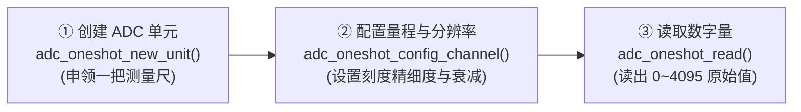

# 第 07 章：感知世界 —— ESP32 模拟量采集(ADC 测温)与超声波飞行时间测距(HC-SR04)


> **写在前面**：在前面的 6 个关卡中，我们和单片机交流的都是**“非黑即白”的数字世界** —— 不是高电平 `1`（3.3V）就是低电平 `0`（0V）。
> 
> 但真实的物理世界从来不是只有 `0` 和 `1`：
> * *房间的温度是连续平滑变化的（比如 26.5℃、26.6℃）；*
> * *物体与单片机的距离也是连续变化的（比如 15.2 厘米、38.6 厘米）。*
> 
> **单片机怎样才能长出一双“能感受温度高低、能测量物体远近”的眼睛呢？**
> 
> 这一章我们采用**【即学即练、学练闭环】**模式，带你跨入经典的模拟量与声波物理世界：
> 1. **ADC 模数转换篇**：搞懂电压如何切成 4096 份，立即写代码测量真实电压；
> 2. **NTC 温度传感篇**：搞懂电阻跷跷板与热力学公式，立即插上探头手捏测温；
> 3. **HC-SR04 超声波测距篇**：学习蝙蝠回声定位，立即测量微秒声波飞行时间；
> 4. **终极融合实战**：用实时环境温度动态补偿空气声速，打造工业级高精度雷达！

---

# 🌟 第一部分：点亮单片机的眼睛 —— ADC 模数转换篇

---

## 7.1 什么是模拟量与 ADC？—— 单片机的“电子刻度尺”

在进入代码之前，我们先用生活中的大白话搞清楚什么是数字量、什么是模拟量，以及 ADC 到底在干嘛。

```text
               【数字量 VS 模拟量的直观对比】

   【数字量 (Digital)】: 只有两个台阶 (开/关, 1/0)
   3.3V ───┐       ┌───
           │       │
     0V ───┴───────┴───

   【模拟量 (Analog)】: 像滑梯一样连续平滑变化 (0.1V, 1.25V, 2.88V...)
   3.3V ───┐   ╭───╮
           │  ╭╯   ╰╮
     0V ───┴──╯     ╰───
```

### 📏 什么是 ADC？它是内部器件还是外部零件？

* **它是一个纯正的“片上内部硬件外设（On-Chip Peripheral）”**！
* 也就是说，你不需要在开发板上额外花钱去焊一颗 ADC 芯片，它就**直接刻在 ESP32 这颗指甲盖大小的黑色芯片肚子里**，与 CPU 核心、Wi-Fi 射频挤在同一块硅晶圆上！
* 板子上的某些引脚（例如 `GPIO36/VP`、`GPIO39/VN`、`GPIO34` 等），就是 **ADC 伸出芯片外面的“测量探针”**。
* **ADC 就是一把微型的“数字刻度尺”**：它把外部引脚输入进来的连续模拟电压（0V ~ 3.3V），等比例切成很多个小格子，转换成一个数字给 CPU 看！

```text
               【ESP32 芯片内部的 ADC 硬件布局】
 ┌────────────────────────────────────────────────────────┐
 │                      ESP32 芯片内部                    │
 │                                                        │
 │   ┌──────────────┐                  ┌──────────────┐   │
 │   │  双核 CPU    │ ◄── 数字量读数 ── │  片内 ADC 硬件│   │
 │   │  (240MHz)    │    (0 ~ 4095)    │  (采样+比较器)│   │
 │   └──────────────┘                  └──────┬───────┘   │
 │                                            │ 多路通道  │
 └────────────────────────────────────────────┼───────────┘
                                              │ (芯片引脚)
                                              ▼
                                       ┌──────────────┐
                                       │ 外部引脚探针 │ ◄── 输入模拟电压
                                       │ (如 GPIO36)  │     (0V ~ 3.3V)
                                       └──────────────┘
```

> [!NOTE]
> **💡 ESP32 内部有几个 ADC？**  
> ESP32 内部其实集成了 **2 个独立的 ADC 硬件单元**：
> 1. **ADC1**：支持 8 个外部通道（GPIO32 ~ GPIO39），不受任何限制，**传感器测温、电量采集首选 ADC1**！
> 2. **ADC2**：支持 10 个外部通道（GPIO0, 2, 4, 12~15, 25~27 等），但由于 ADC2 的内部硬件与 Wi-Fi 模块共用电路，**当开启 Wi-Fi 时 ADC2 会被射频硬件占用**。因此在编写物联网代码时，强烈建议大家优先使用 ADC1 的引脚。

---

### 🔬 拓展探秘：为什么引脚叫 SENSOR_VP / VN？内部的微弱信号放大器 (LNA)

仔细看开发板原理图或引脚丝印，你会发现 `GPIO36` 又叫 `SENSOR_VP`，`GPIO39` 又叫 `SENSOR_VN`。为什么带一个 `SENSOR_` 前缀呢？

* **名字的秘密**：
  * `VP` = **V**oltage **P**ositive（正电压输入端）
  * `VN` = **V**oltage **N**egative（负电压输入端）
* **内部黑科技：微弱电波的“电子显微镜”**：
  * 当外部传感器传来的信号极其微弱（比如只有零点几毫伏的生物电信号、微弱热电偶信号）时，普通 ADC 根本“看不清”；
  * ESP32 内部在 ADC 之前，专门集成了一个 **低噪声微弱信号前置放大器（Low-Noise Amplifier, 简称 LNA）**！它就像一个电子显微镜，可以先把极其微弱的电信号放大几十倍，再送给 ADC 进行高精度数字转换。

```text
               【ESP32 的 VP/VN 微弱信号探测通道】
  GPIO36 (SENSOR_VP) ───┐
                        ├──► 【片内低噪声放大器 (LNA)】 ──► 【片内 ADC】 ──► CPU (数字量)
  GPIO39 (SENSOR_VN) ───┘      (将微弱电波信号放大数十倍)       (模数转换)
```

---

### 🔢 核心机制：ADC 是如何把“连续电压”翻译成“离散数字”的？

弄清了 ADC 的物理位置和引脚后，现在最核心的问题来了：  
**当一个平滑连续变化的电压（比如 1.65V）送进引脚时，ADC 到底是怎么把它变成 CPU 认识的数字的？**

这就是著名的 **12 位模数转换（ADC Conversion）** 过程：

```text
                  【ESP32 12位 ADC 模数转换原理】

  真实输入电压:     0V ────────── 1.65V ────────── 3.3V
                    │              │              │
                    ▼              ▼              ▼
  ADC 读出的数字:   0 ─────────── 2047 ────────── 4095  (2^12 = 4096 个刻度)
```

> [!NOTE]
> **💡 关键参数：12 位分辨率 (12-bit Resolution)**  
> $2^{12} = 4096$。也就是说，ESP32 会把测量的电压范围平均切成 **4096 份**：
> * 测到 `0V` 时，ADC 输出 `0`；
> * 测到 `1.65V` 时，ADC 输出 `2047`；
> * 测到 `3.3V` 时，ADC 输出 `4095`。

---

### 🧠 小白深度拷问：为什么偏偏选“12位”？行业里又是啥情况？

很多初学者学到这里都会好奇：**“为什么不是 8 位、10 位？既然位数越高越精细，为什么 ESP32 不直接做成 16 位甚至 24 位？芯片厂商到底是怎么想的？”**

> [!IMPORTANT]
> **🎯 一句话核心结论**：  
> **12 位（4096 个刻度）是整个单片机行业在“测量精度刚好够用”与“芯片造价低、抗干扰强”之间找到的【最佳黄金平衡点（Sweet Spot）】！**

为了让你彻底明白这个结论是怎么来的，我们分三步拆解：

#### 1. 向上看：为什么 8 位、10 位被淘汰了？（精度太粗）
假设输入电压是 0 ~ 3.3V：
* **8 位 ADC（仅切 256 格）**：最小刻度 $\approx 13\text{mV}$。就像用一把大砍刀切豆腐，刻度太粗，温度稍变一点根本察觉不到；
* **10 位 ADC（切 1024 格）**：最小刻度 $\approx 3.2\text{mV}$。这是早期老款 Arduino Uno 的水平，测温凑合能用，但数字跳变有明显的“台阶感”；
* **12 位 ADC（切 4096 格）**：最小刻度 $\approx \mathbf{0.8\text{mV}}$。**成功突破了 1 毫伏（1mV）的大关**！反映在温度上能精确到 **0.1℃ 的微小变化**，足以满足 90% 的日常传感器！

#### 2. 向下看：为什么单片机内部不做 16 位或 24 位？（物理限制与成本）
既然更高位更精细，为什么 ESP32 芯片内部不直接做成 16 位呢？有两个残酷的现实：
* 💰 **造价成倍暴涨**：ADC 内部靠微型电容阵列来比对电压。每增加 1 位，芯片内部占用的硅片面积就要**翻倍**，芯片会变得非常昂贵；
* 📢 **“在菜市场里听绣花针落地”（电磁噪声极限）**：
  ESP32 内部有 240MHz 的超强大脑和 Wi-Fi 射频天线。发射 Wi-Fi 时，芯片内部就像一个**闹哄哄的菜市场**，电源线上自带好几个毫伏（mV）的电磁杂音。
  如果给单片机塞一个 16 位 ADC（分辨力高达 0.05mV），最末尾的几位读数只会被芯片自身的 Wi-Fi 杂音狂乱冲刷，相当于“高射炮打蚊子”，根本测不准！

#### 3. 横向看：真实工业界是如何分工的？

各行各业根据自己的需求，形成了非常严密的分工“段位”：

| ADC 分辨率 | 角色定位 | 代表芯片 | 典型应用场景 | 为什么这么选？ |
| :--- | :--- | :--- | :--- | :--- |
| **8 ~ 10 位** | **“粗活哨兵”** | 传统 51 单片机、老款 Arduino | 遥控器摇杆、电饭煲旋钮 | 极低成本，只需要知道旋钮转动的大概位置 |
| **12 位** *(主流)* | **“全能顶梁柱”** | **ESP32 / ESP32-S3**、STM32、树莓派RP2040 | **通用物联网标配**！NTC测温、光敏、电池监控 | **片上集成最佳**：免外挂零件，精度达 0.8mV |
| **16 位** | **“精密工匠”** | STM32G4 (高级工控)、TI C2000 | 无人机飞控、精密电机电流环控制 | 电机高速旋转时需要极其细腻的电流闭环 |
| **24 位** | **“高精显微镜”** | **HX711 称重芯片** (独立外置) | 厨房电子秤（微克级称重）、医疗心电图 | 信号只有微伏（µV）级，必须**外挂独立芯片**远离吵闹的 CPU |

---

## 7.2 🎛️ ADC 核心 API 字典与驱动配置三步法

在 ESP-IDF 最新官方驱动中，ADC 采用了现代化的 **Oneshot（单次触发）驱动模型**。头文件为 `#include "esp_adc/adc_oneshot.h"`。

> [!WARNING]
> **💥 编译依赖关键提醒**：
> 在 ESP-IDF v6 中，使用 ADC Oneshot 驱动必须在 [`main/CMakeLists.txt`](../main/CMakeLists.txt) 中的 `REQUIRES` 后面添加 **`esp_adc`**！

初始化 ADC 必须经过标准的 **3 步流水线**：



### 1. 第一步：`adc_oneshot_new_unit(&init_config, &adc_handle)`
* **生活比喻**：从芯片工具箱里申领一把“数字刻度尺”。
* **参数 `.unit_id = ADC_UNIT_1`**：选择使用 **ADC1**（引脚对应 GPIO32~39）。正如前面避坑指南所讲，ADC1 永远不与 Wi-Fi 硬件冲突，是最安全的测量单元。

### 2. 第二步：`adc_oneshot_config_channel(adc_handle, channel, &chan_config)`
这是初学者最容易懵圈的一步，我们把两个核心参数彻底讲透：
1. **`.bitwidth = ADC_BITWIDTH_12`（12 位分辨率）**：
   * $2^{12} = 4096$。意味着将电压等比例切成 **4096 个微小刻度（0 ~ 4095）**；
   * 刻度越密，测量的电压越精准（最小能分辨约 0.8 毫伏的微小变化）。
2. **`.atten = ADC_ATTEN_DB_12`（12dB 衰减器，核心关键 ⚠️）**：
   * **为什么需要衰减器？** ESP32 内部 ADC 原始测量的物理电压范围其实只有 `0V ~ 1.1V`（超过 1.1V 就会爆表溢出）；
   * 开启 **12dB 衰减（Attenuation）** 后，芯片内部会自动接入分压衰减网络，将实际测量上限**从 1.1V 扩展到 3.3V（即 0 ~ 3300mV）**！
   * 👉 **铁律**：只要测量开发板上的 3.3V 传感器（如 NTC、电位器），**必须配置为 `ADC_ATTEN_DB_12`**，否则电压一超过 1.1V 读数就会全卡死在 4095！

### 3. 第三步：`adc_oneshot_read(adc_handle, NTC_ADC_CHANNEL, &raw_val)`
* **作用**：命令 ADC 硬件瞬间对目标引脚（`GPIO36`）进行一次采样，将结果存入 `raw_val` 中；
* **读数范围**：`0 ~ 4095`（0 代表 0V，4095 代表 3.3V）。

---

## 7.3 💻 实战第 1 步：ADC 单次采样与电压测量（Hello ADC）

我们立即将刚刚学到的知识落地，写一段最简单的程序，测量 `GPIO36` 的原始读数并换算为毫伏电压！

> 📁 **配套源码文件**：[`code/07_adc_ultrasonic/01_adc_raw.c`](../code/07_adc_ultrasonic/01_adc_raw.c)  
> ⚡ **一键切换运行**：在终端运行 `./switch_code.sh 7 1 --flash` 即可秒级切换并自动烧录！

### 🌟 实验 1 完整源码：

```c
#include <stdio.h>
#include "freertos/FreeRTOS.h"
#include "freertos/task.h"
#include "esp_log.h"
#include "esp_adc/adc_oneshot.h"

static const char *TAG = "EXP1_ADC_RAW";

#define NTC_ADC_UNIT        ADC_UNIT_1
#define NTC_ADC_CHANNEL     ADC_CHANNEL_0 // GPIO36 (SENSOR_VP)

void app_main(void)
{
    // 1. 申领 ADC1 单元句柄
    adc_oneshot_unit_handle_t adc_handle;
    adc_oneshot_unit_init_cfg_t init_config = {
        .unit_id = NTC_ADC_UNIT,
    };
    ESP_ERROR_CHECK(adc_oneshot_new_unit(&init_config, &adc_handle));

    // 2. 配置通道 0：12位分辨率 + 12dB 衰减 (测量范围 0 ~ 3.3V)
    adc_oneshot_chan_cfg_t chan_config = {
        .bitwidth = ADC_BITWIDTH_12,
        .atten = ADC_ATTEN_DB_12,
    };
    ESP_ERROR_CHECK(adc_oneshot_config_channel(adc_handle, NTC_ADC_CHANNEL, &chan_config));

    ESP_LOGI(TAG, "✅ ADC1 Channel 0 (GPIO36) 初始化成功！");

    while (1) {
        int raw_val = 0;
        // 3. 读取 ADC 原始值 (0 ~ 4095)
        ESP_ERROR_CHECK(adc_oneshot_read(adc_handle, NTC_ADC_CHANNEL, &raw_val));
        
        // 简易换算估算电压 (毫伏 mV): voltage = raw_val / 4095 * 3300mV
        int voltage_mv = raw_val * 3300 / 4095;

        ESP_LOGI(TAG, "📊 ADC 原始数值: %4d | 估算电压: %4d mV", raw_val, voltage_mv);
        vTaskDelay(pdMS_TO_TICKS(500));
    }
}
```

### 📺 串口监视效果：

```text
I (312) EXP1_ADC_RAW: ✅ ADC1 Channel 0 (GPIO36) 初始化成功！
I (812) EXP1_ADC_RAW: 📊 ADC 原始数值: 2045 | 估算电压: 1648 mV
I (1312) EXP1_ADC_RAW: 📊 ADC 原始数值: 2048 | 估算电压: 1650 mV
```

只要看到串口中打印出原始数值和电压，就证明 **ESP32 片内 ADC 已经被你成功点亮了**！

---

# 🌡️ 第二部分：感知冷暖 —— NTC 温度传感器篇

---

## 7.4 NTC 热敏电阻原理：从“测温度”到“测电阻”，再到“测电压”

在上一节中，我们已经成功用 ESP32 的 ADC 测出了引脚上的模拟电压（0V ~ 3.3V）。  
但我们现实生活中的最终目标是：**测量当前房间的环境温度（例如 26.5 ℃）**。

很多初学者看到这里都会产生一个巨大的疑惑：  
**“我们明明要测的是【温度】，为什么这一节张口闭口都在聊【电阻】？单片机不能直接测温度吗？又为什么非要搞一个分压电路？”**

在看电路之前，我们先把这条**“温度 $\rightarrow$ 电阻 $\rightarrow$ 电压 $\rightarrow$ 数字”**的认知逻辑链彻底理顺！

---

### 🧩 核心铺垫：为什么“测温度”必须拐弯抹角地“测电阻”？

单片机是一块冷冰冰的硅片，它自身并没有生物的神经末梢，根本感受不到空气是冷还是热。为了测温，人类必须在物理世界中寻找一种**“能把冷热变化表现出来的物理媒介”**：

```text
               【从“物理世界温度”到“单片机数字”的翻译链条】

 我们的终极目标:   想知道外界的环境温度是多少摄氏度？ (如 26.5 ℃)
                         │
                         ▼  (单片机没有神经末梢，感受不到冷热！)
 找到的物理媒介:   NTC 热敏电阻 (温度变化 ──► 内部电子跃迁 ──► 自身物理阻值 Ω 随之改变)
                         │
                         ▼  (只要知道当前电阻是多少欧姆，就能算出准确温度！)
 遇到的致命矛盾:   ❌ 单片机只有 ADC！世界上没有任何单片机引脚能“直接量欧姆(Ω)”！
                   单片机只会量“电压(V)”！
                         │
                         ▼  (怎样把“欧姆(Ω)的变化”翻译成“伏特(V)的变化”？)
 硬件破局妙招:     【串联分压电路】(让电阻当跷跷板，把“阻值变化”变成“电压升降”)
                         │
                         ▼
 终极测量全流程:   温度 (℃) ──► NTC阻值 (Ω) ──► 引脚电压 (V) ──► ADC数字量 ──► 软件公式还原 (℃)
```

1. **第一步（找媒介）**：我们找到了 **NTC 热敏电阻**。它的物理阻值会随着温度剧烈变化（温度升高，阻值减小）。只要我们能量出它当前的电阻值（比如是 $8.2\text{k}\Omega$），就能反推出温度是 $30^\circ\text{C}$。
2. **第二步（遇瓶颈）**：**单片机“不识欧姆，只认电压”！**  
   ESP32 的引脚只能检测**电位的高低（0 ~ 3.3V）**，你如果把一个纯电阻的两头直接插在单片机引脚上，引脚里没有电流流动，单片机根本测不出任何东西！
3. **第三步（解矛盾）**：硬件工程师发明了**“串联分压电路（电阻跷跷板）”**，把**“看不见的阻值变化”**巧妙地翻译成**“ADC 能看懂的电压高低”**！

---

### 🤔 1. NTC 热敏电阻到底是个啥？

**NTC** 是英文 **N**egative **T**emperature **C**oefficient 的缩写，中文翻译为**“负温度系数热敏电阻”**。

```text
               【普通电阻 VS NTC 热敏电阻的区别】

   【普通电阻 (追求稳定)】: 无论春夏秋冬，阻值永远保持 10kΩ 不变。
   
   【NTC 热敏电阻 (温度传感器)】: “脾气反着来” ——
      🔥 外部温度越高 ──► 内部半导体自由电子越活跃 ──► 自身电阻越小 (如 5kΩ)
      ❄️ 外部温度越低 ──► 内部电子活跃度下降     ──► 自身电阻越大 (如 20kΩ)
```

#### 🍳 现实生活中它都在哪里？
* **🔥 电热水壶 / 电饭煲 / 烤箱**：锅底紧贴着一颗 NTC，用来精确控温、防止水烧干着火；
* **🔋 手机与充电宝锂电池**：紧贴电芯的小黑头就是 NTC，充电发烫超过 45℃ 时自动断电降速，防止电池爆炸；
* **🖨️ 3D 打印机**：加热喷头旁的测温探针；
* **🚗 汽车发动机**：测量水箱冷却液温度。

---

### ⚡ 2. 单片机怎么“间接测电阻”？—— 串联分压电路（电阻跷跷板）

既然单片机只能测电压，那怎么把 NTC 的阻值变化转成电压呢？  
答案是：**给 NTC 找一个“固定不动的参照物伙伴（固定电阻 R1）”，让它们两个串联起来分电压！**

```text
                 【NTC 串联分压电路（电阻跷跷板）】

         +3.3V 供电电源 (总水压)
           │
          ┌┴┐
          │ │ R1 (板载 10kΩ 精密固定电阻，稳如泰山，充当基准参照物)
          └┬┘
           ├────────► 【GPIO36 / ADC1_CH0 测量这里的“中间分压”】
          ┌┴┐
          │ │ NTC (热敏电阻探头：温度越高，自身阻值越小)
          └┬┘
           │
          GND (0V 地线)
```

#### ⚖️ 电阻分压的“跷跷板”大白话（秒懂原理）：
把 3.3V 想象成一个水压总开关，电流从上往下流过 $R_1$ 和 $\text{NTC}$：
1. **天气变热（或手指捏住 NTC 探头）**：
   * NTC 内部电子被激活，**阻力变小**（比如从 10kΩ 骤降到 5kΩ）；
   * NTC 的阻力变得比上面的 $R_1$ 小得多，中间节点就像被吸铁石一样强行**“拉向 0V 地线”**；
   * 👉 **`GPIO36`（ADC）测到的电压明显下降（比如从 1.65V 跌到 1.1V）**。
2. **天气变冷（或往 NTC 吹冷风）**：
   * NTC 内部电子沉寂，**阻力变大**（比如从 10kΩ 暴涨到 20kΩ）；
   * NTC 的阻力远大于 $R_1$，中间节点电压被上面的 3.3V**“顶了上去”**；
   * 👉 **`GPIO36`（ADC）测到的电压明显上升（比如从 1.65V 升到 2.2V）**。

> [!TIP]
> **💡 破案了**：  
> **单片机其实从来没有直接测过温度，也没有直接测过电阻！**  
> 它是通过 ADC 观察中间节点的**“电压升降”**，倒推出 NTC 当前的**“实时阻值”**，再通过物理公式换算出**“真实摄氏度”**！

---

### 🌡️ 3. 怎么把 ADC 测到的“电压”一步步换算为“摄氏度”？

整个计算流程在单片机内部分为 **3 个清晰的小步骤**：

```text
 ┌───────────────┐     ┌──────────────────┐     ┌──────────────────────┐
 │ 1. ADC 测电压 │ ──► │ 2. 算 NTC 实时阻值 │ ──► │ 3. 套公式算出摄氏度(℃) │
 └───────────────┘     └──────────────────┘     └──────────────────────┘
```

#### 第 1 步：ADC 读出原始采样值
ESP32 的 12 位 ADC 会读出一个 `0 ~ 4095` 之间的数值（记为 $D_{\text{adc}}$）。

#### 第 2 步：根据分压比例算出 NTC 实时阻值 $R_{\text{ntc}}$
根据串联分压公式倒推（代码中采用）：
$$R_{\text{ntc}} = R_1 \times \frac{D_{\text{adc}}}{4095 - D_{\text{adc}}}$$
*注：$R_1$ 为板载串联分压固定电阻，阻值为 $10000\ \Omega$（10kΩ）。*

#### 第 3 步：套用经典热力学公式（B 值方程）求出摄氏度
物理学家通过大量实验总结出了热敏电阻材料的 **B 值方程**：

$$\frac{1}{T} = \frac{1}{T_0} + \frac{1}{B} \ln\left(\frac{R_{\text{ntc}}}{R_0}\right)$$

* **$T_0 = 25^\circ\text{C} = 298.15\text{ K}$**（25℃ 常温基准开尔文温度）；
* **$R_0 = 10000\ \Omega$**（25℃ 时的标称基准阻值 10kΩ）；
* **$B = 3950$**（该型号热敏电阻的核心材料常数）；
* **$T$** 算出来是绝对开尔文温度（K），最后只要减去 **$273.15$**，就得到了我们生活中最熟悉的**摄氏度（℃）**！

---

## 7.5 🔌 NTC 硬件准备与实物插座接入指南

| 元件名称 | 实物外观特征 | 作用与物理原理 | 插入插座位置 |
| :--- | :--- | :--- | :--- |
| **NTC 热敏电阻** | 黑色/深色水滴状探头，拖着两根细长的金属引脚 | 阻值随温度变化，用于 ADC 测量环境温度 | **`JP4`** (2-Pin 白色插座) |

```text
 ┌─────────────────────────────────────────────────────────────┐
 │                      ESP32 实战开发板                        │
 │                                                             │
 │   【JP4 插座】(2-Pin)                                       │
 │   ┌────────┐                                                │
 │   │  [..]  │ ◄── NTC 热敏电阻 (无极性，两脚直接插)            │
 │   └────────┘                                                │
 │    Pin 1: GPIO36 (ADC1_CH0 / SENSOR_VP)                     │
 │    Pin 2: GND (地线)                                         │
 └─────────────────────────────────────────────────────────────┘
```

* **极性说明**：NTC 热敏电阻（黑色小水滴状探头）属于纯电阻元件，**完全无极性（不分正反方向、不分正负极）**；
* **操作方法**：直接将两根细金属引脚分别插入 `JP4` 插座的两个小孔中即可。

---

## 7.6 💻 实战第 2 步：NTC 摄氏度高精度温度计

在 ADC 采样的基础上，我们引入 C 语言标准数学库 `#include <math.h>` 中的 `log()` 自然对数函数，把电压实时换算为摄氏度！

> 📁 **配套源码文件**：[`code/07_adc_ultrasonic/02_ntc_temperature.c`](../code/07_adc_ultrasonic/02_ntc_temperature.c)  
> ⚡ **一键切换运行**：在终端运行 `./switch_code.sh 7 2 --flash` 即可秒级切换并自动烧录！

### 🌟 实验 2 完整源码：

```c
#include <stdio.h>
#include <math.h>
#include "freertos/FreeRTOS.h"
#include "freertos/task.h"
#include "esp_log.h"
#include "esp_adc/adc_oneshot.h"

static const char *TAG = "EXP2_NTC_TEMP";

#define NTC_ADC_UNIT        ADC_UNIT_1
#define NTC_ADC_CHANNEL     ADC_CHANNEL_0 // GPIO36
#define NTC_B_VALUE         3950.0f       // 热敏电阻 B 常数
#define NTC_R_SERIES        10000.0f      // 板载串联分压电阻 10kΩ
#define NTC_R25             10000.0f      // 25℃ 时的基准阻值 10kΩ
#define NTC_T25_KELVIN      298.15f       // 25℃ 对应的开尔文温度 (273.15 + 25)

static float read_ntc_temperature(adc_oneshot_unit_handle_t handle)
{
    int raw_val = 0;
    adc_oneshot_read(handle, NTC_ADC_CHANNEL, &raw_val);
    if (raw_val <= 0 || raw_val >= 4095) return -999.0f; // 异常保护

    // 1. 根据分压电路计算 NTC 实时阻值
    float v_ratio = (float)raw_val / (4095.0f - (float)raw_val);
    float r_ntc = NTC_R_SERIES * v_ratio;

    // 2. 套用 B 值方程计算开尔文温度
    float kelvin = 1.0f / ( (1.0f / NTC_T25_KELVIN) + (log(r_ntc / NTC_R25) / NTC_B_VALUE) );
    
    // 3. 换算为人类熟悉的摄氏度
    return kelvin - 273.15f;
}

void app_main(void)
{
    adc_oneshot_unit_handle_t adc_handle;
    adc_oneshot_unit_init_cfg_t init_config = { .unit_id = NTC_ADC_UNIT };
    ESP_ERROR_CHECK(adc_oneshot_new_unit(&init_config, &adc_handle));

    adc_oneshot_chan_cfg_t chan_config = {
        .bitwidth = ADC_BITWIDTH_12,
        .atten = ADC_ATTEN_DB_12,
    };
    ESP_ERROR_CHECK(adc_oneshot_config_channel(adc_handle, NTC_ADC_CHANNEL, &chan_config));

    while (1) {
        float temp_c = read_ntc_temperature(adc_handle);
        ESP_LOGI(TAG, "🌡️ 当前环境温度: \033[32m%.2f ℃\033[0m", temp_c);
        vTaskDelay(pdMS_TO_TICKS(1000));
    }
}
```

> [!TIP]
> **💡 动手试试看**：用你的大拇指和食指捏住板子上的 NTC 热敏电阻探头，观察串口终端，你会看到温度立刻从 25℃ 慢慢爬升到 32℃ 左右！放开手指后又会慢慢降回室温！

---

# 🦇 第三部分：声波探尺 —— HC-SR04 超声波测距篇

---

## 7.7 HC-SR04 超声波测距：从倒车雷达到蝙蝠回声定位

### 🤔 为什么把“测温度”与“超声波测距”放在同一个章节？

很多初学者看到这里可能会好奇：  
**“温度（冷热）和超声波（测距离）看起来风马牛不相及，为什么要把它们编排在同一个章节里呢？它们之间有什么隐藏的联系吗？”**

> [!IMPORTANT]
> **🎯 答案是：用温度来辅助超声波，做工业级的精准测距！**  
> * **超声波本质是“声音”**，它在空气中飞行的速度并不是永远死板的 `340 m/s`；
> * **温度越高，空气分子越活跃，声波跑得越快**（夏天 40℃ 声速高达 355m/s，冬天 0℃ 声速只有 331m/s）；
> * 如果不知道当前气温，直接拿固定的 340m/s 去算距离，**误差会高达 4% ~ 7%（测 2 米能差出 10 多厘米，倒车雷达就可能直接撞车）**！
> * 所以：**我们在第二部分用 NTC 拿到最准的环境温度，就是为了在第四部分给超声波雷达做“实时物理声速校准”！**

现在，我们先来搞懂超声波模块自身是如何像蝙蝠一样隔空测距的！

---

### 🚗 1. 现实生活中的大展身手
* **🚗 汽车倒车雷达**：装在汽车后保险杠，探测车尾离障碍物有多远。越靠近障碍物，“哔哔哔”报警声越急促；
* **🤖 扫地机与避障小车**：机器人向前行进时持续发射声波，探测到前方 10cm 内有桌腿或墙壁立即减速刹车并拐弯；
* **🚰 智能水箱 / 水位监测**：探头安装在水箱顶部朝下探测水面，实时测量水面距离，无需接触水体即可算出剩余水位。

---

### 🦇 2. 蝙蝠回声定位的声波飞行时间（ToF）原理

HC-SR04 模块就像单片机的一双“大眼睛”，采用的是大自然中海豚与蝙蝠的**“回声定位”**原理：

```text
              【HC-SR04 超声波飞行时间 (ToF) 测距时序图】

  1. ESP32 (GPIO32 Trig) 发送 10µs 启动脉冲:
     ┌──┐
  ───┘  └─── (10微秒高电平)

  2. 模块 T 探头发射 8 周期 40kHz 超声波束:
     ~~( ( ( ( ( ( ( ( 🔊 40kHz 超声波向外飞行 ──► [ 🧱 遇到前方障碍物 ]
                                                      │ (被反弹折返)
  3. 模块 R 探头接收回声，同时 GPIO33 Echo 输出高电平:   ▼
     ┌───────────────────────────────────────────────┐ ◄── 回声接收完毕变低
  ───┘                                               └───
     ◄─────────── 测量这段高电平持续的时间 t (微秒) ────────►
```

---

### 📐 3. 测距核心算术（小学数学秒懂）

声音在空气中的传播速度大约是 **340 米/秒（即 0.034 厘米/微秒）**。  
因为超声波从发出到弹回走的是**“往返双程路”**，所以单程物理距离公式为：

$$\text{距离 } S = \frac{\text{Echo 持续时间 } t \times 0.034\text{ cm/\mu s}}{2} = \frac{t}{58.8}\text{ 厘米}$$

* **计算示例**：如果 ESP32 测得 Echo 引脚的高电平持续了 **588 微秒**，那么目标物体的真实距离就是：  
  $$S = \frac{588}{58.8} = \mathbf{10.0\text{ 厘米}}$$

---

### 📊 4. 测量范围、精度与物理极限（为什么有 2cm 盲区与 4m 上限？）

| 参数指标 | 规格数值 | 实际体验说明 |
| :--- | :--- | :--- |
| **📏 有效测量范围** | **`2 cm` ～ `400 cm` (0.02 米 ~ 4 米)** | 最适合桌面级实验、室内避障与近距离测距 |
| **🚫 测量下限（盲区）** | **`< 2 cm` (小于 2 厘米测不到)** | **物理盲区**：太近了回声瞬间弹回，探头来不及从发射切换到接收 |
| **🛑 测量上限（极限）** | **`400 cm` (4 米)** | 超过 4 米后，声波在空气中衰减太微弱，接收探头无法识别 |
| **🎯 测量精度** | **约 `0.3 cm` (3 毫米)** | 灵敏度极高，手掌微微晃动都能敏锐察觉 |

#### 🔍 深度拆解：为什么会有“2cm 盲区”和“4m 上限”？
1. **为什么 2cm 以内测不准（盲区效应）？**
   * 模块发射 40kHz 声波时，压电陶瓷晶片处于强烈振荡状态，发射完毕后会有微弱的**“机械余震”**；
   * 声音走完 2 厘米往返只需要约 $116 \mu s$。如果物体贴得过近（如 1cm），回声在余震还没结束时就撞回来了，接收电路无法分辨这是“自身余震”还是“真实回声”，因此 **2cm 以内是物理盲区**。
2. **为什么上限是 4 米？**
   * 声波在空气中以球面波扩散，能量随传播距离呈**平方反比衰减**；
   * 超出 4 米后反射信号极其微弱，且我们的代码必须设置 **30ms（约 5.1 米）** 的防卡死超时保护，一旦超时立即判定为 `Out of Range`（超出量程）。

---

## 7.8 🔌 超声波硬件准备与实物接线指南

### 1. 硬件外观与 `JP2` 插座接入


```text
 ┌─────────────────────────────────────────────────────────────┐
 │                      ESP32 实战开发板                        │
 │                                                             │
 │                                     【JP2 插座】(4-Pin)       │
 │                                     ┌──────────────┐        │
 │                                     │  [....]      │ ◄── HC-SR04 超声波
 │                                     └──────────────┘   (两只眼睛朝板外)
 │                                      Pin 1: +3.3V 供电      │
 │                                      Pin 2: Trig (GPIO32)   │
 │                                      Pin 3: Echo (GPIO33)   │
 │                                      Pin 4: GND (地线)      │
 └─────────────────────────────────────────────────────────────┘
```

* **识别引脚**：模块正面有标注 **`T`（Transmitter 发射端）** 与 **`R`（Receiver 接收端）**，4 根排针对应 `Vcc`、`Trig`、`Echo`、`Gnd`；
* **直接插上**：将 4 根排针直接插入开发板边缘的 **`JP2` 白色母座**，两只金属大眼睛自然朝向板子外侧前方。

---

### 2. ⏱️ 微秒级时间捕获库函数

在超声波测距中，我们需要产生 **10 微秒（10µs）** 的超短脉冲，并测量声波飞行的 **微秒时间**：

* **为什么发射脉冲必须用 `esp_rom_delay_us(10)`？**
  * `vTaskDelay(pdMS_TO_TICKS(1))` 最小刻度是 1 毫秒（1000 微秒），无法做微秒控制；
  * `esp_rom_delay_us(10)`（来自 `#include "esp_rom_sys.h"`）是硬件级空循环，实现**微秒级（$\mu s$）绝对精准忙等待**！
* **为什么飞行时间用 `esp_timer_get_time()`？**
  * 来自 `#include "esp_timer.h"`，读取芯片内部 64 位高精度定时器从开机至今走过的**微秒数（1 秒 = 1,000,000 微秒）**；
  * 在 Echo 变高时记录 `echo_start`，变低时记录 `echo_end`，相减即得飞行时间！

---

## 7.9 💻 实战第 3 步：HC-SR04 超声波微秒测距

> 📁 **配套源码文件**：[`code/07_adc_ultrasonic/03_ultrasonic_distance.c`](../code/07_adc_ultrasonic/03_ultrasonic_distance.c)  
> ⚡ **一键切换运行**：在终端运行 `./switch_code.sh 7 3 --flash` 即可秒级切换并自动烧录！

### 🌟 实验 3 完整源码：

```c
#include <stdio.h>
#include "freertos/FreeRTOS.h"
#include "freertos/task.h"
#include "driver/gpio.h"
#include "esp_timer.h"
#include "esp_log.h"
#include "esp_rom_sys.h"

static const char *TAG = "EXP3_ULTRASONIC";

#define TRIG_PIN    GPIO_NUM_32
#define ECHO_PIN    GPIO_NUM_33

static void ultrasonic_init(void)
{
    // 1. 配置 Trig 为输出引脚
    gpio_config_t trig_conf = {
        .pin_bit_mask = (1ULL << TRIG_PIN),
        .mode = GPIO_MODE_OUTPUT,
        .pull_down_en = GPIO_PULLDOWN_DISABLE,
        .pull_up_en = GPIO_PULLUP_DISABLE,
    };
    gpio_config(&trig_conf);
    gpio_set_level(TRIG_PIN, 0);

    // 2. 配置 Echo 为输入引脚
    gpio_config_t echo_conf = {
        .pin_bit_mask = (1ULL << ECHO_PIN),
        .mode = GPIO_MODE_INPUT,
        .pull_down_en = GPIO_PULLDOWN_DISABLE,
        .pull_up_en = GPIO_PULLUP_DISABLE,
    };
    gpio_config(&echo_conf);
}

static float measure_distance_cm(void)
{
    // 1. 发射 10 微秒的高电平触发脉冲
    gpio_set_level(TRIG_PIN, 0);
    esp_rom_delay_us(2);
    gpio_set_level(TRIG_PIN, 1);
    esp_rom_delay_us(10);
    gpio_set_level(TRIG_PIN, 0);

    // 2. 等待 Echo 变高电平 (带 30ms 超时保护，防止卡死)
    int64_t start_wait = esp_timer_get_time();
    while (gpio_get_level(ECHO_PIN) == 0) {
        if (esp_timer_get_time() - start_wait > 30000) return -1.0f; // 超时
    }

    // 3. 记录高电平开始时刻
    int64_t echo_start = esp_timer_get_time();

    // 4. 等待 Echo 变低电平
    while (gpio_get_level(ECHO_PIN) == 1) {
        if (esp_timer_get_time() - echo_start > 30000) return -1.0f; // 超时
    }
    int64_t echo_end = esp_timer_get_time();

    // 5. 计算持续时间并换算为厘米 (distance = duration_us / 58.8)
    int64_t duration_us = echo_end - echo_start;
    return (float)duration_us / 58.8f;
}

void app_main(void)
{
    ultrasonic_init();
    ESP_LOGI(TAG, "📡 HC-SR04 超声波测距模块已就绪 (Trig: GPIO32, Echo: GPIO33)");

    while (1) {
        float distance = measure_distance_cm();
        if (distance > 0) {
            ESP_LOGI(TAG, "📏 目标距离: \033[36m%6.1f cm\033[0m (%4.2f m)", distance, distance / 100.0f);
        } else {
            ESP_LOGW(TAG, "⚠️ 超出量程或无障碍物 (Out of Range)");
        }
        vTaskDelay(pdMS_TO_TICKS(300));
    }
}
```

> [!TIP]
> **💡 动手试试看**：把你的手掌放在超声波模块两只“眼睛”前方 10cm 处慢慢向后移动，观察终端打印的厘米读数如何如影随形般实时变化！

---

# 🚀 第四部分：终极融合 —— 智能温补声波雷达篇

---

## 7.10 为什么声速受温度影响？（温声动态补偿算法）

此时我们迎来了一个真正的**工业级物理学细节**：
* 很多人以为声音在空气中的速度永远是固定的 `340 m/s`；
* **但实际上，气温越高，空气分子越活跃，声速越快！**
* 物理学标准公式：$v = 331.3 + 0.606 \times T\text{ (m/s)}$

| 环境温度 | 真实空气声速 | 如果固定用 340m/s 计算的误差 |
| :---: | :---: | :---: |
| **0 ℃ (冬天严寒)** | **331.3 m/s** | 误差高达 **+2.6%**（测得距离偏大） |
| **25 ℃ (常温室内)** | **346.5 m/s** | 误差约 **-1.9%** |
| **40 ℃ (夏天酷暑)** | **355.5 m/s** | 误差高达 **-4.5%**（测得距离明显偏小） |

```text
 ┌─────────────────────────────────────────────────────────────┐
 │               【温声融合算法闭环】                          │
 │                                                             │
 │   1. NTC 测得环境温度 T = 30.0 ℃                             │
 │                  │                                          │
 │                  ▼                                          │
 │   2. 动态计算实时声速 v = 331.3 + 0.606 * 30 = 349.48 m/s    │
 │                  │                                          │
 │                  ▼                                          │
 │   3. 带入超声波飞行时间 t，计算出 100% 真实物理距离！         │
 │      formula: S = (duration_us * sound_speed_cm_us) / 2     │
 └─────────────────────────────────────────────────────────────┘
```

---

## 7.11 💻 终极综合大工程：双任务温声融合雷达系统

以下是融合了 **FreeRTOS 多任务调度**、**ADC 测温**、**HC-SR04 超声波测距** 以及 **实时声速动态温度补偿** 的完整工业级工程源码：

> 📁 **配套源码文件**：[`code/07_adc_ultrasonic/04_radar_integrated.c`](../code/07_adc_ultrasonic/04_radar_integrated.c)  
> ⚡ **一键切换运行**：在终端运行 `./switch_code.sh 7 4 --flash` 即可秒级切换并自动烧录！

```c
/**
 * 🌟 ESP32 物联网实战 —— 第 07 关：ADC 模拟量采集与超声波测距
 *    主控架构: ESP32-D0WD-V3 (8MB Flash + 2MB PSRAM)
 *    外设分配: NTC 测温 (GPIO36), 超声波 Trig(GPIO32), Echo(GPIO33)
 */
#include <stdio.h>
#include <math.h>
#include "freertos/FreeRTOS.h"
#include "freertos/task.h"
#include "driver/gpio.h"
#include "esp_timer.h"
#include "esp_log.h"
#include "esp_rom_sys.h"
#include "esp_adc/adc_oneshot.h"

static const char *TAG = "LEVEL07_RADAR";

/* 引脚定义 */
#define NTC_ADC_UNIT        ADC_UNIT_1
#define NTC_ADC_CHANNEL     ADC_CHANNEL_0 // GPIO36 (VP)
#define ULTRASONIC_TRIG_PIN GPIO_NUM_32
#define ULTRASONIC_ECHO_PIN GPIO_NUM_33

/* NTC 算法常数 */
#define NTC_B_VALUE         3950.0f
#define NTC_R_SERIES        10000.0f
#define NTC_R25             10000.0f
#define NTC_T25_KELVIN      298.15f

/* 全局共享数据 (多任务安全访问) */
static volatile float g_current_temperature = 25.0f; // 默认 25℃
static adc_oneshot_unit_handle_t s_adc_handle = NULL;

/* 1. NTC 测温驱动初始化与采样 */
static void ntc_sensor_init(void)
{
    adc_oneshot_unit_init_cfg_t init_config = { .unit_id = NTC_ADC_UNIT };
    ESP_ERROR_CHECK(adc_oneshot_new_unit(&init_config, &s_adc_handle));

    adc_oneshot_chan_cfg_t chan_config = {
        .bitwidth = ADC_BITWIDTH_12,
        .atten = ADC_ATTEN_DB_12,
    };
    ESP_ERROR_CHECK(adc_oneshot_config_channel(s_adc_handle, NTC_ADC_CHANNEL, &chan_config));
}

static float ntc_get_temperature(void)
{
    int raw_val = 0;
    adc_oneshot_read(s_adc_handle, NTC_ADC_CHANNEL, &raw_val);
    if (raw_val <= 0 || raw_val >= 4095) return 25.0f;

    float v_ratio = (float)raw_val / (4095.0f - (float)raw_val);
    float r_ntc = NTC_R_SERIES * v_ratio;
    float kelvin = 1.0f / ((1.0f / NTC_T25_KELVIN) + (log(r_ntc / NTC_R25) / NTC_B_VALUE));
    return kelvin - 273.15f;
}

/* 2. 超声波引脚初始化与测距 */
static void ultrasonic_sensor_init(void)
{
    gpio_config_t trig_conf = {
        .pin_bit_mask = (1ULL << ULTRASONIC_TRIG_PIN),
        .mode = GPIO_MODE_OUTPUT,
    };
    gpio_config(&trig_conf);
    gpio_set_level(ULTRASONIC_TRIG_PIN, 0);

    gpio_config_t echo_conf = {
        .pin_bit_mask = (1ULL << ULTRASONIC_ECHO_PIN),
        .mode = GPIO_MODE_INPUT,
    };
    gpio_config(&echo_conf);
}

static float ultrasonic_get_distance(float current_temp)
{
    // 发射 10us 脉冲
    gpio_set_level(ULTRASONIC_TRIG_PIN, 0);
    esp_rom_delay_us(2);
    gpio_set_level(ULTRASONIC_TRIG_PIN, 1);
    esp_rom_delay_us(10);
    gpio_set_level(ULTRASONIC_TRIG_PIN, 0);

    // 等待 Echo 变高
    int64_t start_wait = esp_timer_get_time();
    while (gpio_get_level(ULTRASONIC_ECHO_PIN) == 0) {
        if (esp_timer_get_time() - start_wait > 30000) return -1.0f;
    }

    int64_t echo_start = esp_timer_get_time();
    while (gpio_get_level(ULTRASONIC_ECHO_PIN) == 1) {
        if (esp_timer_get_time() - echo_start > 30000) return -1.0f;
    }
    int64_t echo_end = esp_timer_get_time();

    int64_t duration_us = echo_end - echo_start;

    // 💡 核心：动态温度补偿声速计算公式 (cm/us)
    float sound_speed_m_s = 331.3f + (0.606f * current_temp);
    float sound_speed_cm_us = sound_speed_m_s / 10000.0f;

    return (float)duration_us * sound_speed_cm_us / 2.0f;
}

/* 3. 后台独立测温任务 (每秒采集一次) */
static void task_temperature_monitor(void *arg)
{
    ESP_LOGI(TAG, "🌡️ NTC 测温任务已就绪...");
    while (1) {
        g_current_temperature = ntc_get_temperature();
        vTaskDelay(pdMS_TO_TICKS(1000));
    }
}

/* 4. 主超声波雷达扫描任务 (每 250ms 测距一次) */
static void task_radar_scan(void *arg)
{
    ESP_LOGI(TAG, "📡 超声波雷达扫描任务已就绪...");
    while (1) {
        float temp = g_current_temperature;
        float dist = ultrasonic_get_distance(temp);

        if (dist > 0 && dist < 400.0f) {
            ESP_LOGI(TAG, "🎯 [目标检测] 距离: \033[36m%6.1f cm\033[0m | 环境温度: \033[32m%5.1f ℃\033[0m | 补偿声速: %5.1f m/s",
                     dist, temp, 331.3f + 0.606f * temp);
        } else {
            ESP_LOGW(TAG, "🔭 [雷达空载] 前方无障碍物或超出量程 | 环境温度: %.1f ℃", temp);
        }
        vTaskDelay(pdMS_TO_TICKS(250));
    }
}

void app_main(void)
{
    ESP_LOGI(TAG, "============================================================");
    ESP_LOGI(TAG, "🚀 LEVEL 07: ESP32 ADC 模拟量采集与超声波飞行时间测距");
    ESP_LOGI(TAG, "   硬件引脚: NTC (GPIO36), 超声波 Trig(GPIO32)/Echo(GPIO33)");
    ESP_LOGI(TAG, "============================================================");

    ntc_sensor_init();
    ultrasonic_sensor_init();

    xTaskCreate(task_temperature_monitor, "Task_NTC", 3072, NULL, 2, NULL);
    xTaskCreate(task_radar_scan, "Task_Radar", 3072, NULL, 3, NULL);
}
```

---

## 7.12 📺 烧录与串口监视实验效果

在 VS Code 终端中执行构建与烧录：

```bash
idf.py build
idf.py -p COMx flash monitor
```

### 📺 串口终端输出日志：

```text
I (315) LEVEL07_RADAR: ============================================================
I (322) LEVEL07_RADAR: 🚀 LEVEL 07: ESP32 ADC 模拟量采集与超声波飞行时间测距
I (330) LEVEL07_RADAR:    硬件引脚: NTC (GPIO36), 超声波 Trig(GPIO32)/Echo(GPIO33)
I (338) LEVEL07_RADAR: ============================================================
I (346) LEVEL07_RADAR: 🌡️ NTC 测温任务已就绪...
I (354) LEVEL07_RADAR: 📡 超声波雷达扫描任务已就绪...
I (610) LEVEL07_RADAR: 🎯 [目标检测] 距离:   15.4 cm | 环境温度:  26.3 ℃ | 补偿声速: 347.2 m/s
I (860) LEVEL07_RADAR: 🎯 [目标检测] 距离:   15.5 cm | 环境温度:  26.3 ℃ | 补偿声速: 347.2 m/s
I (1110) LEVEL07_RADAR: 🎯 [目标检测] 距离:   28.2 cm | 环境温度:  26.4 ℃ | 补偿声速: 347.3 m/s
I (1360) LEVEL07_RADAR: 🎯 [目标检测] 距离:   45.8 cm | 环境温度:  26.4 ℃ | 补偿声速: 347.3 m/s
W (1610) LEVEL07_RADAR: 🔭 [雷达空载] 前方无障碍物或超出量程 | 环境温度: 26.4 ℃
```

---

## 7.13 🌟 本章总结与通关思考题

### 🌟 核心知识收获清单：
1. **连续物理量模数转换（ADC）**：掌握了 12 位 ADC（0~4095 刻度）将电压转为数字的物理原理与 12dB 衰减器配置；
2. **NTC 热敏电阻算法**：掌握了串联分压电路与 B值方程在摄氏度测量中的完整数学换算链条；
3. **超声波飞行时间法（ToF）**：掌握了 10µs 触发脉冲、40kHz 声波往返与微秒级定时测距机制；
4. **温声动态补偿算法**：学会了用 NTC 测得的环境温度实时校准空气声速（$v = 331.3 + 0.606 \times T$），消除了 4% 以上的环境物理误差；
5. **硬件设计避坑**：深刻理解了 `ADC1`（与 Wi-Fi 不冲突）与 `ADC2` 的关键区别，以及超声波 30ms 防卡死超时保护。

### 🧠 通关思考题：
* **思考题 1**：如果将测温时用手一直按住 NTC 电阻，ADC 读到的原始数字会不断变小？
* **思考题 2**：如果将超声波模块安装在移动小车上做避障雷达，当距离小于 15cm 时触发蜂鸣器报警，代码应该如何与 FreeRTOS 队列进行联动？

---

至此，我们已经掌握了模拟量 ADC 与时序脉冲测距。而在现代复杂传感器中，更多器件采用数字串行总线通信（如 I2C 总线与单总线）。  
下一关，我们将学习两大最经典的数字传感器通信协议！请翻开 [**第 08 章：ESP32 I2C 总线探秘与 DHT11 温湿度解析**](./08_I2C总线探秘与DHT11温湿度解析.md)！
