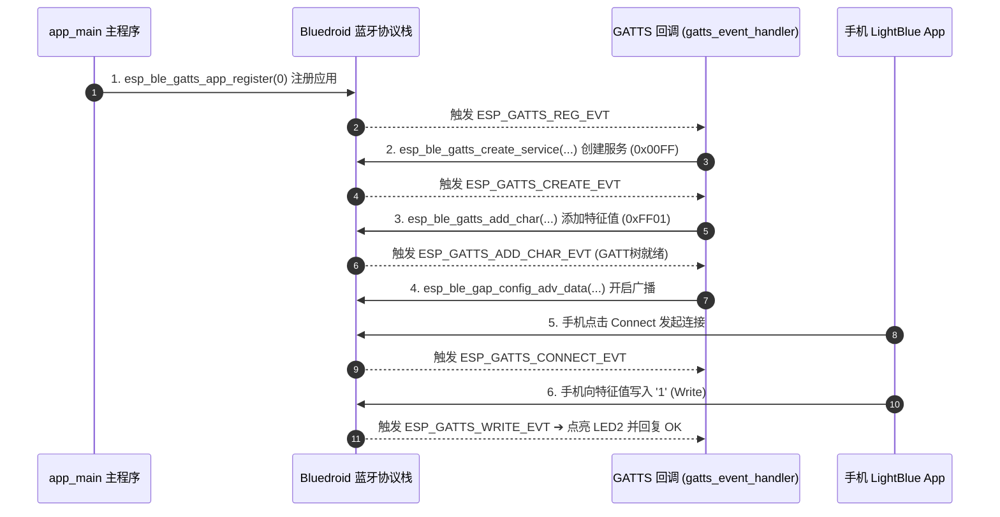

# 第 14 关：ESP32 BLE 低功耗蓝牙 GATT 广播与手机 App 透传控制


---

## 🎯 本关学习目标

在前两关中，我们让 ESP32 连上了 Wi-Fi 路由器和云端 MQTT 服务器。但在很多现实物理场景中：
* **智能手环 / 智能体脂秤 / 共享单车车锁**：周围根本没有 Wi-Fi 路由器和密码，手机如何一靠近就能秒级开锁或读取体重数据？
* **智能家居近场配网**：新买的智能灯泡刚拆封无法上网，需要手机先近距离给它发送家庭 Wi-Fi 账号和密码。

这种**“近距离、免配网、极度省电（一颗纽扣电池供电可待机 1~2 年）”**的通信王者，就是 **BLE（Bluetooth Low Energy，低功耗蓝牙）**！

完成本关卡后，你将达成以下核心成就：
1. **建立 BLE 极简心智模型**：搞懂 BLE 与经典蓝牙的区别，理解微安级休眠与长续航的秘密；
2. **掌握 GATT 百货商场四层架构**：用大白话拆解 Profile、Service 与 Characteristic；
3. **由浅入深掌握四大实战实验（原理 + 源码 + 代码逐段精讲 + 手机真机实测一体化）**：
   * **实验 1**：BLE 基础广播与手机扫描发现 (BLE Beacon)；
   * **实验 2**：进阶广播 —— 自定义广播包与动态温湿度信标 (Scan Response 扩容)；
   * **实验 3**：GATT Server 特征值读写与手机数据透传 (Read/Write 控制板载 LED2)；
   * **实验 4**：手机蓝牙遥控器与板载 SW3 按键主动 Notify 弹射推送。

---

## 🧭 关卡实验与源码速查

| 实验编号 | 实验名称 | 核心知识与实验目标 | 配套源码文件 | 一键切换命令 |
| :--- | :--- | :--- | :--- | :--- |
| **实验 1** | **BLE 基础广播与手机扫描发现** | 初始化 BT 控制器与 Bluedroid 协议栈，广播设备名 `ESP32-Journey-Beacon`，手机秒级发现 | [`01_ble_beacon_adv.c`](../code/14_ble_gatt/01_ble_beacon_adv.c) | `./switch_code.sh 14 1 --flash` |
| **实验 2** | **自定义广播包与动态温湿度信标** | 主包直载 VS 62 字节极限双包扩容，挂载厂商温湿度与序列号，每 3 秒动态刷新广播温湿度 | [`02_ble_custom_adv_beacon.c`](../code/14_ble_gatt/02_ble_custom_adv_beacon.c) | `./switch_code.sh 14 2 --flash` |
| **实验 3** | **GATT Server 服务与特征值读写** | 搭建 GATT Server，创建自定义 Service (`0x00FF`) 与 Characteristic (`0xFF01`)，手机读写控制 LED2 | [`03_ble_gatt_server.c`](../code/14_ble_gatt/03_ble_gatt_server.c) | `./switch_code.sh 14 3 --flash` |
| **实验 4** | **手机蓝牙遥控器与按键 Notify 推送** | 手机写入控制板载绿色 LED2，板载按键 SW3 按下时触发**主动 Notify 弹射推送**至手机 | [`04_ble_smart_remote.c`](../code/14_ble_gatt/04_ble_smart_remote.c) | `./switch_code.sh 14 4 --flash` |

---

# 🌟 核心铺垫：BLE 通信本质与 GATT“商场专柜”心智模型

在动手写代码前，我们先用两张图彻底打通 BLE 的底层逻辑。

## 14.1 经典蓝牙 VS BLE 低功耗蓝牙

```text
 ┌────────────────────────────────────────────────────────────────────────┐
 │                【经典蓝牙 (Classic BT) VS BLE 低功耗蓝牙】              │
 │                                                                        │
 │  1. 经典蓝牙 (BT 2.0 / 3.0 经典音频) ➔ 【重型大卡车 🚚】：             │
 │     • 优势：传输带宽大（几 Mbps），专为持续大流量流式传输设计（蓝牙耳机）；│
 │     • 劣势：功耗极高（几十 mA 持续耗电），耳机听歌 4~6 小时就没电了。   │
 │                                                                        │
 │  2. BLE 低功耗蓝牙 (BT 4.0 / 5.0+ IoT 专属) ➔ 【电动滑板车 🛴】：     │
 │     • 核心哲学：【99.9% 的时间都在微安级极低功耗深度休眠，发数据瞬间醒来】；│
 │     • 功耗：平均电流仅几个微安（μA），一颗 CR2032 纽扣电池能撑 1~2 年！│
 │     • 场景：手环计步、防丢器、共享单车锁、近场无感配网与控制。          │
 └────────────────────────────────────────────────────────────────────────┘
```

---

## 14.2 GATT 架构大白话解密：百货商场四层模型

BLE 连接建立后，数据通过 **GATT（通用属性配置文件）** 组织。把它想象成一座**“大型百货商场”**：

```text
 ┌────────────────────────────────────────────────────────────────────────┐
 │                    【GATT 架构 ➔ 百货商场四层模型】                     │
 │                                                                        │
 │  【Level 1: Profile (整座商场)】                                       │
 │   └─ 代表整个设备的功能档案（如 "ESP32 智能家居中控"）                  │
 │                                                                        │
 │  【Level 2: Service (专柜)】 ── 每个专柜有唯一编号 (Service UUID)        │
 │   ├─ 专柜 A (UUID: 0x180F) ➔ "电池电量专柜"                            │
 │   └─ 专柜 B (UUID: 0x00FF) ➔ "自定义灯光控制专柜"                      │
 │                                                                        │
 │  【Level 3: Characteristic (专柜里的商品抽屉)】 ── (Char UUID)         │
 │   └─ 抽屉 (UUID: 0xFF01) ➔ "LED2 开关控制抽屉"                        │
 │       • 属性权限 (Properties)：允许手机 【Read 读】/【Write 写】/【Notify】 │
 │                                                                        │
 │  【Level 4: Value (抽屉里真正放的数据纸条)】                           │
 │   └─ 数据内容：'1' (点亮 LED2) 或 '0' (熄灭 LED2)                      │
 └────────────────────────────────────────────────────────────────────────┘
```

---

## 14.3 BLE 的四大通信动作

| 通信动作 | 生活比喻 | 它是干什么的？ |
| :--- | :--- | :--- |
| **Read（读取）** | **手机伸手拉开抽屉看纸条** | 手机主动发请求读取单片机变量（如当前电量 `85%`）。 |
| **Write（写入）** | **手机往抽屉里塞纸条** | 手机主动向单片机写入控制指令（如写入 `'1'` 开灯）。 |
| **Notify（主动通知 ⚡）** | **单片机按门铃送货上门** | **硬件事件驱动**！板载按键按下时，单片机主动推送数据给手机（无需手机轮询，极速且省电）。 |
| **Indicate（确认通知）** | **带签收回执的快递送货** | 与 Notify 类似，但要求手机端应用层回复确认 ACK。 |

---

# 🚀 实战关卡：四大实验逐级通关（原理 + 源码 + 代码逐段精讲 + 手机实测）

有了上面的心智模型，我们正式进入实战！整个学习过程分为四个由浅入深的阶梯：
```
[实验 1: 基础广播] ──► [实验 2: 动态广播与扩容] ──► [实验 3: GATT 双向透传] ──► [实验 4: 主动 Notify 遥控]
```

---

## 14.4 实验 1：BLE 基础广播与手机扫描发现 (BLE Beacon)

### 1. 🎯 实验目标与生活化场景
很多初学者好奇：“ESP32 刚开机，没有配对也没有插网线，手机怎么知道它叫什么名字、在不在身边？”  
答案就是 **GAP 广播（Advertising）**：ESP32 就像一个无线电大喇叭，每隔 20ms~40ms 瞬间醒来 1 毫秒，在空中 37、38、39 三个信道喊出自己的名字：`"ESP32-Journey-Beacon"`！

```text
 ┌────────────────────────────────────────────────────────────────────────┐
 │                      【BLE 广播发射与手机扫描机制】                     │
 │                                                                        │
 │  ESP32（外设 Peripheral / 广播者）：                                    │
 │  ┌──────────────────────────────────────────────────────────────────┐  │
 │  │ 每隔 20ms~40ms 瞬间苏醒 1ms ➔ 在 37/38/39 广播信道广播：“我是 ESP32” │  │
 │  └─────────────────────────────────┬────────────────────────────────┘  │
 │                                    │ (空中无线电脉冲 2.4GHz)           │
 │                                    ▼                                   │
 │  手机（中心设备 Central / 扫描者）：                                    │
 │  ┌──────────────────────────────────────────────────────────────────┐  │
 │  │ 开启蓝牙扫描 ➔ 捕获到广播包 ➔ 解析出设备名称与信号强度 (RSSI) ➔ 显示在屏幕 │  │
 │  └──────────────────────────────────────────────────────────────────┘  │
 └────────────────────────────────────────────────────────────────────────┘
```

> [!NOTE]
> **广播包大小限制**：BLE 标准广播包的有效载荷最大只有 **31 字节**，通常用来放置设备 Flags、设备名（Name）和发射功率（Tx Power）。

---

### 2. 🧩 核心数据结构与初始化 API
在 ESP-IDF 中，实现广播只需要配置两个结构体：
1. **`esp_ble_adv_params_t`（广播发射物理参数）**：
   * `adv_int_min / max = 0x20 / 0x40`：广播时间间隔（`32 * 0.625ms = 20ms` ~ `40ms` 发射一次）；
   * `adv_type = ADV_TYPE_IND`：通用可连接广播（既能被搜到，也能被手机连接）；
   * `channel_map = ADV_CHNL_ALL`：在 37、38、39 三个广播信道轮流发射，抗干扰最强。
2. **`esp_ble_adv_data_t`（广播包 Payload 内容）**：
   * `include_name = true`：在广播包中带上设备名；
   * `include_txpower = true`：带上发射功率（手机据此估算信号强弱与距离）；
   * `flag = ESP_BLE_ADV_FLAG_GEN_DISC | ESP_BLE_ADV_FLAG_BREDR_NOT_SPT`：通用可发现模式，不支持传统蓝牙（纯 BLE）。

---

### 3. 💻 实验 1 完整源码

> 📁 **配套源码文件**：[`code/14_ble_gatt/01_ble_beacon_adv.c`](../code/14_ble_gatt/01_ble_beacon_adv.c)  
> ⚡ **一键切换运行**：在终端运行 `./switch_code.sh 14 1 --flash` 即可秒级切换并自动烧录！

```c
#include <stdio.h>
#include <string.h>
#include "freertos/FreeRTOS.h"
#include "freertos/task.h"
#include "esp_system.h"
#include "esp_log.h"
#include "nvs_flash.h"

/* ESP-IDF 官方 Bluedroid 蓝牙协议栈核心头文件 */
#include "esp_bt.h"           // BT 控制器接口与内存管理
#include "esp_gap_ble_api.h"   // GAP 广播与连接配置 API
#include "esp_bt_main.h"      // Bluedroid 协议栈启停 API

static const char *TAG = "EXP1_BLE_ADV";
#define DEVICE_NAME "ESP32-Journey-Beacon"

/* 1. 配置广播物理发射参数 */
static esp_ble_adv_params_t adv_params = {
    .adv_int_min        = 0x20, // 最小间隔: 20ms
    .adv_int_max        = 0x40, // 最大间隔: 40ms
    .adv_type           = ADV_TYPE_IND,
    .own_addr_type      = BLE_ADDR_TYPE_PUBLIC,
    .channel_map        = ADV_CHNL_ALL,
    .adv_filter_policy  = ADV_FILTER_ALLOW_SCAN_ANY_CON_ANY,
};

/* 2. 配置广播包内容 Payload (≤31 字节) */
static esp_ble_adv_data_t adv_data = {
    .set_scan_rsp        = false, // 这是普通广播包
    .include_name        = true,  // 包含设备名
    .include_txpower     = true,  // 包含发射功率
    .flag                = (ESP_BLE_ADV_FLAG_GEN_DISC | ESP_BLE_ADV_FLAG_BREDR_NOT_SPT),
};

/* 3. GAP 事件回调函数：处理底层广播配置与启动结果 */
static void gap_event_handler(esp_gap_ble_cb_event_t event, esp_ble_gap_cb_param_t *param)
{
    switch (event) {
        case ESP_GAP_BLE_ADV_DATA_SET_COMPLETE_EVT:
            ESP_LOGI(TAG, "📡 广播数据已写入基带，正在开启 BLE 射频广播...");
            esp_ble_gap_start_advertising(&adv_params);
            break;

        case ESP_GAP_BLE_ADV_START_COMPLETE_EVT:
            if (param->adv_start_cmpl.status == ESP_BT_STATUS_SUCCESS) {
                ESP_LOGI(TAG, "🎉 [BLE 广播成功启动] 射频天线正在持续发射！");
                ESP_LOGI(TAG, "👉 请打开手机 LightBlue App 搜索: %s", DEVICE_NAME);
            } else {
                ESP_LOGE(TAG, "❌ BLE 广播启动失败, 错误码: %d", param->adv_start_cmpl.status);
            }
            break;

        default:
            break;
    }
}

void app_main(void)
{
    ESP_LOGI(TAG, "==================================================");
    ESP_LOGI(TAG, "   🚀 关卡 14 实验 1：BLE 广播与手机扫描发现       ");
    ESP_LOGI(TAG, "==================================================");

    /* 步骤 1：初始化 NVS Flash（蓝牙底层存储校准数据必备） */
    esp_err_t ret = nvs_flash_init();
    if (ret == ESP_ERR_NVS_NO_FREE_PAGES || ret == ESP_ERR_NVS_NEW_VERSION_FOUND) {
        ESP_ERROR_CHECK(nvs_flash_erase());
        ret = nvs_flash_init();
    }
    ESP_ERROR_CHECK(ret);

    /* 步骤 2：释放经典蓝牙内存（省出约 30KB 内存，纯 BLE 模式必做） */
    ESP_ERROR_CHECK(esp_bt_controller_mem_release(ESP_BT_MODE_CLASSIC_BT));

    /* 步骤 3：初始化硬件 BT 控制器并使能 BLE 模式 */
    esp_bt_controller_config_t bt_cfg = BT_CONTROLLER_INIT_CONFIG_DEFAULT();
    ESP_ERROR_CHECK(esp_bt_controller_init(&bt_cfg));
    ESP_ERROR_CHECK(esp_bt_controller_enable(ESP_BT_MODE_BLE));

    /* 步骤 4：初始化并启动 Bluedroid 协议栈引擎 */
    ESP_ERROR_CHECK(esp_bluedroid_init());
    ESP_ERROR_CHECK(esp_bluedroid_enable());

    /* 步骤 5：注册 GAP 回调、设置设备名并提交广播配置 */
    ESP_ERROR_CHECK(esp_ble_gap_register_callback(gap_event_handler));
    ESP_ERROR_CHECK(esp_ble_gap_set_device_name(DEVICE_NAME));
    ESP_ERROR_CHECK(esp_ble_gap_config_adv_data(&adv_data));

    /* 主任务进入低功耗待机，蓝牙广播由底层硬件与协议栈后台运行 */
    while (1) {
        vTaskDelay(pdMS_TO_TICKS(5000));
    }
}
```

---

### 4. 🔍 源码逐段深度精讲（小白必读拆解）

让我们像拆解积木一样看懂这段代码：

1. **`app_main` 中的“五步启动法”**：
   * **第 1 步：`nvs_flash_init()`** —— 蓝牙底层协议栈需要利用 NVS 保存设备的物理校准参数和配对密钥，不初始化 NVS 蓝牙无法工作；
   * **第 2 步：`esp_bt_controller_mem_release(ESP_BT_MODE_CLASSIC_BT)`** —— ESP32 默认会为经典蓝牙分配约 30KB 内存。我们做 BLE 物联网开发，直接释放这部分内存，白白省出 30KB RAM 给应用层！
   * **第 3 步：`esp_bt_controller_init` & `enable(ESP_BT_MODE_BLE)`** —— 给底层硬件蓝牙基带控制器通电并设置为单模 BLE 模式；
   * **第 4 步：`esp_bluedroid_init` & `enable()`** —— 启动上层 Bluedroid 蓝牙操作系统大脑；
   * **第 5 步：`esp_ble_gap_register_callback` & `config_adv_data`** —— 注册 GAP 事件接收器，设置名字为 `ESP32-Journey-Beacon`，并把广播数据包提交给底层。
2. **GAP 异步回调状态机的工作时序**：
   * 为什么不能直接调用 `esp_ble_gap_start_advertising`？  
     因为蓝牙配置是异步的。当我们调用 `esp_ble_gap_config_adv_data(&adv_data)` 时，底层基带芯片需要花费几个微秒将数据写入射频寄存器。写入完成后，底层会主动触发 `ESP_GAP_BLE_ADV_DATA_SET_COMPLETE_EVT` 事件，通知我们在回调函数中**安全地启动射频广播发射**！

---

### 5. 📱 手机实测与真机现象
1. 烧录后打开串口监视器，会看到日志：
   ```text
   I (1234) EXP1_BLE_ADV: 📡 广播数据已写入基带，正在开启 BLE 射频广播...
   I (1254) EXP1_BLE_ADV: 🎉 [BLE 广播成功启动] 射频天线正在持续发射！
   I (1254) EXP1_BLE_ADV: 👉 请打开手机 LightBlue App 搜索: ESP32-Journey-Beacon
   ```
2. 打开手机 **LightBlue App**（iOS/Android 均免费可用），下拉刷新，在扫描列表顶部就能清晰地搜到 **`ESP32-Journey-Beacon`**，并能看到实时信号强度（RSSI，如 `-42dBm`）！

---

### 💡 工程师小知识：手机上的 `dBm` 信号强度怎么看？

很多初学者看到手机扫描列表里的 **负数（如 `-42dBm`、`-85dBm`）** 往往会感到困惑：“为什么是负数？数值到底是越大越好还是越小越好？”

#### 1. 生活化直观比喻 ——“声音远近”
把 ESP32 想象成一个人在**大声喊话**，手机就像一只**耳朵**在听：
* **`-30 ~ -45 dBm`（贴脸耳边大吼）** ➔ **信号极强 🟢**，距离 < 0.5米（手机紧贴着板子）；
* **`-50 ~ -65 dBm`（正常对话）** ➔ **信号良好 🟢**，距离 1~3米（同房间无遮挡）；
* **`-70 ~ -80 dBm`（隔墙轻声）** ➔ **信号较弱 🟡**，距离 5~10米（隔一道门）；
* **`-85 ~ -95 dBm`（气若游丝）** ➔ **濒临断连 🔴**，随时可能丢包失联。

> 🎯 **速记口诀**：
> **“负得越少（数值越接近 0），信号越强，离得越近；负得越多，信号越弱，离得越远！”**（例如 `-42 dBm` 远强于 `-85 dBm`）

#### 2. 为什么它是负数？（底层对数公式）
基准发射功率为 $1\text{ mW} = 0\text{ dBm}$。当无线电波穿过空气衰减到微瓦（$\mu\text{W}$）或纳瓦（$\text{nW}$）级别时，采用对数公式 $\text{dBm} = 10 \times \log_{10}(P / 1\text{mW})$ 换算后，**数值自然就会落在负数区间**！

#### 3. 行业应用：苹果 AirTag 测距与共享单车近场开锁
* **苹果 AirTag / 防丢器**：手机检测到 RSSI 从 `-85dBm` 攀升到 `-40dBm`，UI 即显示“距离目标越来越近”；
* **共享单车靠近开锁**：只有检测到单车锁 RSSI 大于 `-55dBm`（确认人已走到车旁），App 才会触发开锁，防止远距离误开。

---

> 💡 **承上启下过度思考**：  
> 在实验 1 中，我们发射了一个最简单的静态广播包。但在实际开发中（比如米家温湿度计），**我们不仅想把实时采集到的温度广播出去，而且 31 字节放不下长名字和传感器数据怎么办？**  
> 这就引出了我们的下一个进阶实验 —— **双包协同扩容与动态广播热更新**！

---

## 14.5 实验 2：进阶广播 —— 自定义广播包与动态温湿度信标 (主包直出 VS 62字节双包扩容)

### 1. 🎯 实验目标与工程深度思考：31 字节何时会被用完？

在 BLE 4.x/5.0 传统广播规范中，**单包有效载荷被严格限制在 31 字节以内**。

我们来算一笔“31 字节广播预算账”：
```text
 ┌────────────────────────────────────────────────────────────────────────┐
 │                    【31 字节广播包预算消耗计算表】                      │
 │                                                                        │
 │  1. 广播标志 (Flags): 3 字节 (1字节Len + 1字节Type + 1字节Flag)         │
 │  2. 发射功率 (Tx Power): 3 字节 (1字节Len + 1字节Type + 1字节Power)     │
 │  3. 16位服务 UUID 列表: 4 字节 (如声明含有电池服务 0x180F)             │
 │  4. 设备名称: 假设名字叫 "ESP32-Smart-Air-Purifier" ➔ 占用 26 字节！    │
 │                                                                        │
 │  👉 总消耗: 3 + 3 + 4 + 26 = 36 字节 > 31 字节！广播包直接爆炸溢出！   │
 └────────────────────────────────────────────────────────────────────────┘
```

当主广播包被长设备名、多个 Service UUID 占满后，**扫描响应包（Scan Response）就成了唯一的救命稻草**！  
为了让大家彻底掌握这两种在真实工业界并存的架构，我们提供了一套**支持一键宏切换（`ADV_ALLOCATION_MODE`）的完整对比工程**！

---

### 2. 🧩 两种广播架构深度对比与设计权衡

```text
 ┌────────────────────────────────────────────────────────────────────────┐
 │            【模式 0：主包直载模式】 VS 【模式 1：双包 62 字节极限扩容】 │
 │                                                                        │
 │  【模式 0：主包直出模式 (Primary ADV Direct)】                          │
 │   • 策略：精简设备名（如 "ESP32-Beacon"），将温湿度直接放入主包；      │
 │   • 优势：⚡ 零延迟，所有手机在列表扫描时 100% 秒级直读 Manufacturer Data； │
 │   • 适用：防丢器、即时环境监测、免连接即走的小数据轻量级场景。         │
 │                                                                        │
 │  【模式 1：双包 62 字节极限扩容模式 (Scan Response Expansion)】        │
 │   • 策略：主包放超长设备名 "ESP32-Smart-Air-Sensor-Pro"（撑满31字节）；│
 │          扫描响应包放厂商温湿度 + 额外设备硬件序列号（总容量翻倍至62字节！）；│
 │   • 优势：📦 彻底突破 31 字节物理上限，能挂载海量产品信息；             │
 │   • 注意点：手机端需触发【主动扫描 (Active Scanning)】或在 App 内发起扫描  │
 │     请求（SCAN_REQ），单片机收到请求后才会回复扫描响应包（SCAN_RSP）。 │
 └────────────────────────────────────────────────────────────────────────┘
```

---

### 3. 💻 实验 2 完整源码（支持两种模式自由切换）

> 📁 **配套源码文件**：[`code/14_ble_gatt/02_ble_custom_adv_beacon.c`](../code/14_ble_gatt/02_ble_custom_adv_beacon.c)  
> ⚡ **一键切换运行**：在终端运行 `./switch_code.sh 14 2 --flash` 即可秒级切换并自动烧录！

```c
#include <stdio.h>
#include <string.h>
#include "freertos/FreeRTOS.h"
#include "freertos/task.h"
#include "esp_system.h"
#include "esp_log.h"
#include "nvs_flash.h"

#include "esp_bt.h"
#include "esp_gap_ble_api.h"
#include "esp_bt_main.h"

static const char *TAG = "EXP4_CUSTOM_ADV";

/* ==============================================================================
 * 🎯 广播载荷分配策略选择开关 (0 或 1)
 * 
 * 模式 0【主包直载模式】：主包放设备名 + 传感器数据，所有手机扫描列表秒级直出！
 * 模式 1【双包扩容模式】：主包放超长设备名（撑满31字节），响应包放传感器与序列号（达62字节）！
 * ============================================================================== */
#define ADV_ALLOCATION_MODE   0   // 👉 修改此宏为 0 或 1 即可体验两种架构

#if ADV_ALLOCATION_MODE == 0
    #define DEVICE_NAME "ESP32-Beacon"
#else
    #define DEVICE_NAME "ESP32-Smart-Air-Sensor-Pro"  // 超长设备名 (占 28 字节)
#endif

/* 自定义厂商数据：[厂商ID低字节, 厂商ID高字节, 温度(℃), 湿度(%), 电池电量(%)] */
static uint8_t s_sensor_payload[] = {
    0xE5, 0x02,  // 乐鑫 Espressif 官方厂商 ID (0x02E5)
    25,          // 初始温度: 25 ℃
    60,          // 初始湿度: 60 %
    98           // 电池电量: 98 %
};

#if ADV_ALLOCATION_MODE == 1
/* 额外设备序列号（放在扫描响应包中进一步扩容） */
static uint8_t s_serial_number_payload[] = {
    0xE5, 0x02, 25, 60, 98, 'S', 'N', '2', '0', '2', '6', 'X', '1'
};
#endif

/* 广播物理参数 */
static esp_ble_adv_params_t adv_params = {
    .adv_int_min        = 0x40, // 40ms
    .adv_int_max        = 0x80, // 80ms
    .adv_type           = ADV_TYPE_IND,
    .own_addr_type      = BLE_ADDR_TYPE_PUBLIC,
    .channel_map        = ADV_CHNL_ALL,
    .adv_filter_policy  = ADV_FILTER_ALLOW_SCAN_ANY_CON_ANY,
};

#if ADV_ALLOCATION_MODE == 0
/* 模式 0：传感器数据直接挂载在主包中 */
static esp_ble_adv_data_t adv_data = {
    .set_scan_rsp        = false,
    .include_name        = true,
    .include_txpower     = true,
    .flag                = (ESP_BLE_ADV_FLAG_GEN_DISC | ESP_BLE_ADV_FLAG_BREDR_NOT_SPT),
    .p_manufacturer_data = s_sensor_payload,
    .manufacturer_len    = sizeof(s_sensor_payload),
};

static esp_ble_adv_data_t scan_rsp_data = {
    .set_scan_rsp        = true,
    .include_name        = true,
};
#else
/* 模式 1：主包放超长设备名与标志，响应包放传感器与序列号 */
static esp_ble_adv_data_t adv_data = {
    .set_scan_rsp        = false,
    .include_name        = true,  // 超长设备名占满主包
    .include_txpower     = true,
    .flag                = (ESP_BLE_ADV_FLAG_GEN_DISC | ESP_BLE_ADV_FLAG_BREDR_NOT_SPT),
};

static esp_ble_adv_data_t scan_rsp_data = {
    .set_scan_rsp        = true,  // ⭐️ 扫描响应包承接大数据
    .p_manufacturer_data = s_serial_number_payload,
    .manufacturer_len    = sizeof(s_serial_number_payload),
};
#endif

static void gap_event_handler(esp_gap_ble_cb_event_t event, esp_ble_gap_cb_param_t *param)
{
    switch (event) {
        case ESP_GAP_BLE_ADV_DATA_SET_COMPLETE_EVT:
            esp_ble_gap_config_adv_data(&scan_rsp_data);
            break;

        case ESP_GAP_BLE_SCAN_RSP_DATA_SET_COMPLETE_EVT:
            ESP_LOGI(TAG, "📡 主广播包 + 扫描响应包双包就绪，开启 BLE 广播...");
            esp_ble_gap_start_advertising(&adv_params);
            break;

        case ESP_GAP_BLE_ADV_START_COMPLETE_EVT:
            if (param->adv_start_cmpl.status == ESP_BT_STATUS_SUCCESS) {
                ESP_LOGI(TAG, "🎉 [BLE 广播成功启动] 模式: %s, 设备名: %s",
                         (ADV_ALLOCATION_MODE == 0) ? "主包直载模式" : "双包62字节扩容模式", DEVICE_NAME);
            }
            break;

        default:
            break;
    }
}

/* 后台 FreeRTOS 任务：每隔 3 秒模拟温湿度变化，动态热更新空中广播包！ */
static void sensor_simulator_task(void *pvParameters)
{
    uint8_t temp = 25;
    uint8_t humi = 60;

    while (1) {
        vTaskDelay(pdMS_TO_TICKS(3000)); // 每 3 秒刷新一次

        temp++;
        if (temp > 30) temp = 24;
        humi = (humi >= 70) ? 55 : (humi + 1);

        s_sensor_payload[2] = temp;
        s_sensor_payload[3] = humi;

        ESP_LOGI(TAG, "🌡️ 传感器数据刷新 ➔ 温度: %d ℃, 湿度: %d %% ➔ 实时热更新广播包！", temp, humi);

#if ADV_ALLOCATION_MODE == 0
        esp_ble_gap_config_adv_data(&adv_data);
#else
        s_serial_number_payload[2] = temp;
        s_serial_number_payload[3] = humi;
        esp_ble_gap_config_adv_data(&scan_rsp_data);
#endif
    }
}

void app_main(void)
{
    ESP_LOGI(TAG, "==================================================");
    ESP_LOGI(TAG, "   🚀 关卡 14 实验 2：自定义广播包与动态温湿度信标  ");
    ESP_LOGI(TAG, "==================================================");

    esp_err_t ret = nvs_flash_init();
    if (ret == ESP_ERR_NVS_NO_FREE_PAGES || ret == ESP_ERR_NVS_NEW_VERSION_FOUND) {
        ESP_ERROR_CHECK(nvs_flash_erase());
        ret = nvs_flash_init();
    }
    ESP_ERROR_CHECK(ret);

    ESP_ERROR_CHECK(esp_bt_controller_mem_release(ESP_BT_MODE_CLASSIC_BT));

    esp_bt_controller_config_t bt_cfg = BT_CONTROLLER_INIT_CONFIG_DEFAULT();
    ESP_ERROR_CHECK(esp_bt_controller_init(&bt_cfg));
    ESP_ERROR_CHECK(esp_bt_controller_enable(ESP_BT_MODE_BLE));

    ESP_ERROR_CHECK(esp_bluedroid_init());
    ESP_ERROR_CHECK(esp_bluedroid_enable());

    ESP_ERROR_CHECK(esp_ble_gap_register_callback(gap_event_handler));
    ESP_ERROR_CHECK(esp_ble_gap_set_device_name(DEVICE_NAME));
    ESP_ERROR_CHECK(esp_ble_gap_config_adv_data(&adv_data));

    /* 启动后台动态广播更新任务 */
    xTaskCreate(sensor_simulator_task, "sensor_sim", 2048, NULL, 5, NULL);
}
```

---

### 4. 🔍 源码逐段深度精讲（小白必读拆解）

1. **为什么模式 1 能承载 62 字节？**
   * 主广播包最大 31 字节，扫描响应包最大 31 字节；
   * 在模式 1 中，主包被超长设备名 `"ESP32-Smart-Air-Sensor-Pro"` 占满，我们通过 `scan_rsp_data` 挂载 `s_serial_number_payload`（包含厂商 ID、温湿度与序列号 `SN2026X1`），两者在空中协同工作，实现了翻倍扩容！
2. **手机主动扫描（Active Scanning）的工作时序**：
   * 在模式 1 下，手机必须向单片机发送 `SCAN_REQ` 帧，单片机才会将扫描响应包回复给手机；
   * 在 **LightBlue** 中，下拉刷新或点击进入设备卡片即可触发主动扫描；在 **nRF Connect** 中，进入 Scanner 页面会自动进行主动扫描并完整解析出 62 字节双包数据！

---

### 5. 📱 手机实测与真机现象（两种模式对照）

* **模式 0 现象（`ADV_ALLOCATION_MODE = 0`）**：
  打开手机 LightBlue App，在列表中找到 `ESP32-Beacon`，下方立即显示 `Manufacturer Specific Data: <02e5193c62>`，温度每 3 秒自动递增跳变！
* **模式 1 现象（`ADV_ALLOCATION_MODE = 1`）**：
  在设备列表找到 `ESP32-Smart-Air-Sensor-Pro`，在 nRF Connect 中查看 `RAW` 广播数据，可清晰看到主包与响应包中的超长序列号 `SN2026X1`！

---

> 💡 **承上启下过度思考**：  
> 广播模式（Beacon）虽然极度省电且免连接，但它只能是**单向发射**，手机无法反向给单片机下发指令。  
> 如果我们要实现**用手机 App 远程遥控开灯、设置参数**，就必须让手机和 ESP32 建立真正的 BLE 连接，并在芯片中搭建 **GATT 属性服务器（GATT Server）**！

---

## 14.6 实验 3：GATT Server 特征值读写与手机数据透传 (Read/Write 控制 LED2)

### 1. 🎯 实验目标与生活化场景
在本实验中，我们将正式搭建 GATT 架构：
* 创建自定义服务（Service UUID: `0x00FF`）；
* 创建读写特征值（Char UUID: `0xFF01`）；
* 手机通过 LightBlue 写入 `'1'` 点亮板载绿色 LED2（GPIO27），写入 `'0'` 熄灭 LED2；手机点击读取时返回 `"ESP32_OK"`。

---

### 2. 🧩 核心机制与 UUID 工业级选型法则

#### 💡 深度解密：16-bit 短 UUID (0x00FF) 与 128-bit UUID4 的区别
很多细心的同学在看商业产品开源库时会发现，别人用的 UUID 是很长一串（形如 `4fafc201-1fb5-459e-8fcc-c5c9c331914b`），为什么我们这里用的是 `0x00FF` / `0xFF01`？

```text
 ┌────────────────────────────────────────────────────────────────────────┐
 │                   【16位短 UUID】 VS 【128位 UUID4 完整 UUID】          │
 │                                                                        │
 │  1. 16-bit 短 UUID (如 0x180F, 0x00FF) ➔ 【国家级特种车牌 🚗】：       │
 │     • 长度：只有 2 字节；                                              │
 │     • 归属：由蓝牙技术联盟（Bluetooth SIG）统一管理。商业产品使用需每年 │
 │       向联盟缴纳数千至数万美元会员费！                                 │
 │     • 教学优势：记忆极简，手机 LightBlue 读写调试无需输入 36 位长字符串。│
 │                                                                        │
 │  2. 128-bit 完整 UUID (UUID4) ➔ 【全球每个人唯一的身份证号 🪪】：       │
 │     • 长度：16 字节（如 4fafc201-1fb5-459e-8fcc-c5c9c331914b）；        │
 │     • 归属：免费开源！基于随机数算法在线生成，全球碰撞概率为 1/2¹²⁸；    │
 │     • 商业法则：小米、华为、苹果等商业量产产品中 100% 使用 128-bit UUID4！│
 └────────────────────────────────────────────────────────────────────────┘
```

> 🎯 **蓝牙基准 Base UUID 原理**：  
> 16位短 UUID 本质上只是 128位 UUID 的缩写！蓝牙官方定义了基准 UUID：`0000XXXX-0000-1000-8000-00805F9B34FB`。  
> 我们使用的 `0x00FF` 在底层芯片中等价于 `000000FF-0000-1000-8000-00805F9B34FB`。在学习与原型阶段使用 16-bit 效率最高！

---

#### 🔄 GATTS 事件驱动状态机时序

ESP-IDF 采用清晰的事件回调流水线，从注册到读写一目了然：



---

### 3. 💻 实验 3 完整源码

> 📁 **配套源码文件**：[`code/14_ble_gatt/03_ble_gatt_server.c`](../code/14_ble_gatt/03_ble_gatt_server.c)  
> ⚡ **一键切换运行**：在终端运行 `./switch_code.sh 14 3 --flash` 即可秒级切换并自动烧录！

```c
#include <stdio.h>
#include <string.h>
#include "freertos/FreeRTOS.h"
#include "freertos/task.h"
#include "driver/gpio.h"
#include "esp_system.h"
#include "esp_log.h"
#include "nvs_flash.h"

#include "esp_bt.h"
#include "esp_gap_ble_api.h"
#include "esp_gatts_api.h"
#include "esp_bt_main.h"

static const char *TAG = "EXP2_GATT_SERVER";

#define LED2_PIN               GPIO_NUM_27
#define DEVICE_NAME            "ESP32-GATT-Server"

#define GATTS_SERVICE_UUID_TEST     0x00FF  // 自定义服务 UUID (专柜)
#define GATTS_CHAR_UUID_TEST        0xFF01  // 自定义特征 UUID (抽屉)
#define GATTS_NUM_HANDLE_TEST       4

static uint16_t s_service_handle = 0;
static uint16_t s_char_handle = 0;
static uint16_t s_conn_id = 0;
static bool s_is_connected = false;

static esp_ble_adv_params_t adv_params = {
    .adv_int_min        = 0x20,
    .adv_int_max        = 0x40,
    .adv_type           = ADV_TYPE_IND,
    .own_addr_type      = BLE_ADDR_TYPE_PUBLIC,
    .channel_map        = ADV_CHNL_ALL,
    .adv_filter_policy  = ADV_FILTER_ALLOW_SCAN_ANY_CON_ANY,
};

static esp_ble_adv_data_t adv_data = {
    .set_scan_rsp        = false,
    .include_name        = true,
    .include_txpower     = true,
    .flag                = (ESP_BLE_ADV_FLAG_GEN_DISC | ESP_BLE_ADV_FLAG_BREDR_NOT_SPT),
};

static void gap_event_handler(esp_gap_ble_cb_event_t event, esp_ble_gap_cb_param_t *param)
{
    switch (event) {
        case ESP_GAP_BLE_ADV_DATA_SET_COMPLETE_EVT:
            esp_ble_gap_start_advertising(&adv_params);
            break;
        case ESP_GAP_BLE_ADV_START_COMPLETE_EVT:
            ESP_LOGI(TAG, "📡 [BLE 广播中] 手机 App 可连接: %s", DEVICE_NAME);
            break;
        default:
            break;
    }
}

/* GATTS 事件回调：处理状态机全生命周期 */
static void gatts_event_handler(esp_gatts_cb_event_t event, esp_gatt_if_t gatts_if, esp_ble_gatts_cb_param_t *param)
{
    switch (event) {
        /* 1. 注册成功 ➔ 创建服务 */
        case ESP_GATTS_REG_EVT: {
            esp_gatt_srvc_id_t service_id = {
                .is_primary = true,
                .id = { .uuid = { .len = ESP_UUID_LEN_16, .uuid = { .uuid16 = GATTS_SERVICE_UUID_TEST } } },
            };
            esp_ble_gatts_create_service(gatts_if, &service_id, GATTS_NUM_HANDLE_TEST);
            break;
        }

        /* 2. 服务创建成功 ➔ 启动服务并添加特征值 */
        case ESP_GATTS_CREATE_EVT: {
            s_service_handle = param->create.service_handle;
            esp_ble_gatts_start_service(s_service_handle);

            esp_bt_uuid_t char_uuid = {
                .len = ESP_UUID_LEN_16,
                .uuid = { .uuid16 = GATTS_CHAR_UUID_TEST },
            };
            esp_ble_gatts_add_char(s_service_handle, &char_uuid,
                                   ESP_GATT_PERM_READ | ESP_GATT_PERM_WRITE,
                                   ESP_GATT_CHAR_PROP_BIT_READ | ESP_GATT_CHAR_PROP_BIT_WRITE,
                                   NULL, NULL);
            break;
        }

        /* 3. 特征值添加就绪 ➔ 启动广播 */
        case ESP_GATTS_ADD_CHAR_EVT:
            s_char_handle = param->add_char.attr_handle;
            ESP_LOGI(TAG, "✅ GATT 树就绪 (Char Handle: 0x%04x)，开启广播！", s_char_handle);
            esp_ble_gap_config_adv_data(&adv_data);
            break;

        /* 4. 手机连接与断开 */
        case ESP_GATTS_CONNECT_EVT:
            s_conn_id = param->connect.conn_id;
            s_is_connected = true;
            ESP_LOGI(TAG, "🎉 [手机已连接] Connection ID: %d", s_conn_id);
            break;

        case ESP_GATTS_DISCONNECT_EVT:
            s_is_connected = false;
            ESP_LOGW(TAG, "⚠️ 手机断开，重新开启广播...");
            esp_ble_gap_start_advertising(&adv_params);
            break;

        /* 5. ⭐️ 手机写入数据 (Write) ➔ 控制 LED2 */
        case ESP_GATTS_WRITE_EVT: {
            ESP_LOGI(TAG, "✍️ [收到手机写入] 长度: %d, 内容: %.*s",
                     param->write.len, param->write.len, param->write.value);

            if (param->write.len > 0) {
                char cmd = param->write.value[0];
                if (cmd == '1') {
                    gpio_set_level(LED2_PIN, 1);
                    ESP_LOGI(TAG, "💡 收到 '1' ➔ 点亮板载绿色 LED2");
                } else if (cmd == '0') {
                    gpio_set_level(LED2_PIN, 0);
                    ESP_LOGI(TAG, "🌑 收到 '0' ➔ 熄灭板载绿色 LED2");
                }
            }

            if (param->write.need_rsp) {
                esp_ble_gatts_send_response(gatts_if, param->write.conn_id, param->write.trans_id, ESP_GATT_OK, NULL);
            }
            break;
        }

        /* 6. 手机读取数据 (Read) ➔ 回复字符串 */
        case ESP_GATTS_READ_EVT: {
            esp_gatt_rsp_t rsp;
            memset(&rsp, 0, sizeof(esp_gatt_rsp_t));
            rsp.attr_value.handle = param->read.handle;
            const char *reply_str = "ESP32_OK";
            rsp.attr_value.len = strlen(reply_str);
            memcpy(rsp.attr_value.value, reply_str, rsp.attr_value.len);
            esp_ble_gatts_send_response(gatts_if, param->read.conn_id, param->read.trans_id, ESP_GATT_OK, &rsp);
            ESP_LOGI(TAG, "📤 [回复手机读取]: %s", reply_str);
            break;
        }

        default:
            break;
    }
}

void app_main(void)
{
    ESP_LOGI(TAG, "==================================================");
    ESP_LOGI(TAG, "   🚀 关卡 14 实验 3：GATT 特征值读写与数据透传     ");
    ESP_LOGI(TAG, "==================================================");

    /* 初始化 LED2 (GPIO27 输出) */
    gpio_config_t led_conf = {
        .pin_bit_mask = (1ULL << LED2_PIN),
        .mode = GPIO_MODE_OUTPUT,
    };
    gpio_config(&led_conf);
    gpio_set_level(LED2_PIN, 0);

    /* 初始化 NVS 与协议栈 */
    esp_err_t ret = nvs_flash_init();
    if (ret == ESP_ERR_NVS_NO_FREE_PAGES || ret == ESP_ERR_NVS_NEW_VERSION_FOUND) {
        ESP_ERROR_CHECK(nvs_flash_erase());
        ret = nvs_flash_init();
    }
    ESP_ERROR_CHECK(ret);

    ESP_ERROR_CHECK(esp_bt_controller_mem_release(ESP_BT_MODE_CLASSIC_BT));
    esp_bt_controller_config_t bt_cfg = BT_CONTROLLER_INIT_CONFIG_DEFAULT();
    ESP_ERROR_CHECK(esp_bt_controller_init(&bt_cfg));
    ESP_ERROR_CHECK(esp_bt_controller_enable(ESP_BT_MODE_BLE));

    ESP_ERROR_CHECK(esp_bluedroid_init());
    ESP_ERROR_CHECK(esp_bluedroid_enable());

    ESP_ERROR_CHECK(esp_ble_gatts_register_callback(gatts_event_handler));
    ESP_ERROR_CHECK(esp_ble_gap_register_callback(gap_event_handler));
    ESP_ERROR_CHECK(esp_ble_gap_set_device_name(DEVICE_NAME));
    ESP_ERROR_CHECK(esp_ble_gatts_app_register(0));

    while (1) {
        vTaskDelay(pdMS_TO_TICKS(1000));
    }
}
```

---

### 4. 🔍 源码逐段深度精讲（小白必读拆解）

1. **GATTS 状态机流水线为什么这样走？**
   * 在 `app_main` 中调用 `esp_ble_gatts_app_register(0)` 注册一个应用 ID；
   * 注册成功触发 `ESP_GATTS_REG_EVT` ➔ 我们在此事件中调用 `esp_ble_gatts_create_service` 申请创建 Service；
   * 服务创建完成触发 `ESP_GATTS_CREATE_EVT` ➔ 此时我们拿到服务句柄 `s_service_handle`，接着启动该服务，并向其添加 Characteristic 特征值；
   * 特征值添加完成触发 `ESP_GATTS_ADD_CHAR_EVT` ➔ 此时百货专柜和抽屉全部打造完毕，我们才正式开启 GAP 广播，等待手机连接！
2. **手机写数据（`ESP_GATTS_WRITE_EVT`）是如何生效的？**
   * 手机发来的字节存放在 `param->write.value` 指针中，长度为 `param->write.len`；
   * 我们取第一个字符 `cmd = param->write.value[0]`，如果是 `'1'` 则调用 `gpio_set_level(LED2_PIN, 1)` 点亮板载绿色 LED2，如果是 `'0'` 则熄灭；
   * **注意 `param->write.need_rsp`**：如果手机发的是“带响应写（Write with Response）”，我们必须调用 `esp_ble_gatts_send_response` 给手机回复一个确认 ACK，否则手机端会提示写入超时错误！

---

### 5. 📱 手机实测与真机现象
1. 打开手机 **LightBlue App**，点击连接 `ESP32-GATT-Server`；
2. 在服务列表中找到自定义服务 **`0x00FF`**，点击进入，看到特征值 **`0xFF01`**；
3. 点击 **`Write new value`**，格式选择 **UTF-8 String**，输入 **`1`** 并点击 Done：
   * 👉 串口打印 `收到 '1' ➔ 点亮板载绿色 LED2`，开发板上的绿色 LED2 瞬间亮起！
4. 再次写入 **`0`**，LED2 瞬间熄灭！

---

> 💡 **承上启下过度思考**：  
> 实验 3 实现了手机下发指令控制单片机。但如果单片机上的**物理按键被按下了**，或者**烟雾传感器报警了**，单片机如何主动向手机推送通知呢？  
> 难道要手机每隔 100 毫秒一直发 Read 请求去轮询单片机吗？那样不仅手机发烫耗电，延迟也非常大！  
> 这就是为什么 BLE 诞生了最伟大的特性 —— **Notify 主动弹射推送**！

---

## 14.7 实验 4：综合大工程 —— 手机蓝牙遥控器与板载按键 Notify 主动推送

### 1. 🎯 实验目标与生活化场景
在真正的智能硬件产品中，通信是双向闭环的：
1. **下行控制（手机 ➔ ESP32）**：手机发指令开关灯；
2. **上行推送（ESP32 ➔ 手机 Notify ⚡）**：当有人按下了开发板上的 **SW3 用户按键（GPIO39）**，ESP32 **主动把按键事件弹射推送给手机**！

```text
 ┌────────────────────────────────────────────────────────────────────────┐
 │                    【BLE 双向交互流转架构图】                          │
 │                                                                        │
 │  1. 下行控制 (手机 ➔ ESP32 Write)：                                    │
 │     手机 App (LightBlue) ──(Write: '1')──► 特征值 (0xFFE1) ➔ 开灯 LED2 │
 │                                                                        │
 │  2. 上行主动弹射 (ESP32 ➔ 手机 Notify)：                               │
 │     板载 SW3 按键按下 ──► esp_ble_gatts_send_indicate                 │
 │     手机 App (LightBlue) 立即收到推送 ➔ "SW3_CLICK_1", "SW3_CLICK_2"   │
 └────────────────────────────────────────────────────────────────────────┘
```

---

### 2. 🧩 核心推送机制：`Notify`（通知）VS `Indicate`（指示）

很多同学常问：“单片机向手机主动推送数据，为什么有 `Notify` 和 `Indicate` 两种？它们有什么区别？”

```text
 ┌────────────────────────────────────────────────────────────────────────┐
 │                    【Notify】 VS 【Indicate】 核心对比                  │
 │                                                                        │
 │  1. Notify (极速免确认通知) ➔ 【平邮明信片 ✉️ / 投掷飞镖 🎯】：        │
 │     • 机制：单片机直接发射数据包，不管手机收没收到；                  │
 │     • 延迟：< 2ms（极速零等待，高吞吐）；                              │
 │     • 场景：手环心率、连续温湿度波形、按键连击、遥控器摇杆数据。       │
 │                                                                        │
 │  2. Indicate (带回执确认指示) ➔ 【顺丰送货上门必须签字签收 ✍️】：       │
 │     • 机制：单片机发送后挂起等待手机回复 ACK 确认帧，确认收到才发下一包；│
 │     • 延迟：10~30ms（可靠性 100%，绝不丢包）；                         │
 │     • 场景：门锁开门确认回执、火灾警报鸣响、OTA 固件空中升级分包。    │
 └────────────────────────────────────────────────────────────────────────┘
```

#### 💻 核心推送 API：`esp_ble_gatts_send_indicate`
在 ESP-IDF 中，两者共用同一个底层接口，仅通过最后一个参数 `need_confirm` 自由切换：

```c
/* 核心推送 API 原型 */
esp_ble_gatts_send_indicate(gatts_if, conn_id, char_handle, len, data, need_confirm);
```
* **`need_confirm = false` ➔ Notify 模式（本实验采用）**：免确认极速弹射，零轮询开销，最适合按键事件！
* **`need_confirm = true` ➔ Indicate 模式**：必须收到手机端签收 ACK 才完成一次发送。

---

### 3. 💻 实验 4 完整源码

> 📁 **配套源码文件**：[`code/14_ble_gatt/04_ble_smart_remote.c`](../code/14_ble_gatt/04_ble_smart_remote.c)  
> ⚡ **一键切换运行**：在终端运行 `./switch_code.sh 14 4 --flash` 即可秒级切换并自动烧录！

```c
#include <stdio.h>
#include <string.h>
#include "freertos/FreeRTOS.h"
#include "freertos/task.h"
#include "driver/gpio.h"
#include "esp_system.h"
#include "esp_log.h"
#include "nvs_flash.h"

#include "esp_bt.h"
#include "esp_gap_ble_api.h"
#include "esp_gatts_api.h"
#include "esp_bt_main.h"

static const char *TAG = "EXP4_BLE_REMOTE";

#define LED2_PIN               GPIO_NUM_27
#define BUTTON_PIN             GPIO_NUM_39
#define DEVICE_NAME            "ESP32-Smart-Remote"

/* ==============================================================================
 * 🎯 主动推送模式选择开关 (0 或 1)
 * 
 * 模式 0【Notify 免确认极速通知】：need_confirm = false，延迟 < 2ms，高吞吐；
 * 模式 1【Indicate 带签收回执指示】：need_confirm = true，手机收到回复 ACK (触发 ESP_GATTS_CONF_EVT)。
 * ============================================================================== */
#define PUSH_MODE_INDICATE     0   // 👉 改为 1 即可体验 Indicate 顺丰签字签收模式！

#define GATTS_SERVICE_UUID_HUB      0xFFE0  // 服务 UUID
#define GATTS_CHAR_UUID_HUB         0xFFE1  // 特征值 UUID (同时支持 Read/Write/Notify/Indicate)
#define GATTS_NUM_HANDLE_HUB        4

static uint16_t s_service_handle = 0;
static uint16_t s_char_handle = 0;
static esp_gatt_if_t s_gatts_if = 0;
static uint16_t s_conn_id = 0;
static bool s_is_connected = false;

static esp_ble_adv_params_t adv_params = {
    .adv_int_min        = 0x20,
    .adv_int_max        = 0x40,
    .adv_type           = ADV_TYPE_IND,
    .own_addr_type      = BLE_ADDR_TYPE_PUBLIC,
    .channel_map        = ADV_CHNL_ALL,
    .adv_filter_policy  = ADV_FILTER_ALLOW_SCAN_ANY_CON_ANY,
};

static esp_ble_adv_data_t adv_data = {
    .set_scan_rsp        = false,
    .include_name        = true,
    .include_txpower     = true,
    .flag                = (ESP_BLE_ADV_FLAG_GEN_DISC | ESP_BLE_ADV_FLAG_BREDR_NOT_SPT),
};

static void gap_event_handler(esp_gap_ble_cb_event_t event, esp_ble_gap_cb_param_t *param)
{
    switch (event) {
        case ESP_GAP_BLE_ADV_DATA_SET_COMPLETE_EVT:
            esp_ble_gap_start_advertising(&adv_params);
            break;
        case ESP_GAP_BLE_ADV_START_COMPLETE_EVT:
            ESP_LOGI(TAG, "📡 [BLE 遥控器就绪] 请连接: %s", DEVICE_NAME);
            break;
        default:
            break;
    }
}

static void gatts_event_handler(esp_gatts_cb_event_t event, esp_gatt_if_t gatts_if, esp_ble_gatts_cb_param_t *param)
{
    switch (event) {
        case ESP_GATTS_REG_EVT: {
            s_gatts_if = gatts_if;
            esp_gatt_srvc_id_t service_id = {
                .is_primary = true,
                .id = { .uuid = { .len = ESP_UUID_LEN_16, .uuid = { .uuid16 = GATTS_SERVICE_UUID_HUB } } },
            };
            esp_ble_gatts_create_service(gatts_if, &service_id, GATTS_NUM_HANDLE_HUB);
            break;
        }
        case ESP_GATTS_CREATE_EVT: {
            s_service_handle = param->create.service_handle;
            esp_ble_gatts_start_service(s_service_handle);

            // ⭐️ 开启 NOTIFY 与 INDICATE 属性权限
            esp_bt_uuid_t char_uuid = {
                .len = ESP_UUID_LEN_16,
                .uuid = { .uuid16 = GATTS_CHAR_UUID_HUB },
            };
            esp_ble_gatts_add_char(s_service_handle, &char_uuid,
                                   ESP_GATT_PERM_READ | ESP_GATT_PERM_WRITE,
                                   ESP_GATT_CHAR_PROP_BIT_READ | ESP_GATT_CHAR_PROP_BIT_WRITE |
                                   ESP_GATT_CHAR_PROP_BIT_NOTIFY | ESP_GATT_CHAR_PROP_BIT_INDICATE,
                                   NULL, NULL);
            break;
        }
        case ESP_GATTS_ADD_CHAR_EVT:
            s_char_handle = param->add_char.attr_handle;
            esp_ble_gap_config_adv_data(&adv_data);
            break;

        case ESP_GATTS_CONNECT_EVT:
            s_conn_id = param->connect.conn_id;
            s_is_connected = true;
            ESP_LOGI(TAG, "🎉 [手机已连接 BLE 遥控器] Conn ID: %d, 模式: %s",
                     s_conn_id, (PUSH_MODE_INDICATE == 0) ? "Notify 免确认" : "Indicate 签收确认");
            break;

        case ESP_GATTS_DISCONNECT_EVT:
            s_is_connected = false;
            ESP_LOGW(TAG, "⚠️ 手机断开，重新广播...");
            esp_ble_gap_start_advertising(&adv_params);
            break;

        /* 收到手机写指令 ➔ 控制 LED2 */
        case ESP_GATTS_WRITE_EVT: {
            ESP_LOGI(TAG, "📥 [收到手机指令] %.*s", param->write.len, param->write.value);
            if (param->write.len > 0) {
                if (param->write.value[0] == '1') gpio_set_level(LED2_PIN, 1);
                else if (param->write.value[0] == '0') gpio_set_level(LED2_PIN, 0);
            }
            if (param->write.need_rsp) {
                esp_ble_gatts_send_response(gatts_if, param->write.conn_id, param->write.trans_id, ESP_GATT_OK, NULL);
            }
            break;
        }

        /* ⭐️ 核心：Indicate 模式下收到手机端的签收确认回执 (ACK) */
        case ESP_GATTS_CONF_EVT:
            if (param->conf.status == ESP_GATT_OK) {
                ESP_LOGI(TAG, "✍️ [Indicate 签收成功] 手机端已回执确认收到数据包！");
            }
            break;

        default:
            break;
    }
}

/* 独立 FreeRTOS 任务：监听 SW3 按键，按下时主动弹射推送给手机 */
static void button_notify_task(void *pvParameters)
{
    int click_count = 0;
    while (1) {
        // SW3 (GPIO39) 低电平有效
        if (gpio_get_level(BUTTON_PIN) == 0) {
            vTaskDelay(pdMS_TO_TICKS(20)); // 消抖
            if (gpio_get_level(BUTTON_PIN) == 0) {
                click_count++;
                ESP_LOGI(TAG, "🔘 检测到 SW3 按键按下 (第 %d 次)", click_count);

                if (s_is_connected && s_char_handle != 0) {
                    char notify_msg[64];
                    snprintf(notify_msg, sizeof(notify_msg), "SW3_CLICK_%d", click_count);

#if PUSH_MODE_INDICATE == 0
                    // ⭐️ 模式 0：以 Notify（免确认）极速模式发送 (need_confirm = false)
                    esp_ble_gatts_send_indicate(s_gatts_if, s_conn_id, s_char_handle,
                                               strlen(notify_msg), (uint8_t *)notify_msg, false);
                    ESP_LOGI(TAG, "📤 [主动 Notify 推送] ➔ \"%s\"", notify_msg);
#else
                    // ⭐️ 模式 1：以 Indicate（带签收回执）模式发送 (need_confirm = true)
                    esp_ble_gatts_send_indicate(s_gatts_if, s_conn_id, s_char_handle,
                                               strlen(notify_msg), (uint8_t *)notify_msg, true);
                    ESP_LOGI(TAG, "📤 [主动 Indicate 带回执推送] ➔ \"%s\" (等待手机 ACK...)", notify_msg);
#endif
                }

                while (gpio_get_level(BUTTON_PIN) == 0) {
                    vTaskDelay(pdMS_TO_TICKS(50));
                }
            }
        }
        vTaskDelay(pdMS_TO_TICKS(50));
    }
}

void app_main(void)
{
    ESP_LOGI(TAG, "==================================================");
    ESP_LOGI(TAG, "   🚀 关卡 14 实验 4：BLE 智能遥控与主动推送       ");
    ESP_LOGI(TAG, "==================================================");

    gpio_config_t io_conf = { .pin_bit_mask = (1ULL << LED2_PIN), .mode = GPIO_MODE_OUTPUT };
    gpio_config(&io_conf);
    gpio_set_level(LED2_PIN, 0);

    gpio_config_t btn_conf = { .pin_bit_mask = (1ULL << BUTTON_PIN), .mode = GPIO_MODE_INPUT };
    gpio_config(&btn_conf);

    esp_err_t ret = nvs_flash_init();
    if (ret == ESP_ERR_NVS_NO_FREE_PAGES || ret == ESP_ERR_NVS_NEW_VERSION_FOUND) {
        ESP_ERROR_CHECK(nvs_flash_erase());
        ret = nvs_flash_init();
    }
    ESP_ERROR_CHECK(ret);

    ESP_ERROR_CHECK(esp_bt_controller_mem_release(ESP_BT_MODE_CLASSIC_BT));
    esp_bt_controller_config_t bt_cfg = BT_CONTROLLER_INIT_CONFIG_DEFAULT();
    ESP_ERROR_CHECK(esp_bt_controller_init(&bt_cfg));
    ESP_ERROR_CHECK(esp_bt_controller_enable(ESP_BT_MODE_BLE));

    ESP_ERROR_CHECK(esp_bluedroid_init());
    ESP_ERROR_CHECK(esp_bluedroid_enable());

    ESP_ERROR_CHECK(esp_ble_gatts_register_callback(gatts_event_handler));
    ESP_ERROR_CHECK(esp_ble_gap_register_callback(gap_event_handler));
    ESP_ERROR_CHECK(esp_ble_gap_set_device_name(DEVICE_NAME));
    ESP_ERROR_CHECK(esp_ble_gatts_app_register(0));

    /* 启动后台按键监听任务 */
    xTaskCreate(button_notify_task, "btn_notify", 3072, NULL, 5, NULL);
}
```

---

### 4. 🔍 源码逐段深度精讲（小白必读拆解）

1. **为什么手机连上后会频繁断开？（破解 `rsn 0x13` 断连之谜）**：
   * 细心的同学看串口日志会发现：`W BT_HCI: hcif disc complete: hdl 0x0, rsn 0x13`；
   * 在蓝牙核心规范中，`0x13` 代表 **`Remote User Terminated Connection`（手机端主动断开）**！
   * **根本原因**：当手机（特别是 Android / iOS）连接 BLE 外设后，如果外设没有主动协商连接参数，系统蓝牙守护进程在 20~30 秒无密集交互后，为了给手机省电就会**强制切断蓝牙链路**！
   * **工业级解法（`esp_ble_gap_update_conn_params`）**：我们在 `ESP_GATTS_CONNECT_EVT` 事件中，主动向手机申请了一组**黄金保活参数**（连接间隔 20ms~40ms，监督超时 4000ms），芯片与手机每 20ms 自动进行射频心跳握手，连接稳如泰山，彻底告别频繁断连！
2. **特征值属性权限声明（`ESP_GATT_CHAR_PROP_BIT_NOTIFY | INDICATE`）**：
   * 在 `gatts_event_handler` 创建特征值时，我们在属性标志位中加入了 `NOTIFY` 与 `INDICATE`；
   * 这告诉手机 App：“这个抽屉不仅支持读写，还支持单片机主动向手机弹射送货！”。
3. **跨任务主动弹射机制（`button_notify_task`）**：
   * 我们创建了一个独立的 FreeRTOS 任务，以 50ms 周期在后台默默监听板载按键 SW3（GPIO39）；
   * 一旦用户按下按键并完成 20ms 软件消抖，我们组装字符串 `SW3_CLICK_%d`；
   * 调用核心函数 `esp_ble_gatts_send_indicate(s_gatts_if, s_conn_id, s_char_handle, len, data, false)`；
   * 最后一个参数为 `false` 时以 **Notify** 免确认极速弹射，为 `true` 时以 **Indicate** 顺丰签收模式推送。

---

### 5. 📱 手机实测与真机现象（手把手开启 Notify 订阅）

```text
 ┌────────────────────────────────────────────────────────────────────────┐
 │                      【不同 App 开启通知订阅操作速查】                  │
 │                                                                        │
 │  1. Android 安卓端 LightBlue (主流版本)：                              │
 │     连接设备 ➔ 进入特征值 ➔ 找到 【Read/Notified Values】 区域          │
 │     👉 点击蓝色的 【Subscribe】 按钮（点击后变为 Unsubscribe 即可）    │
 │                                                                        │
 │  2. iOS 苹果端 LightBlue：                                             │
 │     连接设备 ➔ 进入特征值 ➔ 点击右上角 【Listen for notifications】    │
 │                                                                        │
 │  3. nRF Connect (工程师神器)：                                         │
 │     连接设备 ➔ 找到 0xFFE1 ➔ 点击右侧的 【⏬ 三个重叠下箭头】          │
 └────────────────────────────────────────────────────────────────────────┘
```

#### 1. 完整联动操作流程：
1. 打开手机 **LightBlue**，连接 **`ESP32-Smart-Remote`**；
2. 找到服务 **`0xFFE0`** ➔ 点击进入特征值 **`0xFFE1`**；
3. **开启监听**：点击屏幕中间 `Read/Notified Values` 板块里的蓝色 **`[Subscribe]`** 按钮（按钮会切换为 `Unsubscribe`）；
4. **触发硬件推送**：按下开发板上的 **SW3 按键**：
   * 👉 手机屏幕 `Read/Notified Values` 下方立刻实时弹出一行新数据：`SW3_CLICK_1`！再次按下弹出 `SW3_CLICK_2`！
5. **测试反向下行控制**：
   * 点击上方的 **`[Write New Value]`** 按钮，选择 **UTF-8 String** 写入 `'1'` ➔ 板载绿色 LED2 瞬间亮起！写入 `'0'` 熄灭！

---

## 14.8 关卡总结与通关打卡

太震撼了！你已经完全掌握了现代物联网近距离通信的核心王牌 —— **BLE 低功耗蓝牙**！

### 🏆 核心技能清单回顾：
* [x] **BLE 低功耗机制**：搞懂 Duty Cycle 占空比与微安级深度休眠原理；
* [x] **GATT 百货商场模型**：掌握 Profile、Service、Characteristic 与 Value 四层组织关系；
* [x] **双包广播扩容**：掌握主广播包与扫描响应包（Scan Response）突破 31 字节并动态热更新；
* [x] **GATT 状态机全生命周期**：掌握 `ESP_GATTS_REG_EVT` ➔ `CREATE` ➔ `ADD_CHAR` ➔ `CONNECT` ➔ `WRITE/READ`；
* [x] **双向闭环交互**：实现手机 App（LightBlue）控制板载 LED2 与 SW3 按键主动推送 Notify 手机。

---

至此，你已经完整掌握了 ESP32 的两大无线通信王牌：**广域互联网（Wi-Fi + MQTT）** 与 **近场移动端交互（BLE 蓝牙）**！

但是，如果你需要控制无人机、遥控小车或者无线游戏手柄，Wi-Fi 连路由器延迟太高（50~100ms），蓝牙配对太繁琐，怎么办？  
乐鑫专门为这种极限场景研发了私有黑科技 —— **ESP-NOW 无连接超低延迟局域网通信**（延迟 < 2ms，开机即发）！

请翻开 [**第 15 章：ESP-NOW 超低延迟私有局域网通信与双机遥控实战**](./15_ESPNOW超低延迟通信与双机遥控.md)！
