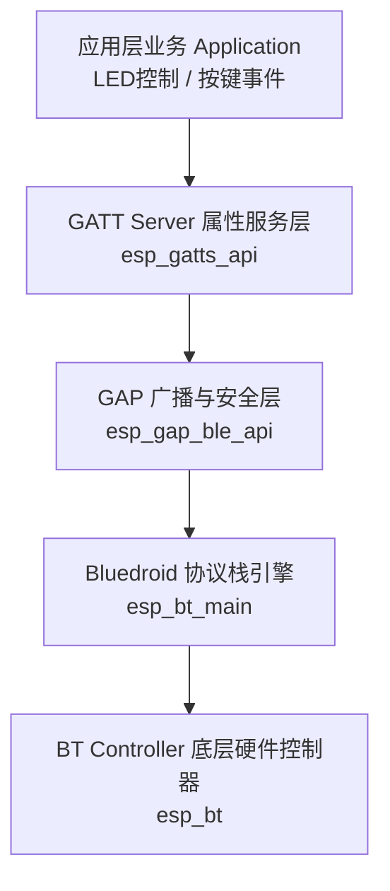

# 第 14 关：ESP32 BLE 低功耗蓝牙 GATT 广播与手机 App 透传控制


---

## 🎯 本关学习目标

在前两关中，我们让 ESP32 连上了 Wi-Fi 路由器和云端 MQTT 服务器。但在很多现实物理场景中：
* **智能手环 / 智能体脂秤 / 共享单车车锁**：周围根本没有 Wi-Fi 路由器和密码，手机如何一靠近就能秒级开锁或读取体重数据？
* **智能家居近场配网**：新买的智能灯泡刚拆封无法上网，需要手机先近距离给它发送家庭 Wi-Fi 账号和密码。

这种**“近距离、免配网、极度省电（一颗纽扣电池供电可待机 1~2 年）”**的通信王者，就是 **BLE（Bluetooth Low Energy，低功耗蓝牙）**！

完成本关卡后，你将达成以下核心成就：
1. **搞懂 BLE 与经典蓝牙的区别**：从占空比（Duty Cycle）和微安级睡眠电流理解手环长续航的底层秘密；
2. **彻底掌握 GATT 协议四层树状模型**：用“商场专柜与商品抽屉”大白话拆解 Profile、Service 与 Characteristic；
3. **搞懂 BLE 三大核心通信动作**：读取（Read）、写入（Write）与单片机硬件事件主动推送（Notify）；
4. **掌握 ESP32 Bluedroid 蓝牙协议栈开发**：BT Controller 控制器启停、GAP 广播配置与 GATTS 状态机流水线；
5. **打造手机 App 蓝牙双向遥控中枢**：手机端（iOS / Android）通过 **LightBlue App** 发送指令控制板载 LED2，板载按键 SW3 触发主动 Notify 弹射推送！

---

## 🧭 关卡实验与源码速查

| 实验编号 | 实验名称 | 核心知识与实验目标 | 配套源码文件 | 一键切换命令 |
| :--- | :--- | :--- | :--- | :--- |
| **实验 1** | **BLE 广播与手机扫描发现** | 初始化 BT 控制器与 Bluedroid 协议栈，广播设备名 `ESP32-Journey-Beacon`，手机端秒级发现 | [`01_ble_beacon_adv.c`](../code/14_ble_gatt/01_ble_beacon_adv.c) | `./switch_code.sh 14 1 --flash` |
| **实验 2** | **GATT Server 服务与特征值读写** | 搭建 GATT Server，创建自定义 Service (`0x00FF`) 与 Characteristic (`0xFF01`)，手机主动读写数据 | [`02_ble_gatt_server.c`](../code/14_ble_gatt/02_ble_gatt_server.c) | `./switch_code.sh 14 2 --flash` |
| **实验 3** | **手机蓝牙遥控器与按键 Notify 推送** | 手机写入控制板载绿色 LED2，板载按键 SW3 按下时触发**主动 Notify 弹射推送**至手机 | [`03_ble_smart_remote.c`](../code/14_ble_gatt/03_ble_smart_remote.c) | `./switch_code.sh 14 3 --flash` |

---

# 🌟 主题一：BLE 低功耗蓝牙本质与 GATT“商场专柜”心智模型

## 14.1 什么是 BLE？它和传统经典蓝牙（Classic BT）的区别

很多人以为“蓝牙就是用来听歌的”，其实在蓝牙技术演进史上有两条截然不同的路线：

```text
 ┌────────────────────────────────────────────────────────────────────────┐
 │                【经典蓝牙 (Classic BT) VS BLE 低功耗蓝牙】              │
 │                                                                        │
 │  1. 经典蓝牙 (BT 2.0 / 3.0 / 经典音频) ➔ 【重型大卡车 🚚】：           │
 │     • 优势：传输带宽大（几 Mbps），专为持续大流量流式传输设计（蓝牙耳机）；│
 │     • 劣势：功耗极高（几十 mA 持续耗电），耳机听歌 4~6 小时就没电了。   │
 │                                                                        │
 │  2. BLE 低功耗蓝牙 (BT 4.0 / 5.0+ IoT 专属) ➔ 【电动滑板车 🛴】：     │
 │     • 核心哲学：【99.9% 的时间都在极低功耗深度休眠，发数据瞬间醒来】； │
 │     • 功耗：平均电流仅几个微安（μA），一颗 CR2032 纽扣电池能撑 1~2 年！│
 │     • 场景：手环计步、心率传感器、防丢器、共享单车锁、近场控制。      │
 └────────────────────────────────────────────────────────────────────────┘
```

---

## 14.2 GATT 架构大白话解密：商场专柜与商品抽屉

在 BLE 连接建立后，手机和 ESP32 之间的数据是如何组织的？  
BLE 制定了一套全球通用的数据组织规范 —— **GATT（Generic Attribute Profile，通用属性配置文件）**。

很多初学者容易被 UUID、Handle、Service、Characteristic 这些专业名词绕晕。其实只要把它想象成一座**“大型百货商场”**，所有概念瞬间秒懂：

```text
 ┌────────────────────────────────────────────────────────────────────────┐
 │                    【GATT 架构 ➔ 百货商场四层模型】                     │
 │                                                                        │
 │  【Level 1: Profile (整座商场)】                                       │
 │   └─ 代表整个设备的功能档案（如 "ESP32 智能家居中控设备"）              │
 │                                                                        │
 │  【Level 2: Service (专柜)】 ── 每个专柜有一个唯一编号 (Service UUID)    │
 │   ├─ 专柜 A (UUID: 0x180F) ➔ "电池电量专柜"                            │
 │   └─ 专柜 B (UUID: 0x00FF) ➔ "自定义灯光控制专柜" (本关创建)            │
 │                                                                        │
 │  【Level 3: Characteristic (专柜里的商品抽屉)】 ── (Char UUID)         │
 │   └─ 抽屉 (UUID: 0xFF01) ➔ "LED2 开关控制抽屉"                        │
 │       • 属性权限 (Properties)：允许手机 【Read 读】/【Write 写】/【Notify】 │
 │                                                                        │
 │  【Level 4: Value (抽屉里真正放的纸条/货物)】                          │
 │   └─ 数据内容：'1' (点亮) 或 '0' (熄灭)                                │
 └────────────────────────────────────────────────────────────────────────┘
```

### 📋 GATT 核心术语 1-对-1 字典：

| GATT 术语 | 商场生活比喻 | 它是干什么的？（秒懂设计） |
| :--- | :--- | :--- |
| **Profile（规范档案）** | **🏢 百货商场名字** | 描述设备是什么（如“健康手环”或“智能遥控器”），由一个或多个 Service 组成。 |
| **Service（服务）** | **🛍️ 商场里的功能专柜** | 一组相关功能的集合，用唯一的 **Service UUID**（如 `0x00FF`）标识。 |
| **Characteristic（特征值）** | **🗄️ 专柜里的数据抽屉** | **BLE 通信中最核心的实体**！真正存放具体数据变量的地方，用 **Char UUID**（如 `0xFF01`）标识。 |
| **UUID（通用唯一标识符）** | **🏷️ 专柜/抽屉的门牌条形码** | 区分不同服务与特征值的唯一编号（如 16 位短 UUID `0xFF01` 或 128 位长 UUID）。 |
| **Handle（属性句柄）** | **🔢 芯片内部的内存索引号** | ESP-IDF 底层给每个 Service 和 Characteristic 分配的 16 位整型数字编号（如 `0x002A`）。 |

---

## 14.3 BLE 的四大通信动作：Read、Write、Notify、Indicate

在特征值（抽屉）上，手机和 ESP32 可以进行以下四种操作：

```text
 ┌────────────────────────────────────────────────────────────────────────┐
 │                      【BLE 四大通信操作机制对比】                       │
 │                                                                        │
 │  1. Read（读）：                                                       │
 │     手机主动伸手打开抽屉拿数据 ➔ "当前电量是多少？" 单片机返回 "85%"。 │
 │                                                                        │
 │  2. Write（写）：                                                      │
 │     手机主动往抽屉里塞数据 ➔ 手机写入 '1'，ESP32 收到后立即点亮 LED2。 │
 │                                                                        │
 │  3. Notify（主动通知 ⚡ 最常用）：                                     │
 │     单片机发现按键 SW3 被按下，【主动把最新数据弹射推送给手机】！       │
 │     • 特点：不需要手机每秒来问（零轮询），单片机单向推送，速度极快！    │
 │                                                                        │
 │  4. Indicate（带确认的主动通知）：                                     │
 │     与 Notify 类似，但要求手机应用层必须回复确认收到（可靠性更高）。    │
 └────────────────────────────────────────────────────────────────────────┘
```

---

# 🛠️ 主题二：ESP-IDF Bluedroid 蓝牙协议栈与 API 字典

ESP32 内部搭载了强大的双模蓝牙硬件，官方 ESP-IDF 提供了经过数亿台设备检验的 **Bluedroid** 蓝牙协议栈。



## 14.4 核心 API 函数功能字典（小白必读）

| 函数原型 | 生活比喻 | 核心功能与参数深度剖析 |
| :--- | :--- | :--- |
| **`esp_bt_controller_mem_release(ESP_BT_MODE_CLASSIC_BT)`** | **扔掉不需要的大卡车零件** | **释放经典蓝牙占用的 RAM 显存**。<br>ESP32 默认给经典蓝牙分配了约 30KB 内存，本实验只用 BLE，提前释放可大幅节省单片机内存！ |
| **`esp_bt_controller_init(&bt_cfg)`** | **给蓝牙无线电电台通电** | **初始化底层硬件 BT 控制器**。<br>配置时钟源、中断优先级与基带芯片寄存器。 |
| **`esp_bt_controller_enable(ESP_BT_MODE_BLE)`** | **启动 BLE 模式基带** | **使能低功耗蓝牙硬件工作模式**。 |
| **`esp_bluedroid_init()` & `enable()`** | **启动蓝牙操作系统大脑** | **初始化并启动 Bluedroid 协议栈**。 |
| **`esp_ble_gap_set_device_name("Name")`** | **给设备起一个广播名字** | **配置广播设备名称**（例如 `ESP32-Journey-Beacon`），手机 App 搜索时一眼就能看到！ |
| **`esp_ble_gap_start_advertising(&adv_params)`** | **开启喇叭大声广播：“我在这里！”** | **启动 BLE 广播发射**。<br>• `adv_int_min / max`：广播频率间隔（如 20ms~40ms 发射一次脉冲）。 |
| **`esp_ble_gatts_create_service(...)`** | **在商场里开辟一个新专柜** | **创建 GATT 服务**，传入 `Service UUID` 与预计占用的 Handle 数量。 |
| **`esp_ble_gatts_add_char(...)`** | **在专柜里打造一个商品抽屉** | **向服务添加特征值**，指定权限（`READ | WRITE | NOTIFY`）。 |
| **`esp_ble_gatts_send_indicate(...)`** | **主动按门铃给手机弹射送货** | **向手机推送 Notify 状态**。<br>• `need_confirm=false` 为 Notify（免确认），`true` 为 Indicate。 |

---

# 🚀 主题三：三大实战实验逐级通关（源码 + 验证）

---

## 14.5 实验 1：BLE 广播与手机扫描发现 (BLE Beacon)

配置 ESP32 为广播外设（Peripheral），广播设备名 **`ESP32-Journey-Beacon`**，手机打开 LightBlue App 秒级发现！

> 📁 **配套源码文件**：[`code/14_ble_gatt/01_ble_beacon_adv.c`](../code/14_ble_gatt/01_ble_beacon_adv.c)  
> ⚡ **一键切换运行**：在终端运行 `./switch_code.sh 14 1 --flash` 即可秒级切换并自动烧录！

### 1. 核心流程：
1. `esp_bt_controller_mem_release` 释放经典蓝牙内存；
2. 初始化 BT 控制器并使能 `ESP_BT_MODE_BLE`；
3. 初始化并使能 Bluedroid 协议栈；
4. 注册 `gap_event_handler`，设置广播名称为 `ESP32-Journey-Beacon` 并启动广播！

### 2. 成功运行日志：
```text
I (....) EXP1_BLE_ADV: 📡 广播数据设置完成，正在启动 BLE 广播...
I (....) EXP1_BLE_ADV: 🎉 [BLE 广播中] 请打开手机 App 搜索: ESP32-Journey-Beacon
```

---

## 14.6 实验 2：GATT Server 服务与特征值读写 (Read/Write 数据透传)

创建自定义 GATT 服务（UUID: `0x00FF`）与特征值（UUID: `0xFF01`），支持手机通过 LightBlue 写入 `'1'` 或 `'0'` 实时开关板载绿色 LED2（GPIO27）：

> 📁 **配套源码文件**：[`code/14_ble_gatt/02_ble_gatt_server.c`](../code/14_ble_gatt/02_ble_gatt_server.c)  
> ⚡ **一键切换运行**：在终端运行 `./switch_code.sh 14 2 --flash` 即可秒级切换并自动烧录！

### 1. 核心代码解析：GATT 事件状态机与写数据处理
```c
static void gatts_event_handler(esp_gatts_cb_event_t event, esp_gatt_if_t gatts_if, esp_ble_gatts_cb_param_t *param)
{
    switch (event) {
        case ESP_GATTS_REG_EVT:
            // 1. 注册服务
            esp_ble_gatts_create_service(gatts_if, &service_id, 4);
            break;

        case ESP_GATTS_CREATE_EVT:
            // 2. 服务创建成功 ➔ 启动服务并添加特征值
            s_service_handle = param->create.service_handle;
            esp_ble_gatts_start_service(s_service_handle);
            esp_ble_gatts_add_char(s_service_handle, &char_uuid,
                                   ESP_GATT_PERM_READ | ESP_GATT_PERM_WRITE,
                                   ESP_GATT_CHAR_PROP_BIT_READ | ESP_GATT_CHAR_PROP_BIT_WRITE,
                                   NULL, NULL);
            break;

        case ESP_GATTS_WRITE_EVT:
            // 3. ⭐️ 收到手机写入数据
            ESP_LOGI(TAG, "✍️ 收到手机写入数据: %.*s", param->write.len, param->write.value);
            if (param->write.value[0] == '1') {
                gpio_set_level(LED2_PIN, 1); // 点亮 LED2
                ESP_LOGI(TAG, "💡 板载绿色 LED2 ➔ 点亮 (ON)");
            } else if (param->write.value[0] == '0') {
                gpio_set_level(LED2_PIN, 0); // 熄灭 LED2
                ESP_LOGI(TAG, "🌑 板载绿色 LED2 ➔ 熄灭 (OFF)");
            }
            // 回复 Write Response
            esp_ble_gatts_send_response(gatts_if, param->write.conn_id, param->write.trans_id, ESP_GATT_OK, NULL);
            break;
    }
}
```

---

## 14.7 实验 3：综合大工程 —— 手机蓝牙遥控器与按键 Notify 主动推送

打造双向闭环蓝牙系统：
1. **下行控制**：手机写入 `'1'` / `'0'` 开关 LED2；
2. **上行主动推送（Notify）**：当按下开发板上的 **SW3 用户按键（GPIO39）** 时，ESP32 立即调用 `esp_ble_gatts_send_indicate` **主动向手机弹射推送包含按键点击次数的 Notify 报文**！

> 📁 **配套源码文件**：[`code/14_ble_gatt/03_ble_smart_remote.c`](../code/14_ble_gatt/03_ble_smart_remote.c)  
> ⚡ **一键切换运行**：在终端运行 `./switch_code.sh 14 3 --flash` 即可秒级切换并自动烧录！

```text
 ┌────────────────────────────────────────────────────────────────────────┐
 │                    【BLE 双向交互流转架构图】                          │
 │                                                                        │
 │  1. 下行控制 (手机 ➔ ESP32 Write)：                                    │
 │     手机 App (LightBlue) ──(Write: '1')──► 特征值 (0xFFE1) ➔ 开灯 LED2 │
 │                                                                        │
 │  2. 上行主动弹射 (ESP32 ➔ 手机 Notify)：                               │
 │     板载 SW3 按键按下 ──► esp_ble_gatts_send_indicate                 │
 │     手机 App (LightBlue) 立即弹窗收到 ➔ "SW3_CLICK_1", "SW3_CLICK_2"   │
 └────────────────────────────────────────────────────────────────────────┘
```

### 1. 按键扫描与主动 Notify 推送核心代码：
```c
static void button_task(void *arg)
{
    int click_count = 0;
    while (1) {
        // SW3 (GPIO39) 低电平有效
        if (gpio_get_level(BUTTON_PIN) == 0) {
            vTaskDelay(pdMS_TO_TICKS(50)); // 消抖
            if (gpio_get_level(BUTTON_PIN) == 0) {
                click_count++;
                ESP_LOGI(TAG, "🔘 检测到 SW3 按键按下 (第 %d 次)", click_count);

                if (s_is_connected) {
                    char notify_msg[64];
                    snprintf(notify_msg, sizeof(notify_msg), "SW3_CLICK_%d", click_count);

                    // ⭐️ 主动向已连接的手机推送 Notify 报文 (need_confirm = false)
                    esp_ble_gatts_send_indicate(s_gatts_if, s_conn_id, s_char_handle,
                                                strlen(notify_msg), (uint8_t *)notify_msg, false);
                    ESP_LOGI(TAG, "📤 [主动 Notify 推送给手机] ➔ %s", notify_msg);
                }

                // 等待按键释放
                while (gpio_get_level(BUTTON_PIN) == 0) {
                    vTaskDelay(pdMS_TO_TICKS(20));
                }
            }
        }
        vTaskDelay(pdMS_TO_TICKS(50));
    }
}
```

---

# 📱 主题四：使用手机独立 App (LightBlue / nRF Connect) 联动测试指北

为了在真机上获得最佳的工程师级调试体验，我们推荐使用全世界最经典的开源/免费 BLE 调试工具：
* **iOS 苹果端**：App Store 搜索下载 **`LightBlue`**（开发者：Punch Through，界面清爽无广告，首选 👍）；
* **Android 安卓端**：应用商店或 Google Play 搜索下载 **`LightBlue`** 或 **`nRF Connect`**。

---

## 14.8 配合 LightBlue 进行 4 步可视化实战

```text
 ┌────────────────────────────────────────────────────────────────────────┐
 │                      【LightBlue 手机联动实战四步法】                   │
 │                                                                        │
 │  步骤 1：开启手机蓝牙与定位 ➔ 打开 LightBlue App                        │
 │  步骤 2：下拉刷新扫描 ➔ 找到名为 `ESP32-Smart-Remote` 的设备，点击 Connect │
 │  步骤 3：查看 GATT 服务树 ➔ 找到服务 `FFE0` ➔ 点击特征值 `FFE1`          │
 │  步骤 4：测试双向联动：                                                │
 │           • 【写数据开灯】：点击 `Write new value` ➔ 选 UTF-8 ➔ 输入 `1` │
 │             👉 看到开发板绿色 LED2 瞬间亮起！输入 `0` 熄灭！            │
 │           • 【监听按键推送】：在特征值页面点击 `Listen for notifications`│
 │             👉 按下开发板上的 SW3 按键，手机屏幕实时弹出 `SW3_CLICK_1`！│
 └────────────────────────────────────────────────────────────────────────┘
```

---

## 14.9 关卡总结与通关打卡

太震撼了！你已经完全掌握了现代嵌入式物联网近距离通信的王者技能 —— **BLE 低功耗蓝牙**！

### 🏆 核心技能清单回顾：
* [x] **BLE 低功耗机制**：理解 Duty Cycle 占空比与微安级休眠长续航原理；
* [x] **GATT 百货商场模型**：掌握 Profile、Service、Characteristic 与 Value 四层组织关系；
* [x] **三大交互动作**：搞懂 Read 读取、Write 写入与 Notify 硬件主动弹射推送的区别与场景；
* [x] **ESP-IDF Bluedroid 协议栈**：熟练掌握 BT 控制器初始化、GAP 广播与 GATTS 事件驱动状态机；
* [x] **软硬件双向闭环**：实现手机 App（LightBlue）控制板载 LED2 与 SW3 按键主动推送手机。

---

至此，你已经完整掌握了 ESP32 的两大无线通信王牌：**广域互联网（Wi-Fi + MQTT）** 与 **近场移动端交互（BLE 蓝牙）**！

但是，如果你需要控制无人机、遥控小车或者无线游戏手柄，Wi-Fi 连路由器延迟太高（50~100ms），蓝牙配对太繁琐，怎么办？  
乐鑫专门为这种极限场景研发了私有黑科技 —— **ESP-NOW 无连接超低延迟局域网通信**（延迟 < 2ms，开机即发）！

请翻开 [**第 15 章：ESP-NOW 超低延迟私有局域网通信与双机遥控实战**](./15_ESPNOW超低延迟通信与双机遥控.md)！
