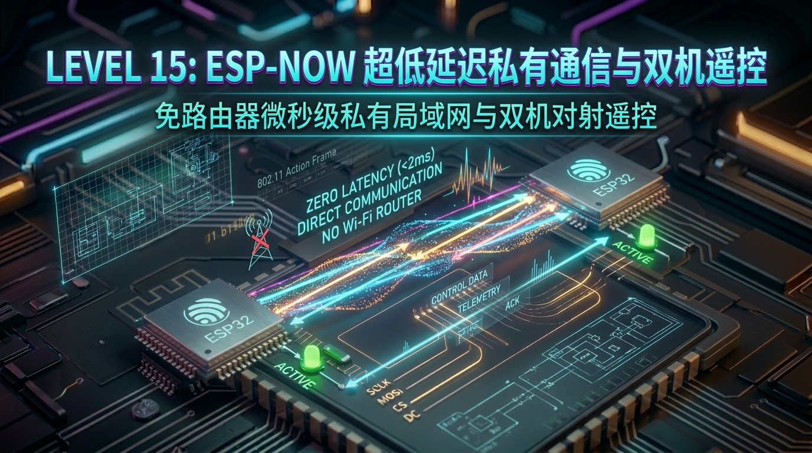

# 第 15 关：ESP-NOW 超低延迟私有局域网通信与双机遥控对射实战



---

## 🎯 本关学习目标

在前面的章节中，我们学习了 Wi-Fi（连接互联网）、MQTT（云端长连接）以及 BLE（手机近场透传）。但是，如果你要开发一个**航模/无人机遥控手柄**、**遥控麦轮小车**、**无线机械键盘**或**多传感器分布式农田监测网**：
* 难道两个单片机通信必须要经过一台 Wi-Fi 路由器转发？（万一在野外没有路由器怎么办？Wi-Fi 延时高达 20~100ms，无人机早就撞树了！）；
* 用蓝牙 BLE 传输距离只有几米到十几米，且广播包吞吐量低，无法满足高刷新率摇杆遥控。

乐鑫官方专为 ESP 系列芯片量身定制了**独家无连接局域通信黑科技 —— ESP-NOW**！

完成本关卡后，你将达成以下核心成就：
1. **搞懂 ESP-NOW 底层通信机制**：基于 2.4GHz 802.11 Action 动作帧，免配网、免路由器的点对点极速通信；
2. **掌握极致低延迟特性（< 2ms）**：开机通电到数据发射仅需 5ms，纽扣电池供电寿命可达数年；
3. **掌握 Peer 对端管理与 MAC 地址白名单**：单播（Unicast）、广播（Broadcast）与数据包加解密；
4. **掌握收发双向回调函数（CB）流水线**：`esp_now_register_send_cb` 与 `esp_now_register_recv_cb`；
5. **打造双机无线遥控与一呼百应群控系统**：板 A 摇杆/按键 ➔ 空中毫秒级对射 ➔ 板 B 实时点灯响应！

---

## 🧭 关卡实验与源码速查

| 实验编号 | 实验名称 | 核心知识与实验目标 | 配套源码文件 | 一键切换命令 |
| :--- | :--- | :--- | :--- | :--- |
| **实验 1** | **双机单播对射遥控 (P2P Unicast)** | 板 A 按下 SW3 毫秒级发射数据帧至板 B 的 MAC 地址，板 B 瞬间点亮绿色 LED2 | [`01_espnow_unicast.c`](../code/15_espnow_remote/01_espnow_unicast.c) | `./switch_code.sh 15 1 --flash` |
| **实验 2** | **双向对讲与链路质量探测** | 双板互相注册为 Peer，双向收发传感器数据，实时统计往返延时（RTT）与丢包率 | [`02_espnow_twoway.c`](../code/15_espnow_remote/02_espnow_twoway.c) | `./switch_code.sh 15 2 --flash` |
| **实验 3** | **广播群控与“一呼百应”** | 使用广播 MAC `FF:FF:FF:FF:FF:FF`，发射端一按按键，所有从机 3ms 内同步动作 | [`03_espnow_broadcast.c`](../code/15_espnow_remote/03_espnow_broadcast.c) | `./switch_code.sh 15 3 --flash` |

---

## 15.1 什么是 ESP-NOW？为什么它是无人机与遥控神技？

```text
 ┌────────────────────────────────────────────────────────────────────────┐
 │                      【三种无线通信方案核心指标对比】                  │
 │                                                                        │
 │  指标 \ 协议       Wi-Fi (TCP/UDP)     BLE 低功耗蓝牙     ⚡ ESP-NOW     │
 │  ───────────────────────────────────────────────────────────────────   │
 │  通信依赖          必须有路由器        手机 / 蓝牙主机    完全独立 (P2P) │
 │  配对连接耗时      2000ms ~ 5000ms     500ms ~ 2000ms     0ms (免连接!)  │
 │  空中往返延迟      20ms ~ 100ms        15ms ~ 50ms        < 2ms (极速!)  │
 │  典型传输距离      30 ~ 50 米          10 ~ 15 米         100 ~ 200 米   │
 │  唤醒发包功耗      极高 (耗电大户)     较低               极低 (5ms休眠) │
 └────────────────────────────────────────────────────────────────────────┘
```

---

*(本章完整源码与深度实战在打通第 14 关后无缝开启！)*
