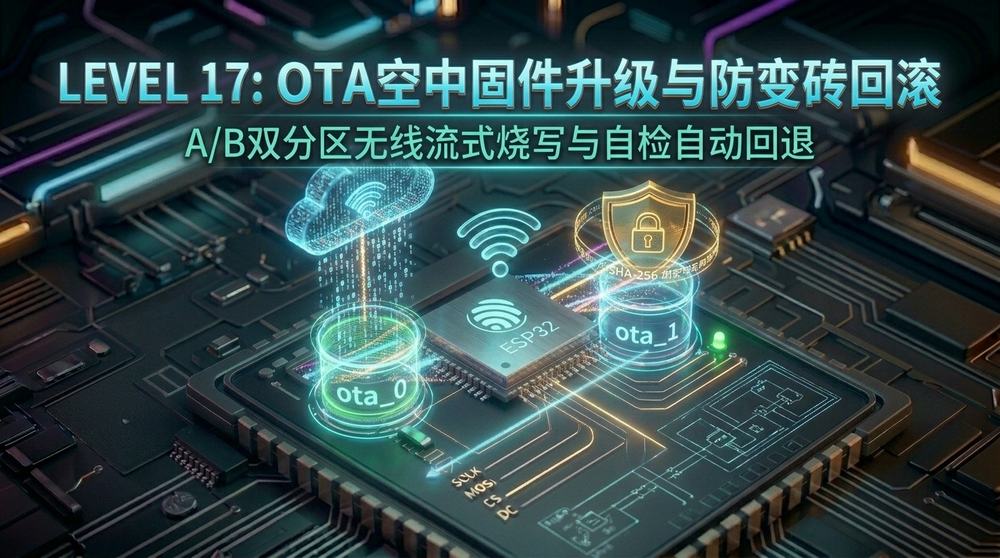

# 第 17 关：ESP32 OTA 空中无线固件升级与 A/B 双分区防变砖回滚实战



---

## 🎯 本关学习目标

在传统嵌入式开发中，给单片机升级程序通常需要一根 USB 线或者 JTAG/SWD 仿真器，工程师必须坐在设备旁边守着烧录。

然而，在真正的**消费级物联网与工业产品**中：
* **现实挑战**：如果几万台智能电表安装在高楼外墙、智能手环戴在用户手腕、智能路灯分散在整座城市，你不可能派售后工程师带着电脑去一把把插线刷机；
* **致命风险**：如果设备在无线下载固件过程中**突然断电**，或者新上传的代码有严重 Bug 导致开机**死循环崩溃**，设备会不会瞬间彻底“变砖”？

这就是为什么 **OTA（Over-The-Air，空中无线固件升级）** 和 **A/B 分区自动回滚（Rollback）** 被称为物联网产品的**生命线**！

完成本关卡后，你将达成以下核心成就：
1. **搞懂 Flash 分区表（Partition Table）底层原理**：透彻掌握 `partitions.csv` 语法，设计 8MB Flash 的 `ota_0` 与 `ota_1` 双镜像乒乓架构；
2. **掌握 ESP-IDF 原生 OTA 流式烧写流水线**：使用 `esp_https_ota` 高阶组件实现固件在线静默下载、实时进度监控与 SHA-256 指纹校验；
3. **攻克工业级防变砖自动回滚机制**：掌握 `CONFIG_BOOTLOADER_APP_ROLLBACK_ENABLE`、`PENDING_VERIFY` 待验证状态机与自检确认，保障设备万无一失永不变砖；
4. **亲手搭建本地固件服务器并完成无线空中刷机**：电脑一键启动 HTTP 服务，ESP32 自动拉取 `bin` 镜像，5 秒内完成空中升级并无缝重启！

---

## 🧭 关卡实验与源码速查

| 实验编号 | 实验名称 | 核心知识与实验目标 | 配套源码文件 | 一键切换命令 |
| :--- | :--- | :--- | :--- | :--- |
| **实验 1** | **自定义 A/B 双分区表检测** | 划分 `ota_0` 与 `ota_1` 双镜像分区，遍历全局分区表并读取固件 SHA-256 指纹 | [`01_ota_partition_check.c`](../code/17_ota_firmware/01_ota_partition_check.c) | `./switch_code.sh 17 1 --flash` |
| **实验 2** | **HTTP 固件空中无线拉取与烧写** | 搭建局域网 HTTP 固件服务器，ESP32 流式下载固件、计算进度百分比并自动重启 | [`02_http_ota_upgrade.c`](../code/17_ota_firmware/02_http_ota_upgrade.c) | `./switch_code.sh 17 2 --flash` |
| **实验 3** | **防变砖自检与 Bootloader 自动回滚** | 模拟新固件待验证状态与崩溃场景，验证 Bootloader 毫秒级自动回滚至旧稳定版本 | [`03_ota_rollback_guard.c`](../code/17_ota_firmware/03_ota_rollback_guard.c) | `./switch_code.sh 17 3 --flash` |

---

## 17.1 💡 极简认知启蒙：什么是 OTA 与 A/B 双分区？

### 1. 舞台换装模型：单分区 vs A/B 双分区

很多初学者容易产生一个误解：*“升级固件不就是把新代码直接盖写在原来的单片机程序上吗？”*  
**绝对不行！** 单分区直接覆盖升级极其危险：

```text
 ❌【单分区覆盖升级（自杀式升级）】
 
   Flash: [ 正在运行的旧固件 (擦除中...) ] ──► (写入到一半时突然断电 💥) ──► 变成一堆碎代码 ──► 设备永久变砖！
 
 ---------------------------------------------------------------------------------------------------------
 
 ✅【A/B 双分区乒乓升级（商用级高可靠架构）】
 
   阶段 1: ESP32 正常运行 [ ota_0 (旧版本 v1.0) ]
          后台通过 Wi-Fi 静默下载新固件并写入 ────► [ ota_1 (全新写入中...) ]
 
   阶段 2: 下载完成，计算 SHA-256 完整性校验无误
          Bootloader 修改启动指针 ───────────────► 引导启动 [ ota_1 (新版本 v2.0) ]
 
   阶段 3: 若新版本开机崩溃死机 ──────────────────► Bootloader 自动回退切回 [ ota_0 (v1.0) ]！
```

* **生活化比喻（舞台换装）**：
  * **单分区覆盖** 就像演员直接在舞台中央当着观众的面脱衣服换装，一旦拉链卡住或者断电，演出彻底搞砸（变砖）；
  * **A/B 双分区** 就像剧场准备了 **A/B 两个舞台（ota_0 和 ota_1）**：A 舞台正在正常演出，B 舞台在后台拉上幕布慢慢布置新布景。等 B 舞台完全布置妥当并检查无误后，灯光瞬间切换到 B 舞台；如果 B 舞台道具突然倒塌，灯光马上切回 A 舞台继续表演！

---

### 2. OTA 升级的核心三要素

```text
  ┌────────────────────────────────────────────────────────────────────────┐
  │                           【OTA 核心技术拼图】                          │
  │                                                                        │
  │   1. 分区表 (Partition Table)  2. 传输流水线 (Transport)  3. 引导状态机 (Rollback) │
  │      划分 ota_0 / ota_1 / otadata     HTTP / HTTPS 流式下载       NEW ➔ PENDING ➔ VALID  │
  │                                                                        │
  └────────────────────────────────────────────────────────────────────────┘
```

1. **Flash 分区表（Partition Table）**：在 Flash 硬件存储器中明确划分出两个等大的 App 空间（`ota_0` 和 `ota_1`），以及一个记录当前该启动谁的 `otadata`（OTA 数据区）；
2. **传输与烧写流水线（Transport & Write）**：设备连上 Wi-Fi 后，通过 HTTP/HTTPS 请求拉取二进制固件（`firmware.bin`），边接收网络数据包边流式写入备用分区；
3. **引导状态机与防变砖回滚（Rollback）**：新固件第一次开机时进入“试用考察期”（`PENDING_VERIFY`）。只有当系统成功联网、传感器自检通过后才正式转正；如果开机崩溃死锁，Bootloader 自动无缝切回上一版本。

---

## 17.2 🗺️ ESP32 Flash 分区表（Partition Table）深度剖析

### 1. 什么是分区表？

ESP32 板载搭载了一颗 **8 MB SPI Flash 芯片**。如果不进行分区管理，所有的代码和数据就会混成一锅粥。  
分区表就像**将一块 8MB 的大衣柜划分成不同的抽屉**：有的抽屉放 Wi-Fi 密码配置，有的抽屉放系统固件，有的抽屉放文件系统。

ESP-IDF 默认会在 Flash 的起始偏移量 `0x8000`（32KB 处）存放一份编译好的二进制分区表。

```text
 0x0000        0x1000        0x8000        0x9000     0xD000       0x10000            0x310000           0x610000        0x800000 (8MB)
 ┌─────────────┬─────────────┬─────────────┬──────────┬────────────┬──────────────────┬──────────────────┬───────────────┐
 │ 硬件保留区  │ Bootloader  │ 分区表      │ NVS 存储 │ otadata    │ ota_0 (3 MB)     │ ota_1 (3 MB)     │ storage (FAT) │
 │ (4KB)       │ (二级引导)  │ (32KB 处)   │ (Wi-Fi等)│ (OTA状态)  │ 【当前运行/A槽】  │ 【备用升级/B槽】 │ (大容量存储)  │
 └─────────────┴─────────────┴─────────────┴──────────┴────────────┴──────────────────┴──────────────────┴───────────────┘
 ◀─── 【前 36KB: 硬件系统固定区，不可挪动】 ───► ◀──────────────── 【0x9000 之后: 用户自由分配空间】 ────────────────►
```

#### 🏗️ 大厦地基模型：为什么 `0x9000` 前面是固定写死的？（前 36KB 深度拆解）
1. **`0x0000 ~ 0x1000`（前 4KB：Flash 头部硬件保留区）**：
   * 存放 SPI Flash 工作模式（DIO/QIO）、时钟频率（40MHz/80MHz）及硬件芯片启动校验头；
2. **`0x1000 ~ 0x8000`（4KB ~ 32KB 处，共 28KB：二级 Bootloader 引导程序）**：
   * **芯片硬件 ROM 铁律**：ESP32 芯片内部固化了一段只读硬件代码（1 级引导 ROM）。芯片上电瞬间，硬件逻辑**固定死死地去 Flash 的 `0x1000` 地址加载 Bootloader**。如果把 Bootloader 挪到别处，芯片开机就会找不到入口而直接死机变砖；
3. **`0x8000 ~ 0x9000`（32KB ~ 36KB 处，共 4KB：Partition Table 二进制分区表）**：
   * **这就是 `partitions.csv` 编译烧录后的物理家园！**
   * 我们在电脑工程里写的 `partitions.csv` 文本文件，在执行 `idf.py build` 编译时会被工具自动编译为 **`partition-table.bin` 二进制文件**；
   * 在执行 `idf.py flash` 烧录时，烧录工具会**精准将这份二进制数据写入到 Flash 的 `0x8000` 偏移地址处**！
   * Bootloader 开机后，就是在这个 `0x8000` 位置读取它，从而知道了后面的 `nvs` 在 `0x9000`、`otadata` 在 `0xd000`、`ota_0` 在 `0x10000`！
4. **`0x9000` 之后（36KB ~ 8MB/16MB：用户自由定制区）**：
   * 从 `0x9000` 开始直到 Flash 尽头，就像**大厦地上部分的毛坯房**，你可以根据产品需求随意自由规划（想分几个 OTA 槽、分配多大的文件系统、存多少数据，全由你在 `partitions.csv` 说了算）！

```text
 ┌────────────────────────────────────────────────────────────────────────┐
 │            【从 partitions.csv 源码到 0x8000 硬件烧录全链路】           │
 │                                                                        │
 │   [ partitions.csv ] (文本源码)                                        │
 │          │                                                             │
 │          ▼ idf.py build (编译翻译)                                      │
 │   [ build/partition_table/partition-table.bin ] (二进制文件)            │
 │          │                                                             │
 │          ▼ idf.py flash (精准烧录到 Flash 偏移 0x8000 处)               │
 │   [ 物理 Flash: 0x8000 处的分区表 ] ◄── (Bootloader 开机时读取它!)      │
 └────────────────────────────────────────────────────────────────────────┘
```

---

### 2. `partitions.csv` 语法规则详解

在 ESP-IDF 工程根目录下创建 `partitions.csv`，语法格式如下：

```csv
# Name,   Type, SubType, Offset,  Size,     Flags
nvs,      data, nvs,     0x9000,  0x4000,
otadata,  data, ota,     0xd000,  0x2000,
phy_init, data, phy,     0xf000,  0x1000,
ota_0,    app,  ota_0,   0x10000, 0x300000,
ota_1,    app,  ota_1,   0x310000,0x300000,
storage,  data, fat,     0x610000,0x1F0000,
```

| 字段名称 | 说明与含义 |
| :--- | :--- |
| **`Name`** | 分区标签名称（长度最多 16 字节，如 `nvs`、`ota_0`、`ota_1`） |
| **`Type`** | 分区大类：`app`（可执行代码）或 `data`（数据存储） |
| **`SubType`** | 分区子类：`factory`（出厂）、`ota_0`/`ota_1`（OTA 槽位）、`ota`（otadata 信息区）、`nvs`、`fat` 等 |
| **`Offset`** | 分区在 Flash 上的起始物理偏移地址（必须 4KB/0x1000 对齐，留空则由系统自动顺延计算） |
| **`Size`** | 分区占用大小（支持三种写法：`3M`/`16K`、纯十进制、十六进制，**最终字节数必须是 4KB 的整数倍**） |
| **`Flags`** | 标志位（通常填 `encrypted` 启用加密，一般留空） |

> 💡 **小贴士：分区大小（Size）支持哪几种写法？**  
> ESP-IDF 分区解析器（无论是在 `partitions.csv` 文本中，还是在 VS Code 可视化编辑器中）**完全支持人类可读的单位简写**，绝不强制要求你手算十六进制：
> 1. **带单位后缀（🌟 最推荐，最直观）**：
>    * `3M` 或 `3MB`（= 3 × 1024 × 1024 = 3,145,728 字节）
>    * `16K` 或 `16KB`（= 16 × 1024 = 16,384 字节）
>    * `4K`、`8K`、`1.5M` 等均可；
> 2. **十六进制写法（以 `0x` 开头）**：
>    * `0x300000`（3MB）、`0x4000`（16KB）、`0x2000`（8KB）、`0x1000`（4KB）；
> 3. **纯十进制数值**：
>    * `3145728`（3MB）、`16384`（16KB）、`4096`（4KB）；
> 
> ⚠️ **唯一硬件铁律**：不论采用哪种写法，计算出的总字节数**必须是 4096（4KB）的整数倍**（例如写 `16K`、`3M` 是合法的，但写 `5K` 或 `1000` 字节则会报错），因为 Flash 硬件物理擦除以 4KB 扇区为最小步长！

> 💡 **特别提醒**：  
> 当使用 OTA 分区时，**必须同时定义 `otadata`（大小至少 0x2000 即 8KB）**。Bootloader 就是通过读取 `otadata` 分区中记录的序列号和状态，来决定系统启动时加载 `ota_0` 还是 `ota_1`！

---

### 3. 🔍 深度拆解：ESP32 全系 Flash 分区类型家族全景剖析

在 ESP32 的世界里，Flash 分区主要划分为两大阵营：**`app`（可执行代码程序）** 和 **`data`（数据存储）**。

下面用生活化比喻将所有常见分区类型逐一彻底拆解，让你以后面对任何复杂工程的分区表都能一眼看穿：

```text
 ┌─────────────────────────────────────────────────────────────────────────────────────────────┐
 │                         【ESP32 Flash 分区家族全景“大厦功能分布图”】                          │
 │                                                                                             │
 │ 🏢 APP 阵营 (可执行代码)                                                                     │
 │   ├── [ factory ] ➔ 出厂保底固件 (紧急安全门，不参与 OTA 擦写)                                 │
 │   ├── [ ota_0   ] ➔ A 舞台 (当前运行固件 / 或 OTA 槽位 0)                                    │
 │   └── [ ota_1   ] ➔ B 舞台 (备用升级固件 / 或 OTA 槽位 1)                                    │
 │                                                                                             │
 │ 📦 DATA 阵营 (数据与配置)                                                                    │
 │   ├── [ otadata  ] ➔ 轨道扳道总机 (8KB，双备份记录当前该开哪列车，决定引导 ota_0 还是 ota_1)   │
 │   ├── [ nvs      ] ➔ 贴身小金库 (键值对数据库，存 Wi-Fi 密码、设备配置、重启计数器)           │
 │   ├── [ phy_init ] ➔ 射频调音师 (4KB，存 2.4GHz 功放与天线微调出厂校准表)                     │
 │   ├── [ fat/spiffs/littlefs ] ➔ 大宗仓储 (文件系统，存 MP3 音效、字库、高清图片、网页资源)   │
 │   ├── [ coredump ] ➔ 飞行黑匣子 (崩溃转储区，系统死机瞬间把寄存器和堆栈抓拍存盘)              │
 │   └── [ nvs_keys ] ➔ 金库密匙盒 (硬件加密密钥区，用于 NVS Flash 扇区 AES-XTS 加密)            │
 └─────────────────────────────────────────────────────────────────────────────────────────────┘
```

---

#### ① `app` 类分区：放代码的可执行程序槽位

| 分区类型 / SubType | 空间大小建议 | 生活化比喻 | 核心底层机制与使用场景 |
| :--- | :--- | :--- | :--- |
| **`factory`**<br>(出厂固件) | 1MB ~ 3MB | **紧急逃生门** | • 传统非 OTA 工程的唯一固件存放区；<br>• 在高端 OTA 工程中，作为“出厂黄金母本”。当 `ota_0` 和 `ota_1` 均被用户误操作损坏时，长按物理按键可瞬间引导恢复至 `factory` 出厂状态。 |
| **`ota_0` & `ota_1`**<br>(A/B 双镜像槽) | 等大 (如各 3MB) | **A/B 轮换双舞台** | • OTA 乒乓升级的核心载体。两个分区大小必须**完全一致**；<br>• 系统运行在 `ota_0` 时，新固件静默下载写入 `ota_1`；下次升级则反向写入 `ota_0`，交替轮换永不掉线。 |
| **`test`**<br>(产线测试固件) | 512KB ~ 1MB | **出厂体检通道** | • 专用于工厂流水线自动化测试的特种固件（测试屏幕、按键、传感器），量产检验完毕后由产线烧录脚本覆盖或禁用。 |

---

#### ② `data` 类分区：放配置与资源的参数数据区

| 分区类型 / SubType | 空间大小建议 | 生活化比喻 | 核心底层机制与使用场景 |
| :--- | :--- | :--- | :--- |
| **`otadata`**<br>(OTA 引导状态) | **固定 8KB (0x2000)** | **轨道扳道工** | • **OTA 系统的指挥中枢！** 内部划分为两个 4KB 物理扇区，采用**双备份防掉电算法（带自增序列号 Sequence Number 和 CRC32 校验）**；<br>• Bootloader 开机第一件事就是读取它，判断当前该跳转到 `ota_0` 还是 `ota_1`，并检查新固件是否处于 `PENDING_VERIFY`（待验证）状态。 |
| **`nvs`**<br>(非易失性存储) | 12KB ~ 64KB (常用 0x4000/16KB) | **贴身小账本 / 备忘录** | • 基于 Flash 磨损均衡（Wear Leveling）实现的轻量级 Key-Value 键值对数据库；<br>• 存储 Wi-Fi SSID/密码、设备配网状态、MQTT Token、屏幕背光亮度、开机计数器等零碎参数。 |
| **`phy_init`**<br>(物理层射频校准) | **固定 4KB (0x1000)** | **天线声乐调音师** | • 存放 2.4GHz 射频（Wi-Fi & 蓝牙）专属硬件校准数据表（PA 功率衰减补偿、IQ 镜像抑制、温度温漂补偿）；<br>• 出海过认证（FCC/CE/SRRC）时，工厂产线综测仪会将每台机器特定的 RF 射频校准值写入此分区。 |
| **`storage` / `fat` / `spiffs` / `littlefs`**<br>(文件系统) | 512KB ~ 4MB | **地下大仓库** | • 挂载为虚拟文件系统（VFS，如 `/spiffs` 或 `/storage`）；<br>• 适合存放结构化大文件，例如网页 HTML/JS/CSS 静态资源、LVGL 中文字库 `.bin`、提示音 MP3、离线传感器日志等。 |
| **`coredump`**<br>(崩溃死机黑匣子) | 64KB ~ 256KB | **飞机失事黑匣子** | • 当系统发生野指针、内存越界、除以零导致 Panic 崩溃死机时，ESP-IDF 会在瞬间把当前所有 CPU 寄存器与调用堆栈抓拍并写入 `coredump` 分区；<br>• 重启后可通过串口将 dump 数据导出，用 GDB 工具反解出到底是在源码第几行发生了崩溃！ |
| **`nvs_keys`**<br>(NVS 加密密钥) | **固定 4KB (0x1000)** | **保险箱密码盒** | • 启用 Flash 硬件安全加密（NVS Encryption）时，存放经过 eFuse 保护的 AES-XTS 密钥，防止黑客通过物理编程器读取 Flash 盗取 Wi-Fi 密码和商业私钥。 |

---

#### ③ 为什么有的分区是 4KB、8KB，有的是几 MB？（底层设计权衡）

```text
  ┌────────────────────────────────────────────────────────────────────────┐
  │                 【Flash 物理扇区对齐与空间分配黄金法则】                 │
  │                                                                        │
  │   1. 4 KB (0x1000) ➔ 物理 Flash 最小擦除单位 (如 phy_init, nvs_keys)   │
  │   2. 8 KB (0x2000) ➔ 双扇区乒乓防掉电 (如 otadata = 4KB主 + 4KB备)     │
  │   3. 4 KB 整数倍   ➔ 所有分区的 Offset 和 Size 必须严格 4KB 对齐！     │
  └────────────────────────────────────────────────────────────────────────┘
```
1. **4KB（1 个物理扇区）**：NOR Flash 的物理硬件限制是“**只能按扇区擦除（Sector Erase = 4096 字节）**”。即便你的数据只有 10 个字节，也必须给它独占 4KB，否则擦除时会把邻居的数据一起抹掉！
2. **8KB（2 个物理扇区）**：像 `otadata` 这种绝对不能在写入中途断电损坏的核心数据，ESP-IDF 采用了**双扇区交替轮换写入机制（Ping-Pong Buffer）**：写入扇区 2 成功前，扇区 1 始终有效，确保升级中途断电 100% 不破坏启动引导！

---

#### ④ 💡 知识硬核拓展：什么是 NOR Flash？半导体 Flash 存储家族全景图

在芯片与半导体工业界，**Flash（闪存）** 主要分为两大门派：**`NOR Flash`（或非闪存）** 与 **`NAND Flash`（与非闪存）**。

```text
 ┌─────────────────────────────────────────────────────────────────────────────────────────────┐
 │                         【半导体 Flash 闪存两大核心门派对决】                                 │
 │                                                                                             │
 │   📖【NOR Flash (或非闪存)】                       📦【NAND Flash (与非闪存)】               │
 │   • 架构: 存储单元并联 (独立地址线)                • 架构: 存储单元串联 (总线复用)           │
 │   • 特点: 支持字节级随机读，读取极快               • 特点: 只能按页(Page)和块(Block)成批搬运 │
 │   • 绝技: 支持 XIP (芯片内直接执行代码)            • 缺陷: 无法直接跑代码，必须先拷入 RAM    │
 │   • 容量: 几百 KB ~ 64 MB (昂贵、密度低)           • 容量: 16 GB ~ 4 TB (极低成本、超高密度) │
 │   • 用途: ESP32/单片机固件、电脑主板 BIOS          • 用途: 手机存储、SSD 固态硬盘、TF 卡、U盘│
 └─────────────────────────────────────────────────────────────────────────────────────────────┘
```

##### 1. 生活化比喻：翻开书本 vs 拆开集装箱
* **NOR Flash 就像一本《英汉大词典》**：
  * CPU 可以直接翻到第 38 页读第 5 个单词（**单字节随机读取**）；
  * **这就是为什么 ESP32 能直接在 Flash 上运行代码（XIP，eXecute-In-Place）**，不需要先把固件全盘拷到宝贵的内存 RAM 中！
* **NAND Flash 就像港口的“海运集装箱”**：
  * 里面能装海量货物（几百 GB），但你没办法只拿出一个苹果，必须整箱整箱卸货搬进仓库（**按 2KB/4KB Page 整体读写**）；
  * 电脑和手机启动时，必须花几秒钟把操作系统从 SSD（NAND）全部搬到内存 DDR（RAM）里才能开始运行。

---

##### 2. Flash 闪存全家族演进与选型全景速查

| 存储器类型 | 核心介质原理 | 读取粒度 | 典型容量范围 | 读写速度特性 | 典型工业界应用场景 |
| :--- | :--- | :--- | :--- | :--- | :--- |
| **SPI NOR Flash**<br>(ESP32 板载标配) | NOR 晶体管并联 | **字节级 (Byte)** | **4 MB ~ 32 MB** | 读极快 (80MHz)，写入慢，支持 XIP | 单片机固件代码存储、电脑主板 BIOS 芯片、路由器启动芯片 |
| **Raw NAND Flash** | NAND 晶体管串联 | **页级 (Page, 2K/4K)** | **128 MB ~ 8 GB** | 读较快，写入极快，需硬件 ECC 纠错 | 嵌入式 Linux 路由器、安防摄像头开发板 |
| **TF卡 / MicroSD卡** | NAND + 小型主控 | **扇区级 (512B/4K)** | **8 GB ~ 512 GB** | 取决于 SDIO/SPI 速度 (如 Class 10) | 行车记录仪、智能音箱、ESP32 外部扩展存储（下一关） |
| **eMMC / UFS** | 高速 NAND + 专用主控 | **块级 (Block)** | **32 GB ~ 1 TB** | 顺序读取超 1000 MB/s | 智能手机机身存储、智能汽车座舱中控主机、树莓派 5 |
| **NVMe SSD** | 3D-TLC/QLC NAND + PCIe | **块级 (Block)** | **512 GB ~ 8 TB** | 读写超 5000 MB/s | 台式电脑、笔记本、数据中心云服务器 |
| **EEPROM**<br>(远古先辈) | 独立浮栅晶体管 | **单字节 (Byte)** | **几 KB ~ 128 KB** | 极慢，但支持**单字节直接擦除** | 电表保存电量、家电保存最后关机状态 |

---

### 4. 🎛️ 分区表怎么配置？三种高效配置方式（含可视化 GUI 与命令行）

配置 ESP32 分区表主要有以下三种方式，从**小白最爱的可视化界面**到**资深工程师的极速文本流**任你选择：

---

#### 方式一：VS Code / IDE 原生可视化图形编辑器（🌟 最推荐新手）

如果你安装了 ESP-IDF 官方 VS Code 插件，可以使用自带的**可视化表格编辑器**：

```text
 ┌────────────────────────────────────────────────────────────────────────────────────────┐
 │ 🛠️【ESP-IDF Partition Table Editor 可视化网页编辑器】                                   │
 │                                                                                        │
 │  Name      Type     SubType   Offset       Size (KB/MB)   Flags       [操作]            │
 │ ┌────────┬────────┬─────────┬────────────┬──────────────┬───────────┐                  │
 │ │ nvs    │ data ▼ │ nvs   ▼ │ 0x9000     │ 16 KB        │           │ [ 🗑️ 删除 ]     │
 │ │ otadata│ data ▼ │ ota   ▼ │ 0xd000     │ 8 KB         │           │ [ 🗑️ 删除 ]     │
 │ │ phy_init data ▼ │ phy   ▼ │ 0xf000     │ 4 KB         │           │ [ 🗑️ 删除 ]     │
 │ │ ota_0  │ app  ▼ │ ota_0 ▼ │ 0x10000    │ 3 MB         │           │ [ 🗑️ 删除 ]     │
 │ │ ota_1  │ app  ▼ │ ota_1 ▼ │ 0x310000   │ 3 MB         │           │ [ 🗑️ 删除 ]     │
 │ │ storage│ data ▼ │ fat   ▼ │ 0x610000   │ 1.9 MB       │           │ [ 🗑️ 删除 ]     │
 │ └────────┴────────┴─────────┴────────────┴──────────────┴───────────┘                  │
 │                                                                                        │
 │  [ ➕ Add New Partition ]       [ 💾 Save to partitions.csv ]   [ 🔄 Auto Calculate ]   │
 └────────────────────────────────────────────────────────────────────────────────────────┘
```

* **打开方法**：
  1. 按快捷键 `Ctrl + Shift + P`（Mac 为 `Cmd + Shift + P`）打开命令面板；
  2. 搜索并选择 **`ESP-IDF: Open Partition Table Editor`**；
  3. 此时会弹出一个交互式表格，你可以像用 Excel 一样：
     * 点击 **`➕ Add New Partition`** 新增分区；
     * 下拉框直接选择 `app` / `data` 以及 `ota_0` / `nvs` 等子类型；
     * 大小直接支持输入 `3M`、`16K`、`0x300000`，编辑器会**自动实时校验是否有地址重叠或未 4KB 对齐并标红提示**；
     * 点击 **`Save`** 即可一键自动保存并生成 `partitions.csv` 文件！
* **关联项目配置（⚠️ 若提示“未启用自定义分区表”怎么解？）**：
  * **原因**：VS Code 插件会读取项目当前的 `sdkconfig`。如果之前使用的是默认单分区（`Single App Large`），插件会认为你没有开启自定义分区表功能；
  * **解决办法（2 秒搞定）**：
    1. 按 `Ctrl + Shift + P` 搜索并打开 **`ESP-IDF: SDK Configuration Editor (GUI)`**；
    2. 搜索 `Partition Table`；
    3. 将 `Partition Table` 下拉选项切换为 **`Custom partition table CSV`**，下方文件名输入 **`partitions.csv`** 并保存；
    4. 再次打开 `ESP-IDF: Open Partition Table Editor` 即可正常编辑！

---

#### 方式二：终端可视化交互菜单（`idf.py menuconfig` TUI）

在终端中输入命令，进入蓝底灰框的经典字符交互菜单：

```bash
idf.py menuconfig
```

```text
 ┌─────────────────────────── ESP-IDF Configuration ───────────────────────────┐
 │                                                                             │
 │       Component config  --->                                                │
 │       Compiler options  --->                                                │
 │   --> Partition Table  --->                                                 │
 │                                                                             │
 │       Partition Table (Custom partition table CSV)  --->                    │
 │       (partitions.csv) Custom partition CSV file to use                     │
 │       (0x8000) Offset of partition table                                    │
 │       [*] Generate an MD5 checksum for the partition table                  │
 │                                                                             │
 │   [Select]      [ Help ]      [ Save ]      [ Quit ]                        │
 └─────────────────────────────────────────────────────────────────────────────┘
```

* **操作步骤**：
  1. 键盘上下方向键移动光标到 **`Partition Table --->`**，按回车进入；
  2. 在第一项按回车，选择 **`Custom partition table CSV`**；
  3. 在第二项输入你的文件名 **`partitions.csv`**；
  4. 按键盘 **`S`** 保存配置，按 **`Q`** 退出。

---

#### 方式三：直接文本编写（极速省心，支持 Offset 自动顺延）

熟练后，工程师最常用的其实是直接在根目录下新建 `partitions.csv` 文件。

> 💡 **超实用黑科技：Offset 偏移地址可以留空！**  
> 你不需要手动辛苦拿十六进制计算器算每个分区的起始地址。只要前面基础分区位置固定，后面的分区 Offset 留空，ESP-IDF 编译器就会**自动根据上一个分区的大小，以 4KB 扇区（0x1000）为步长自动向后顺延对齐**！

```csv
# Name,   Type, SubType, Offset,  Size,     Flags
nvs,      data, nvs,     0x9000,  0x4000,
otadata,  data, ota,     ,        0x2000,
phy_init, data, phy,     ,        0x1000,
ota_0,    app,  ota_0,   ,        3M,
ota_1,    app,  ota_1,   ,        3M,
storage,  data, fat,     ,        0x1F0000,
```

编写完毕后，可以在终端运行以下命令，查看 ESP-IDF 自动为你计算出来的完整对齐分区表：
```bash
idf.py partition-table
```

---

## 17.3 🛠️ ESP-IDF 原生 OTA 核心 API 与流程

在 ESP-IDF 中，进行 OTA 操作主要依赖 `esp_https_ota` 和 `esp_ota_ops` 两个核心模块。

### 1. 核心 API 大白话速查表

| API 函数名 | 通俗功能比喻 | 关键作用与注意事项 |
| :--- | :--- | :--- |
| **`esp_ota_get_running_partition()`** | **我是谁？** | 获取当前正在执行代码的 Flash 分区（如 `ota_0`） |
| **`esp_ota_get_next_update_partition(NULL)`** | **我该写到哪？** | 获取下一个备用写入分区（若当前是 `ota_0`，则返回 `ota_1`） |
| **`esp_app_get_description()`** | **查看身份证** | 获取固件版本号、项目名称、编译时间与 SHA-256 唯一指纹 |
| **`esp_https_ota_begin(&cfg, &handle)`** | **建立下载专线** | 初始化 HTTP 连接并预备流式写入目标分区 |
| **`esp_https_ota_perform(handle)`** | **下载并烧写一块** | 循环调用，分块接收网络包并写入 Flash，返回 `IN_PROGRESS` 或 `ESP_OK` |
| **`esp_https_ota_finish(handle)`** | **验货盖章** | 校验固件完整性并更新 `otadata` 启动指针 |
| **`esp_ota_mark_app_valid_cancel_rollback()`** | **新固件转正** | 确认新固件自检健康，取消回滚，正式设为稳定版本 |
| **`esp_ota_mark_app_invalid_rollback_and_reboot()`** | **主动触发回滚** | 判定新固件异常，立即回退至上一稳定版本并重启 |

---

### 2. 防变砖回滚（Rollback）状态机流转

当在 `sdkconfig` 中开启了 `CONFIG_BOOTLOADER_APP_ROLLBACK_ENABLE=y` 时，OTA 固件的生命周期状态机会按如下严格流转：

```text
 ┌────────────────┐         OTA 烧写成功并重启          ┌─────────────────────────┐
 │ ESP_OTA_IMG_NEW ├──────────────────────────────────►│ ESP_OTA_IMG_PENDING_VERIFY│
 │ (全新固件写入) │                                    │ (首次启动: 待自检验证)   │
 └────────────────┘                                    └────────────┬────────────┘
                                                                    │
                             ┌──────────────────────────────────────┴──────────────────────────────────────┐
                             │                                                                            │
                             ▼ (自检通过)                                                                  ▼ (死锁崩溃 / 判定失败)
               ┌───────────────────────────┐                                                ┌───────────────────────────┐
               │    ESP_OTA_IMG_VALID      │                                                │   ESP_OTA_IMG_INVALID     │
               │ (正式转正，永久稳定运行)  │                                                │ (标记损坏，毫秒级回滚旧版)│
               └───────────────────────────┘                                                └───────────────────────────┘
```

1. **`ESP_OTA_IMG_PENDING_VERIFY`（待验证）**：新固件烧录后首次开机，Bootloader 会将其状态置为待验证。如果此时系统因看门狗超时、空指针崩溃或断电重启，Bootloader 会自动认定该固件损坏，下次开机自动回退到上一版旧固件！
2. **`ESP_OTA_IMG_VALID`（已转正）**：新固件启动后，业务逻辑完成自检（如成功连上 Wi-Fi、传感器读取正常），主动调用 `esp_ota_mark_app_valid_cancel_rollback()`，固件正式确认为健康版本。

---

## 17.4 🔬 实验 1：Flash 自定义 A/B 双分区表检测与元数据诊断

### 1. 🎯 实验目标与生活化场景
* **场景**：系统上电开机，全面体检当前 ESP32 的 Flash 分区表规划与当前固件元数据；
* **动作**：
  1. 打印当前 App 的版本号、编译日期时间与 32 字节 SHA-256 唯一指纹；
  2. 查询当前正在运行的 App 分区与下一个待升级目标分区；
  3. 遍历整颗 8MB Flash 中的所有已定义分区，输出结构化清单。

---

### 2. 💻 实验 1 完整源码

> 📁 **配套源码文件**：[`code/17_ota_firmware/01_ota_partition_check.c`](../code/17_ota_firmware/01_ota_partition_check.c)  
> ⚡ **一键切换运行**：在终端运行 `./switch_code.sh 17 1 --flash` 即可秒级切换并自动烧录！

```c
#include <stdio.h>
#include <string.h>
#include "freertos/FreeRTOS.h"
#include "freertos/task.h"
#include "driver/gpio.h"
#include "esp_system.h"
#include "esp_log.h"
#include "nvs_flash.h"
#include "esp_partition.h"
#include "esp_ota_ops.h"
#include "esp_app_format.h"

#define LED_PIN GPIO_NUM_27
static const char *TAG = "EXP1_OTA_CHECK";

/**
 * @brief 将分区类型转换为可读字符串
 */
static const char* partition_type_to_str(esp_partition_type_t type, esp_partition_subtype_t subtype) {
    if (type == ESP_PARTITION_TYPE_APP) {
        switch (subtype) {
            case ESP_PARTITION_SUBTYPE_APP_FACTORY: return "APP / Factory (出厂固件)";
            case ESP_PARTITION_SUBTYPE_APP_OTA_0:   return "APP / OTA_0 (A槽固件)";
            case ESP_PARTITION_SUBTYPE_APP_OTA_1:   return "APP / OTA_1 (B槽固件)";
            case ESP_PARTITION_SUBTYPE_APP_TEST:    return "APP / Test (测试固件)";
            default: return "APP / Unknown";
        }
    } else if (type == ESP_PARTITION_TYPE_DATA) {
        switch (subtype) {
            case ESP_PARTITION_SUBTYPE_DATA_OTA:      return "DATA / OTA Data (启动指向)";
            case ESP_PARTITION_SUBTYPE_DATA_NVS:      return "DATA / NVS (参数存储)";
            case ESP_PARTITION_SUBTYPE_DATA_PHY:      return "DATA / PHY (射频校准)";
            case ESP_PARTITION_SUBTYPE_DATA_FAT:      return "DATA / FAT (文件系统)";
            case ESP_PARTITION_SUBTYPE_DATA_SPIFFS:   return "DATA / SPIFFS";
            default: return "DATA / Custom";
        }
    }
    return "UNKNOWN";
}

/**
 * @brief 打印当前运行固件的详细元数据
 */
static void print_current_app_info(void) {
    const esp_app_desc_t *app_desc = esp_app_get_description();
    const esp_partition_t *running_part = esp_ota_get_running_partition();
    const esp_partition_t *next_part = esp_ota_get_next_update_partition(NULL);

    ESP_LOGI(TAG, "==========================================================");
    ESP_LOGI(TAG, "        📱 ESP32 当前运行固件元数据 (App Description)        ");
    ESP_LOGI(TAG, "==========================================================");
    ESP_LOGI(TAG, "📦 项目名称 (Project Name) : %s", app_desc->project_name);
    ESP_LOGI(TAG, "🏷️ 固件版本 (App Version)  : %s", app_desc->version);
    ESP_LOGI(TAG, "⏰ 编译时间 (Compile Date) : %s %s", app_desc->date, app_desc->time);
    ESP_LOGI(TAG, "⚙️ IDF 版本 (ESP-IDF Ver) : %s", app_desc->idf_ver);

    // 格式化打印固件 SHA-256 指纹
    char sha256_str[65] = {0};
    for (int i = 0; i < 32; i++) {
        sprintf(&sha256_str[i * 2], "%02x", app_desc->app_elf_sha256[i]);
    }
    ESP_LOGI(TAG, "🔑 SHA-256 固件指纹        : %s", sha256_str);

    ESP_LOGI(TAG, "----------------------------------------------------------");
    if (running_part) {
        ESP_LOGI(TAG, "▶️ 当前运行分区 (Running)   : [%s] (起始地址: 0x%08lX, 大小: %lu KB)",
                 running_part->label, running_part->address, running_part->size / 1024);
    } else {
        ESP_LOGE(TAG, "❌ 无法获取当前运行分区！");
    }

    if (next_part) {
        ESP_LOGI(TAG, "🎯 下次升级目标 (Next Target): [%s] (起始地址: 0x%08lX, 大小: %lu KB)",
                 next_part->label, next_part->address, next_part->size / 1024);
    } else {
        ESP_LOGW(TAG, "⚠️ 未找到可升级的目标 OTA 分区！");
    }
    ESP_LOGI(TAG, "==========================================================\n");
}

/**
 * @brief 遍历并打印 Flash 中的所有分区表
 */
static void scan_and_print_all_partitions(void) {
    ESP_LOGI(TAG, "==========================================================");
    ESP_LOGI(TAG, "          🗺️ ESP32 全局 Flash 分区表完整扫描清单             ");
    ESP_LOGI(TAG, "==========================================================");
    ESP_LOGI(TAG, " %-10s | %-8s | %-10s | %-10s | %-24s", "Label", "Type", "Offset", "Size (KB)", "Description");
    ESP_LOGI(TAG, "--------------------------------------------------------------------------------");

    esp_partition_iterator_t it = esp_partition_find(ESP_PARTITION_TYPE_ANY, ESP_PARTITION_SUBTYPE_ANY, NULL);
    while (it != NULL) {
        const esp_partition_t *p = esp_partition_get(it);
        ESP_LOGI(TAG, " %-10s | 0x%02X     | 0x%08lX | %-10lu | %s",
                 p->label,
                 p->type,
                 p->address,
                 p->size / 1024,
                 partition_type_to_str(p->type, p->subtype));
        it = esp_partition_next(it);
    }
    esp_partition_iterator_release(it);
    ESP_LOGI(TAG, "==========================================================\n");
}

void app_main(void) {
    // 1. 初始化 NVS 闪存
    esp_err_t ret = nvs_flash_init();
    if (ret == ESP_ERR_NVS_NO_FREE_PAGES || ret == ESP_ERR_NVS_NEW_VERSION_FOUND) {
        ESP_ERROR_CHECK(nvs_flash_erase());
        ret = nvs_flash_init();
    }
    ESP_ERROR_CHECK(ret);

    // 2. 初始化板载 LED2 (GPIO27)
    gpio_config_t io_conf = {
        .pin_bit_mask = (1ULL << LED_PIN),
        .mode = GPIO_MODE_OUTPUT,
        .pull_up_en = GPIO_PULLUP_DISABLE,
        .pull_down_en = GPIO_PULLDOWN_DISABLE,
        .intr_type = GPIO_INTR_DISABLE,
    };
    gpio_config(&io_conf);
    gpio_set_level(LED_PIN, 0);

    ESP_LOGI(TAG, "🌟 Level 17 实验 1: OTA 分区检测与元数据诊断已启动！");

    // 3. 打印当前 App 详细信息与 Flash 分区表
    print_current_app_info();
    scan_and_print_all_partitions();

    // 4. 心跳主循环
    int loop_count = 0;
    while (1) {
        gpio_set_level(LED_PIN, 1);
        vTaskDelay(pdMS_TO_TICKS(100));
        gpio_set_level(LED_PIN, 0);
        vTaskDelay(pdMS_TO_TICKS(900));

        loop_count++;
        if (loop_count % 10 == 0) {
            const esp_partition_t *running = esp_ota_get_running_partition();
            ESP_LOGI(TAG, "💓 [心跳存活] 系统正常运行中... 当前分区: [%s], 运行时间: %d 秒",
                     running ? running->label : "Unknown", loop_count);
        }
    }
}
```

---

### 3. 📊 实验 1 串口运行日志解读

烧录成功后，打开串口终端，你将看到如下整齐壮观的分区与固件体检报表：

```text
I (320) EXP1_OTA_CHECK: ==========================================================
I (320) EXP1_OTA_CHECK:         📱 ESP32 当前运行固件元数据 (App Description)        
I (330) EXP1_OTA_CHECK: ==========================================================
I (340) EXP1_OTA_CHECK: 📦 项目名称 (Project Name) : esp32-start
I (340) EXP1_OTA_CHECK: 🏷️ 固件版本 (App Version)  : 1.0.0
I (350) EXP1_OTA_CHECK: ⏰ 编译时间 (Compile Date) : Aug 24 2026 12:30:00
I (360) EXP1_OTA_CHECK: ⚙️ IDF 版本 (ESP-IDF Ver) : v6.0.2
I (370) EXP1_OTA_CHECK: 🔑 SHA-256 固件指纹        : a8f419c836d5e120...42e7b1a90c88
I (380) EXP1_OTA_CHECK: ----------------------------------------------------------
I (390) EXP1_OTA_CHECK: ▶️ 当前运行分区 (Running)   : [ota_0] (起始地址: 0x00010000, 大小: 3072 KB)
I (400) EXP1_OTA_CHECK: 🎯 下次升级目标 (Next Target): [ota_1] (起始地址: 0x00310000, 大小: 3072 KB)
I (410) EXP1_OTA_CHECK: ==========================================================

I (420) EXP1_OTA_CHECK: ==========================================================
I (420) EXP1_OTA_CHECK:           🗺️ ESP32 全局 Flash 分区表完整扫描清单             
I (430) EXP1_OTA_CHECK: ==========================================================
I (440) EXP1_OTA_CHECK:  Label      | Type     | Offset     | Size (KB)  | Description             
I (450) EXP1_OTA_CHECK: --------------------------------------------------------------------------------
I (460) EXP1_OTA_CHECK:  nvs        | 0x01     | 0x00009000 | 16         | DATA / NVS (参数存储)
I (470) EXP1_OTA_CHECK:  otadata    | 0x01     | 0x0000D000 | 8          | DATA / OTA Data (启动指向)
I (480) EXP1_OTA_CHECK:  phy_init   | 0x01     | 0x0000F000 | 4          | DATA / PHY (射频校准)
I (490) EXP1_OTA_CHECK:  ota_0      | 0x00     | 0x00010000 | 3072       | APP / OTA_0 (A槽固件)
I (500) EXP1_OTA_CHECK:  ota_1      | 0x00     | 0x00310000 | 3072       | APP / OTA_1 (B槽固件)
I (510) EXP1_OTA_CHECK:  storage    | 0x01     | 0x00610000 | 1984       | DATA / FAT (文件系统)
I (520) EXP1_OTA_CHECK: ==========================================================
```

---

### 4. ❓ 核心疑问：在 VS Code 点击“烧录”（USB线刷）时，到底写到了 `ota_0` 还是 `ota_1`？

这是一个绝大多数初学者都会好奇的绝佳问题！

#### ① USB 物理线刷的默认铁律：永远默认写入 `ota_0`
当我们在 VS Code 里点击 Flash 按钮（或在终端运行 `idf.py flash`）通过 USB 数据线烧录时，ESP-IDF 底层的烧录工具（`esptool`）会根据分区表规则，**固定将主程序二进制固件写入到第 1 个 App 分区（即 `ota_0`，物理起始地址 `0x10000`）**！

你可以直接观察 VS Code 烧录时的终端控制台日志，注意看这里的写入地址：
```text
Writing at 0x00001000... (100 %)  <--- 这里写入 Bootloader
Writing at 0x00008000... (100 %)  <--- 这里写入 分区表
Writing at 0x00010000... (100 %)  <--- 🌟 关键！0x10000 恰恰就是 ota_0 的起始地址！
```

#### ② 代码如何实时判断当前在哪个分区？
在实验 1 的源码中，我们调用了 ESP-IDF 提供的核心 API：
```c
const esp_partition_t *running_part = esp_ota_get_running_partition();
ESP_LOGI(TAG, "▶️ 当前运行分区: [%s] (起始地址: 0x%08lX)", running_part->label, running_part->address);
```
在串口日志中你会清晰地看到：
* `▶️ 当前运行分区 (Running) : [ota_0]`
* `🎯 下次升级目标 (Next Target): [ota_1]`

#### ③ 什么时候才会用到 `ota_1` 呢？
**只有进入 OTA 无线空中升级时！**  
在接下来的 [**实验 2**](#175--实验-2http-局域网空中无线拉取固件与流式烧写) 中，ESP32 连上 Wi-Fi 后，发现当前自己正在 `ota_0` 运行，系统就会自动调用无线下载流水线，把网络拉取到的新固件写入到备用分区 `ota_1`（地址 `0x310000`），升级成功重启后自动切换为 `ota_1`！

---

### 5. ❓ 核心疑问：日志里的 `factory` 是什么意思？`ota_0` 是出厂固件吗？

很多同学在看日志或代码时，会发现 `factory`、`ota_0` 容易混淆。它们两者的定位与底层逻辑完全不同：

#### ① 概念本质区别：黄金母本 vs 轮换工作台
* **`factory`（出厂保底分区）**：
  * 它是一个**专用的、永远不会被 OTA 覆盖擦写**的独立安全空间；
  * 相当于手机里的“出厂原装系统镜像”。无论未来 OTA 升级了多少次，只要按住硬件按键恢复出厂，就能秒级退回 `factory`；
* **`ota_0` & `ota_1`（OTA 轮换工作台）**：
  * 这两个分区是**生来就要被不断擦写覆盖**的动态工作区。

#### ② 为什么初次烧录时，Bootloader 会把 `ota_0` 当作默认启动项？
这是 ESP32 Bootloader 的**启动决策优先级**决定的：

```text
 ┌────────────────────────────────────────────────────────────────────────┐
 │                   【Bootloader 开机启动项决策树】                       │
 │                                                                        │
 │                      ESP32 通电开机                                    │
 │                            │                                           │
 │                            ▼                                           │
 │             [ 1. 读取 otadata 分区是否有升级记录? ]                    │
 │                   ├──【有记录】 ──► 引导指向的分区 (ota_0 或 ota_1)     │
 │                   │                                                    │
 │                   └──【无记录 (首次线刷)】                              │
 │                            │                                           │
 │                            ▼                                           │
 │             [ 2. 检查分区表中有没有 factory 分区? ]                     │
 │                   ├──【有 factory】 ──► 引导启动 factory 出厂固件      │
 │                   └──【无 factory】 ──► 默认引导第 1 个 OTA 槽位 (ota_0)│
 └────────────────────────────────────────────────────────────────────────┘
```

* 当我们在 `partitions.csv` 中采用了 **双 OTA 无 factory 方案（ota_0 3MB + ota_1 3MB）** 时，由于没有单独划分 `factory` 分区，Bootloader 在初次开机时就会**顺理成章地将 `ota_0` 作为默认的第一个固件来启动**！
* 也就是说：**`ota_0` 并不是 `factory` 分区，它只是在首次开机时充当了初始启动入口！**

---

## 17.5 🌐 实验 2：HTTP 局域网空中无线拉取固件与流式烧写

### 1. 🎯 实验目标与架构设计
* **场景**：ESP32 连上局域网 Wi-Fi，向电脑上搭建的极简 HTTP 服务器请求最新的 `firmware.bin` 固件；
* **动作**：
  1. 使用 `esp_https_ota_begin` 建立流式下载通道；
  2. 循环调用 `esp_https_ota_perform` 逐步下载数据并写入 Flash 备用分区（`ota_1`）；
  3. LED2 快闪指示下载中，终端实时计算并打印百分比进度条（`10% -> 50% -> 100%`）；
  4. 校验无误后自动重启，系统无缝切换至新分区运行！

```text
 ┌────────────────────────────────────────────────────────────────────────┐
  │                    【局域网 HTTP OTA 空中刷机实验架构】                  │
  │                                                                        │
  │   [ 电脑端 (开发主机) ]                             [ ESP32 开发板 ]   │
  │   1. idf.py build 生成 bin 固件                                        │
  │   2. python3 -m http.server 8070 ──(HTTP GET /firmware.bin)──► 建立 OTA 连接 │
  │   3. 监听 8070 端口分发数据 ◄──────(流式分块传输固件)────────── 实时写入 Flash│
  │                                                                │       │
  │                                           (计算 SHA-256 校验) ◄┘       │
  │                                           (修改 otadata 启动指针)       │
  │                                           (自动重启 ➔ 成功切换分区!)     │
  └────────────────────────────────────────────────────────────────────────┘
```

---

### 2. 💻 实验 2 完整源码

> 📁 **配套源码文件**：[`code/17_ota_firmware/02_http_ota_upgrade.c`](../code/17_ota_firmware/02_http_ota_upgrade.c)  
> ⚡ **一键切换运行**：在终端运行 `./switch_code.sh 17 2 --flash` 即可秒级切换并自动烧录！

```c
#include <stdio.h>
#include <string.h>
#include "freertos/FreeRTOS.h"
#include "freertos/task.h"
#include "freertos/event_groups.h"
#include "driver/gpio.h"
#include "esp_system.h"
#include "esp_log.h"
#include "nvs_flash.h"
#include "esp_wifi.h"
#include "esp_event.h"
#include "esp_netif.h"
#include "esp_ota_ops.h"
#include "esp_https_ota.h"
#include "esp_http_client.h"
#include "esp_app_format.h"

// ⚙️ Wi-Fi 与 OTA 服务器配置（请根据实际环境修改）
#define WIFI_SSID           "Your_WiFi_SSID"
#define WIFI_PASS           "Your_WiFi_Password"
#define OTA_FIRMWARE_URL    "http://192.168.1.100:8070/firmware.bin"

#define LED_PIN             GPIO_NUM_27
static const char *TAG = "EXP2_HTTP_OTA";

static EventGroupHandle_t s_wifi_event_group;
#define WIFI_CONNECTED_BIT  BIT0
#define WIFI_FAIL_BIT       BIT1

static bool s_is_upgrading = false;

/**
 * @brief Wi-Fi 事件回调处理
 */
static void wifi_event_handler(void* arg, esp_event_base_t event_base,
                                int32_t event_id, void* event_data) {
    static int retry_num = 0;
    if (event_base == WIFI_EVENT && event_id == WIFI_EVENT_STA_START) {
        esp_wifi_connect();
        ESP_LOGI(TAG, "📡 正在连接 Wi-Fi: %s ...", WIFI_SSID);
    } else if (event_base == WIFI_EVENT && event_id == WIFI_EVENT_STA_DISCONNECTED) {
        if (retry_num < 5) {
            esp_wifi_connect();
            retry_num++;
            ESP_LOGW(TAG, "⚠️ Wi-Fi 连接断开，正在重试第 %d/5 次...", retry_num);
        } else {
            xEventGroupSetBits(s_wifi_event_group, WIFI_FAIL_BIT);
            ESP_LOGE(TAG, "❌ Wi-Fi 连接失败，请检查 SSID/密码！");
        }
    } else if (event_base == IP_EVENT && event_id == IP_EVENT_STA_GOT_IP) {
        ip_event_got_ip_t* event = (ip_event_got_ip_t*) event_data;
        ESP_LOGI(TAG, "✅ Wi-Fi 已连接！获取到 IP 地址: " IPSTR, IP2STR(&event->ip_info.ip));
        retry_num = 0;
        xEventGroupSetBits(s_wifi_event_group, WIFI_CONNECTED_BIT);
    }
}

/**
 * @brief 初始化 Wi-Fi STA 模式
 */
static void wifi_init_sta(void) {
    s_wifi_event_group = xEventGroupCreate();
    ESP_ERROR_CHECK(esp_netif_init());
    ESP_ERROR_CHECK(esp_event_loop_create_default());
    esp_netif_create_default_wifi_sta();

    wifi_init_config_t cfg = WIFI_INIT_CONFIG_DEFAULT();
    ESP_ERROR_CHECK(esp_wifi_init(&cfg));

    ESP_ERROR_CHECK(esp_event_handler_instance_register(WIFI_EVENT,
                                                        ESP_EVENT_ANY_ID,
                                                        &wifi_event_handler,
                                                        NULL,
                                                        NULL));
    ESP_ERROR_CHECK(esp_event_handler_instance_register(IP_EVENT,
                                                        IP_EVENT_STA_GOT_IP,
                                                        &wifi_event_handler,
                                                        NULL,
                                                        NULL));

    wifi_config_t wifi_config = {
        .sta = {
            .ssid = WIFI_SSID,
            .password = WIFI_PASS,
            .threshold.authmode = WIFI_AUTH_WPA2_PSK,
        },
    };
    ESP_ERROR_CHECK(esp_wifi_set_mode(WIFI_MODE_STA));
    ESP_ERROR_CHECK(esp_wifi_set_config(WIFI_IF_STA, &wifi_config));
    ESP_ERROR_CHECK(esp_wifi_start());
}

/**
 * @brief 执行 OTA 固件拉取与流式烧写任务
 */
static void ota_upgrade_task(void *pvParameter) {
    ESP_LOGI(TAG, "🚀 开始执行 OTA 固件升级流程...");
    ESP_LOGI(TAG, "🌐 目标固件 URL: %s", OTA_FIRMWARE_URL);

    // 1. 获取当前运行分区与升级目标分区信息
    const esp_partition_t *running_partition = esp_ota_get_running_partition();
    const esp_partition_t *update_partition = esp_ota_get_next_update_partition(NULL);
    ESP_LOGI(TAG, "📍 当前运行分区: [%s] (0x%08lX)", running_partition->label, running_partition->address);
    ESP_LOGI(TAG, "🎯 写入目标分区: [%s] (0x%08lX)", update_partition->label, update_partition->address);

    s_is_upgrading = true;

    // 2. 配置 HTTP 客户端与 OTA 句柄
    esp_http_client_config_t http_config = {
        .url = OTA_FIRMWARE_URL,
        .timeout_ms = 10000,
        .keep_alive_enable = true,
    };

    esp_https_ota_config_t ota_config = {
        .http_config = &http_config,
    };

    esp_https_ota_handle_t ota_handle = NULL;
    esp_err_t err = esp_https_ota_begin(&ota_config, &ota_handle);
    if (err != ESP_OK) {
        ESP_LOGE(TAG, "❌ OTA 初始化失败 (0x%x)，请检查服务器是否开启或 URL 是否可达！", err);
        s_is_upgrading = false;
        vTaskDelete(NULL);
        return;
    }

    // 3. 读取新固件的 App Description 信息并校验
    esp_app_desc_t new_app_info;
    err = esp_https_ota_get_img_desc(ota_handle, &new_app_info);
    if (err == ESP_OK) {
        ESP_LOGI(TAG, "==========================================================");
        ESP_LOGI(TAG, "📦 发现新固件: [%s] 版本: [%s]", new_app_info.project_name, new_app_info.version);
        ESP_LOGI(TAG, "⏰ 固件编译时间: %s %s", new_app_info.date, new_app_info.time);
        ESP_LOGI(TAG, "==========================================================");
    } else {
        ESP_LOGW(TAG, "⚠️ 无法提前读取新固件元数据，继续下载...");
    }

    // 4. 流式下载与烧写循环
    int last_progress = -1;
    while (1) {
        err = esp_https_ota_perform(ota_handle);
        if (err != ESP_ERR_HTTPS_OTA_IN_PROGRESS) {
            break;
        }

        // 计算下载进度
        int total_len = esp_https_ota_get_image_size(ota_handle);
        int read_len = esp_https_ota_get_image_len_read(ota_handle);
        if (total_len > 0) {
            int progress = (read_len * 100) / total_len;
            if (progress != last_progress && progress % 10 == 0) {
                last_progress = progress;
                ESP_LOGI(TAG, "⏬ 固件下载烧写进度: [%d%%] (已下载: %d / 总计: %d 字节)",
                         progress, read_len, total_len);
            }
        }
    }

    // 5. 校验结果与完成流程
    if (err == ESP_OK) {
        err = esp_https_ota_finish(ota_handle);
        if (err == ESP_OK) {
            ESP_LOGI(TAG, "🎉 ==========================================================");
            ESP_LOGI(TAG, "🎉 OTA 升级写入成功！新固件已就绪！");
            ESP_LOGI(TAG, "🔄 系统将在 3 秒后自动重启并切换至新分区 [%s]...", update_partition->label);
            ESP_LOGI(TAG, "🎉 ==========================================================");
            vTaskDelay(pdMS_TO_TICKS(3000));
            esp_restart();
        } else {
            ESP_LOGE(TAG, "❌ OTA 校验与收尾失败: 0x%x", err);
        }
    } else {
        ESP_LOGE(TAG, "❌ OTA 升级传输中断: 0x%x", err);
        esp_https_ota_abort(ota_handle);
    }

    s_is_upgrading = false;
    vTaskDelete(NULL);
}

void app_main(void) {
    // 1. 初始化 NVS
    esp_err_t ret = nvs_flash_init();
    if (ret == ESP_ERR_NVS_NO_FREE_PAGES || ret == ESP_ERR_NVS_NEW_VERSION_FOUND) {
        ESP_ERROR_CHECK(nvs_flash_erase());
        ret = nvs_flash_init();
    }
    ESP_ERROR_CHECK(ret);

    // 2. 初始化 LED2 指示灯
    gpio_config_t io_conf = {
        .pin_bit_mask = (1ULL << LED_PIN),
        .mode = GPIO_MODE_OUTPUT,
        .pull_up_en = GPIO_PULLUP_DISABLE,
        .pull_down_en = GPIO_PULLDOWN_DISABLE,
        .intr_type = GPIO_INTR_DISABLE,
    };
    gpio_config(&io_conf);
    gpio_set_level(LED_PIN, 0);

    const esp_app_desc_t *app_desc = esp_app_get_description();
    const esp_partition_t *running = esp_ota_get_running_partition();
    ESP_LOGI(TAG, "🌟 当前运行固件版本: [%s], 分区: [%s]", app_desc->version, running ? running->label : "Unknown");

    // 3. 防变砖安全确认：若当前固件处于待自检状态 (PENDING_VERIFY)，必须先确认健康才能允许下次 OTA
    esp_ota_img_states_t ota_state;
    if (esp_ota_get_state_partition(running, &ota_state) == ESP_OK) {
        if (ota_state == ESP_OTA_IMG_PENDING_VERIFY) {
            ESP_LOGI(TAG, "🟢 检测到当前固件处于待验证状态 (PENDING_VERIFY)，主动标记为有效 (Valid) 并取消回滚！");
            esp_ota_mark_app_valid_cancel_rollback();
        }
    }

    // 4. 启动 Wi-Fi
    wifi_init_sta();


    // 等待 Wi-Fi 连接成功
    EventBits_t bits = xEventGroupWaitBits(s_wifi_event_group,
                                           WIFI_CONNECTED_BIT | WIFI_FAIL_BIT,
                                           pdFALSE,
                                           pdFALSE,
                                           portMAX_DELAY);

    if (bits & WIFI_CONNECTED_BIT) {
        ESP_LOGI(TAG, "🎉 网络畅通，5 秒后启动 OTA 空中升级任务...");
        vTaskDelay(pdMS_TO_TICKS(5000));
        xTaskCreate(&ota_upgrade_task, "ota_task", 8192, NULL, 5, NULL);
    } else {
        ESP_LOGE(TAG, "❌ 网络连接失败，无法启动 OTA 升级任务。");
    }

    // 4. 指示灯心跳主循环
    while (1) {
        if (s_is_upgrading) {
            // 升级中：快闪指示（100ms）
            gpio_set_level(LED_PIN, 1);
            vTaskDelay(pdMS_TO_TICKS(100));
            gpio_set_level(LED_PIN, 0);
            vTaskDelay(pdMS_TO_TICKS(100));
        } else {
            // 平常状态：慢闪呼吸（1s）
            gpio_set_level(LED_PIN, 1);
            vTaskDelay(pdMS_TO_TICKS(200));
            gpio_set_level(LED_PIN, 0);
            vTaskDelay(pdMS_TO_TICKS(800));
        }
    }
}
```

---

### 3. 🛠️ 本地搭建 HTTP 固件服务器 4 步保姆级实操

要体验无线刷机，只需在你的电脑上用 Python 启动一个微型 HTTP 服务器：

#### 第一步：编译生成二进制固件
```bash
idf.py build
```
编译完成后，生成的目标固件位于 `build/esp32-start.bin`。

#### 第二步：复制固件为标准升级包
```bash
cp build/esp32-start.bin build/firmware.bin
```

#### 第三步：一键开启本地 HTTP 静态文件服务器
```bash
cd build
python3 -m http.server 8070
```
此时终端会显示：`Serving HTTP on 0.0.0.0 port 8070 ...`。

#### 第四步：查出电脑局域网 IP 并填入代码
在电脑终端输入 `ifconfig` (Mac/Linux) 或 `ipconfig` (Windows)，找到局域网 IP（例如 `192.168.31.64`），将代码中的 `OTA_FIRMWARE_URL` 修改为：
```c
#define OTA_FIRMWARE_URL "http://192.168.31.64:8070/firmware.bin"
```

> ⚠️ **避坑高能预警 1（No option for server verification 报错排查）**：  
> * **报错现象**：`E (xxxx) esp_https_ota: No option for server verification is enabled in esp_http_client config.` (错误码 0x102)；  
> * **底层原因**：ESP-IDF 出于工业安全考虑，`esp_https_ota` 默认强制要求 HTTPS 安全证书校验。如果使用非加密的普通 `http://` 局域网测试，必须在 `sdkconfig` 中开启 **`CONFIG_ESP_HTTPS_OTA_ALLOW_HTTP=y`**（允许非安全 HTTP 升级）；  
> * **项目状态**：本项目工程已在 `sdkconfig.defaults` 中为你自动配置好了此项！
> 
> ⚠️ **避坑高能预警 2（Running app has not confirmed state 报错排查）**：  
> * **报错现象**：`E (xxxx) esp_ota_ops: Running app has not confirmed state (ESP_OTA_IMG_PENDING_VERIFY)`，返回错误码 **`0x1506 (ESP_ERR_OTA_ROLLBACK_INVALID_STATE)`**；  
> * **底层原因**：如果当前固件是刚通过 OTA 升级上来的“新版本”，它还处于 `PENDING_VERIFY`（待自检验证）的考察期。**ESP-IDF 的防变砖铁律规定：处于待验证期的新固件，绝对不允许去擦除覆盖另一个备用分区！**（否则如果新固件自己都还没证明健康，就把唯一的旧版退路擦掉了，一旦死机设备就会彻底变砖）；  
> * **解决方案**：在启动下一次 OTA 任务前，必须先调用 `esp_ota_mark_app_valid_cancel_rollback()` 确认当前固件健康！

---

### 4. 📊 实验 2 OTA 升级实测日志

当 ESP32 连上 Wi-Fi 后，控制台将输出令人激动的流式下载与无缝切换过程：

```text
I (4120) EXP2_HTTP_OTA: ✅ Wi-Fi 已连接！获取到 IP 地址: 192.168.1.105
I (9120) EXP2_HTTP_OTA: 🚀 开始执行 OTA 固件升级流程...
I (9120) EXP2_HTTP_OTA: 🌐 目标固件 URL: http://192.168.1.100:8070/firmware.bin
I (9130) EXP2_HTTP_OTA: 📍 当前运行分区: [ota_0] (0x00010000)
I (9140) EXP2_HTTP_OTA: 🎯 写入目标分区: [ota_1] (0x00310000)
I (9350) esp_https_ota: Starting OTA...
I (9560) EXP2_HTTP_OTA: ==========================================================
I (9560) EXP2_HTTP_OTA: 📦 发现新固件: [esp32-start] 版本: [1.0.1]
I (9570) EXP2_HTTP_OTA: ⏰ 固件编译时间: Aug 24 2026 13:00:00
I (9580) EXP2_HTTP_OTA: ==========================================================
I (10280) EXP2_HTTP_OTA: ⏬ 固件下载烧写进度: [10%] (已下载: 98304 / 总计: 983040 字节)
I (10980) EXP2_HTTP_OTA: ⏬ 固件下载烧写进度: [30%] (已下载: 294912 / 总计: 983040 字节)
I (11680) EXP2_HTTP_OTA: ⏬ 固件下载烧写进度: [60%] (已下载: 589824 / 总计: 983040 字节)
I (12380) EXP2_HTTP_OTA: ⏬ 固件下载烧写进度: [100%] (已下载: 983040 / 总计: 983040 字节)
I (12500) EXP2_HTTP_OTA: 🎉 ==========================================================
I (12500) EXP2_HTTP_OTA: 🎉 OTA 升级写入成功！新固件已就绪！
I (12510) EXP2_HTTP_OTA: 🔄 系统将在 3 秒后自动重启并切换至新分区 [ota_1]...
I (12520) EXP2_HTTP_OTA: 🎉 ==========================================================
... (系统重启) ...
I (310) boot: Loaded app from partition at offset 0x310000 (ota_1)
I (320) EXP2_HTTP_OTA: 🌟 当前运行固件版本: [1.0.1], 分区: [ota_1]
```
👉 **看！系统成功自动从 `ota_0` 切换到了 `ota_1` 分区运行！无需插任何下载线！**

---

## 17.6 🛡️ 实验 3：工业级固件自检守护与 Bootloader 自动回滚 (Rollback) 防变砖机制

### 1. 🎯 实验目标与灾难恢复场景
* **场景**：模拟新固件上线后的两难境地：
  * **情况 A（正常固件）**：新固件启动正常，10 秒内按下板载按键 **SW3（GPIO39）** 确认自检通过，系统调用 `esp_ota_mark_app_valid_cancel_rollback()` 永久转正；
  * **情况 B（灾难固件）**：新固件存在严重缺陷或进入死锁，10 秒内未按按键（或程序自检失败主动调用 `esp_ota_mark_app_invalid_rollback_and_reboot()`），**Bootloader 毫秒级自动回退至上一稳定版本**！

---

### 2. 💻 实验 3 完整源码

> 📁 **配套源码文件**：[`code/17_ota_firmware/03_ota_rollback_guard.c`](../code/17_ota_firmware/03_ota_rollback_guard.c)  
> ⚡ **一键切换运行**：在终端运行 `./switch_code.sh 17 3 --flash` 即可秒级切换并自动烧录！

```c
#include <stdio.h>
#include <string.h>
#include "freertos/FreeRTOS.h"
#include "freertos/task.h"
#include "driver/gpio.h"
#include "esp_system.h"
#include "esp_log.h"
#include "nvs_flash.h"
#include "esp_ota_ops.h"
#include "esp_app_format.h"

#define LED_PIN         GPIO_NUM_27
#define BUTTON_SW3_PIN  GPIO_NUM_39

static const char *TAG = "EXP3_OTA_ROLLBACK";

/**
 * @brief 将 OTA 镜像状态转换为可读中文
 */
static const char* ota_state_to_str(esp_ota_img_states_t state) {
    switch (state) {
        case ESP_OTA_IMG_NEW:             return "NEW (全新写入，未启动过)";
        case ESP_OTA_IMG_PENDING_VERIFY:  return "PENDING_VERIFY (待自检验证，若死机将自动回滚)";
        case ESP_OTA_IMG_VALID:           return "VALID (已确认健康稳定)";
        case ESP_OTA_IMG_INVALID:         return "INVALID (已损坏或自检失败)";
        case ESP_OTA_IMG_ABORTED:         return "ABORTED (烧写中断废弃)";
        case ESP_OTA_IMG_UNDEFINED:       return "UNDEFINED (未定义/非OTA模式)";
        default:                          return "UNKNOWN";
    }
}

/**
 * @brief 初始化硬件 GPIO
 */
static void init_hardware(void) {
    // 1. 初始化 LED2 输出
    gpio_config_t led_conf = {
        .pin_bit_mask = (1ULL << LED_PIN),
        .mode = GPIO_MODE_OUTPUT,
        .pull_up_en = GPIO_PULLUP_DISABLE,
        .pull_down_en = GPIO_PULLDOWN_DISABLE,
        .intr_type = GPIO_INTR_DISABLE,
    };
    gpio_config(&led_conf);
    gpio_set_level(LED_PIN, 0);

    // 2. 初始化 SW3 按键输入 (GPIO39 内部无上下拉电阻，依赖硬件板载上拉)
    gpio_config_t btn_conf = {
        .pin_bit_mask = (1ULL << BUTTON_SW3_PIN),
        .mode = GPIO_MODE_INPUT,
        .pull_up_en = GPIO_PULLUP_DISABLE,
        .pull_down_en = GPIO_PULLDOWN_DISABLE,
        .intr_type = GPIO_INTR_DISABLE,
    };
    gpio_config(&btn_conf);
}

void app_main(void) {
    // 1. 初始化 NVS 闪存
    esp_err_t ret = nvs_flash_init();
    if (ret == ESP_ERR_NVS_NO_FREE_PAGES || ret == ESP_ERR_NVS_NEW_VERSION_FOUND) {
        ESP_ERROR_CHECK(nvs_flash_erase());
        ret = nvs_flash_init();
    }
    ESP_ERROR_CHECK(ret);

    // 2. 初始化硬件
    init_hardware();

    ESP_LOGI(TAG, "==========================================================");
    ESP_LOGI(TAG, "   🛡️ ESP32 工业级 OTA 防变砖回滚 (Rollback) 守护启动    ");
    ESP_LOGI(TAG, "==========================================================");

    // 3. 查询当前运行分区与其 OTA 状态
    const esp_partition_t *running_part = esp_ota_get_running_partition();
    const esp_app_desc_t *app_desc = esp_app_get_description();

    ESP_LOGI(TAG, "📦 固件名称: [%s], 版本号: [%s]", app_desc->project_name, app_desc->version);
    ESP_LOGI(TAG, "📍 当前运行分区: [%s] (地址: 0x%08lX)",
             running_part ? running_part->label : "NULL",
             running_part ? running_part->address : 0);

    esp_ota_img_states_t ota_state = ESP_OTA_IMG_UNDEFINED;
    if (esp_ota_get_state_partition(running_part, &ota_state) == ESP_OK) {
        ESP_LOGI(TAG, "🔍 当前分区状态: [%s]", ota_state_to_str(ota_state));
    } else {
        ESP_LOGW(TAG, "⚠️ 无法获取分区状态（可能当前处于非 Rollback 编译配置或出厂分区）");
    }

    // 4. 判断是否处于待自检验证阶段 (PENDING_VERIFY)
    if (ota_state == ESP_OTA_IMG_PENDING_VERIFY) {
        ESP_LOGW(TAG, "----------------------------------------------------------");
        ESP_LOGW(TAG, "⚠️ 【重要提示】当前固件处于【待验证 (PENDING_VERIFY)】状态！");
        ESP_LOGW(TAG, "⚠️ 系统进入 10 秒健康自检倒计时！");
        ESP_LOGW(TAG, "👉 请在 10 秒内按下板载按键 【SW3 (GPIO39)】 确认固件正常；");
        ESP_LOGW(TAG, "👉 若 10 秒内未按或发生死机崩溃，Bootloader 将自动回退至上一稳定版本！");
        ESP_LOGW(TAG, "----------------------------------------------------------");

        bool verified = false;
        for (int i = 10; i > 0; i--) {
            ESP_LOGW(TAG, "⏳ 自检倒计时剩余: %d 秒... (快闪警示中)", i);

            // 倒计时期间快速闪烁 LED2 (100ms)
            for (int k = 0; k < 5; k++) {
                gpio_set_level(LED_PIN, 1);
                vTaskDelay(pdMS_TO_TICKS(100));
                gpio_set_level(LED_PIN, 0);
                vTaskDelay(pdMS_TO_TICKS(100));

                // 实时检测按键 SW3 (低电平按下)
                if (gpio_get_level(BUTTON_SW3_PIN) == 0) {
                    // 消抖 20ms
                    vTaskDelay(pdMS_TO_TICKS(20));
                    if (gpio_get_level(BUTTON_SW3_PIN) == 0) {
                        verified = true;
                        break;
                    }
                }
            }

            if (verified) {
                break;
            }
        }

        if (verified) {
            // ✅ 用户人工确认 / 自检通过：标记固件有效并取消回滚！
            ESP_LOGI(TAG, "==========================================================");
            ESP_LOGI(TAG, "🎉 检测到按键 SW3 按下！系统自检顺利通过！");
            esp_err_t err = esp_ota_mark_app_valid_cancel_rollback();
            if (err == ESP_OK) {
                ESP_LOGI(TAG, "✅ 【成功】固件已被标记为 VALID (稳定健康)！回退机制已永久取消！");
                gpio_set_level(LED_PIN, 1); // 自检成功，LED2 常亮
            } else {
                ESP_LOGE(TAG, "❌ 标记固件有效失败: 0x%x", err);
            }
            ESP_LOGI(TAG, "==========================================================");
        } else {
            // ❌ 倒计时超时：模拟自检失败，主动触发回滚并重启！
            ESP_LOGE(TAG, "==========================================================");
            ESP_LOGE(TAG, "💥 自检超时或异常！模拟判定新固件存在致命 Bug！");
            ESP_LOGE(TAG, "🔄 正在调用 esp_ota_mark_app_invalid_rollback_and_reboot()...");
            ESP_LOGE(TAG, "🔄 正在自动回滚至上一版本并重启...");
            ESP_LOGE(TAG, "==========================================================");
            vTaskDelay(pdMS_TO_TICKS(1000));
            esp_ota_mark_app_invalid_rollback_and_reboot();
        }
    } else if (ota_state == ESP_OTA_IMG_VALID) {
        ESP_LOGI(TAG, "🟢 当前固件已是验证通过的【稳定健康版本 (VALID)】，无需再次自检。");
        gpio_set_level(LED_PIN, 1);
    } else {
        ESP_LOGI(TAG, "ℹ️ 正常运行中... 当前分区未启用回滚待验证模式。");
    }

    // 5. 稳定运行主循环
    while (1) {
        vTaskDelay(pdMS_TO_TICKS(5000));
        ESP_LOGI(TAG, "💓 [系统稳定运行] 当前分区: [%s], 固件版本: [%s]",
                 running_part ? running_part->label : "NULL",
                 app_desc->version);
    }
}
```

---

### 3. 🧪 怎么才能触发 `PENDING_VERIFY` 待验证状态？（重要测试手法）

很多同学直接用 USB 线把实验 3 烧录进板子，开机看到 `当前分区状态: [VALID]`，会疑惑为什么没有触发 10 秒倒计时？

#### 🔍 核心原理：
* **USB 物理线刷**：工程师直接插线烧录的代码，系统默认认为是可信的，**开机状态直接是 `VALID`（无需自检）**；
* **无线 OTA 升级**：只有通过网络空中升级（OTA）写入备用分区后首次启动的固件，系统才会赋予它 **`PENDING_VERIFY`（待验证考核期）** 状态！

#### 🛠️ 触发实验 3 倒计时的 3 步标准测试法：

```text
 ┌────────────────────────────────────────────────────────────────────────┐
 │                   【实验 3 防变砖自检完整测试闭环】                    │
 │                                                                        │
 │   [ 步骤 1: 编译实验 3 固件 ] ➔ idf.py build ➔ cp build/firmware.bin   │
 │                                                                        │
 │   [ 步骤 2: 运行实验 2 触发 OTA ] ➔ ESP32 通过网络将实验 3 刷入 ota_1   │
 │                                                                        │
 │   [ 步骤 3: 首次启动进入自检 ] ➔ 真正触发 10 秒倒计时 (PENDING_VERIFY)! │
 │            ├── 按下 SW3 (GPIO39) ➔ 固件转正 (VALID)，留存运行 ota_1    │
 │            └── 超时未按 / 死机 ➔ 触发自动回滚，秒级退回 ota_0!         │
 └────────────────────────────────────────────────────────────────────────┘
```

1. **第一步：把实验 3 编译为升级包并挂载到 HTTP 服务器**：
   ```bash
   # 1. 切换代码为实验 3
   ./switch_code.sh 17 3
   # 2. 编译生成 bin
   idf.py build
   # 3. 复制为固件文件
   cp build/esp32-start.bin build/firmware.bin
   # 4. 在 build 目录开启 HTTP 服务器
   cd build && python3 -m http.server 8070
   ```
2. **第二步：切换回实验 2 烧录运行，通过网络将新固件 OTA 刷入板子**：
   ```bash
   ./switch_code.sh 17 2 --flash
   ```
   * ESP32 联网后，会自动从电脑下载刚才编译的实验 3 固件并烧入 `ota_1`，烧录完毕后自动重启！
3. **第三步：见证奇迹！板子从 `ota_1` 首次启动，真正触发 10 秒自检倒计时！**

---

### 4. 📊 实操验证防变砖回退效果（串口日志对照）

#### 场景 1：自检通过（按下 SW3）
```text
W (3200) EXP3_OTA_ROLLBACK: ⏳ 自检倒计时剩余: 8 秒...
I (4100) EXP3_OTA_ROLLBACK: 🎉 检测到按键 SW3 按下！系统自检顺利通过！
I (4100) EXP3_OTA_ROLLBACK: ✅ 【成功】固件已被标记为 VALID (稳定健康)！回退机制已永久取消！
I (9100) EXP3_OTA_ROLLBACK: 💓 [系统稳定运行] 当前分区: [ota_1], 固件版本: [1.0.1]
```

#### 场景 2：自检超时或崩溃（不按按键）
```text
W (12200) EXP3_OTA_ROLLBACK: ⏳ 自检倒计时剩余: 1 秒...
E (13200) EXP3_OTA_ROLLBACK: 💥 自检超时或异常！模拟判定新固件存在致命 Bug！
E (13200) EXP3_OTA_ROLLBACK: 🔄 正在自动回滚至上一版本并重启...
... (系统重启) ...
I (310) boot: Loaded app from partition at offset 0x10000 (ota_0)
I (320) EXP3_OTA_ROLLBACK: 🟢 当前固件已是验证通过的【稳定健康版本 (VALID)】，无需再次自检。
```
👉 **看！由于 `ota_1` 固件未通过自检，Bootloader 启动时自动跳过了损坏的 `ota_1`，秒级切回了旧版本 `ota_0`！设备毫发无损！**

---

## 17.7 ⚠️ 工业级 OTA 避坑指南与量产设计法则

```text
 ┌────────────────────────────────────────────────────────────────────────┐
  │                    【工业级 OTA 避坑黄金法则速查】                       │
  │                                                                        │
  │   1. 分区超限 (Partition Overflow) ➔ 固件大小切勿超过 ota_x 分区上限       │
  │   2. 弱网断点 (Network Dropout)    ➔ 开启 TCP Keep-Alive 与分块超时重试     │
  │   3. 签名安全 (Secure Boot & RSA) ➔ 商业级量产必须启用 SHA256/RSA 数字签名  │
  │   4. Flash 寿命 (Wear Leveling)    ➔ 禁止高频无意义 OTA 磨损 Flash 扇区    │
  └────────────────────────────────────────────────────────────────────────┘
```

1. **固件尺寸必须严格小于分区容量**：
   * 在本关 8MB 方案中，`ota_0` 和 `ota_1` 大小各为 `3072 KB (3MB)`。如果编译后的 `.bin` 超过 3MB，下载写入会立即报错 `ESP_ERR_OTA_VALIDATE_FAILED`。
2. **Wi-Fi 弱网与网络超时配置**：
   * `http_config.timeout_ms` 建议设置为 `10000ms`（10秒）以上，并开启 `keep_alive_enable = true`，防止因局域网丢包导致传输异常中断。
3. **商业级量产的安全校验（Secure Boot）**：
   * 在消费级产品中，固件必须通过 ESP32 的 **硬件 Secure Boot 与 RSA-3072 数字签名**，防止黑客伪造恶意 `firmware.bin` 劫持设备。
4. **Flash 擦除寿命考量**：
   * NOR Flash 物理擦写寿命一般为 10 万次。常规 OTA 应按版本发布周期触发，切忌在代码中设计无节制的死循环 OTA 烧写。

---

## 17.8 关卡总结与通关打卡

恭喜你！你已经掌握了商业级物联网设备永不落幕的在线进化能力 —— **OTA 空中固件升级与防变砖回滚**！

### 🏆 核心技能清单回顾：
* [x] **A/B 双分区表设计**：理解 `ota_0`、`ota_1` 与 `otadata` 镜像乒乓交替更新；
* [x] **无线空中烧写**：掌握基于 HTTP/HTTPS 的固件流式下载与 Flash 扇区安全烧录；
* [x] **自检与防变砖回退**：掌握未确认健康状态前死机时 Bootloader 毫秒级自动回滚。

---

如果我们的设备需要长期记录数月甚至数年的传感器历史数据、离线保存大尺寸高清图片或音频背景音乐，板载仅几 MB 的 Flash 就捉襟见肘了。  
下一关，我们将为 ESP32 扩充海量大容量外置存储！

请翻开 [**第 18 章：ESP32 挂载 MicroSD/TF 卡(4-bit SDIO)与 FATFS 电子相册**](./18_TF卡文件系统与电子相册.md)！
