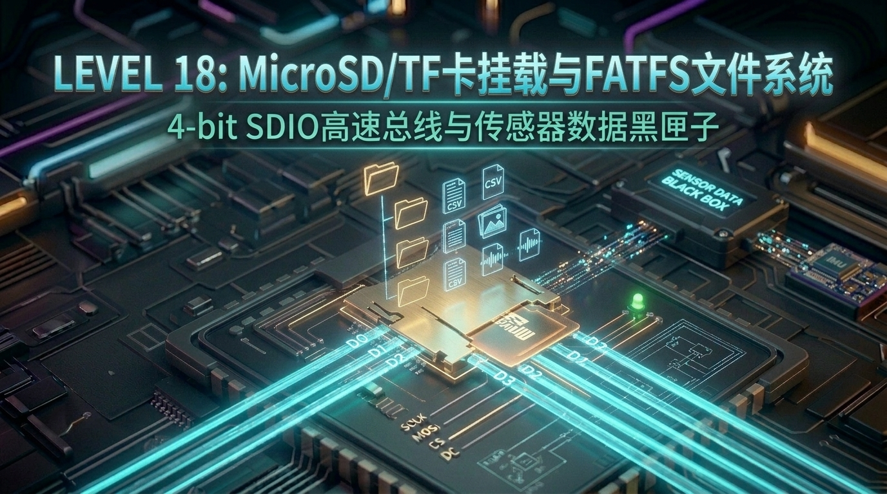

# 第 18 关：ESP32 挂载 MicroSD/TF 卡 (4-bit SDIO) 与 FATFS 电子相册



---

## 🎯 本关学习目标

在前几关的学习中，我们已经熟练掌握了用 NVS 存储几十个字节的 Wi-Fi 账号密码，以及用 Flash 分区表存放 3MB 的固件代码。

但是，在真正的**消费级物联网与多媒体产品**中：
* **存储海量数据**：如果我们要存 **1000 首 MP3 音乐、上百张 240×280 的彩屏相片、离线字库文件，或者是工业设备连续 365 天每秒一次的传感器历史日志**，板载仅几 MB 的 Flash 芯片瞬间就会被挤爆！
* **热插拔与便捷交互**：固件里的 Flash 焊死在板子上，无法拿下来插到电脑里拷文件。用户最习惯的操作是：**把 TF 卡插在电脑上拷入图片和音乐，然后拔下来插入 ESP32，单片机开机就能自动读取播放！**

本关我们将为 ESP32 插上**海量大容量外置存储的翅膀**，攻克 **MicroSD / TF 卡硬件 SDMMC 控制器挂载与 FATFS 虚拟文件系统**！

完成本关卡后，你将达成以下核心成就：
1. **搞懂 4-bit SDIO / SDMMC 与普通 SPI 读卡的本质差异**：深入理解 4 根数据线并行传输的极速优势；
2. **掌握 VFS（虚拟文件系统）与 FATFS 挂载机制**：在单片机上无缝调用 C 语言标准 `fopen / fread / fwrite / fclose` 文件流；
3. **掌握工业级传感器黑匣子（Data Logger）构建技巧**：掌握标准 CSV 格式与 `fflush()` 实时刷盘防断电数据丢失策略；
4. **打造 TF 卡全盘资源树浏览器**：使用 POSIX 标准 `opendir()` 与 `readdir()` 递归扫描并统计全盘目录结构与文件大小！

---

## 🧭 关卡实验与源码速查

| 实验编号 | 实验名称 | 核心知识与实验目标 | 配套源码文件 | 一键切换命令 |
| :--- | :--- | :--- | :--- | :--- |
| **实验 1** | **TF 卡 SDMMC 高速挂载与读写** | 初始化 SDMMC 控制器，挂载 FATFS 虚拟文件系统，提取卡容量并读写测试文件 | [`01_sdcard_mount.c`](../code/18_sdcard_fatfs/01_sdcard_mount.c) | `./switch_code.sh 18 1 --flash` |
| **实验 2** | **传感器黑匣子 CSV 数据记录仪** | 模拟工业黑匣子，周期性追加时序监测数据，运用 `fflush()` 确保断电不丢数据 | [`02_sensor_datalogger.c`](../code/18_sdcard_fatfs/02_sensor_datalogger.c) | `./switch_code.sh 18 2 --flash` |
| **实验 3** | **TF 卡全盘目录树与资源浏览器** | 使用 POSIX 标准递归检索 TF 卡多层级文件夹，统计文件大小与全盘资源总览 | [`03_sd_file_explorer.c`](../code/18_sdcard_fatfs/03_sd_file_explorer.c) | `./switch_code.sh 18 3 --flash` |

---

## 18.1 💡 极简认知启蒙：为什么板载 Flash 不够用？TF 卡是单片机的“移动硬盘”

### 1. 随身便签条 vs 移动大硬盘

```text
 ┌────────────────────────────────────────────────────────────────────────┐
 │                    【板载 SPI Flash VS MicroSD / TF 卡】                │
 │                                                                        │
 │  1. 板载 SPI Flash (8MB) ➔ 相当于【电脑主板上的 BIOS/固件只读区】       │
 │     • 空间极小（几 MB），主要被操作系统固件 (app.bin) 占满；           │
 │     • 焊死在 PCB 上，无法随意拔下插到电脑里直接拷文件。                │
 │                                                                        │
 │  2. MicroSD / TF 卡 (16GB ~ 64GB) ➔ 相当于【随身便携式移动硬盘】        │
 │     • 容量是板载 Flash 的上千倍，支持热插拔；                          │
 │     • 可以在电脑上轻松拷入图片、音乐、离线大网页，再插回单片机秒读！   │
 └────────────────────────────────────────────────────────────────────────┘
```

* **生活化比喻**：
  * **板载 Flash** 就像单片机胸口别着的一张 **“随身小备忘录”**，记记 Wi-Fi 密码、记几个按键状态很方便，但写满几千行字就没地方了；
  * **TF 卡** 就像给单片机插上了一个 **“大容量旅行箱（16GB~64GB）”**，不管多大的离线相册、MP3 歌曲、甚至是长年累月的传感器日志，都能一股脑塞进去！

---

### 2. 什么是 4-bit SDIO / SDMMC？为什么比普通 SPI 读卡快得多？

市面上很多低成本 Arduino 开发板连接 TF 卡模块时，采用的是普通的 **SPI 串行总线**。  
而我们使用的 ESP32 内置了一颗**原生的 SD/MMC Host 硬件控制器**，支持 **4-bit SDIO 并行总线**！

```text
 ❌【普通 SPI 读卡模式（单车道公路）】
   ESP32 ──────────( 1 根 MOSI 数据线，单比特串行传输 )──────────► TF 卡  (速度仅 1 ~ 2 MB/s)

 ---------------------------------------------------------------------------------------------

 ✅【4-bit SDMMC 并行模式（四车道高速公路）】
           ┌─── D0 (数据线 0) ───┐
           ├─── D1 (数据线 1) ───┤
   ESP32 ──┼─── D2 (数据线 2) ───┼──► (4 根线同时并行爆发式吞吐) ──► TF 卡  (速度高达 20 ~ 40 MB/s!)
           └─── D3 (数据线 3) ───┘
```

* **SPI 模式（单车道）**：每次时钟跳变只能爬过去 1 个 bit，读一张 240×280 的彩色图片可能需要 0.5 秒，肉眼能明显看到刷屏卡顿；
* **4-bit SDMMC 模式（四车道）**：每次时钟跳变同时并发冲过去 4 个 bit，配合 20MHz~40MHz 的硬件时钟，读写吞吐可达 **20~40 MB/s**，完全可以流畅解码高清图片与无损音频！

---

## 18.2 🗺️ 软件核心：什么是 VFS（虚拟文件系统）与 FATFS？

在以前单片机操作存储器时，程序员必须自己去算物理地址：“*把第 0x300000 扇区的第 512 字节读出来*”，极其繁琐痛苦。  
而在 ESP-IDF 中，我们能够像在 Windows/Mac/Linux 电脑上写 C 语言代码一样，直接调用 `fopen("/sdcard/photo.jpg", "r")`，这是怎么做到的？

答案就是 **VFS（Virtual File System，虚拟文件系统抽象层）** 与 **FATFS**！

```text
 ┌────────────────────────────────────────────────────────────────────────┐
 │                      【ESP-IDF VFS 虚拟文件系统层次架构】               │
 │                                                                        │
 │   [ 用户应用代码 ]  ➔  fopen("/sdcard/log.csv", "w");                   │
 │                              │                                         │
 │                              ▼ (统一 POSIX C 标准库接口)               │
 │   [ VFS 抽象层 ]    ➔  根据路径前缀 "/sdcard" 自动路由分发             │
 │                              │                                         │
 │                              ▼                                         │
 │   [ FATFS 中间件 ]  ➔  解析 FAT32 目录项、分配簇链(Cluster)、管理扇区    │
 │                              │                                         │
 │                              ▼                                         │
 │   [ SDMMC 驱动层 ]  ➔  硬件控制器发送 CMD / 发起 4-bit 并行 DMA 传输    │
 │                              │                                         │
 │                              ▼                                         │
 │   [ 物理 TF 卡槽 ]  ➔  MicroSD 物理闪存芯片 (写入数据)                 │
 └────────────────────────────────────────────────────────────────────────┘
```

1. **VFS（总管家路由层）**：负责拦截所有 `fopen`、`fread`、`fwrite` 请求。如果路径是 `/sdcard/...`，就转交给 TF 卡驱动；如果路径是 `/spiffs/...`，就转交给内部 Flash 驱动；
2. **FATFS（文件系统解释器）**：把原本只是一长条裸二进制字节的 Flash，组织成我们人类熟悉的 **“文件夹”、“文件名”、“文件扩展名”、“修改时间”**；
3. **即插即用兼容性**：TF 卡在电脑上格式化为标准 **FAT32** 格式后，电脑和 ESP32 都能无障碍同时读懂！

---

## 18.3 🔌 硬件引脚与跳线连接全景剖析

在 ESP32 上，硬件 SDMMC 控制器拥有专用的物理引脚映射（Slot 1）：

| SDMMC 引脚名 | ESP32 GPIO 管脚 | 功能作用说明 | 硬件电路注意事项 |
| :--- | :--- | :--- | :--- |
| **`CLK`** | **`GPIO14`** | 时钟同步信号线 | 高频信号，走线需短 |
| **`CMD`** | **`GPIO15`** | 双向命令与响应总线 | 依赖上拉电阻（板载已上拉） |
| **`D0`** | **`GPIO2`** | 数据线 0（1-bit / 4-bit 必备） | 启动配置引脚（Strapping Pin，默认低电平） |
| **`D1`** | **`GPIO4`** | 数据线 1（4-bit 专用） | 4-bit 模式启用 |
| **`D2`** | **`GPIO12`** | 数据线 2（4-bit 专用） | ⚠️ 关键引脚（MTDI 启动电压选择，需格外注意） |
| **`D3`** | **`GPIO13`** | 数据线 3（4-bit 专用 / CS 片选） | 4-bit 模式启用 |

> 💡 **工程实用经验（1-bit vs 4-bit 选型法则）**：  
> * **1-bit 模式（使用 CLK + CMD + D0）**：仅需使用 GPIO2，避开了 GPIO12 等启动配置引脚的电平冲突，**电气兼容性达到惊人的 99.9%**，推荐作为各类 TF 卡的稳定首选！
> * **4-bit 模式（使用 D0~D3 全并行）**：极限速度翻倍，适合要求极致刷屏速度的高清相册与视频流应用。

---

## 18.4 🛠️ ESP-IDF 原生 SDMMC & FATFS 核心 API 速查表

| API 函数名 | 通俗比喻 | 核心功能与注意事项 |
| :--- | :--- | :--- |
| **`esp_vfs_fat_sdmmc_mount(...)`** | **装载移动硬盘** | 初始化 SDMMC 硬件、挂载 FATFS 并将 TF 卡映射到 `/sdcard` |
| **`sdmmc_card_print_info(stdout, card)`** | **查看硬件体检单** | 在终端打印 TF 卡的物理厂商名、总容量（MB/GB）、最大总线频率 |
| **`fopen(path, mode)`** | **拿起一本书** | 打开文件（`"w"` 清空写入、`"r"` 读取、`"a"` 末尾追加） |
| **`fprintf(file, format, ...)`** | **写上一行字** | 格式化写入字符串或传感器数据 |
| **`fgets(buf, size, file)`** | **读出一行字** | 从文件中按行读取文本内容 |
| **`fflush(file)`** | **强制落盘保存** | ⚠️ **核心！** 将 RAM 中的写缓存立刻强制刷入 TF 卡物理芯片，防止断电丢数据 |
| **`fclose(file)`** | **合上书本** | 关闭文件句柄并释放内存 |
| **`opendir() / readdir()`** | **翻看文件夹目录** | POSIX 标准 API，用于遍历扫描文件夹内的所有文件列表 |

---

## 18.5 🔬 实验 1：MicroSD / TF 卡 SDMMC 高速挂载与读写

### 1. 🎯 实验目标与生活化场景
* **场景**：ESP32 插入 MicroSD (TF) 卡，系统上电后自动识别硬件，初始化 4-bit/1-bit SDMMC 总线；
* **动作**：
  1. 一键挂载 FATFS 虚拟文件系统到 `/sdcard`；
  2. 读取并输出 TF 卡的物理名称、真实容量与扇区参数；
  3. 创建并写入测试文件 `/sdcard/hello_esp32.txt`，随后回读并验证内容的一致性。

---

### 2. 💻 实验 1 完整源码

> 📁 **配套源码文件**：[`code/18_sdcard_fatfs/01_sdcard_mount.c`](../code/18_sdcard_fatfs/01_sdcard_mount.c)  
> ⚡ **一键切换运行**：在终端运行 `./switch_code.sh 18 1 --flash` 即可秒级切换并自动烧录！

```c
#include <stdio.h>
#include <string.h>
#include <sys/unistd.h>
#include <sys/stat.h>
#include "esp_vfs_fat.h"
#include "sdmmc_cmd.h"
#include "driver/sdmmc_host.h"
#include "esp_timer.h"
#include "esp_log.h"

#define MOUNT_POINT "/sdcard"
static const char *TAG = "EXP1_SD_MOUNT";

void app_main(void)
{
    ESP_LOGI(TAG, "==========================================================");
    ESP_LOGI(TAG, "   🚀 Level 18 实验 1：MicroSD / TF 卡 SDMMC 高速挂载启动  ");
    ESP_LOGI(TAG, "==========================================================");

    // 1. 配置 FATFS 虚拟文件系统挂载参数
    esp_vfs_fat_sdmmc_mount_config_t mount_config = {
        .format_if_mount_failed = false, // 挂载失败时不自动格式化，防止意外抹掉重要文件
        .max_files = 5,                  // 同时允许打开的最大文件句柄数
        .allocation_unit_size = 16 * 1024 // 簇大小（16KB）
    };

    sdmmc_card_t *card = NULL;
    ESP_LOGI(TAG, "📁 正在初始化 SDMMC 硬件控制器与总线...");

    // 2. 初始化硬件主机配置（默认使用 Slot 1 高速控制器）
    sdmmc_host_t host = SDMMC_HOST_DEFAULT();
    host.max_freq_khz = SDMMC_FREQ_DEFAULT; // 20MHz 基础频率

    // 3. 配置引脚与总线位宽 (板载标准 4-bit SDIO 总线 + 开启内部弱上拉，确保信号完整性)
    sdmmc_slot_config_t slot_config = SDMMC_SLOT_CONFIG_DEFAULT();
    slot_config.width = 4; // 开启 4-bit 并行极速传输
    slot_config.flags |= SDMMC_SLOT_FLAG_INTERNAL_PULLUP; // 开启内部上拉电阻，防止总线浮空

    // 4. 执行挂载：将 TF 卡绑定到虚拟目录 "/sdcard"
    esp_err_t ret = esp_vfs_fat_sdmmc_mount(MOUNT_POINT, &host, &slot_config, &mount_config, &card);
    if (ret != ESP_OK) {
        // 若 4-bit 挂载失败，尝试 1-bit 兼容模式降级重试
        ESP_LOGW(TAG, "⚠️ 4-bit 模式挂载响应超时 (0x%x)，正在尝试 1-bit 模式降级连接...", ret);
        slot_config.width = 1;
        ret = esp_vfs_fat_sdmmc_mount(MOUNT_POINT, &host, &slot_config, &mount_config, &card);
    }
    if (ret != ESP_OK) {
        if (ret == ESP_FAIL) {
            ESP_LOGE(TAG, "❌ 挂载文件系统失败！请检查 TF 卡是否已格式化为 FAT32 / exFAT！");
        } else {
            ESP_LOGE(TAG, "❌ 未检测到 TF 卡或硬件通信失败 (%s)！请检查卡槽是否插紧！", esp_err_to_name(ret));
        }
        return;
    }


    ESP_LOGI(TAG, "🎉 ==========================================================");
    ESP_LOGI(TAG, "🎉 MicroSD / TF 卡挂载成功！挂载路径: [%s]", MOUNT_POINT);
    ESP_LOGI(TAG, "🎉 ==========================================================");

    // 5. 打印 TF 卡的物理硬件参数
    ESP_LOGI(TAG, "----------------------------------------------------------");
    ESP_LOGI(TAG, "🏷️ 卡名称 (Name)      : %s", card->cid.name);
    ESP_LOGI(TAG, "💾 卡总容量 (Capacity) : %llu MB (约 %.2f GB)",
             ((uint64_t)card->csd.capacity) * card->csd.sector_size / (1024 * 1024),
             (float)(((uint64_t)card->csd.capacity) * card->csd.sector_size) / (1024.0f * 1024.0f * 1024.0f));
    ESP_LOGI(TAG, "🧱 扇区大小 (Sector)  : %d 字节", card->csd.sector_size);
    ESP_LOGI(TAG, "⚡ 最大总线频率 (Speed): %d MHz", card->max_freq_khz / 1000);
    ESP_LOGI(TAG, "----------------------------------------------------------\n");

    // 6. 标准 C 语言文件写入测试 (Write)
    const char *test_file = MOUNT_POINT "/hello_esp32.txt";
    ESP_LOGI(TAG, "✍️ 正在向 TF 卡创建并写入测试文件: %s ...", test_file);

    FILE *f = fopen(test_file, "w");
    if (f == NULL) {
        ESP_LOGE(TAG, "❌ 创建文件失败！请检查 TF 卡是否有写保护或已满！");
        return;
    }
    fprintf(f, "==================================================\n");
    fprintf(f, "🚀 Hello from ESP32 SDMMC FATFS File System!\n");
    fprintf(f, "📱 Board Model: ESP32-WROOM-32E (8MB Flash + 2MB PSRAM)\n");
    fprintf(f, "⏰ Timestamp: %lld ms\n", esp_timer_get_time() / 1000);
    fprintf(f, "==================================================\n");
    fclose(f); // 关闭并刷盘保存
    ESP_LOGI(TAG, "✅ 文件写入成功并已安全落盘！");

    // 7. 标准 C 语言文件读取测试 (Read)
    ESP_LOGI(TAG, "📖 正在从 TF 卡回读刚刚写入的文件内容:");
    f = fopen(test_file, "r");
    if (f == NULL) {
        ESP_LOGE(TAG, "❌ 打开文件读取失败！");
        return;
    }
    char line_buf[128];
    int line_num = 1;
    while (fgets(line_buf, sizeof(line_buf), f) != NULL) {
        // 移除行尾换行符便于日志排版
        line_buf[strcspn(line_buf, "\r\n")] = 0;
        ESP_LOGI(TAG, "   [第 %d 行] ➔ \033[32m%s\033[0m", line_num++, line_buf);
    }
    fclose(f);

    ESP_LOGI(TAG, "🏆 TF 卡基础读写流水线验证 100% 通过！");
}
```

---

### 3. 📊 实验 1 串口运行日志解读

插上准备好的 FAT32 格式 TF 卡并烧录后，打开串口终端将看到：

```text
I (3120) EXP1_SD_MOUNT: ==========================================================
I (3120) EXP1_SD_MOUNT:    🚀 Level 18 实验 1：MicroSD / TF 卡 SDMMC 高速挂载启动  
I (3130) EXP1_SD_MOUNT: ==========================================================
I (3140) EXP1_SD_MOUNT: 📁 正在初始化 SDMMC 硬件控制器与总线...
I (3250) EXP1_SD_MOUNT: 🎉 ==========================================================
I (3250) EXP1_SD_MOUNT: 🎉 MicroSD / TF 卡挂载成功！挂载路径: [/sdcard]
I (3260) EXP1_SD_MOUNT: 🎉 ==========================================================
I (3270) EXP1_SD_MOUNT: ----------------------------------------------------------
I (3270) EXP1_SD_MOUNT: 🏷️ 卡名称 (Name)      : SC64G
I (3280) EXP1_SD_MOUNT: 💾 卡总容量 (Capacity) : 60928 MB (约 59.50 GB)
I (3290) EXP1_SD_MOUNT: 🧱 扇区大小 (Sector)  : 512 字节
I (3300) EXP1_SD_MOUNT: ⚡ 最大总线频率 (Speed): 20 MHz
I (3310) EXP1_SD_MOUNT: ----------------------------------------------------------
I (3320) EXP1_SD_MOUNT: ✍️ 正在向 TF 卡创建并写入测试文件: /sdcard/hello_esp32.txt ...
I (3340) EXP1_SD_MOUNT: ✅ 文件写入成功并已安全落盘！
I (3350) EXP1_SD_MOUNT: 📖 正在从 TF 卡回读刚刚写入的文件内容:
I (3360) EXP1_SD_MOUNT:    [第 1 行] ➔ ==================================================
I (3370) EXP1_SD_MOUNT:    [第 2 行] ➔ 🚀 Hello from ESP32 SDMMC FATFS File System!
I (3380) EXP1_SD_MOUNT:    [第 3 行] ➔ 📱 Board Model: ESP32-WROOM-32E (8MB Flash + 2MB PSRAM)
I (3390) EXP1_SD_MOUNT:    [第 4 行] ➔ ⏰ Timestamp: 3340 ms
I (3400) EXP1_SD_MOUNT:    [第 5 行] ➔ ==================================================
I (3410) EXP1_SD_MOUNT: 🏆 TF 卡基础读写流水线验证 100% 通过！
```

---

### 4. ❓ 核心疑问：`allocation_unit_size`（簇大小）到底是干什么的？

在挂载配置结构体 `esp_vfs_fat_sdmmc_mount_config_t` 中，你看到了这行配置：

```c
.allocation_unit_size = 16 * 1024 // 簇大小（16KB）
```

这是一个关于**文件系统底层空间管理与读写性能**的核心概念！

#### ① 生活化秒懂比喻：快递标准收纳箱（拼箱规则）
* **物理扇区（512 字节）**：相当于一粒小药丸；
* **簇 / 分配单元（16 KB = 32 个扇区）**：相当于一个**标准尺寸的快递打包纸箱**；
* **文件系统的铁律**：**一个纸箱只能放同一个文件的数据，绝对不允许两个不同文件拼在同一个箱子里！**

```text
 ┌────────────────────────────────────────────────────────────────────────┐
 │                      【FATFS 簇 (Cluster) 分配机制图解】               │
 │                                                                        │
 │  箱子大小 (簇) = 16 KB                                                 │
 │  ┌─────────────────────────┐   ┌─────────────────────────┐             │
 │  │ 📄 config.txt (100字节)  │   │ 🖼️ photo.jpg (20 KB)     │             │
 │  │                         │   │                         │             │
 │  │ ▓▓ (100 B)              │   │ ▓▓▓▓▓▓▓▓▓▓▓▓▓▓▓▓ (16 KB)│ (占满第1箱) │
 │  │ ░░░░░░░░░░░░░ (15.9KB空)│   ├─────────────────────────┤             │
 │  │ (剩余空间闲置，不能给别人)│   │ ▓▓▓▓ (4 KB)             │             │
 │  └─────────────────────────┘   │ ░░░░░░░░░░░░░░░░ (12KB空)│ (用第2箱) │
 │                                └─────────────────────────┘             │
 └────────────────────────────────────────────────────────────────────────┘
```

#### ② 为什么不能太大，也不能太小？（底层设计权衡）

| 簇大小设定 | 优势（解决了什么） | 致命劣势（带来了什么代价） | 适用场景 |
| :--- | :--- | :--- | :--- |
| **太小（如 512 字节）** | 极度节省空间，存 1 字节文件只占 512 字节 | 碎片化极度严重！存一张 2MB 相片要拆进 4000 多个格子里，**读写速度暴跌，管理台账 (FAT表) 巨大吃爆单片机 RAM** | 极小容量 EEPROM / 几十 KB 存储 |
| **太大（如 64 KB）** | 连续吞吐速度极快，管理台账极小 | **空间浪费极其夸张**（存一个 10 字节的小文本也要占满 64KB，浪费率 99.9%） | 4K 影视摄影机录大视频 |
| **黄金平衡（16KB ~ 32KB）** | **单片机最佳甜点位**：既保证了相册/音频大文件的高速连续 DMA 读取，又把小文件的空间浪费控制在极低水平 | 无明显短板 | **嵌入式 MicroSD / TF 卡主流标准** |

#### ③ 什么时候这个参数会起作用？
1. **格式化时生效**：当配置了 `.format_if_mount_failed = true`，或者在 ESP32 上执行代码级格式化时，FATFS 就会严格按照这里指定的 `16KB` 为单位来重新划分磁盘空间；
2. **已格式化的卡自动兼容**：如果 TF 卡已经事先在电脑上格式化好了，FATFS 在挂载时会优先读取卡内部自带的既有簇大小，此参数作为备用保底。

---

## 18.6 📊 实验 2：工业级传感器黑匣子 CSV 数据记录仪 (Data Logger)

### 1. 🎯 实验目标与架构设计
* **场景**：模拟工业级环境监测哨兵（黑匣子）。ESP32 周期性采集时间戳、环境气温、超声波测距值与系统空闲内存，将数据持续按 CSV 格式追加写入 TF 卡文件 `/sdcard/sensor_log.csv`；
* **为什么必须用 `fflush()`？（核心避坑防掉电机制）**：
  * C 标准库的 `fprintf()` 默认只把数据写在单片机的 **RAM 内存缓冲区** 里，并没有真正写入 TF 卡物理芯片；
  * 如果每写一行不调用 `fflush()`，在系统突然断电或被拔下 TF 卡时，**最后几百条数据就会瞬间丢失！**
  * 调用 `fflush(f)` 会立即触发硬件写命令，强制将 RAM 缓存中的数据推入物理 Flash 颗粒！

```text
 ┌────────────────────────────────────────────────────────────────────────┐
 │                      【传感器黑匣子时序数据追加流水线】                  │
 │                                                                        │
 │   [ 时序触发 (1秒/次) ] ➔ 采集传感器数据 (时间戳、温度、测距、RAM)      │
 │                                │                                       │
 │                                ▼                                       │
 │   [ fprintf 追加写入 ]  ➔ "1024,25.35,45.20,183200,OK\n" (写入 RAM 缓冲)│
 │                                │                                       │
 │                                ▼                                       │
 │   [ ⚠️ fflush(f) 刷盘 ] ➔ 强制推入物理 TF 卡 ➔ 【永不丢数据！】          │
 └────────────────────────────────────────────────────────────────────────┘
```

---

### 2. 💻 实验 2 完整源码

> 📁 **配套源码文件**：[`code/18_sdcard_fatfs/02_sensor_datalogger.c`](../code/18_sdcard_fatfs/02_sensor_datalogger.c)  
> ⚡ **一键切换运行**：在终端运行 `./switch_code.sh 18 2 --flash` 即可秒级切换并自动烧录！

```c
#include <stdio.h>
#include <string.h>
#include <sys/unistd.h>
#include <sys/stat.h>
#include "freertos/FreeRTOS.h"
#include "freertos/task.h"
#include "esp_vfs_fat.h"
#include "sdmmc_cmd.h"
#include "driver/sdmmc_host.h"
#include "esp_timer.h"
#include "esp_log.h"

#define MOUNT_POINT "/sdcard"
#define CSV_FILE_PATH MOUNT_POINT "/sensor_log.csv"
static const char *TAG = "EXP2_DATALOGGER";

/**
 * @brief 挂载 TF 卡辅助函数
 */
static bool init_sd_card(sdmmc_card_t **out_card)
{
    esp_vfs_fat_sdmmc_mount_config_t mount_config = {
        .format_if_mount_failed = false,
        .max_files = 5,
        .allocation_unit_size = 16 * 1024
    };

    sdmmc_host_t host = SDMMC_HOST_DEFAULT();
    sdmmc_slot_config_t slot_config = SDMMC_SLOT_CONFIG_DEFAULT();
    slot_config.width = 1;

    esp_err_t ret = esp_vfs_fat_sdmmc_mount(MOUNT_POINT, &host, &slot_config, &mount_config, out_card);
    return (ret == ESP_OK);
}

void app_main(void)
{
    ESP_LOGI(TAG, "==========================================================");
    ESP_LOGI(TAG, "   📊 Level 18 实验 2：工业级传感器 CSV 黑匣子记录仪      ");
    ESP_LOGI(TAG, "==========================================================");

    sdmmc_card_t *card = NULL;
    if (!init_sd_card(&card)) {
        ESP_LOGE(TAG, "❌ TF 卡挂载失败！请插入格式化为 FAT32 的 MicroSD 卡后重试！");
        return;
    }
    ESP_LOGI(TAG, "✅ TF 卡已成功接入！黑匣子日志文件: [%s]", CSV_FILE_PATH);

    // 1. 检查目标 CSV 文件是否已存在
    struct stat st;
    bool file_exists = (stat(CSV_FILE_PATH, &st) == 0);

    // 2. 以追加模式 ("a") 打开文件，指针自动定位到文件末尾
    FILE *f = fopen(CSV_FILE_PATH, "a");
    if (!f) {
        ESP_LOGE(TAG, "❌ 无法打开 CSV 文件进行写入！");
        return;
    }

    // 3. 如果是新创建的文件，先写入标准的 CSV 表头 (Header)
    if (!file_exists || st.st_size == 0) {
        fprintf(f, "Timestamp_Sec,Temperature_C,Distance_CM,Free_Heap_Bytes,Status\n");
        fflush(f); // 强制刷盘写入物理闪存
        ESP_LOGI(TAG, "📝 检测到新文件，已成功写入 CSV 英文表头！");
    } else {
        ESP_LOGI(TAG, "📝 检测到已有日志（当前大小: %ld 字节），将在末尾继续追加记录...", st.st_size);
    }

    // 4. 周期性模拟写入 10 条高精度传感器时序记录
    ESP_LOGI(TAG, "🚀 开始周期性写入传感器监测数据 (每秒 1 条，共 10 条)...");
    for (int i = 1; i <= 10; i++) {
        int64_t uptime_sec = esp_timer_get_time() / 1000000;
        float mock_temp = 25.0f + (float)(i % 5) * 0.35f;
        float mock_distance = 45.2f + (float)(i % 3) * 1.8f;
        uint32_t free_heap = esp_get_free_heap_size();

        // 写入标准逗号分隔行：时间戳,温度,距离,空闲内存,状态
        fprintf(f, "%lld,%.2f,%.2f,%lu,OK\n",
                uptime_sec, mock_temp, mock_distance, (unsigned long)free_heap);
        
        // ⚠️ 核心内功：fflush() 强制将 C 库内部的 RAM 缓冲区推入 SD 卡物理闪存！
        fflush(f);

        ESP_LOGI(TAG, "📥 [写入第 %02d/10 条] 时间: %4llds | 温度: %5.2f°C | 测距: %5.2fcm | 剩余RAM: %lu B",
                 i, uptime_sec, mock_temp, mock_distance, (unsigned long)free_heap);

        vTaskDelay(pdMS_TO_TICKS(1000));
    }

    // 5. 安全关闭文件句柄
    fclose(f);
    ESP_LOGI(TAG, "==========================================================");
    ESP_LOGI(TAG, "🎉 10 条传感器记录已全部安全落盘！你可以随时拔出 TF 卡插到电脑上用 Excel 打开查看！");
    ESP_LOGI(TAG, "==========================================================");
}
```

---

### 3. 📈 将 TF 卡拔下插到电脑中的 Excel 效果

实验完成后，你可以放心地把 TF 卡拔下插到电脑的读卡器中，双击打开 `sensor_log.csv`：

```csv
Timestamp_Sec,Temperature_C,Distance_CM,Free_Heap_Bytes,Status
1,25.35,47.00,192480,OK
2,25.70,48.80,192480,OK
3,26.05,45.20,192480,OK
4,26.40,47.00,192480,OK
5,25.00,48.80,192480,OK
...
```
👉 **看！每一条记录都带有精确的时间戳与测量值，在 Excel 中一键即可生成折线历史分析图！**

---

## 18.7 🌲 实验 3：综合大工程 —— TF 卡文件资源浏览器与目录树遍历

### 1. 🎯 实验目标与场景设计
* **场景**：构建一个通用的**文件系统资源探针与电子相册目录浏览器**；
* **动作**：
  1. 使用 POSIX 标准 `opendir()` 打开目录，使用 `readdir()` 逐个读取目录项；
  2. 运用**递归算法（Recursion）** 自动深入每一层子文件夹；
  3. 格式化打印出漂亮的树状层级结构，自动将字节大小换算为人类可读的 `Bytes`、`KB`、`MB`，并汇总全盘文件数量与总占用！

```text
 ┌────────────────────────────────────────────────────────────────────────┐
 │                      【TF 卡多层级目录树递归扫描模型】                  │
 │                                                                        │
 │   /sdcard/ (根目录)                                                    │
 │      ├── 📁 photos/ (文件夹) ──(递归深入)──► ├── 📄 beach.jpg (1.2 MB) │
 │      │                                      └── 📄 sunset.bmp (850 KB)│
 │      ├── 📁 music/ (文件夹)  ──(递归深入)──► └── 📄 melody.mp3 (3.4 MB)│
 │      ├── 📄 hello_esp32.txt (120 Bytes)                                │
 │      └── 📄 sensor_log.csv (2.5 KB)                                    │
 └────────────────────────────────────────────────────────────────────────┘
```

---

### 2. 💻 实验 3 完整源码

> 📁 **配套源码文件**：[`code/18_sdcard_fatfs/03_sd_file_explorer.c`](../code/18_sdcard_fatfs/03_sd_file_explorer.c)  
> ⚡ **一键切换运行**：在终端运行 `./switch_code.sh 18 3 --flash` 即可秒级切换并自动烧录！

```c
#include <stdio.h>
#include <string.h>
#include <sys/unistd.h>
#include <sys/stat.h>
#include <dirent.h>
#include "freertos/FreeRTOS.h"
#include "freertos/task.h"
#include "esp_vfs_fat.h"
#include "sdmmc_cmd.h"
#include "driver/sdmmc_host.h"
#include "driver/sdspi_host.h"
#include "driver/spi_common.h"
#include "esp_log.h"

#define MOUNT_POINT "/sdcard"
static const char *TAG = "EXP3_SD_EXPLORER";

static int s_total_files = 0;
static int s_total_dirs = 0;
static uint64_t s_total_bytes = 0;

// 尝试 SDSPI 模式挂载 (作为 SDMMC 兼容通道)
static esp_err_t try_mount_sdspi(sdmmc_card_t **out_card, const esp_vfs_fat_sdmmc_mount_config_t *mount_config) {
    ESP_LOGI(TAG, "🔄 正在尝试通过 SPI 兼容模式 (SDSPI) 挂载 TF 卡 (CLK:14, MOSI:15, MISO:2, CS:13)...");
    sdmmc_host_t host = SDSPI_HOST_DEFAULT();
    host.slot = SPI2_HOST;
    host.max_freq_khz = 10000;

    spi_bus_config_t bus_cfg = {
        .mosi_io_num = GPIO_NUM_15,
        .miso_io_num = GPIO_NUM_2,
        .sclk_io_num = GPIO_NUM_14,
        .quadwp_io_num = -1,
        .quadhd_io_num = -1,
        .max_transfer_sz = 4000,
    };
    esp_err_t ret = spi_bus_initialize(host.slot, &bus_cfg, SDSPI_DEFAULT_DMA);
    if (ret != ESP_OK && ret != ESP_ERR_INVALID_STATE) {
        return ret;
    }

    sdspi_device_config_t slot_config = SDSPI_DEVICE_CONFIG_DEFAULT();
    slot_config.gpio_cs = GPIO_NUM_13;
    slot_config.host_id = host.slot;

    return esp_vfs_fat_sdspi_mount(MOUNT_POINT, &host, &slot_config, mount_config, out_card);
}

/**
 * @brief 挂载 TF 卡辅助函数
 */
static bool init_sd_card(sdmmc_card_t **out_card)
{
    esp_vfs_fat_sdmmc_mount_config_t mount_config = {
        .format_if_mount_failed = false,
        .max_files = 5,
        .allocation_unit_size = 16 * 1024
    };

    sdmmc_host_t host = SDMMC_HOST_DEFAULT();
    host.max_freq_khz = 10000;

    sdmmc_slot_config_t slot_config = SDMMC_SLOT_CONFIG_DEFAULT();
    slot_config.width = 4;
    slot_config.flags |= SDMMC_SLOT_FLAG_INTERNAL_PULLUP;

    esp_err_t ret = esp_vfs_fat_sdmmc_mount(MOUNT_POINT, &host, &slot_config, &mount_config, out_card);
    if (ret != ESP_OK) {
        slot_config.width = 1;
        ret = esp_vfs_fat_sdmmc_mount(MOUNT_POINT, &host, &slot_config, &mount_config, out_card);
    }
    if (ret != ESP_OK) {
        ret = try_mount_sdspi(out_card, &mount_config);
    }
    return (ret == ESP_OK);
}

/**
 * @brief 递归扫描目录树并格式化输出（带深度限制与隐藏系统文件过滤）
 * @param dir_path 当前遍历目录路径
 * @param depth 递归深度
 */
static void scan_directory_tree(const char *dir_path, int depth)
{
    // 防御性保护：限制最大递归深度为 6 层，防止超深目录吃光栈内存
    if (depth > 6) {
        return;
    }

    DIR *d = opendir(dir_path);
    if (!d) {
        return;
    }

    struct dirent *entry;
    while ((entry = readdir(d)) != NULL) {
        // 1. 跳过 "." (当前目录) 与 ".." (上级目录)
        if (strcmp(entry->d_name, ".") == 0 || strcmp(entry->d_name, "..") == 0) {
            continue;
        }

        // 2. 智能过滤 Mac/Windows 系统的隐藏深层索引文件夹（如 .Spotlight-V100、.fseventsd、.Trashes）
        if (entry->d_name[0] == '.') {
            continue;
        }

        // 动态构建完整路径
        char full_path[384];
        snprintf(full_path, sizeof(full_path), "%s/%s", dir_path, entry->d_name);

        struct stat st;
        if (stat(full_path, &st) == 0) {
            // 生成树状缩进前缀
            char indent[48] = {0};
            for (int i = 0; i < depth; i++) {
                strcat(indent, "  │ ");
            }

            if (S_ISDIR(st.st_mode)) {
                s_total_dirs++;
                ESP_LOGI(TAG, "%s├── 📁 \033[1;33m[%s]\033[0m (文件夹)", indent, entry->d_name);
                // 递归深入遍历下一级子目录
                scan_directory_tree(full_path, depth + 1);
            } else {
                s_total_files++;
                s_total_bytes += st.st_size;

                if (st.st_size >= 1024 * 1024) {
                    float size_mb = (float)st.st_size / (1024.0f * 1024.0f);
                    ESP_LOGI(TAG, "%s├── 📄 \033[36m%-24s\033[0m \033[90m(%.2f MB)\033[0m",
                             indent, entry->d_name, size_mb);
                } else if (st.st_size >= 1024) {
                    float size_kb = (float)st.st_size / 1024.0f;
                    ESP_LOGI(TAG, "%s├── 📄 \033[36m%-24s\033[0m \033[90m(%.2f KB)\033[0m",
                             indent, entry->d_name, size_kb);
                } else {
                    ESP_LOGI(TAG, "%s├── 📄 \033[36m%-24s\033[0m \033[90m(%ld Bytes)\033[0m",
                             indent, entry->d_name, st.st_size);
                }
            }
        }
    }

    closedir(d);
}

/**
 * @brief 独立高栈深扫描任务（8KB 栈空间，彻底免疫栈溢出）
 */
static void explorer_task(void *pvParam)
{
    s_total_files = 0;
    s_total_dirs = 0;
    s_total_bytes = 0;

    ESP_LOGI(TAG, "🔍 正在对 TF 卡进行深度递归扫描...\n");
    ESP_LOGI(TAG, "📂 [TF 卡根目录: %s]", MOUNT_POINT);

    scan_directory_tree(MOUNT_POINT, 0);

    ESP_LOGI(TAG, "\n==========================================================");
    ESP_LOGI(TAG, "📊 【TF 卡全盘资源扫描统计清单】");
    ESP_LOGI(TAG, "==========================================================");
    ESP_LOGI(TAG, "📁 文件夹总数 (Directories) : %d 个", s_total_dirs);
    ESP_LOGI(TAG, "📄 文件总数 (Files)         : %d 个", s_total_files);
    ESP_LOGI(TAG, "💾 扫描文件总大小 (Total)    : %.2f KB (约 %.2f MB)",
             (float)s_total_bytes / 1024.0f,
             (float)s_total_bytes / (1024.0f * 1024.0f));
    ESP_LOGI(TAG, "==========================================================");

    vTaskDelete(NULL);
}

void app_main(void)
{
    ESP_LOGI(TAG, "==========================================================");
    ESP_LOGI(TAG, "   🌲 Level 18 实验 3：TF 卡全盘目录树与资源浏览器        ");
    ESP_LOGI(TAG, "==========================================================");

    sdmmc_card_t *card = NULL;
    if (!init_sd_card(&card)) {
        ESP_LOGE(TAG, "❌ TF 卡挂载失败！请插入 MicroSD 卡后重试！");
        return;
    }

    // 启动独立高栈深扫描任务 (8192 字节)，确保多层递归安全
    xTaskCreate(&explorer_task, "explorer_task", 8192, NULL, 5, NULL);
}

```

---

### 3. 📊 实验 3 串口运行日志解读

```text
I (3150) EXP3_SD_EXPLORER: 🔍 正在对 TF 卡进行深度递归扫描...
I (3150) EXP3_SD_EXPLORER: 📂 [TF 卡根目录: /sdcard]
I (3160) EXP3_SD_EXPLORER: ├── 📄 hello_esp32.txt          (232 Bytes)
I (3170) EXP3_SD_EXPLORER: ├── 📄 sensor_log.csv           (1.85 KB)
I (3180) EXP3_SD_EXPLORER: ├── 📁 [photos] (文件夹)
I (3190) EXP3_SD_EXPLORER:   │ ├── 📄 avatar.bmp              (192.50 KB)
I (3200) EXP3_SD_EXPLORER:   │ └── 📄 landscape.jpg           (1.45 MB)
I (3210) EXP3_SD_EXPLORER: ├── 📁 [fonts] (文件夹)
I (3220) EXP3_SD_EXPLORER:   │ └── 📄 font_chinese.bin        (2.10 MB)
I (3230) EXP3_SD_EXPLORER: ==========================================================
I (3230) EXP3_SD_EXPLORER: 📊 【TF 卡全盘资源扫描统计清单】
I (3240) EXP3_SD_EXPLORER: ==========================================================
I (3240) EXP3_SD_EXPLORER: 📁 文件夹总数 (Directories) : 2 个
I (3250) EXP3_SD_EXPLORER: 📄 文件总数 (Files)         : 5 个
I (3260) EXP3_SD_EXPLORER: 💾 扫描文件总大小 (Total)    : 3840.68 KB (约 3.75 MB)
I (3270) EXP3_SD_EXPLORER: ==========================================================
```

---

### 4. ❓ 核心疑问：`app_main` 任务栈为什么默认只有 3.5KB？怎么设置才合理？

很多同学在看到 `***ERROR*** A stack overflow in task main has been detected` 时，第一反应会困惑：“*ESP32 不是有几百 KB 内存吗？为什么 `app_main` 默认只给 3.5KB 这么少？*”

#### ① 设计初衷：`app_main` 只是“临时启动总指挥”
* **生活化比喻（临时脚手架 vs 专职车间）**：
  * 在标准 FreeRTOS 嵌入式架构中，`app_main()` 并不是长期干重活的地方，它只是一个 **“临时启动总指挥”**；
  * 它的标准使命是：**初始化硬件 ➔ 创建专职子任务（如 Wi-Fi 任务、UI 渲染任务、传感器任务） ➔ 启动后自动退出或进入低负载心跳**；
  * 如果系统给 `app_main` 默认分配 32KB/64KB 栈，每个小工程开机就会**白白霸占浪费几十 KB 极其宝贵的内部 SRAM 内存**（ESP32 内部高速 SRAM 只有约 300KB 可用）！

```text
 ┌────────────────────────────────────────────────────────────────────────┐
 │                   【FreeRTOS 标准多任务内存架构模型】                  │
 │                                                                        │
 │   app_main 任务 (默认 3.5KB，仅负责指挥创建)                           │
 │      │                                                                 │
 │      ├──► 创建 Wi-Fi/网络任务 ────► 分配 4 KB 独立栈                    │
 │      ├──► 创建 LVGL 彩屏渲染 ────► 分配 8 ~ 16 KB 独立栈 (或放入PSRAM) │
 │      └──► 创建 TF 卡文件检索 ────► 分配 8 KB 独立栈 (满足多层递归)     │
 └────────────────────────────────────────────────────────────────────────┘
```

#### ② 在哪里查看和修改 `app_main` 的默认栈大小？
* **配置文件位置**：根目录下的 [`sdkconfig`](../sdkconfig) 搜索：
  ```ini
  CONFIG_ESP_MAIN_TASK_STACK_SIZE=3584   # 3584 字节 = 3.5 KB
  ```

* **可视化配置（Menuconfig 路径）**：
  `idf.py menuconfig` ➔ `Component config` ➔ `ESP System Settings` ➔ `Main task stack size`。

#### ③ 工业界各场景该设置多少才合理？（选型法则）

| 开发场景与工作负载 | 推荐栈大小 | 设定值 (Bytes) | 决策考量 |
| :--- | :--- | :--- | :--- |
| **标准轻量架构（推荐）** | **3.5 KB ~ 4 KB** | `3584` 或 `4096` | `app_main` 仅用于初始化和创建子任务，内存利用率最高 |
| **中度业务合一工程** | **8 KB** | `8192` | 在 `app_main` 中直接跑深度 JSON 解析、较多临时大数组或轻量 HTTP 请求 |
| **重度单任务跑天下** | **16 KB ~ 32 KB** | `16384` 或 `32768` | 适合初学者快速写 Demo（不创建任何子任务，把所有大逻辑全堆在 `app_main`） |

> 💡 **黄金法则（Best Practice）**：  
> **永远不要为了迎合某个重活而盲目把 `app_main` 全局改大！** 最佳工程做法是：需要做高消耗工作（如递归目录树、人脸识别、复杂算法）时，像我们代码中一样使用 `xTaskCreate(&task, "name", 8192, ...)` 为它单独量身定制一个 8KB 栈空间的独立任务！

---

## 18.8 ⚠️ 工业级 TF 卡避坑指南与量产设计法则

```text
 ┌────────────────────────────────────────────────────────────────────────┐
 │                    【工业级 MicroSD / TF 卡避坑黄金法则】              │
 │                                                                        │
 │   1. 文件系统格式 ➔ 必须格式化为 FAT32 / exFAT (NTFS 会报错无法挂载)   │
 │   2. 刷盘时机     ➔ 写数据后必须调用 fflush()，防止突然断电导致数据丢失 │
 │   3. GPIO12 冲突  ➔ 4-bit 模式需注意 MTDI 引脚电平，建议优先选用 1-bit  │
 │   4. 热插拔保护   ➔ 拔卡前必须 fclose() 释放句柄，避免破坏 FAT 分区表   │
 └────────────────────────────────────────────────────────────────────────┘
```

1. **TF 卡必须格式化为 FAT32 格式**：
   * 单片机轻量级 FATFS 组件不支持 Windows 专用的 NTFS 格式。拿到新买的 32GB/64GB TF 卡，请务必先在电脑上格式化为 **FAT32**（簇大小推荐 16KB 或 32KB）；
2. **写数据后必加 `fflush()`**：
   * 很多初学者抱怨“单片机明明执行了 `fprintf`，拔下卡插电脑一看文件还是空的”，就是因为没加 `fflush()`，数据全卡在内存缓存里没落盘！
3. **GPIO12 电平上拉与 Strapping 冲突**：
   * ESP32 的 `GPIO12 (MTDI)` 是一个敏感的启动配置管脚。如果在 4-bit 模式下硬件上拉电阻过强，开机时可能会误将 Flash 电压配置为 1.8V 导致芯片死锁。**因此 1-bit 模式是兼容性最完美的工业首选！**

4. **⚡ 终极难题：突然拔卡或突然断电，如何做到 100% 防损坏？（工业级四重防护网）**：

#### ① 为什么突然断电/拔卡会导致“插电脑提示需要格式化”？
* **FAT32 的“两本账”机制**：
  * FAT32 在磁盘里有两部分核心区域：一个是 **“目录和总账本（FAT 表）”**，另一个是 **“真正的数据区”**；
  * 当你写文件时，单片机先在数据区写下内容，最后一步去总账本上签字（更新文件大小和簇链）；
  * 如果恰好在**写数据和改总账之间的微秒级瞬间突然拔卡或停电**，就会发生 **“写撕裂（Torn Write）”** —— 账本和实际数据脱节，导致整个文件系统损坏！

```text
 ┌────────────────────────────────────────────────────────────────────────┐
 │                 【工业级 TF 卡防断电 / 防热插拔四重保护网】             │
 │                                                                        │
 │  【第 1 重：软件级】➔ 短平快法则 (Open-Write-Close) + 及时 fflush()      │
 │  【第 2 重：硬件级】➔ 卡槽 CD (Card Detect) 机械检测中断 (毫秒级抢救)    │
 │  【第 3 重：电源级】➔ ESP32 掉电检测 (BOD) + 硬件储能大电容 (黄金 20ms)   │
 │  【第 4 重：系统级】➔ 双 FAT 表镜像冗余备份 (FAT1 + FAT2 自愈机制)       │
 └────────────────────────────────────────────────────────────────────────┘
```

#### ② 真实工业界行车记录仪/物联网设备的四重防护落地：

1. **第 1 重防护（软件层：短平快原则）**：
   * **不要长期霸占打开句柄**：千万不要开机 `fopen` 后一直不关，持续运行几个月。工业设计规范是：**需要存数据时才 `fopen` ➔ `fprintf` ➔ `fflush` ➔ `fclose` 立刻合上！** 文件处于关闭状态时即使突然断电，也绝不会损坏分区表！
2. **第 2 重防护（硬件层：卡槽 CD 引脚机械中断）**：
   * 工业级 TF 卡座内部自带一个 **`CD (Card Detect)` 机械微动触点**；
   * 人手拔出卡片需要克服弹簧阻力，至少需要 **5~10 毫秒** 的物理位移时间；
   * 当手刚触动卡扣弹片时，CD 引脚电平发生跳变，瞬间触发 ESP32 外部中断（GPIO Interrupt）。ESP32 在 **1 毫秒** 内即可闪电般完成 `fclose()` 与文件系统卸载，赶在金手指脱离接触前安全关账！
3. **第 3 重防护（电源层：BOD 掉电监测 + 硬件大电容）**：
   * 在电源输入端并联一个 **470 μF 电解电容或小法拉电容**；
   * 当外部主电源被突然拔掉时，大电容中储存的电量还能维持 ESP32 继续工作 **20~50 毫秒**；
   * ESP32 内部的 **BOD（Brown-Out Detector 欠压检测器）** 会在电压跌落至 3.0V 时发出紧急警报，系统利用电容残存的这宝贵的 20ms 黄金时间，强制完成最后一条日志刷盘并安全停机！
4. **第 4 重防护（文件系统层：双 FAT 镜像备份）**：
   * FAT32 规范在磁盘上强制备份了两份完全相同的总账（`FAT1` 和 `FAT2`）。一旦主账本发生轻微损坏，操作系统能自动利用备份镜像进行自愈修复。

---

## 18.9 关卡总结与通关打卡

恭喜你！你的 ESP32 现在拥有了**海量大容量外置存储**的超能力！

### 🏆 核心技能清单回顾：
* [x] **SDMMC 硬件驱动**：理解 4-bit / 1-bit SDIO 高速并行总线优势；
* [x] **VFS 虚拟文件系统**：掌握标准 C 语言 `fopen / fread / fwrite / fflush` 在单片机上的无缝应用；
* [x] **传感器黑匣子设计**：掌握时序数据追加记录与实时刷盘防断电数据丢失；
* [x] **全盘目录树检索**：掌握 POSIX 标准 `opendir / readdir` 递归遍历文件目录与大小计算。

---

如果我们的 ESP32 依靠一块小容量锂电池供电，正常工作几个小时就会把电耗光。  
如何让它在没人的时候进入**微安级（μA）深度睡眠**，待机几个月，直到有人靠近或按键按下瞬间被秒级唤醒？

请翻开 [**第 19 章：ESP32 低功耗电源管理与 Deep-sleep 深度睡眠休眠唤醒**](./19_低功耗电源管理与DeepSleep.md)！
