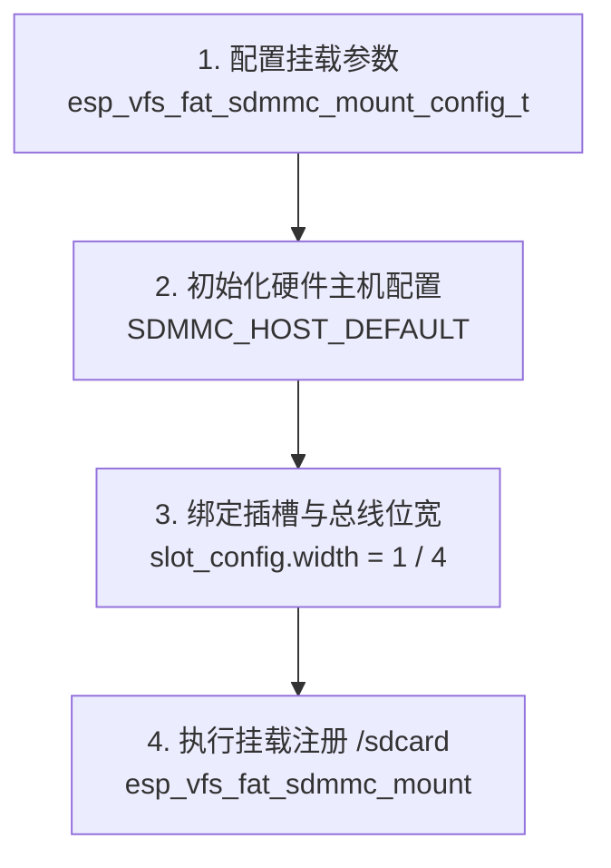

# 第 18 关：ESP32 挂载 MicroSD/TF 卡 (4-bit SDIO) 与 FATFS 电子相册


---

## 🎯 本关学习目标

在前几关中，我们用 NVS 存储了几个字节的开机次数和 Wi-Fi 密码。但随着我们项目规模越来越大：
* 如果想存 **1000 首 MP3 音乐、几百张高清相片、或者 365 天每秒一次的温湿度历史日志**，板载的 8MB SPI Flash 瞬间就会爆满！
* 如何让 ESP32 像电脑一样插上一张 **16GB/32GB/64GB 的 MicroSD (TF) 卡**，自由读写海量文件？

完成本关卡后，你将达成以下核心成就：
1. **搞懂 4-bit SDIO / SDMMC 与 SPI 读卡模式的区别**：理解 4 根数据线并行传输的极速优势；
2. **掌握 VFS（虚拟文件系统）与 FATFS 挂载机制**：在单片机上自由使用 C 语言标准 `fopen / fread / fwrite / fclose`；
3. **掌握传感器黑匣子（Data Logger）构建技巧**：学习 CSV 格式规范与 `fflush()` 缓存及时刷盘技巧，防止断电丢数据；
4. **打造 TF 卡目录树资源浏览器**：掌握 `opendir()` 与 `readdir()` 递归检索 TF 卡内所有文件与大小！

---

## 18.1 为什么板载 Flash 不够用？TF 卡是单片机的“移动硬盘”

```text
 ┌─────────────────────────────────────────────────────────────┐
 │                【SPI Flash VS MicroSD / TF 卡】              │
 │                                                              │
 │  1. 板载 SPI Flash (8MB) ➔ 相当于【主板上的 BIOS/固件区】   │
 │     - 空间极小，还要被操作系统固件 (app.bin) 占去大部分；    │
 │     - 不方便频繁取下插到电脑里拷文件。                      │
 │                                                             │
 │  2. MicroSD / TF 卡 (16GB ~ 64GB) ➔ 相当于【移动硬盘】       │
 │     - 容量是 Flash 的数千倍，支持热插拔；                   │
 │     - 可以在电脑上拷入图片、字体、网页文件，再插回单片机！ │
 │ └─────────────────────────────────────────────────────────────┘
```

---

## 18.2 什么是 4-bit SDIO / SDMMC？为什么比 SPI 读卡快 4 倍？

市面上很多入门开发板读 TF 卡是用普通的 SPI 总线（只有 1 根 MOSI 数据线，传输速率只有 1~2 MB/s）。

而我们这块底板使用的是 **ESP32 硬件原生的 SDMMC 控制器（4-bit SDIO 专用并行总线）**：
* 具有 **4 根双向数据线（D0、D1、D2、D3）** 同时并行传输数据；
* 传输速度可达 **20~40 MB/s**，完全可以流畅读取解码无损音乐与全高清图片！

---

## 18.3 📚 核心库函数功能字典与关键参数解密（小白必读）

---

### 1. 🛠️ 本章引入的核心头文件与组件

| 头文件 | 作用说明 | 对应 CMake 依赖 | 核心函数 / 结构体 |
| :--- | :--- | :--- | :--- |
| **`"esp_vfs_fat.h"`** | **FATFS 虚拟文件系统挂载器** | `fatfs` | `esp_vfs_fat_sdmmc_mount()`、`esp_vfs_fat_sdcard_unmount()` |
| **`"driver/sdmmc_host.h"`** | **ESP32 硬件 SDMMC 主机驱动** | `esp_driver_sdmmc` | `SDMMC_HOST_DEFAULT()`、`SDMMC_SLOT_CONFIG_DEFAULT()` |
| **`<stdio.h>`** | **C 语言标准文件流操作** | C 标准库 | `fopen()`、`fprintf()`、`fgets()`、`fflush()`、`fclose()` |
| **`<dirent.h>`** | **POSIX 目录检索操作** | C 标准库 | `opendir()`、`readdir()`、`closedir()` |

---

### 2. 🎛️ TF 卡挂载标准四步流水线



---

## 18.4 实战第 1 步：TF 卡 4-bit SDMMC 高速挂载与读写 (Mount SD Card)

> 📁 **配套源码文件**：[`code/18_sdcard_fatfs/01_sdcard_mount.c`](../code/18_sdcard_fatfs/01_sdcard_mount.c)  
> ⚡ **一键切换运行**：在终端运行 `./switch_code.sh 18 1 --flash` 即可秒级切换并自动烧录！

```c
// 1. 一键挂载 FATFS
esp_err_t ret = esp_vfs_fat_sdmmc_mount("/sdcard", &host, &slot_config, &mount_config, &card);
if (ret == ESP_OK) {
    ESP_LOGI(TAG, "🎉 TF 卡挂载成功！");
    sdmmc_card_print_info(stdout, card); // 打印容量、扇区大小
}

// 2. 标准 C 文件写入
FILE *f = fopen("/sdcard/hello.txt", "w");
fprintf(f, "Hello from ESP32 SDMMC File System!\n");
fclose(f);
```

---

## 18.5 实战第 2 步：传感器黑匣子 CSV 数据记录仪 (Data Logger)

模拟工业级传感器黑匣子，周期性将环境气温与内存状态按标准的逗号分隔 CSV 格式追加写入文件：

> 📁 **配套源码文件**：[`code/18_sdcard_fatfs/02_sensor_datalogger.c`](../code/18_sdcard_fatfs/02_sensor_datalogger.c)  
> ⚡ **一键切换运行**：在终端运行 `./switch_code.sh 18 2 --flash` 即可秒级切换并自动烧录！

```c
// 以追加模式 'a' 打开 CSV 文件
FILE *f = fopen("/sdcard/sensor_log.csv", "a");
if (f) {
    // 写入格式化行
    fprintf(f, "%lld,%.2f,%lu,INFO\n", uptime_sec, mock_temp, free_heap);
    fflush(f); // ⚠️ 关键！强制刷盘，防止突然断电丢失缓存数据！
}
```

---

## 18.6 实战第 3 步：综合大工程 —— TF 卡文件资源浏览器与目录树遍历

使用 POSIX 标准的 `opendir()` 和 `readdir()` 递归扫描并打印出整张 TF 卡的文件目录树：

> 📁 **配套源码文件**：[`code/18_sdcard_fatfs/03_sd_file_explorer.c`](../code/18_sdcard_fatfs/03_sd_file_explorer.c)  
> ⚡ **一键切换运行**：在终端运行 `./switch_code.sh 18 3 --flash` 即可秒级切换并自动烧录！

```c
/* 递归遍历目录树并打印 */
static void scan_directory_tree(const char *dir_path, int depth)
{
    DIR *d = opendir(dir_path);
    if (!d) return;

    struct dirent *dir;
    while ((dir = readdir(d)) != NULL) {
        if (strcmp(dir->d_name, ".") == 0 || strcmp(dir->d_name, "..") == 0) continue;

        char full_path[300];
        snprintf(full_path, sizeof(full_path), "%s/%s", dir_path, dir->d_name);

        struct stat st;
        if (stat(full_path, &st) == 0) {
            if (S_ISDIR(st.st_mode)) {
                ESP_LOGI(TAG, "📁 [%s] (文件夹)", dir->d_name);
                scan_directory_tree(full_path, depth + 1); // 递归深入
            } else {
                ESP_LOGI(TAG, "📄 %-20s (%.2f KB)", dir->d_name, (float)st.st_size / 1024.0f);
            }
        }
    }
    closedir(d);
}
```

---

## 18.7 关卡总结与通关打卡

恭喜你！你的 ESP32 现在拥有了**海量大容量外置存储**的超能力！

### 🏆 核心技能清单回顾：
* [x] **SDMMC 硬件驱动**：理解 4-bit 并行总线的高速读取优势；
* [x] **VFS 虚拟文件系统**：掌握标准 C 语言 `fopen / fread / fwrite` 在单片机上的无缝应用；
* [x] **数据黑匣子防丢设计**：掌握 `fflush()` 刷盘策略与 CSV 规范格式；
* [x] **文件浏览器开发**：掌握 `opendir / readdir` 递归遍历文件目录树。

---

如果我们的 ESP32 依靠一块 500mAh 的锂电池供电，正常工作几个小时就会把电耗光。  
如何让它在没人的时候进入**微安级（μA）深度睡眠**，待机几个月，直到有人靠近或按键按下瞬间被唤醒？

请翻开 [**第 19 章：ESP32 低功耗电源管理与 Deep-sleep 深度睡眠唤醒**](./19_低功耗电源管理与DeepSleep.md)！
