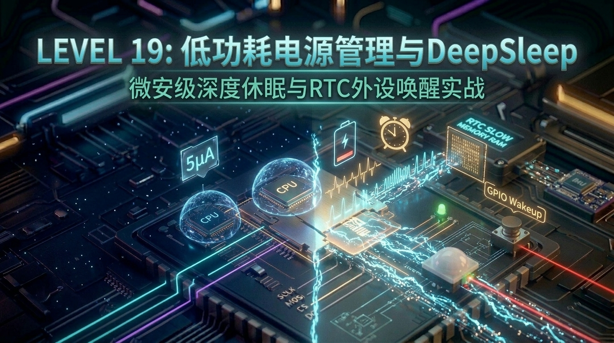

# 第 19 关：ESP32 低功耗电源管理与 Deep-sleep 深度睡眠休眠唤醒 (电池省电技术)



---

## 🎯 本关学习目标

如果我们的 ESP32 嵌入式产品（例如野外农田土壤监测仪、智能门铃猫眼、随身心率手环、GPS 防丢器）脱离了插座充电线，完全依靠一块 **500 mAh 的小型锂电池供电**：
* **如果 CPU 与 Wi-Fi 全速运转（工作电流 ~150mA - 240mA）**：电池 **短短 2~3 个小时就会彻底耗光电量关机**！
* **但如果平时让芯片进入 Deep-sleep（深度睡眠模式）**：整机静态功耗瞬间骤降至 **数微安（约 5 μA）**，同一块电池居然能**持续待机超 1~2 年**！

本关我们将攻克 ESP32 在物联网电池供电领域的核心竞争力 —— **超低功耗电源管理与 Deep-sleep 深度休眠唤醒技术**！

### 🏆 核心技能清单：
1. **搞懂 ESP32 的五大电源模式**：深入理解 Active（全速运行）、Light-sleep（浅度睡眠）与 Deep-sleep（深度休眠）的底层供电差异与能耗曲线；
2. **掌握 `RTC_DATA_ATTR` 慢速内存黑科技**：单片机进入深度睡眠后 CPU 断电，睡醒后依然能记住之前的历史数据与运行轮次；
3. **掌握三大休眠唤醒源机制**：
   - ⏰ **定时器唤醒（Timer Wakeup）**：微秒级硬件闹钟唤醒，实现周期性巡检；
   - 🔘 **EXT0 单引脚硬件电平唤醒**：板载 SW3 按键（`GPIO39`）低电平唤醒，实现“按键即开机/秒级唤醒”；
   - 🚶 **EXT1 多引脚位掩码唤醒**：SR602 人体红外感应（`GPIO34`）高电平唤醒，实现“有人靠近秒级感应复活”；
4. **打造微安级野外环境监测哨兵**：平时微安级沉睡，定时/有人靠近瞬间唤醒巡检，处理完毕 200ms 内闪退重新入睡，省电 99.8%！

---

## 🧭 关卡实验与源码速查

| 实验编号 | 实验名称 | 核心知识与实验目标 | 配套源码文件 | 一键切换命令 |
| :--- | :--- | :--- | :--- | :--- |
| **实验 1** | **Timer 定时器深度睡眠与 RTC 内存保持** | 定时器微秒级休眠、RTC 慢速内存 `RTC_DATA_ATTR` 掉电保存、冷启动与唤醒诊断 | [`code/19_low_power_deepsleep/01_timer_deepsleep.c`](../code/19_low_power_deepsleep/01_timer_deepsleep.c) | `./switch_code.sh 19 1 --flash` |
| **实验 2** | **EXT0 / EXT1 外部按键与红外中断唤醒** | EXT0 单引脚电平触发、EXT1 多引脚位掩码触发、精准唤醒源诊断 | [`code/19_low_power_deepsleep/02_ext_gpio_wakeup.c`](../code/19_low_power_deepsleep/02_ext_gpio_wakeup.c) | `./switch_code.sh 19 2 --flash` |
| **实验 3** | **综合大工程：微安级智能环境监测哨兵** | 双重唤醒源联动、极速闪退技术（Fast Wake-to-Sleep）、持久化遥测黑匣子 | [`code/19_low_power_deepsleep/03_low_power_sentry.c`](../code/19_low_power_deepsleep/03_low_power_sentry.c) | `./switch_code.sh 19 3 --flash` |

---

## 19.1 什么是 Deep-sleep？为什么能省电上万倍？

### ① 生活化秒懂比喻：大卡车停车熄火与值班保安

很多初学者容易把单片机的 `vTaskDelay(1000)` 误以为是“省电休眠”。其实 `vTaskDelay` 时 CPU 依然在高速振荡运行，Wi-Fi 射频电路依然在全功率辐射，耗电量几乎没有下降！

```text
 ┌────────────────────────────────────────────────────────────────────────┐
 │                 【正常运行 (Active) VS 深度睡眠 (Deep-sleep)】          │
 │                                                                        │
 │  1. 正常运行 (Active) ➔ 【开着引擎狂轰油门的大卡车】                   │
 │     - 双核 CPU @ 240MHz 全开、Wi-Fi 射频全功率发射、系统 RAM 通电；    │
 │     - 工作电流：~150 mA - 240 mA（耗电极快，电池几个小时耗光）。       │
 │                                                                        │
 │  2. 深度睡眠 (Deep-sleep) ➔ 【发动机熄火、全厂断电，只留保安值班】     │
 │     - 双核 CPU、系统 RAM、Wi-Fi/蓝牙射频 全部被硬件切断供电！          │
 │     - 整个芯片内部只留下一个极其省电的 **RTC 超低功耗协处理器**；      │
 │     - 工作电流：骤降至仅约 \033[1;36m~5 μA（微安）\033[0m（功耗降低 30,000 倍）！│
 └────────────────────────────────────────────────────────────────────────┘
```

### ② ESP32 五大电源模式全景图

| 电源工作模式 | CPU 状态 | Wi-Fi/蓝牙 状态 | 内部 RAM 状态 | RTC 域状态 | 典型工作电流 | 适用场景 |
| :--- | :--- | :--- | :--- | :--- | :--- | :--- |
| **Active (正常运行)** | 240 MHz 全速 | 开启传输 | 正常通电 | 运行 | **150 ~ 240 mA** | 正在采集计算、传视频、刷彩屏 |
| **Modem-sleep (调制解调休眠)** | 运行 | 周期性休眠 | 正常通电 | 运行 | **20 ~ 30 mA** | Wi-Fi 保持连接路由器但无高频数据 |
| **Light-sleep (浅度睡眠)** | 时钟暂停 | 关闭 | 数据保留 | 运行 | **0.8 ~ 2 mA** | 毫秒级快速休眠，唤醒速度微秒级 |
| **Deep-sleep (深度睡眠 🌟)** | **完全断电** | **完全断电** | **完全断电** | **极低功耗维持** | **约 5 ~ 10 μA** | **电池供电设备的绝对首选核心模式！** |
| **Hibernation (冬眠模式)** | 完全断电 | 完全断电 | 完全断电 | 仅主定时器工作 | **约 2.5 μA** | 超长时间纯定时休眠 |

---

## 19.2 睡醒了怎么记住数据？`RTC_DATA_ATTR` 慢速 RAM

很多同学在初学 Deep-sleep 时会有个巨大疑问：
> *“既然 CPU 和系统 RAM 在深度睡眠时全部断电了，那内存里的普通全局变量不就全被抹掉了吗？单片机睡醒之后怎么知道自己之前运行过几次？历史数据怎么保留？”*

### 💡 芯片硬件解密：独立的 8KB RTC Slow Memory
ESP32 芯片内部在主内存之外，专门划分了一块独立的 **8KB RTC 慢速内存（RTC Slow Memory）**：
* 当芯片进入 Deep-sleep 时，主 RAM 断电，但这块 RTC 内存会由低功耗电源域继续保持供电；
* **使用方式极简**：只要在全局变量前加上 **`RTC_DATA_ATTR`** 宏修饰；
* 编译器就会把这个变量自动存入 RTC 慢速内存。**即便芯片睡了几百天，里面的数据也绝对不会丢失！**

```c
// ⚡ 核心黑科技：这个变量存放在 RTC 慢速内存中，Deep-sleep 期间数据完好无损！
static RTC_DATA_ATTR int s_boot_count = 0;
```

---

## 19.3 外部唤醒源大白话：EXT0 与 EXT1 的本质区别

当芯片进入 Deep-sleep 之后，它是怎么被瞬间“叫醒”的呢？ESP32 支持多种硬件唤醒源：

```text
 ┌────────────────────────────────────────────────────────────────────────┐
 │                      【两大外部硬件电平唤醒源对比】                    │
 │                                                                        │
 │  1. EXT0（单引脚电平唤醒）：                                           │
 │     - 特点：使用 RTC 内部独立模拟比较器，只能监听【单个引脚】；       │
 │     - 典型应用：板载 SW3 按键（GPIO39），配置为【低电平 0】时瞬间唤醒。│
 │                                                                        │
 │  2. EXT1（多引脚位掩码唤醒）：                                         │
 │     - 特点：使用 RTC 逻辑控制器，可以同时监听【多个 RTC 引脚的组合】；│
 │     - 典型应用：SR602 人体红外（GPIO34），配置为【任意高电平 1】时唤醒。│
 └────────────────────────────────────────────────────────────────────────┘
```

> ⚠️ **关键硬件引脚约束**：  
> 只有支持 **RTC GPIO** 功能的引脚才能在 Deep-sleep 期间唤醒芯片！  
> 本开发板上的 `GPIO39 (VN)` 对应 `RTC_GPIO3`，`GPIO34` 对应 `RTC_GPIO4`，均属于标准 RTC 引脚，完美支持外部硬件唤醒！

---

## 19.4 📚 核心库函数功能字典（小白必读）

| 核心 API | 生活化比喻 | 核心功能与参数说明 |
| :--- | :--- | :--- |
| **`esp_sleep_enable_timer_wakeup(us)`** | **定好闹钟** | 配置定时器唤醒时间（单位：微秒 $\mu s$，1秒 = 1,000,000 微秒） |
| **`esp_sleep_enable_ext0_wakeup(pin, level)`** | **门铃按键** | 配置 EXT0 单引脚电平唤醒（`level=0` 低电平按下唤醒，`level=1` 高电平唤醒） |
| **`esp_sleep_enable_ext1_wakeup(mask, mode)`** | **红外红外线报警器** | 配置 EXT1 多引脚位掩码唤醒（`ESP_EXT1_WAKEUP_ANY_HIGH` 任意引脚变高即唤醒） |
| **`esp_deep_sleep_start()`** | **全厂断电入睡** | **核心指令！** 立即切断 CPU 主电源进入 Deep-sleep。睡醒后芯片像复位一样从 `app_main` 第一行重新启动 |
| **`esp_sleep_get_wakeup_cause()`** | **查验苏醒原因** | 返回本次开机是因为冷插电、定时器闹钟、按键还是红外感应唤醒 |
| **`esp_sleep_get_ext1_wakeup_status()`** | **查验是哪个引脚触发** | 返回 EXT1 唤醒时的具体引脚位掩码（确定是哪一路传感器触发） |

---

## 19.5 🔬 实验 1：Timer 定时器深度睡眠与 RTC 内存保持

### 1. 🎯 实验目标与场景
* **场景**：系统上电点亮 LED2，打印本次唤醒原因与 RTC 内存累计次数；
* **动作**：模拟执行 2 秒业务采集，随后熄灭 LED，配置 5 秒定时器闹钟并进入 Deep-sleep；
* **验证**：观察串口打印，每次睡醒后计数器 `s_boot_count` 自动递增且数据不丢失！

---

### 2. 💻 实验 1 完整源码

> 📁 **配套源码文件**：[`code/19_low_power_deepsleep/01_timer_deepsleep.c`](../code/19_low_power_deepsleep/01_timer_deepsleep.c)  
> ⚡ **一键切换运行**：在终端运行 `./switch_code.sh 19 1 --flash` 即可秒级切换并自动烧录！

```c
#include <stdio.h>
#include <time.h>
#include <sys/time.h>
#include "freertos/FreeRTOS.h"
#include "freertos/task.h"
#include "esp_sleep.h"
#include "driver/gpio.h"
#include "esp_log.h"

#define LED_PIN         GPIO_NUM_27
#define SLEEP_TIME_SEC  5       // 每次深度睡眠 5 秒
static const char *TAG = "EXP1_TIMER_SLEEP";

// ⚡ 核心黑科技：保存在 8KB RTC 慢速内存中的掉电保持变量！
static RTC_DATA_ATTR int s_boot_count = 0;

void app_main(void)
{
    // 1. 累计开机/唤醒总次数 (存放在 RTC 慢速内存中)
    s_boot_count++;

    // 2. 初始化 LED2 指示灯
    gpio_reset_pin(LED_PIN);
    gpio_set_direction(LED_PIN, GPIO_MODE_OUTPUT);
    gpio_set_level(LED_PIN, 1); // 点亮 LED 表明系统处于活跃运行态 (Active)

    ESP_LOGI(TAG, "==========================================================");
    ESP_LOGI(TAG, "   ⚡ Level 19 实验 1：Timer 定时器深度睡眠与 RTC 数据保持 ");
    ESP_LOGI(TAG, "==========================================================");

    // 3. 诊断本次启动原因：判断是插电冷启动还是睡醒复活
    esp_sleep_wakeup_cause_t wakeup_reason = esp_sleep_get_wakeup_cause();
    switch (wakeup_reason) {
        case ESP_SLEEP_WAKEUP_TIMER:
            ESP_LOGI(TAG, "⏰ 【唤醒来源】: 定时器闹钟响了 (ESP_SLEEP_WAKEUP_TIMER)！芯片从深度睡眠中苏醒！");
            break;
        case ESP_SLEEP_WAKEUP_UNDEFINED:
        default:
            ESP_LOGW(TAG, "🔌 【启动来源】: 首次外部通电冷启动 (Power-on Reset)！");
            break;
    }

    ESP_LOGI(TAG, "📊 【RTC 内存数据】: 累计苏醒运行次数: 第 \033[1;32m%d\033[0m 次", s_boot_count);
    ESP_LOGI(TAG, "💡 【工作状态】: LED2 已点亮，CPU 双核 @ 240MHz 全速工作 (活跃电流 ~150mA)");

    // 模拟执行 2 秒的核心采集/计算业务
    ESP_LOGI(TAG, "⏳ 正在模拟执行业务数据采集与处理 (耗时 2 秒)...");
    vTaskDelay(pdMS_TO_TICKS(2000));

    // 4. 准备进入微安级深度睡眠
    ESP_LOGI(TAG, "----------------------------------------------------------");
    ESP_LOGI(TAG, "💤 业务处理完毕！正在配置 %d 秒后定时唤醒...", SLEEP_TIME_SEC);
    ESP_LOGI(TAG, "🔌 即将切断 CPU/RAM/外设主电源，整机功耗降至 \033[1;36m~5 μA (微安)\033[0m！");
    ESP_LOGI(TAG, "----------------------------------------------------------\n");

    // 熄灭 LED 表明即将切断主电源
    gpio_set_level(LED_PIN, 0);

    // 5. 启用 Timer 唤醒源 (入参单位为微秒 μs: 1 秒 = 1,000,000 微秒)
    esp_sleep_enable_timer_wakeup((uint64_t)SLEEP_TIME_SEC * 1000000ULL);

    // 6. 核心指令：芯片立即断电进入 Deep-sleep！
    esp_deep_sleep_start();
}
```

---

### 3. 📊 实验 1 串口运行日志解读

```text
I (819) EXP1_TIMER_SLEEP: ==========================================================
I (829) EXP1_TIMER_SLEEP:    ⚡ Level 19 实验 1：Timer 定时器深度睡眠与 RTC 数据保持 
I (829) EXP1_TIMER_SLEEP: ==========================================================
W (839) EXP1_TIMER_SLEEP: 🔌 【启动来源】: 首次外部通电冷启动 (Power-on Reset)！
I (849) EXP1_TIMER_SLEEP: 📊 【RTC 内存数据】: 累计苏醒运行次数: 第 1 次
I (859) EXP1_TIMER_SLEEP: 💡 【工作状态】: LED2 已点亮，CPU 双核 @ 240MHz 全速工作 (活跃电流 ~150mA)
I (869) EXP1_TIMER_SLEEP: ⏳ 正在模拟执行业务数据采集与处理 (耗时 2 秒)...
I (2879) EXP1_TIMER_SLEEP: ----------------------------------------------------------
I (2879) EXP1_TIMER_SLEEP: 💤 业务处理完毕！正在配置 5 秒后定时唤醒...
I (2889) EXP1_TIMER_SLEEP: 🔌 即将切断 CPU/RAM/外设主电源，整机功耗降至 ~5 μA (微安)！
I (2899) EXP1_TIMER_SLEEP: ----------------------------------------------------------

... (板载 LED 熄灭，整机进入 5μA 极低功耗静默休眠 5 秒) ...

I (825) EXP1_TIMER_SLEEP: ==========================================================
I (835) EXP1_TIMER_SLEEP:    ⚡ Level 19 实验 1：Timer 定时器深度睡眠与 RTC 数据保持 
I (835) EXP1_TIMER_SLEEP: ==========================================================
I (845) EXP1_TIMER_SLEEP: ⏰ 【唤醒来源】: 定时器闹钟响了 (ESP_SLEEP_WAKEUP_TIMER)！芯片从深度睡眠中苏醒！
I (855) EXP1_TIMER_SLEEP: 📊 【RTC 内存数据】: 累计苏醒运行次数: 第 2 次
```

---

## 19.6 🔬 实验 2：EXT0 与 EXT1 外部硬件引脚中断秒级唤醒

### 1. 🎯 实验目标与场景
* **场景**：配置板载 SW3 按键（`GPIO39`）与 SR602 人体红外传感器（`GPIO34`）为外部唤醒源；
* **动作**：芯片进入微安级休眠后，用户按下按键或人体靠近传感器，瞬间硬件级唤醒 ESP32；
* **验证**：芯片准确分辨出是哪一个物理外设唤醒了它，并分别统计触发频次！

---

### 2. 💻 实验 2 完整源码

> 📁 **配套源码文件**：[`code/19_low_power_deepsleep/02_ext_gpio_wakeup.c`](../code/19_low_power_deepsleep/02_ext_gpio_wakeup.c)  
> ⚡ **一键切换运行**：在终端运行 `./switch_code.sh 19 2 --flash` 即可秒级切换并自动烧录！

```c
#include <stdio.h>
#include <inttypes.h>
#include "freertos/FreeRTOS.h"
#include "freertos/task.h"
#include "esp_sleep.h"
#include "driver/gpio.h"
#include "esp_log.h"

#define PIN_BUTTON_SW3      GPIO_NUM_39 // 板载按键 SW3 (低电平有效)
#define PIN_PIR_SR602       GPIO_NUM_34 // 人体红外感应引脚 (有人时高电平)
#define PIN_LED             GPIO_NUM_27

static const char *TAG = "EXP2_EXT_WAKEUP";

// RTC 慢速内存统计变量
static RTC_DATA_ATTR int s_total_wakeups = 0;
static RTC_DATA_ATTR int s_button_wakeups = 0;
static RTC_DATA_ATTR int s_pir_wakeups = 0;

void app_main(void)
{
    s_total_wakeups++;

    // 初始化 LED2 指示灯
    gpio_reset_pin(PIN_LED);
    gpio_set_direction(PIN_LED, GPIO_MODE_OUTPUT);
    gpio_set_level(PIN_LED, 1);

    ESP_LOGI(TAG, "==========================================================");
    ESP_LOGI(TAG, "   ⚡ Level 19 实验 2：EXT0 / EXT1 外部硬件引脚中断秒级唤醒 ");
    ESP_LOGI(TAG, "==========================================================");

    // 1. 识别具体的唤醒硬件来源
    esp_sleep_wakeup_cause_t wakeup_reason = esp_sleep_get_wakeup_cause();
    switch (wakeup_reason) {
        case ESP_SLEEP_WAKEUP_EXT0:
            s_button_wakeups++;
            ESP_LOGI(TAG, "🔘 【唤醒来源】: EXT0 触发 ➔ \033[1;32m用户按下了 SW3 按键 (GPIO39)！\033[0m");
            break;

        case ESP_SLEEP_WAKEUP_EXT1: {
            s_pir_wakeups++;
            uint64_t wakeup_pin_mask = esp_sleep_get_ext1_wakeup_status();
            if (wakeup_pin_mask & (1ULL << PIN_PIR_SR602)) {
                ESP_LOGI(TAG, "🚶 【唤醒来源】: EXT1 触发 ➔ \033[1;33mSR602 人体红外感应到有人靠近 (GPIO34)！\033[0m");
            } else {
                ESP_LOGI(TAG, "⚡ 【唤醒来源】: EXT1 掩码触发 (引脚掩码: 0x%" PRIx64 ")", wakeup_pin_mask);
            }
            break;
        }

        case ESP_SLEEP_WAKEUP_UNDEFINED:
        default:
            ESP_LOGW(TAG, "🔌 【启动来源】: 首次外部通电冷启动 (Power-on Reset)！");
            break;
    }

    // 2. 打印 RTC 慢速内存统计数据
    ESP_LOGI(TAG, "📊 【RTC 唤醒历史统计】: 总唤醒: %d 次 | 🔘 按键触发: %d 次 | 🚶 红外感应: %d 次",
             s_total_wakeups, s_button_wakeups, s_pir_wakeups);

    // 模拟快速响应处理（如开屏显示或拍照，耗时 1.5 秒）
    ESP_LOGI(TAG, "⏳ 正在执行事件应急响应处理 (1.5 秒)...");
    vTaskDelay(pdMS_TO_TICKS(1500));

    // 3. 配置两大外部硬件唤醒源
    ESP_LOGI(TAG, "----------------------------------------------------------");
    ESP_LOGI(TAG, "⚙️ 正在配置外部休眠唤醒源:");
    ESP_LOGI(TAG, "   1. EXT0 ➔ 监听 SW3 按键 [GPIO%d]，低电平 (0) 时瞬间唤醒", PIN_BUTTON_SW3);
    ESP_LOGI(TAG, "   2. EXT1 ➔ 监听 SR602 红外 [GPIO%d]，高电平 (1) 时瞬间唤醒", PIN_PIR_SR602);
    ESP_LOGI(TAG, "----------------------------------------------------------");

    // ① 配置 EXT0：单引脚电平触发 (参数 0 表示低电平唤醒)
    esp_sleep_enable_ext0_wakeup(PIN_BUTTON_SW3, 0);

    // ② 配置 EXT1：多引脚位掩码触发 (ESP_EXT1_WAKEUP_ANY_HIGH 表示指定引脚中任意一个变高电平即唤醒)
    esp_sleep_enable_ext1_wakeup((1ULL << PIN_PIR_SR602), ESP_EXT1_WAKEUP_ANY_HIGH);

    ESP_LOGI(TAG, "💤 系统即将进入 Deep-sleep 深度睡眠模式 (5 μA 超低功耗)！");
    ESP_LOGI(TAG, "👉 请按下 SW3 按键 或 用手在 SR602 传感器前晃动，观察秒级唤醒复活！\n");

    gpio_set_level(PIN_LED, 0);

    // 4. 立即进入深度休眠
    esp_deep_sleep_start();
}
```

---

## 19.7 🔬 实验 3：综合大工程 —— 微安级智能野外环境监测哨兵 (Ultra Low-Power Sentry)

### 1. 🎯 实验目标与架构设计
* **场景**：部署在野外依靠锂电池供电的智能监测哨兵；
* **双模唤醒架构**：
  - **常规巡检（Timer 10s 闹钟）**：每隔 10 秒自动醒来采集一次环境温度，LED 微弱闪烁 1 次，随后 **200ms 内闪退沉睡**；
  - **突发入侵（EXT0/EXT1 触发）**：有人靠近或按键强行触发时，芯片秒级苏醒，LED 连闪 3 次警示，并在 RTC 遥测黑匣子中记录入侵警报！

```text
 ┌────────────────────────────────────────────────────────────────────────┐
 │                    【微安级智能哨兵双模运转状态机】                    │
 │                                                                        │
 │                     ┌──────────────────────────┐                       │
 │                     │  💤 5μA 深度睡眠静默守卫  │                       │
 │                     └─────────────┬────────────┘                       │
 │                                   │                                    │
 │                 ┌─────────────────┴─────────────────┐                  │
 │                 ▼ (10秒闹钟到期)                     ▼ (人体红外感应/按键)│
 │     ┌───────────────────────────┐       ┌───────────────────────────┐  │
 │     │ ⏰ 常规心跳巡检模式       │       │ 🚨 突发安全告警模式       │  │
 │     │ • 采集环境数据            │       │ • 记录入侵异常            │  │
 │     │ • LED 闪烁 1 次           │       │ • LED 强力快闪 3 次警示   │  │
 │     └─────────────┬─────────────┘       └─────────────┬─────────────┘  │
 │                   │                                   │                │
 │                   └─────────────────┬─────────────────┘                │
 │                                     ▼                                  │
 │                      ┌─────────────────────────────┐                   │
 │                      │ ⚡ 200ms 内闪退重新进入沉睡  │                   │
 │                      └─────────────────────────────┘                   │
 └────────────────────────────────────────────────────────────────────────┘
```

---

### 2. 💻 实验 3 完整源码

> 📁 **配套源码文件**：[`code/19_low_power_deepsleep/03_low_power_sentry.c`](../code/19_low_power_deepsleep/03_low_power_sentry.c)  
> ⚡ **一键切换运行**：在终端运行 `./switch_code.sh 19 3 --flash` 即可秒级切换并自动烧录！

```c
#include <stdio.h>
#include <inttypes.h>
#include "freertos/FreeRTOS.h"
#include "freertos/task.h"
#include "esp_sleep.h"
#include "driver/gpio.h"
#include "esp_timer.h"
#include "esp_log.h"

#define PIN_LED             GPIO_NUM_27
#define PIN_BUTTON_SW3      GPIO_NUM_39
#define PIN_PIR_SR602       GPIO_NUM_34
#define HEARTBEAT_INTERVAL_SEC 10 // 周期性心跳巡检间隔 (秒)

static const char *TAG = "EXP3_LP_SENTRY";

// -----------------------------------------------------------------------------
// 🧠 RTC 慢速内存持久化数据区 (Deep-sleep 期间不丢失)
// -----------------------------------------------------------------------------
typedef struct {
    int total_cycles;       // 总运行轮次
    int timer_checks;       // 定时常规巡检次数
    int intrusion_alerts;   // 人体入侵告警次数
    int last_temp_raw;      // 最近一次模拟采样值
} sentry_telemetry_t;

static RTC_DATA_ATTR sentry_telemetry_t s_sentry_data = {0};

void app_main(void)
{
    int64_t wake_start_us = esp_timer_get_time();
    s_sentry_data.total_cycles++;

    // 初始化 LED2 引脚
    gpio_reset_pin(PIN_LED);
    gpio_set_direction(PIN_LED, GPIO_MODE_OUTPUT);

    ESP_LOGI(TAG, "==========================================================");
    ESP_LOGI(TAG, "   🛡️ Level 19 实验 3：微安级智能野外环境监测哨兵启动     ");
    ESP_LOGI(TAG, "==========================================================");

    // 1. 诊断唤醒源并分流处理业务
    esp_sleep_wakeup_cause_t cause = esp_sleep_get_wakeup_cause();

    if (cause == ESP_SLEEP_WAKEUP_TIMER) {
        s_sentry_data.timer_checks++;
        ESP_LOGI(TAG, "⏰ 【常规心跳巡检】: 定时器唤醒 (第 %d 次常规巡检)", s_sentry_data.timer_checks);

        // 快速模拟温度采集（仅耗时 20ms）
        s_sentry_data.last_temp_raw = 24 + (s_sentry_data.total_cycles % 5);
        ESP_LOGI(TAG, "🌡️ 采集当前环境温度: %d °C (状态正常)", s_sentry_data.last_temp_raw);

        // LED 快速微弱闪烁 1 次 (50ms)
        gpio_set_level(PIN_LED, 1);
        vTaskDelay(pdMS_TO_TICKS(50));
        gpio_set_level(PIN_LED, 0);

    } else if (cause == ESP_SLEEP_WAKEUP_EXT0 || cause == ESP_SLEEP_WAKEUP_EXT1) {
        s_sentry_data.intrusion_alerts++;
        ESP_LOGW(TAG, "🚨 \033[1;31m【突发安全告警】: 检测到人体靠近或按键强行触发！(第 %d 次告警)\033[0m",
                 s_sentry_data.intrusion_alerts);

        // 告警状态：LED 强力快闪 3 次 (警示入侵者)
        for (int i = 0; i < 3; i++) {
            gpio_set_level(PIN_LED, 1);
            vTaskDelay(pdMS_TO_TICKS(80));
            gpio_set_level(PIN_LED, 0);
            vTaskDelay(pdMS_TO_TICKS(80));
        }

    } else {
        ESP_LOGI(TAG, "🔌 【哨兵上电部署】: 系统初始化完成，进入守卫阵地！");
    }

    // 2. 打印哨兵持久化黑匣子状态
    ESP_LOGI(TAG, "----------------------------------------------------------");
    ESP_LOGI(TAG, "📊 【哨兵运行黑匣子 (RTC 内存)】:");
    ESP_LOGI(TAG, "   • 累计苏醒总轮次 : %d 轮", s_sentry_data.total_cycles);
    ESP_LOGI(TAG, "   • 定时常规巡检   : %d 次", s_sentry_data.timer_checks);
    ESP_LOGI(TAG, "   • 异常入侵拦截   : %d 次", s_sentry_data.intrusion_alerts);
    ESP_LOGI(TAG, "   • 最近一次温度   : %d °C", s_sentry_data.last_temp_raw);
    ESP_LOGI(TAG, "----------------------------------------------------------");

    // 3. 配置双重休眠唤醒源 (定时 10s + 外部按键/红外)
    esp_sleep_enable_timer_wakeup((uint64_t)HEARTBEAT_INTERVAL_SEC * 1000000ULL);
    esp_sleep_enable_ext0_wakeup(PIN_BUTTON_SW3, 0);
    esp_sleep_enable_ext1_wakeup((1ULL << PIN_PIR_SR602), ESP_EXT1_WAKEUP_ANY_HIGH);

    int64_t elapsed_ms = (esp_timer_get_time() - wake_start_us) / 1000;
    ESP_LOGI(TAG, "⚡ 【能效分析】: 本次苏醒处理总耗时: \033[1;32m%lld ms\033[0m", (long long)elapsed_ms);
    ESP_LOGI(TAG, "💤 哨兵重新进入 5μA 极低功耗沉睡态...\n");

    // 4. 立即重新沉睡
    esp_deep_sleep_start();
}
```

---

## 19.8 ⚠️ 工业级低功耗量产设计法则与避坑指南

```text
 ┌────────────────────────────────────────────────────────────────────────┐
 │                    【工业级 Deep-sleep 避坑四大铁律】                  │
 │                                                                        │
 │   1. 外部上拉电阻 ➔ 休眠引脚严禁对地形成强漏电回路 (10k 电阻漏 330μA!)│
 │   2. 闪退原则     ➔ 唤醒后能 100ms 干完绝不拖延 1 秒 (省电 90% 的秘密)│
 │   3. 外设电源隔离 ➔ 传感器 VCC 必须通过 MOS 管控制断电 (防传感器偷电) │
 │   4. 内存生命周期 ➔ 普通全局变量全部失效，唯有 RTC_DATA_ATTR 永存     │
 └────────────────────────────────────────────────────────────────────────┘
```

1. **外部上下拉电阻的“漏电陷阱”**：
   * 在 3.3V 系统中，如果某个 RTC GPIO 引脚内部配置了 10k 上拉，而外部电平为 0，休眠时会产生 $I = 3.3\text{V} / 10\text{k}\Omega = 330\mu\text{A}$ 的漏电流！这比 ESP32 自身休眠电流（5μA）还要大 **60 多倍**！
   * 工业法则：进入休眠前，必须关闭不必要的引脚上下拉电阻或调用 `gpio_hold_en()` 保持锁存。
2. **极速闪退原则（Fast Wake-to-Sleep）**：
   * 电池寿命的核心公式是：**$\text{平均电流} = \frac{I_{\text{active}} \times T_{\text{active}} + I_{\text{sleep}} \times T_{\text{sleep}}}{T_{\text{total}}}$**；
   * 如果每次醒来只花 **100ms** 采集完成立刻入睡，500mAh 电池可以用 2 年；如果醒来慢悠悠 `vTaskDelay(2000)` 等待 2 秒，电池 2 个月就会耗尽！
3. **传感器外设电源切断（MOS 管电源开关）**：
   * ESP32 自身虽然只消耗 5μA，但如果外接的传感器（如屏幕背光、GPS 模块、温湿度计）一直在通电，外设自身就会吃掉几十毫安电量！
   * 工业标准硬件方案：使用一颗 P-MOS 管控制传感器的 VCC 供电脚，平时休眠彻底断开传感器电源，唤醒时才通过 GPIO 使能供电。

---

## 19.9 关卡总结与通关打卡

恭喜你！你已经完全掌握了物联网电池供电产品最核心的**微安级超低功耗电源管理技术**！

### 🏆 核心技能清单回顾：
* [x] **五大电源模式**：理解 Active 与 Deep-sleep 的能耗差距（5μA  vs 150mA）；
* [x] **`RTC_DATA_ATTR` 慢速内存**：掌握掉电保持变量的声明与生命周期；
* [x] **三大唤醒机制**：掌握定时器闹钟、EXT0 按键与 EXT1 红外感应的配置与识别；
* [x] **极速闪退技术**：掌握低功耗状态机设计与毫秒级唤醒-休眠循环。

---

在下一关中，我们将迎来嵌入式软件工程化的内功修炼 —— **告别千行代码堆在 main 的意大利面条写法，掌握 BSP 驱动分层、统一事件总线、硬件看门狗 (WDT) 与 Core Dump 崩溃诊断**！

请翻开 [**第 20 关：嵌入式软件工程化 —— 驱动分层、事件总线、硬件看门狗(WDT)与崩溃诊断**](./20_嵌入式软件工程与模块化分层架构.md)！


