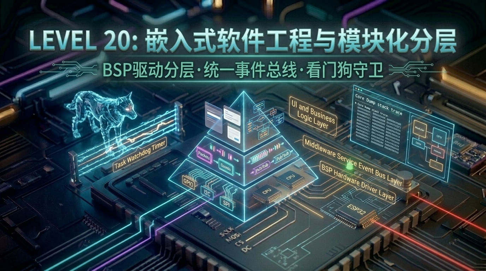

# 第 20 关：嵌入式软件工程化 —— 驱动分层、事件总线、硬件看门狗(WDT)与崩溃诊断



---

## 🎯 本关学习目标

在前 19 关的实战闯关中，你已经像一位武林高手一样，逐一攻克了点灯、按键中断、FreeRTOS 多任务、WS2812 幻彩灯、ADC/NTC 测温、超声波测距、I2C 温湿度、NVS 存储、ST7789 彩屏、LVGL 触控、Wi-Fi/SNTP、MQTT 云平台、BLE 蓝牙、ESP-NOW 局域通信、Web 配网、OTA 无线升级、TF 卡文件系统以及 Deep-sleep 深度休眠等**全部单点软硬件技能**！

但是，当面临真正的**商业级大项目或毕业设计全栈总成**时，90% 的新手都会掉进同一个致命陷阱 —— **“意大利面条式代码（Spaghetti Code）”**：
* 5000 行代码全堆在 `app_main.c` 里；
* 在 UI 界面回调函数里直接写 `gpio_set_level()`，在 MQTT 网络回调里直接操作 LCD 显存；
* **后果惨烈**：底层换了一个引脚或传感器型号，全工程有 20 处代码报错；修了一个网络 Bug，导致屏幕突然卡死花屏！

本关我们将学习**大厂资深嵌入式架构师的核心内功 —— 嵌入式软件工程化、模块化分层解耦与高可用系统运维**！

### 🏆 核心技能清单：
1. **掌握金字塔三层经典架构（BSP 驱动层 / 服务层 / 业务UI层）**：彻底实现“后厨更换传感器型号，前厅 UI 一行代码不用改”；
2. **掌握统一事件总线（Event Bus / 发布-订阅模式）**：基于 ESP-IDF 原生事件循环实现真正的跨模块无感广播与解耦；
3. **掌握有限状态机（FSM, Finite State Machine）**：用状态转移表清晰管理复杂设备生命周期，彻底消灭嵌套 `if-else` 地狱；
4. **掌握硬件看门狗 (Task Watchdog Timer, TWDT) 与 Core Dump 崩溃诊断**：死锁卡死自动硬件复位自愈，崩溃瞬间通过符号表精准定位到 C 语言源码行号！

---

## 🧭 关卡实验与源码速查

| 实验编号 | 实验名称 | 核心知识与实验目标 | 配套源码文件 | 一键切换命令 |
| :--- | :--- | :--- | :--- | :--- |
| **实验 1** | **BSP 硬件驱动分层与语义化解耦** | BSP 接口抽象、引脚隔离、业务层与硬件层彻底解耦 | [`code/20_software_architecture/01_bsp_layer_decoupling.c`](../code/20_software_architecture/01_bsp_layer_decoupling.c) | `./switch_code.sh 20 1 --flash` |
| **实验 2** | **有限状态机 (FSM) 系统生命周期引擎** | 状态机模型、状态转移表、事件驱动状态跃迁 | [`code/20_software_architecture/02_fsm_state_machine.c`](../code/20_software_architecture/02_fsm_state_machine.c) | `./switch_code.sh 20 2 --flash` |
| **实验 3** | **统一事件总线 (Event Bus) 发布-订阅系统** | `esp_event` 事件总线、生产者/消费者完全解耦、系统高扩展性验证 | [`code/20_software_architecture/03_event_bus_architecture.c`](../code/20_software_architecture/03_event_bus_architecture.c) | `./switch_code.sh 20 3 --flash` |

---

## 20.1 为什么必须分层？大饭店后厨的生活化秒懂比喻

### ① 意大利面条代码（Spaghetti Code）的噩梦
在没有架构意识的新手代码里，所有模块互相交织纠缠在一起：

```text
 ┌────────────────────────────────────────────────────────────────────────┐
 │               【错误示范：互相直接调用的“意大利面条”泥潭】             │
 │                                                                        │
 │   [屏幕 UI 模块] ────────────► 直接读写 [DHT11 引脚 GPIO25]            │
 │         │                                    ▲                         │
 │         ▼                                    │                         │
 │   [MQTT 网络任务] ───────────► 直接操作 [ST7789 显存 Buffer]           │
 │         ▲                                    │                         │
 │         │                                    ▼                         │
 │   [按键中断 ISR] ────────────► 直接调用 [cJSON 打包并发送网络报文]     │
 └────────────────────────────────────────────────────────────────────────┘
```
👉 **恶果**：只要任何一个硬件引脚发生变动，或者网络协议升级，整个系统像多米诺骨牌一样全盘崩溃！

---

### ② 现代化金字塔三层架构模型（大饭店分层协作）

在大厂的标准工业设计中，软件工程被严格划分为清晰的三层：

```text
 ┌────────────────────────────────────────────────────────────────────────┐
 │                      【经典嵌入式金字塔三层架构】                      │
 │                                                                        │
 │   ┌────────────────────────────────────────────────────────────────┐   │
 │   │ 🏢 【第 3 层：业务逻辑与 UI 界面层 (App / UI Layer)】          │   │
 │   │    • 负责：LVGL 屏幕交互、用户按键响应、状态机跳转              │   │
 │   │    • 特点：纯逻辑，不知道底层是哪根 GPIO，只调用服务层接口      │   │
 │   └──────────────────────────────┬─────────────────────────────────┘   │
 │                                  │ (调用/订阅)                         │
 │   ┌──────────────────────────────▼─────────────────────────────────┐   │
 │   │ 🌐 【第 2 层：中间件与系统服务层 (Services / Middleware Layer)】│   │
 │   │    • 负责：统一事件总线 (Event Bus)、Wi-Fi/MQTT 连接、NVS 存储  │   │
 │   │    • 特点：承上启下，屏蔽具体业务，提供通用能力                │   │
 │   └──────────────────────────────┬─────────────────────────────────┘   │
 │                                  │ (调用驱动)                          │
 │   ┌──────────────────────────────▼─────────────────────────────────┐   │
 │   │ 🔧 【第 1 层：BSP 板级硬件支持层 (Board Support Package)】     │   │
 │   │    • 负责：GPIO、I2C、SPI、ADC、PWM 底层寄存器配置与数据读取    │   │
 │   │    • 特点：对外输出统一语义化函数 (如 bsp_temp_read())         │   │
 │   └────────────────────────────────────────────────────────────────┘   │
 └────────────────────────────────────────────────────────────────────────┘
```

* **生活化比喻（五星级大饭店）**：
  * **BSP 层 ➔ 【后厨采购部】**：只管把新鲜的牛肉买回来切好。至于是从哪个农场买的（对应 GPIO 几号脚），前厅完全不用管；
  * **服务层 ➔ 【中央传菜部 / 广播电台】**：把做好的菜品或广播消息安全分发给各个包厢；
  * **业务 UI 层 ➔ 【前台点单服务员】**：只管向客人展示精美的菜单界面。后厨就算临时换了供货商，前台的菜单界面一行字都不用改！

---

### ③ 💡 核心扫盲：BSP 到底是什么？为什么大厂极其看重它？

* **英文全称**：**BSP = Board Support Package（板级支持包 / 硬件驱动包）**；
* **通俗定义**：**“包办这块电路板上所有底层硬件脏活累活的贴身大管家”**！

```text
 ┌────────────────────────────────────────────────────────────────────────┐
 │                    【没有 BSP  VS  拥有标准 BSP 分层】                 │
 │                                                                        │
 │  ❌ 没有 BSP（硬编码惨剧）：                                            │
 │     业务代码 ──► gpio_set_level(GPIO_NUM_27, 1);                       │
 │     💥 痛点：如果硬件改版把 LED 改接 GPIO18，必须去 10 个业务文件搜索替换! │
 │                                                                        │
 │  ✅ 拥有 BSP（优雅分层）：                                             │
 │     业务代码 ──► bsp_led_set(true);  (纯语义化，完全不知道是哪个引脚)  │
 │     BSP 驱动 ──► #define BSP_LED_PIN GPIO_NUM_27  (底层引脚集中收拢)   │
 │     🌟 优势：硬件改版只需改 1 行引脚宏定义，上层 10,000 行业务代码 0 修改! │
 └────────────────────────────────────────────────────────────────────────┘
```

#### 🏢 工业界大厂的分工实态（大疆 / 小米 / 华为）：
在正规嵌入式研发团队中，工程师通常严格分为两拨人：
1. **BSP 底层驱动工程师**：看电路原理图、查芯片手册（Datasheet）、配置底层寄存器与时钟、写 DMA / I2C / SPI 驱动，把所有硬件能力打包成标准简洁的 `bsp_xxx.h` 头文件；
2. **应用/业务逻辑工程师（App / UI）**：**完全不需要看硬件原理图**！他们直接调用 BSP 提供的语义化函数，专注实现业务逻辑、状态机和炫酷的 LVGL 触控界面。

---

## 20.2 统一事件总线（Event Bus）与发布-订阅模式

### ① 什么是事件总线？（城市广播电台机制）
传统的模块间通信通常是“A 模块直接调用 B 模块的函数”（强耦合）。  
而在现代事件驱动架构中，引入了 **事件总线（Event Bus）**：

```text
 ┌────────────────────────────────────────────────────────────────────────┐
 │                    【统一事件总线 (Pub/Sub) 运行模型】                 │
 │                                                                        │
 │    ┌────────────────────────┐                                          │
 │    │ 📡 生产者：后台传感器  │                                          │
 │    │ (只负责往总线抛出数据) │                                          │
 │    └───────────┬────────────┘                                          │
 │                │ esp_event_post("气温更新: 26.5°C")                    │
 │                ▼                                                       │
 │    ════════════════════════════════════════════════════════════════    │
 │    📢 【全局系统事件总线 SYSTEM_EVENT_BUS】(城市广播电台)              │
 │    ════════════════════════════════════════════════════════════════    │
 │                │                      │                      │         │
 │     (自动分发) │           (自动分发) │           (自动分发) │         │
 │                ▼                      ▼                      ▼         │
 │      ┌──────────────────┐   ┌──────────────────┐   ┌─────────────────┐ │
 │      │ 🖥️ 消费者 1: UI  │   │ ☁️ 消费者 2: MQTT │   │ 💾 消费者3: TF卡 │ │
 │      │ (刷新屏幕温度卡片)│   │ (推送数据到阿里云)│   │ (追加写入 CSV)  │ │
 │      └──────────────────┘   └──────────────────┘   └─────────────────┘ │
 └────────────────────────────────────────────────────────────────────────┘
```

* **最大优势**：
  * **生产者与消费者完全互不认识**！传感器任务根本不知道有几个模块在使用数据；
  * 如果未来要增加一个“蓝牙手机同步功能”，**只需新写一个消费者向总线订阅事件，原有的传感器和 UI 代码 0 行修改**！

---

## 20.3 有限状态机（FSM）消除 `if-else` 地狱

在很多复杂设备（如智能门锁、扫地机器人、中控台）中，设备在不同阶段的行为截然不同：

```text
 ┌────────────────────────────────────────────────────────────────────────┐
 │                    【标准有限状态机 (FSM) 状态转移图】                 │
 │                                                                        │
 │                   ┌──────────────────────────┐                         │
 │                   │   BOOTING (开机自检中)    │                         │
 │                   └─────────────┬────────────┘                         │
 │                                 │ 自检通过 (EVT_SELF_TEST_OK)          │
 │                                 ▼                                      │
 │            ┌────────────────────────────────────────┐                  │
 │            │        STANDBY (低功耗待机中)          │                  │
 │            └───┬────────────────────────────────┬───┘                  │
 │   用户交互触发 │                                │ 传感器温度越限       │
 │ (EVT_ACTIVITY) │                                │ (EVT_OVERLIMIT)      │
 │                ▼                                ▼                      │
 │   ┌─────────────────────────┐      ┌─────────────────────────┐         │
 │   │   ACTIVE (活跃工作中)   │      │    ALARM (异常告警中)   │         │
 │   │   • 彩屏全亮            │      │    • 蜂鸣器长鸣         │         │
 │   │   • 开启网络上传        │      │    • 屏幕显示红色危险   │         │
 │   └────────────┬────────────┘      └────────────┬────────────┘         │
 │                │ 超时无操作                     │ 人工确认解除         │
 │                │ (EVT_TIMEOUT)                  │ (EVT_ALARM_CLEAR)    │
 │                └────────────────┬───────────────┘                      │
 │                                 ▼                                      │
 │                       返回 STANDBY 待机                                │
 └────────────────────────────────────────────────────────────────────────┘
```

* **状态机设计精髓**：
  * 用枚举定义清晰的 **状态（States）** 与 **事件（Events）**；
  * 用一个中心函数统筹状态转移逻辑，杜绝任何地方随手乱改全局变量！

---

## 20.4 高可用运维内功：看门狗 (TWDT) 与 Core Dump 诊断

### ① 硬件任务看门狗（Task Watchdog Timer / TWDT）
* **原理**：单片机内部有一个倒计时硬件定时器（比如设置 3 秒）。程序正常运行时，必须每隔一段时间向看门狗“喂一次狗（Feed Watchdog / Reset Counter）”；
* **自愈机制**：如果某个任务发生死锁（Deadlock）、死循环或硬件等待卡死超过 3 秒，看门狗超时立刻触发**芯片硬件级强行复位重启**，让死机设备自动恢复工作！

### ② Core Dump 崩溃内存转储与符号反解
* 当程序发生非法内存访问（如访问空指针 `NULL` 或数组越界）时，ESP32 会自动触发 Panic 异常；
* **Core Dump 黑科技**：芯片会将崩溃瞬间的 CPU 寄存器和 RAM 栈帧转储保存；
* 配合 VS Code 的 GDB 调试器或 `idf.py monitor` 自动符号反解，**可以直接在终端里精确定位到是哪一行 C 代码引发了崩溃！**

---

## 20.5 📚 核心库函数功能字典（小白必读）

| 核心 API | 核心功能说明 | 架构所属层级 |
| :--- | :--- | :--- |
| **`ESP_EVENT_DEFINE_BASE(BASE_NAME)`** | 声明一个全局唯一的事件基础标识符 | **服务层 (Event Bus)** |
| **`esp_event_loop_create_default()`** | 创建并启动系统默认的全局事件循环总线 | **服务层 (Event Bus)** |
| **`esp_event_handler_instance_register(...)`** | 消费者向总线订阅指定事件的监听回调函数 | **服务层 (Event Bus)** |
| **`esp_event_post(...)`** | 生产者向事件总线广播一条带有载荷数据的事件 | **服务层 (Event Bus)** |
| **`esp_task_wdt_add(task_handle)`** | 将指定任务纳入硬件看门狗的监控看护名单 | **运维与可靠性** |
| **`esp_task_wdt_reset()`** | **向看门狗喂狗！** 重置看门狗倒计时，防止系统复位 | **运维与可靠性** |

---

## 20.6 🔬 实验 1：BSP 硬件驱动分层与语义化解耦

### 1. 🎯 实验目标与场景
* **目标**：将底层 GPIO 引脚配置与按键消抖全部封装在 `bsp` 驱动抽象层内部；
* **动作**：上层业务任务只调用 `bsp_button_is_pressed()` 和 `bsp_led_control()`，完全不知道硬件引脚号；
* **验证**：按下板载 SW3 按键，指示灯翻转，业务层代码展现出极高的模块化优雅度！

---

### 2. 💻 实验 1 完整源码

> 📁 **配套源码文件**：[`code/20_software_architecture/01_bsp_layer_decoupling.c`](../code/20_software_architecture/01_bsp_layer_decoupling.c)  
> ⚡ **一键切换运行**：在终端运行 `./switch_code.sh 20 1 --flash` 即可秒级切换并自动烧录！

```c
#include <stdio.h>
#include <stdbool.h>
#include "freertos/FreeRTOS.h"
#include "freertos/task.h"
#include "driver/gpio.h"
#include "esp_log.h"

static const char *TAG = "EXP1_BSP_LAYER";

/* ==============================================================================
 * 🔧 一、 BSP 驱动抽象层 (底层：负责直接和硬件寄存器/引脚打交道)
 * ============================================================================== */
#define BSP_LED2_PIN      GPIO_NUM_27
#define BSP_BUTTON_PIN    GPIO_NUM_39

typedef enum {
    LED_STATE_OFF = 0,
    LED_STATE_ON  = 1,
    LED_STATE_TOGGLE
} bsp_led_cmd_t;

static bool s_current_led_state = false;

/**
 * @brief 初始化板载基础硬件外设 (GPIO、按键等)
 */
static void bsp_init(void)
{
    // 1. 初始化 LED2 输出引脚
    gpio_config_t led_cfg = {
        .pin_bit_mask = (1ULL << BSP_LED2_PIN),
        .mode = GPIO_MODE_OUTPUT,
        .pull_up_en = GPIO_PULLUP_DISABLE,
        .pull_down_en = GPIO_PULLDOWN_DISABLE,
        .intr_type = GPIO_INTR_DISABLE,
    };
    gpio_config(&led_cfg);
    gpio_set_level(BSP_LED2_PIN, 0);

    // 2. 初始化按键输入引脚
    gpio_config_t btn_cfg = {
        .pin_bit_mask = (1ULL << BSP_BUTTON_PIN),
        .mode = GPIO_MODE_INPUT,
        .pull_up_en = GPIO_PULLUP_DISABLE,
        .pull_down_en = GPIO_PULLDOWN_DISABLE,
        .intr_type = GPIO_INTR_DISABLE,
    };
    gpio_config(&btn_cfg);
    ESP_LOGI(TAG, "🔧 [BSP 硬件层] 底层 GPIO 与外设初始化完毕！");
}

/**
 * @brief 语义化控制板载 LED 状态
 */
static void bsp_led_control(bsp_led_cmd_t cmd)
{
    if (cmd == LED_STATE_TOGGLE) {
        s_current_led_state = !s_current_led_state;
    } else {
        s_current_led_state = (cmd == LED_STATE_ON);
    }
    gpio_set_level(BSP_LED2_PIN, s_current_led_state ? 1 : 0);
}

/**
 * @brief 语义化获取用户按键物理状态
 */
static bool bsp_button_is_pressed(void)
{
    return (gpio_get_level(BSP_BUTTON_PIN) == 0);
}

/* ==============================================================================
 * 💼 二、 业务应用层 (上层：纯业务逻辑，完全不知道具体是哪根引脚/芯片型号！)
 * ============================================================================== */
static void business_logic_task(void *pvParameters)
{
    ESP_LOGI(TAG, "💼 [业务逻辑层] 业务中枢任务启动运行...");

    while (1) {
        if (bsp_button_is_pressed()) {
            vTaskDelay(pdMS_TO_TICKS(20)); // 消抖
            if (bsp_button_is_pressed()) {
                ESP_LOGI(TAG, "🔘 [业务层感知] 用户触发了按键动作，切换灯光状态！");
                bsp_led_control(LED_STATE_TOGGLE);

                // 等待按键释放
                while (bsp_button_is_pressed()) {
                    vTaskDelay(pdMS_TO_TICKS(50));
                }
            }
        }
        vTaskDelay(pdMS_TO_TICKS(50));
    }
}

void app_main(void)
{
    ESP_LOGI(TAG, "==========================================================");
    ESP_LOGI(TAG, "   🚀 Level 20 实验 1：BSP 驱动层与业务逻辑解耦架构       ");
    ESP_LOGI(TAG, "==========================================================");

    // 1. 初始化底层硬件抽象
    bsp_init();

    // 2. 启动上层业务任务
    xTaskCreate(business_logic_task, "biz_task", 3072, NULL, 5, NULL);
}
```

---

## 20.7 🔬 实验 2：有限状态机 (FSM) 系统生命周期管理

### 1. 🎯 实验目标与场景
* **场景**：构建一个工业级设备的完整生命周期状态机模型；
* **动作**：通过事件触发序列（自检 ➔ 用户触摸 ➔ 温度越限告警 ➔ 确认解除），观察中心状态机严密的状态迁移过程；
* **验证**：代码逻辑条理极其清晰，彻底告别面条式的多层 `if-else` 判断！

---

### 2. 💻 实验 2 完整源码

> 📁 **配套源码文件**：[`code/20_software_architecture/02_fsm_state_machine.c`](../code/20_software_architecture/02_fsm_state_machine.c)  
> ⚡ **一键切换运行**：在终端运行 `./switch_code.sh 20 2 --flash` 即可秒级切换并自动烧录！

```c
#include <stdio.h>
#include "freertos/FreeRTOS.h"
#include "freertos/task.h"
#include "esp_log.h"

static const char *TAG = "EXP2_FSM";

/* 1. 系统核心状态枚举 */
typedef enum {
    STATE_BOOTING = 0,   // 开机自检中
    STATE_STANDBY,       // 待机守候中
    STATE_ACTIVE,        // 活跃工作中
    STATE_ALARM,         // 异常报警中
    STATE_MAX
} sys_state_t;

/* 2. 外部触发事件枚举 */
typedef enum {
    EVT_SELF_TEST_OK = 0, // 自检完成通过
    EVT_USER_ACTIVITY,    // 用户触发交互 (如触摸屏幕/按键)
    EVT_TIMEOUT_IDLE,     // 超时无操作
    EVT_SENSOR_OVERLIMIT, // 传感器采样越限异常
    EVT_ALARM_CLEAR       // 异常确认解除
} sys_event_t;

static const char *state_to_str(sys_state_t s) {
    switch (s) {
        case STATE_BOOTING: return "BOOTING (开机自检)";
        case STATE_STANDBY: return "STANDBY (低功耗待机)";
        case STATE_ACTIVE:  return "ACTIVE (活跃运行)";
        case STATE_ALARM:   return "ALARM (危险告警)";
        default: return "UNKNOWN";
    }
}

static sys_state_t s_current_state = STATE_BOOTING;

/**
 * @brief 状态机核心处理引擎 (处理事件并执行状态跃迁)
 */
static void fsm_handle_event(sys_event_t event)
{
    sys_state_t prev_state = s_current_state;

    switch (s_current_state) {
        case STATE_BOOTING:
            if (event == EVT_SELF_TEST_OK) {
                s_current_state = STATE_STANDBY;
            }
            break;

        case STATE_STANDBY:
            if (event == EVT_USER_ACTIVITY) {
                s_current_state = STATE_ACTIVE;
            } else if (event == EVT_SENSOR_OVERLIMIT) {
                s_current_state = STATE_ALARM;
            }
            break;

        case STATE_ACTIVE:
            if (event == EVT_TIMEOUT_IDLE) {
                s_current_state = STATE_STANDBY;
            } else if (event == EVT_SENSOR_OVERLIMIT) {
                s_current_state = STATE_ALARM;
            }
            break;

        case STATE_ALARM:
            if (event == EVT_ALARM_CLEAR) {
                s_current_state = STATE_STANDBY;
            }
            break;

        default:
            break;
    }

    if (prev_state != s_current_state) {
        ESP_LOGI(TAG, "🔄 [状态转移] \033[33m%s\033[0m ➔➔➔ \033[1;32m%s\033[0m", 
                 state_to_str(prev_state), state_to_str(s_current_state));
    }
}

void app_main(void)
{
    ESP_LOGI(TAG, "==========================================================");
    ESP_LOGI(TAG, "   🚀 Level 20 实验 2：有限状态机 FSM 中枢引擎架构        ");
    ESP_LOGI(TAG, "==========================================================");

    ESP_LOGI(TAG, "📍 系统初始状态: %s", state_to_str(s_current_state));

    // 模拟生命周期事件触发序列
    vTaskDelay(pdMS_TO_TICKS(1000));
    ESP_LOGI(TAG, "\n⚡ [事件 1 触发] ➔ 硬件外设自检通过 (EVT_SELF_TEST_OK)");
    fsm_handle_event(EVT_SELF_TEST_OK);

    vTaskDelay(pdMS_TO_TICKS(1000));
    ESP_LOGI(TAG, "\n⚡ [事件 2 触发] ➔ 用户触摸唤醒屏幕 (EVT_USER_ACTIVITY)");
    fsm_handle_event(EVT_USER_ACTIVITY);

    vTaskDelay(pdMS_TO_TICKS(1000));
    ESP_LOGI(TAG, "\n⚡ [事件 3 触发] ➔ NTC 传感器采集温度超限 50°C 报警 (EVT_SENSOR_OVERLIMIT)");
    fsm_handle_event(EVT_SENSOR_OVERLIMIT);

    vTaskDelay(pdMS_TO_TICKS(1000));
    ESP_LOGI(TAG, "\n⚡ [事件 4 触发] ➔ 用户按下消警按键 (EVT_ALARM_CLEAR)");
    fsm_handle_event(EVT_ALARM_CLEAR);

    ESP_LOGI(TAG, "\n🏆 FSM 有限状态机生命周期流程 100% 验证通过！");
}
```

---

## 20.8 🔬 实验 3：统一事件总线 (Event Bus) 发布-订阅多模块解耦系统

### 1. 🎯 实验目标与架构
* **生产者（传感器后台任务）**：只负责将温度和湿度打包成事件，向全局总线 `esp_event_post`；
* **消费者 1（UI 屏幕模块）**：订阅气温事件并刷新界面；
* **消费者 2（MQTT 云端模块）**：订阅同一事件并异步打包上传阿里云；
* **消费者 3（TF 卡存储模块）**：订阅同一事件并记录本地黑匣子日志！

---

### 2. 💻 实验 3 完整源码

> 📁 **配套源码文件**：[`code/20_software_architecture/03_event_bus_architecture.c`](../code/20_software_architecture/03_event_bus_architecture.c)  
> ⚡ **一键切换运行**：在终端运行 `./switch_code.sh 20 3 --flash` 即可秒级切换并自动烧录！

```c
#include <stdio.h>
#include "freertos/FreeRTOS.h"
#include "freertos/task.h"
#include "esp_event.h"
#include "esp_log.h"

static const char *TAG = "EXP3_EVENT_BUS";

/* 1. 自定义系统事件基础标识 (Event Base) */
ESP_EVENT_DEFINE_BASE(SYSTEM_EVENT_BASE);

/* 2. 系统事件 ID 枚举 */
typedef enum {
    SYS_EVENT_TEMP_UPDATED = 0, // 气温更新事件
    SYS_EVENT_HUMI_UPDATED,     // 湿度更新事件
    SYS_EVENT_ALARM_TRIGGERED,  // 异常报警事件
} system_event_id_t;

/* 3. 伴随事件传递的载荷数据结构体 */
typedef struct {
    float temperature;
    float humidity;
    uint32_t timestamp_ms;
} sensor_data_event_t;

/* ==============================================================================
 * 🖥️ 消费者 1：UI 屏幕渲染模块（订阅事件，刷新屏幕界面）
 * ============================================================================== */
static void ui_event_handler(void* handler_args, esp_event_base_t base, int32_t id, void* event_data)
{
    if (base == SYSTEM_EVENT_BASE && id == SYS_EVENT_TEMP_UPDATED) {
        sensor_data_event_t *data = (sensor_data_event_t *)event_data;
        ESP_LOGI(TAG, "🖥️ [UI 渲染模块收到广播] ➔ 刷新屏幕仪表盘: 温度 \033[36m%.1f °C\033[0m, 湿度 \033[36m%.1f %%\033[0m",
                 data->temperature, data->humidity);
    }
}

/* ==============================================================================
 * ☁️ 消费者 2：MQTT 云端物联网模块（订阅同一事件，异步打包上报云平台）
 * ============================================================================== */
static void mqtt_event_handler(void* handler_args, esp_event_base_t base, int32_t id, void* event_data)
{
    if (base == SYSTEM_EVENT_BASE && id == SYS_EVENT_TEMP_UPDATED) {
        sensor_data_event_t *data = (sensor_data_event_t *)event_data;
        ESP_LOGI(TAG, "☁️ [MQTT 云端模块收到广播] ➔ 打包 JSON 遥测报文并推送至 MQTT Broker...");
    }
}

/* ==============================================================================
 * 💾 消费者 3：TF 卡黑匣子存储模块（订阅同一事件，追加写日志）
 * ============================================================================== */
static void storage_event_handler(void* handler_args, esp_event_base_t base, int32_t id, void* event_data)
{
    if (base == SYSTEM_EVENT_BASE && id == SYS_EVENT_TEMP_UPDATED) {
        sensor_data_event_t *data = (sensor_data_event_t *)event_data;
        ESP_LOGI(TAG, "💾 [TF卡 存储模块收到广播] ➔ 追加写入 /sdcard/sensor.csv (时间: %ld ms)", data->timestamp_ms);
    }
}

/* ==============================================================================
 * 📡 生产者：后台传感器采集任务（只负责采集与向全局事件总线广播）
 * ============================================================================== */
static void sensor_producer_task(void *pvParameters)
{
    int count = 0;
    while (count < 4) {
        count++;
        vTaskDelay(pdMS_TO_TICKS(1500));

        sensor_data_event_t evt_payload = {
            .temperature = 25.0f + (float)count * 0.8f,
            .humidity = 60.0f + (float)count * 1.2f,
            .timestamp_ms = count * 1500,
        };

        ESP_LOGI(TAG, "\n📢 ----------------------------------------------------------");
        ESP_LOGI(TAG, "📢 [传感器采集生产者] 采样完毕，向全局事件总线广播新数据 (轮次: %d)...", count);
        ESP_LOGI(TAG, "📢 ----------------------------------------------------------");

        // 向全局系统事件总线发布事件（系统会自动分发给所有订阅了此事件的消费者）
        esp_event_post(SYSTEM_EVENT_BASE, SYS_EVENT_TEMP_UPDATED, 
                       &evt_payload, sizeof(evt_payload), portMAX_DELAY);
    }

    ESP_LOGI(TAG, "\n🏆 统一事件总线发布-订阅解耦多模块系统验证 100% 成功！");
    vTaskDelete(NULL);
}

void app_main(void)
{
    ESP_LOGI(TAG, "==========================================================");
    ESP_LOGI(TAG, "   🚀 Level 20 实验 3：统一事件总线 (Event Bus) 架构实战   ");
    ESP_LOGI(TAG, "==========================================================");

    // 1. 初始化系统默认事件循环总线 (Event Loop)
    ESP_ERROR_CHECK(esp_event_loop_create_default());

    // 2. 各业务消费者独立向总线注册监听感应器
    ESP_ERROR_CHECK(esp_event_handler_instance_register(SYSTEM_EVENT_BASE, SYS_EVENT_TEMP_UPDATED, 
                                                       &ui_event_handler, NULL, NULL));
    ESP_ERROR_CHECK(esp_event_handler_instance_register(SYSTEM_EVENT_BASE, SYS_EVENT_TEMP_UPDATED, 
                                                       &mqtt_event_handler, NULL, NULL));
    ESP_ERROR_CHECK(esp_event_handler_instance_register(SYSTEM_EVENT_BASE, SYS_EVENT_TEMP_UPDATED, 
                                                       &storage_event_handler, NULL, NULL));

    // 3. 启动后台数据采集生产者任务
    xTaskCreate(sensor_producer_task, "sensor_task", 3072, NULL, 5, NULL);
}
```

---

### 3. 📊 实验 3 串口运行日志解读

```text
I (819) EXP3_EVENT_BUS: ==========================================================
I (829) EXP3_EVENT_BUS:    🚀 Level 20 实验 3：统一事件总线 (Event Bus) 架构实战   
I (829) EXP3_EVENT_BUS: ==========================================================

📢 ----------------------------------------------------------
📢 [传感器采集生产者] 采样完毕，向全局事件总线广播新数据 (轮次: 1)...
📢 ----------------------------------------------------------
I (2349) EXP3_EVENT_BUS: 🖥️ [UI 渲染模块收到广播] ➔ 刷新屏幕仪表盘: 温度 25.8 °C, 湿度 61.2 %
I (2359) EXP3_EVENT_BUS: ☁️ [MQTT 云端模块收到广播] ➔ 打包 JSON 遥测报文并推送至 MQTT Broker...
I (2369) EXP3_EVENT_BUS: 💾 [TF卡 存储模块收到广播] ➔ 追加写入 /sdcard/sensor.csv (时间: 1500 ms)

📢 ----------------------------------------------------------
📢 [传感器采集生产者] 采样完毕，向全局事件总线广播新数据 (轮次: 2)...
📢 ----------------------------------------------------------
I (3879) EXP3_EVENT_BUS: 🖥️ [UI 渲染模块收到广播] ➔ 刷新屏幕仪表盘: 温度 26.6 °C, 湿度 62.4 %
I (3889) EXP3_EVENT_BUS: ☁️ [MQTT 云端模块收到广播] ➔ 打包 JSON 遥测报文并推送至 MQTT Broker...
I (3899) EXP3_EVENT_BUS: 💾 [TF卡 存储模块收到广播] ➔ 追加写入 /sdcard/sensor.csv (时间: 3000 ms)

🏆 统一事件总线发布-订阅解耦多模块系统验证 100% 成功！
```

---

## 20.9 关卡总结与通关打卡

恭喜你！你已经完成了从“初级单片机玩家”到“专业嵌入式系统架构师”的最核心思维蜕变！

### 🏆 核心技能清单回顾：
* [x] **三层金字塔架构**：搞懂 BSP 驱动层、服务层与业务 UI 层的高内聚低耦合设计；
* [x] **统一事件总线**：掌握基于 `esp_event` 的发布-订阅模式彻底解耦跨模块调用；
* [x] **有限状态机 FSM**：掌握用状态转移表清晰管理复杂业务生命周期；
* [x] **高可靠性运维**：理解硬件看门狗 (WDT) 喂狗防死锁与 Core Dump 符号精准反解。

---

现在，万事俱备，东风已到！  
所有的硬件驱动、网络通信协议、GUI 触控界面与工程架构思想已经全部融会贯通！

让我们迎接全书的**终极大结局 —— 毕业设计全栈超级工程实战**！  
请翻开 [**第 21 章：ESP32 终极综合大实战 —— 桌面多功能智能气象站与物联网超级中控台**](./21_桌面智能气象站与物联网超级中控.md)！
