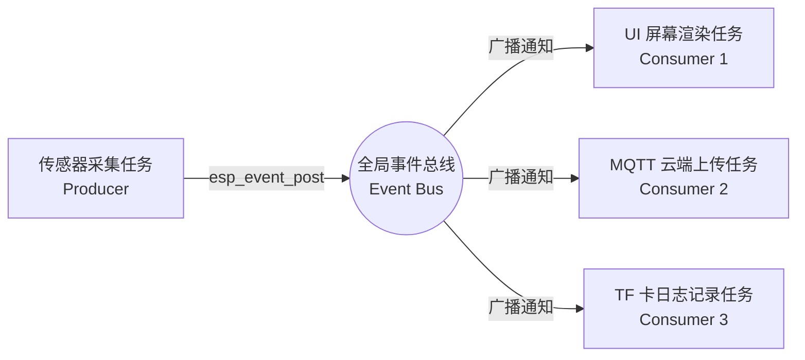

# 第 17 关：嵌入式软件工程化 —— 驱动/业务分层、事件总线与组件化模块设计


---

## 🎯 本关学习目标

在前 16 关的学习中，你已经掌握了点灯、屏幕、触摸、Wi-Fi、MQTT、BLE 蓝牙、TF 卡和低功耗休眠等全部单点硬件技能。

但是，很多新手在做综合大项目时，往往把所有代码全塞进一个 `app_main.c` 里：
* 5000 行代码混杂着 GPIO 引脚配置、Wi-Fi 握手、MQTT 解析、按键消抖和屏幕绘制；
* 一旦换了一个传感器型号，整个工程直接崩溃，改一个 Bug 引发十个新 Bug！这就是臭名昭著的**“意大利面条式代码”**。

本关我们将学习**大厂资深架构师的核心工程思维 —— 嵌入式软件工程化与模块化分层解耦**！

完成本关卡后，你将达成以下核心成就：
1. **搞懂经典三层架构（BSP 驱动层 / 服务层 / 业务UI层）**：实现“后厨更换传感器型号，前厅 UI 一行代码不用改”；
2. **掌握统一事件总线（Event Bus）设计模式**：基于 ESP-IDF 原生事件循环实现真正的发布-订阅（Pub/Sub）解耦；
3. **掌握有限状态机（FSM, Finite State Machine）**：用状态转移表彻底消灭杂乱无章的多层 `if-else` 嵌套；
4. **掌握 C 语言面向对象与句柄封装**：提升大型嵌入式代码的模块复用率与商业级工程美感！

---

## 17.1 为什么必须分层？金字塔三层架构模型

```text
 ┌─────────────────────────────────────────────────────────────┐
 │                  【经典嵌入式三层分层架构】                 │
 │                                                             │
 │  Level 3: 【业务逻辑与 UI 交互层】 (App / UI Layer)        │
 │    - 负责表盘绘制、页面滑动、按键响应与业务逻辑；          │
 │    - ⚠️ 严禁直接调用底层的 `gpio_set_level` 等硬件引脚！   │
 │                                                             │
 │  Level 2: 【中间件与事件总线服务层】 (Service Layer)       │
 │    - 全局事件总线 (Event Bus)、状态机 (FSM)、数据缓存；    │
 │    - 充当黏合剂，负责模块间的数据流转与异步分发。          │
 │                                                             │
 │  Level 1: 【BSP 板级硬件驱动层】 (BSP Layer)               │
 │    - 负责具体芯片引脚配置、I2C/SPI 底层通信；              │
 │    - 对上暴露极简 API（如 `bsp_sensor_read(&temp, &humi)`）│
 └─────────────────────────────────────────────────────────────┘
```

👉 **分层的巨大威力**：假如明天硬件工程师把温度传感器从 DHT11 换成了 SHT30，你只需要修改 BSP 层里的几行代码，上层的 UI 界面和云端 MQTT 代码**完全不需要做任何修改**！

---

## 17.2 什么是统一事件总线（Event Bus）？

在传统代码中，传感器采集到数据后，必须手动调用 UI 刷新函数 `ui_update_temp(temp)`，再手动调用云端上传函数 `mqtt_send_temp(temp)`。两个模块紧紧耦合在一起。

使用 **Event Bus（事件总线）** 后：
1. **传感器（生产者）**：采集完数据，只向全局总线广播一句：*“气温更新了：25.5°C”*；
2. **UI 模块（消费者 1）**：在总线上订阅了气温事件，听到广播后自动刷新表盘；
3. **MQTT 模块（消费者 2）**：也在总线上订阅了气温事件，听到广播后自动打包上传阿里云；
4. **两者互不认识，彻底解耦！**



---

## 17.3 📚 核心设计模式字典与 C 语言结构体句柄解密（小白必读）

---

### 1. 🛠️ 本章引入的核心头文件

| 头文件 | 作用说明 | 核心函数 / 宏 |
| :--- | :--- | :--- |
| **`"esp_event.h"`** | **ESP-IDF 原生全局事件总线** | `ESP_EVENT_DEFINE_BASE()`、`esp_event_post()`、`esp_event_handler_instance_register()` |

---

### 2. 🎛️ 有限状态机（FSM）消除 `if-else`

```c
typedef enum {
    STATE_STANDBY = 0, // 待机
    STATE_ACTIVE,      // 活跃
    STATE_ALARM,       // 报警
} sys_state_t;

// 状态转移表清晰明了
switch (current_state) {
    case STATE_STANDBY:
        if (event == EVT_TOUCH) current_state = STATE_ACTIVE;
        break;
    case STATE_ACTIVE:
        if (event == EVT_TIMEOUT) current_state = STATE_STANDBY;
        break;
}
```

---

## 17.4 实战第 1 步：BSP 驱动层与业务逻辑解耦 (BSP Interface)

业务层只依赖 `bsp_led_control()` 和 `bsp_button_is_pressed()`，完全不知道底层使用的是哪个 GPIO 引脚：

> 📁 **配套源码文件**：[`code/17_software_architecture/01_bsp_layer_decoupling.c`](../code/17_software_architecture/01_bsp_layer_decoupling.c)  
> ⚡ **一键切换运行**：在终端运行 `./switch_code.sh 17 1 --flash` 即可秒级切换并自动烧录！

```c
/* BSP 硬件抽象层 */
static void bsp_led_control(bsp_led_cmd_t cmd);
static bool bsp_button_is_pressed(void);

/* 业务层任务 */
static void business_logic_task(void *pvParameters)
{
    while (1) {
        if (bsp_button_is_pressed()) {
            bsp_led_control(LED_STATE_TOGGLE); // 优雅的语义化调用！
        }
        vTaskDelay(pdMS_TO_TICKS(50));
    }
}
```

---

## 17.5 实战第 2 步：有限状态机 (FSM) 系统中枢架构设计

使用枚举状态机管理开机自检、待机、活跃与越限报警生命周期：

> 📁 **配套源码文件**：[`code/17_software_architecture/02_fsm_state_machine.c`](../code/17_software_architecture/02_fsm_state_machine.c)  
> ⚡ **一键切换运行**：在终端运行 `./switch_code.sh 17 2 --flash` 即可秒级切换并自动烧录！

```c
static void fsm_handle_event(sys_event_t event)
{
    sys_state_t prev_state = s_current_state;
    // 状态转移逻辑
    switch (s_current_state) {
        case STATE_STANDBY:
            if (event == EVT_USER_ACTIVITY) s_current_state = STATE_ACTIVE;
            else if (event == EVT_SENSOR_OVERLIMIT) s_current_state = STATE_ALARM;
            break;
        case STATE_ACTIVE:
            if (event == EVT_TIMEOUT_IDLE) s_current_state = STATE_STANDBY;
            break;
    }
    ESP_LOGI(TAG, "🔄 [状态转移] %s ➔➔➔ %s", state_to_str(prev_state), state_to_str(s_current_state));
}
```

---

## 17.6 实战第 3 步：综合大工程 —— 统一事件总线驱动的多模块解耦系统

基于 `esp_event` 搭建现代工业级事件总线架构：

> 📁 **配套源码文件**：[`code/17_software_architecture/03_event_bus_architecture.c`](../code/17_software_architecture/03_event_bus_architecture.c)  
> ⚡ **一键切换运行**：在终端运行 `./switch_code.sh 17 3 --flash` 即可秒级切换并自动烧录！

```c
// 1. 生产者发布事件
esp_event_post(SYSTEM_EVENT_BASE, SYS_EVENT_TEMP_UPDATED, &evt_payload, sizeof(evt_payload), portMAX_DELAY);

// 2. 消费者注册监听
esp_event_handler_instance_register(SYSTEM_EVENT_BASE, SYS_EVENT_TEMP_UPDATED, &ui_event_handler, NULL, NULL);
esp_event_handler_instance_register(SYSTEM_EVENT_BASE, SYS_EVENT_TEMP_UPDATED, &mqtt_event_handler, NULL, NULL);
```

---

## 17.7 关卡总结与通关打卡

恭喜你！你已经完成了从“初级单片机玩家”到“专业嵌入式系统工程师”的最关键思维蜕变！

### 🏆 核心技能清单回顾：
* [x] **三层金字塔架构**：搞懂 BSP 驱动层、服务层与业务 UI 层的高内聚低耦合设计；
* [x] **统一事件总线**：掌握基于 `esp_event` 的发布-订阅模式彻底解耦跨模块调用；
* [x] **有限状态机 FSM**：掌握用状态转移表清晰管理复杂业务生命周期；
* [x] **企业级代码规范**：学会用结构体封装、语义化 API 和纯净接口组织大型工程。

---

现在，万事俱备，东风已到！  
所有的硬件驱动、网络协议、GUI 界面与架构思想已经全部融会贯通！

让我们迎接全书的**终极大结局 —— 毕业设计全栈超级工程实战**！  
请翻开 [**第 18 章：ESP32 终极综合大实战 —— 桌面多功能智能气象站与物联网超级中控台**](./18_桌面智能气象站与物联网超级中控.md)！
