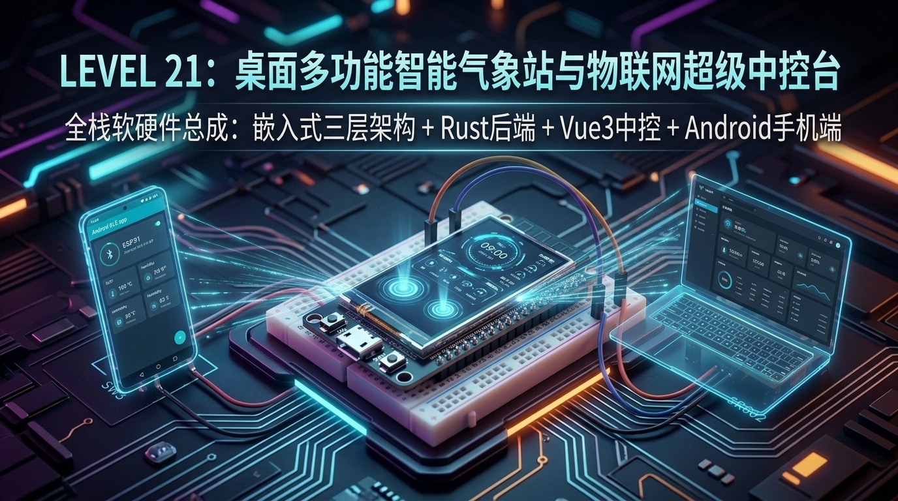

# 第 21 关：ESP32 终极综合大实战 —— 桌面多功能智能气象站与物联网超级中控台 (毕业设计全栈总成)



---

## 🎓 毕业设计实战总览

历经 **21 个关卡的攻坚克难**，你从一个连串口波特率、GPIO 高低电平都不了解的纯小白，一步一个脚印，亲手攻克了：
* **基础硬件外设**：LED、PWM 呼吸灯、按键消抖、GPIO 中断、FreeRTOS 双核队列；
* **传感器与通信总线**：WS2812 幻彩灯带、ADC 采样、NTC 测温、超声波测距、I2C 总线、DHT11 温湿度；
* **存储、字库与图形渲染**：NVS 偏好设置、ST7789 彩屏驱动、LVGL v9 触控 GUI、中文字库适配、TF 卡 FATFS 文件系统；
* **无线互联与物联网全矩阵**：Wi-Fi STA 联网、SNTP 授时、HTTP/HTTPS 天气时钟、MQTT 双向通信、BLE 蓝牙手机透传、ESP-NOW 超低时延双机群控、Web Server 网页中控与 AP 强制门户配网；
* **工业级量产与可靠性架构**：OTA 空中无线升级与防变砖回退、Deep-sleep 微安级休眠、BSP 三层解耦架构、统一事件总线与硬件看门狗！

在全书的终极毕业关卡中，我们将把**所有 21 个关卡学到的硬核技能熔炼为一体**，打造一个属于你自己的**商业级软硬件一体化全栈物联网超级中控台（全能 Mini-OS 桌面智显系统）**！

---

## 21.1 全栈物联网商业级产品全生态架构

本项目不再是一个简单的单片机玩具实验，而是一套包含 **【端 - 边 - 云 - 移动端】全生态闭环** 的商业级完整产品：

```text
 ┌─────────────────────────────────────────────────────────────────────────────────────────────────┐
 │                       🏆 LEVEL 21 全栈物联网商业级产品全生态架构                                │
 │                                                                                                 │
 │   ┌────────────────────────┐      HTTP / Web OTA / WebSocket      ┌─────────────────────────┐   │
 │   │ 💻 PC 端 Web 智能管理平台│ ◄──────────────────────────────────► │ 🚀 ESP32 桌面智能中控台 │   │
 │   │ • Rust (Axum) 高性能后端│         MQTT Broker 云端遥测          │ • 1.69" 触控 5-App 桌面 │   │
 │   │ • Vue 3 现代响应式前端 │ ◄──────────────────────────────────► │ • 传感器融合与执行器    │   │
 │   │ • 固件发布与一键 OTA   │                                      │ • TF卡相册/小说流式引擎 │   │
 │   │ • 相册裁剪转换与推送   │          BLE GATT 近场直连            │ • BSP + Services 三层   │   │
 │   │ • 电子书章节切割下发   │ ◄──────────────────┐                 └────────────┬────────────┘   │
 │   └────────────────────────┘                    │                              │                │
 │                                                 ▼                              ▼                │
 │                                      ┌────────────────────────┐   ┌─────────────────────────┐   │
 │                                      │ 📱 Android 手机中控 App│   │ 💾 本地持久化与高可靠   │   │
 │                                      │ • Kotlin 原生 BLE GATT │   │ • TF卡 FATFS 4-bit SDMMC│   │
 │                                      │ • 实时传感器卡片展示   │   │ • Flash Core Dump 黑匣子│   │
 │                                      │ • 手机遥控与短文投屏   │   │ • TWDT 任务看门狗自愈   │   │
 │                                      └────────────────────────┘   └─────────────────────────┘   │
 └─────────────────────────────────────────────────────────────────────────────────────────────────┘
```

---

## 21.2 📁 全栈三大独立子系统工程结构速查

```text
📁 code/21_final_station_hub/
│
├── 📁 firmware/                        # 🚀 1. ESP32 嵌入式端完整工程 (C / FreeRTOS / LVGL v9)
│   ├── partitions.csv                  # 核心分区表：ota_0 (2.5M) + ota_1 (2.5M) + coredump + storage + nvs
│   ├── bsp/                            # BSP 板级硬件驱动抽象层
│   │   ├── bsp_display.c/.h            # 1.69寸 ST7789 SPI LCD (240x280, Gap 0,20)
│   │   ├── bsp_touch.c/.h              # CST816S I2C 电容触摸驱动
│   │   ├── bsp_lvgl_port.c/.h          # LVGL v9 双缓冲区 DMA 显存加速 (PSRAM)
│   │   ├── bsp_sensor.c/.h             # DHT11 / NTC ADC / HC-SR04 超声波 / SR602 PIR
│   │   ├── bsp_led.c/.h                # 板载 LED2 (GPIO27) 控制
│   │   ├── bsp_button.c/.h             # 板载 SW3 (GPIO39) 按键检测
│   │   └── bsp_sdcard.c/.h             # TF 卡 SDMMC 4-bit FATFS 挂载
│   ├── services/                       # 系统服务与中间件层
│   │   ├── sys_event_bus.c/.h          # 全局统一事件总线 (发布/订阅)
│   │   ├── sys_fsm.c/.h                # 有限状态机 (管理 5 大 App 场景与 OTA 升级)
│   │   ├── sys_guard_wdt.c/.h          # 任务看门狗 (TWDT) 喂狗守护与 Flash Core Dump
│   │   ├── sys_ota.c/.h                # 双模 OTA 引擎 (固件升级 + 字库资源包热更新)
│   │   ├── net_manager.c/.h            # Wi-Fi STA 联网 / SNTP 授时 / HTTP 天气 / MQTT 遥测
│   │   ├── ble_manager.c/.h            # BLE GATT 蓝牙服务与手机近场透传
│   │   ├── file_reader.c/.h            # TF 卡相册遍历、电子小说流式分段阅读器、CSV 遥测日志追加
│   │   └── web_server.c/.h             # 嵌入式 REST WebServer 与 Web OTA 页面
│   ├── ui/                             # UI 交互层 (LVGL v9 触控 5 大独立 App)
│   │   ├── ui_hub.c/.h                 # 5 大 App 标签页交互系统 (气象时钟/传感器/相册/小说/系统)
│   │   ├── ui_fonts.c/.h               # 美化大号数字时钟字体与中文字库引擎
│   │   └── ui_icons.c/.h               # 气象与系统矢量拟物图标资产
│   ├── app/                            # 业务逻辑与调度层
│   │   └── app_business.c/.h           # 双核负载平衡调度器 (Core 1 渲染 / Core 0 感知通信)
│   └── app_main.c                      # 纯流水线总装入口
│
├── 📁 server_platform/                 # 💻 2. PC 端 Web 智能管理平台 (Rust + Vue 3)
│   ├── backend_rust/                   # 🦀 Rust 高性能后端 (Axum + Tokio + Image + Serde)
│   │   ├── src/main.rs                 # RESTful 接口：固件发布/图片裁剪转RGB565/小说切片下发
│   │   └── Cargo.toml
│   └── frontend_vue3/                  # 💚 Vue 3 现代响应式前端看板 (Vite + 玻璃拟物设计)
│       ├── src/App.vue                 # 根导航组件
│       ├── src/components/             # 遥测看板、相册裁剪器、小说推送器、OTA 刷机台、设备遥控
│       ├── package.json
│       └── vite.config.js
│
└── 📁 mobile_android_app/              # 📱 3. Android 移动端手机中控工程
    ├── android_native/                 # 📱 Android 原生工程 (Kotlin + Material Design + BLE GATT)
    │   ├── app/src/main/AndroidManifest.xml
    │   ├── app/src/main/java/com/esp32/smarthub/MainActivity.kt
    │   └── app/src/main/res/layout/activity_main.xml
    └── web_bluetooth/index.html        # 🌐 免安装 Web-Bluetooth 网页版手机控制台
```

---

## 21.3 📱 ESP32 触控桌面 5 大核心独立 App 深度解析

### 🌤️ App 1：气象时钟看板 (Weather Station)
* **网络自动授时**：开机连接 Wi-Fi 后，SNTP 自动校准东八区毫秒级时间，生成 `HH:MM:SS` 数字大时钟；
* **动态拟物天气**：HTTP 轮询气象接口，动态展示天气状态（晴 ☀️ / 雨 🌧️ / 阴 ⛅）、实时气温与湿度；
* **局域网 IP 直显**：屏幕底部实时显示设备 IP 地址，方便手机和电脑浏览器一键访问 Web 中控台。

### 🎛️ App 2：智能传感器与 IoT 中控 (Sensor Hub)
* **多传感器动态仪表**：NTC 热敏高精度温度条、HC-SR04 超声波雷达测距条动态实时刷新；
* **板载交互**：触控屏幕大按钮，秒级点亮/熄灭板载 LED2，状态通过 MQTT 同步推送至手机与云端；
* **MQTT 遥测上报**：每 3 秒自动打包 JSON 报文向公共 Broker（`broker.emqx.io:1883`）发送遥测流。

### 🖼️ App 3：TF 卡触控电子相册 (Photo Gallery)
* **文件流加载**：扫描 TF 卡 `/sdcard/photos/` 目录下的照片壁纸；
* **触控手势切图**：轻触屏幕下方 **Next Photo** 或左右滑动，秒级切换壁纸，尽显 1.69 寸 IPS 高清屏色彩！

### 📖 App 4：TF 卡电子小说阅读器 (Novel Reader)
* **长文本流式分页**：从 TF 卡 `/sdcard/novel.txt` 流式读取，按每页 160 字符优雅排版；
* **触控前后翻页**：屏幕左下角 **上一页 (Prev)**、右下角 **下一页 (Next)** 触控翻页，底部实时显示当前页码与总页数！

### ⚙️ App 5：系统健康、无线中控与 OTA 升级 (System Center)
* **硬件健康监视**：实时显示剩余 Free Heap 内存（约 180 KB）与外部 PSRAM 空闲大小（约 1.8 MB）；
* **双模 OTA 状态机**：进入固件刷机状态时，全屏浮现 OTA 升级进度条，实时显示固件写入百分比；
* **看门狗与 Core Dump**：展示当前 6000ms 任务看门狗守护状态与 Flash Core Dump 故障黑匣子就绪标志。

---

## 21.4 💻 PC 端 Web 智能管理平台 (Rust + Vue 3) 快速启动指南

### 1. 启动 Rust 高性能后端 (`backend_rust/`)
在终端进入目录并运行：
```bash
cd code/21_final_station_hub/server_platform/backend_rust
cargo run
```
* **运行地址**：`http://localhost:8080`
* **核心接口**：
  * `POST /api/photo/process`：将任意尺寸图片自动智能居中裁剪缩放为 240×280 并推送到 ESP32；
  * `POST /api/novel/process`：将 TXT 小说按段落分卷切片并下发到 ESP32 TF 卡；
  * `POST /api/ota/upload`：上传 `esp32_journey.bin`，计算 SHA256 并通过 HTTP OTA 接口推送给 ESP32。

### 2. 启动 Vue 3 现代前端看板 (`frontend_vue3/`)
在终端进入目录并运行：
```bash
cd code/21_final_station_hub/server_platform/frontend_vue3
npm install
npm run dev
```
* **访问地址**：浏览器打开 `http://localhost:3000` 即可尽情体验深色玻璃拟物大屏中控！

---

## 21.5 📱 Android 移动端手机中控快速上手

### 方案 A：Android Studio 原生工程 (`android_native/`)
1. 使用 Android Studio 打开 `code/21_final_station_hub/mobile_android_app/android_native/`；
2. 连接 Android 手机，点击 **Run 'app'** 安装到手机；
3. 点击 **“🔍 扫描并连接 ESP32-Smart-Hub”**，秒级建立 BLE GATT 连接，实时查看温湿度卡片与远程开关灯！

### 方案 B：免安装 Web-Bluetooth 网页版 (`web_bluetooth/`)
1. 用手机 Chrome 或 Edge 浏览器打开 `code/21_final_station_hub/mobile_android_app/web_bluetooth/index.html`；
2. 点击 **“配对设备”**，无需安装任何 APK 即可直接通过浏览器与 ESP32 蓝牙互动！

---

## 21.6 ⚡ 一键切换与固件编译运行

在项目根目录下，直接使用我们的专属工程切换工具：

```powershell
# 一键切换到第 21 关毕业设计全栈大工程并自动同步组件
.\switch_code.ps1 21
```

```bash
# 编译固件
idf.py build

# 烧录并打开串口监视器
idf.py flash monitor
```

---

## 21.7 🎓 毕业结语与通关证书

```text
 ╔═══════════════════════════════════════════════════════════════════════════════════════════════════════╗
 ║                                                                                                       ║
 ║                              🏆 ESP32 物联网实战闯关 · 终极毕业通关证书                               ║
 ║                                                                                                       ║
 ║     恭喜你！坚持到最后、完成全栈毕业设计的硬核嵌入式工程师！                                          ║
 ║                                                                                                       ║
 ║     你已经成功打通了从 Level 01 到 Level 21 的全部关卡：                                              ║
 ║     • 硬件外设与总线：GPIO / PWM / 中断 / FreeRTOS / RMT WS2812 / ADC / I2C / SPI / 4-bit SDMMC        ║
 ║     • 图形与人机交互：ST7789 LCD / CST816S 电容触控 / LVGL v9 拟物 GUI / 中文字库 / PSRAM 显存加速     ║
 ║     • 无线网络全矩阵：Wi-Fi STA / SNTP / HTTP 天气 / MQTT 云平台 / BLE GATT / ESP-NOW / Web Server    ║
 ║     • 软件工程与可靠性：三层架构解耦 / 统一事件总线 / 有限状态机 / 双模 OTA / 看门狗 / Flash Core Dump║
 ║     • 全栈多端生态协同：Rust (Axum) 后端 + Vue 3 (Vite) 智能中控 + Android 原生 BLE 移动端           ║
 ║                                                                                                       ║
 ║     海阔凭鱼跃，天高任鸟飞。                                                                          ║
 ║     带着这套顶级的知识武器，去创造属于你自己的商业级智能硬件奇迹吧！ 🚀                               ║
 ║                                                                                                       ║
 ╚═══════════════════════════════════════════════════════════════════════════════════════════════════════╝
```
